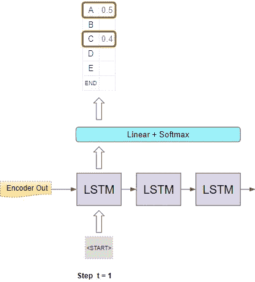
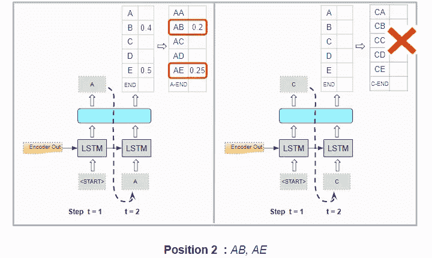

# 自然语言处理的基础直观解释:波束搜索，它是如何工作的

> 原文：<https://towardsdatascience.com/foundations-of-nlp-explained-visually-beam-search-how-it-works-1586b9849a24?source=collection_archive---------1----------------------->

## [实践教程](https://towardsdatascience.com/tagged/hands-on-tutorials)，直观的 NLP 系列

## 波束搜索如何增强预测的简明指南

由[凯西·霍纳](https://unsplash.com/@mischievous_penguins?utm_source=medium&utm_medium=referral)在 [Unsplash](https://unsplash.com?utm_source=medium&utm_medium=referral) 上拍摄

许多 NLP 应用程序，如机器翻译、聊天机器人、文本摘要和语言模型都会生成一些文本作为输出。此外，像图像字幕或自动语音识别(即语音到文本)输出文本，即使它们可能不被认为是纯 NLP 应用程序。

所有这些应用都使用一些常用的算法，作为产生最终输出的最后一步。

*   贪婪搜索就是这样一种算法。它经常被使用，因为它简单快捷。
*   另一种方法是使用波束搜索。它非常受欢迎，因为虽然它需要更多的计算，但通常会产生更好的结果。

在本文中，我将探索波束搜索，并解释为什么使用它以及它是如何工作的。我们将简单地讨论一下贪婪搜索作为比较，这样我们就能理解波束搜索是如何改进它的。

另外，如果您对 NLP 感兴趣，我还有几篇文章，您可能会觉得有用。他们还探索了这一领域的其他有趣主题，如变形金刚、语音转文本和 Bleu 评分标准。

1.  [变形金刚直观讲解:功能概述](/transformers-explained-visually-part-1-overview-of-functionality-95a6dd460452) *(变形金刚怎么用，为什么比 RNNs 好。架构的组件，以及训练和推理期间的行为)*
2.  [变压器如何工作，循序渐进](/transformers-explained-visually-part-2-how-it-works-step-by-step-b49fa4a64f34) *(内部操作端到端。数据如何流动以及执行何种计算，包括矩阵表示)*
3.  [自动语音识别](/audio-deep-learning-made-simple-automatic-speech-recognition-asr-how-it-works-716cfce4c706) *(语音转文本算法和架构，使用 CTC 丢失和解码进行序列对齐。)*
4.  [Bleu 评分](/foundations-of-nlp-explained-bleu-score-and-wer-metrics-1a5ba06d812b) ( *Bleu 评分和单词错误率是 NLP 模型的两个基本指标*

我们将从获得一些关于 NLP 模型如何产生它们的输出的上下文开始，以便我们能够理解波束搜索(和贪婪搜索)适合在哪里。

注意:根据他们正在解决的问题，NLP 模型可以生成字符或单词形式的输出。与波束搜索相关的所有概念都同样适用于这两个术语，因此我将在本文中交替使用这两个术语。

# NLP 模型如何生成输出

让我们以序列到序列模型为例。这些模型经常用于机器翻译等应用。

机器翻译的序列对序列模型(图片由作者提供)

例如，如果这个模型被用来从英语翻译成西班牙语，它将把源语言中的句子(例如英语中的“You are welcome”)作为输入，并输出目标语言中的对等句子(例如西班牙语中的“De nada”)。

文本是单词(或字符)的序列，NLP 模型构建了由源语言和目标语言中的整个单词集组成的词汇表。

该模型将源句子作为其输入，并将其通过一个嵌入层，随后是一个编码器。然后，编码器输出压缩捕获输入的基本特征的编码表示。

然后，这种表示与一个“<start>”标记一起被馈送到解码器，作为其输出的种子。解码器使用这些来生成自己的输出，这是目标语言句子的编码表示。</start>

然后通过输出层传递，输出层可能由一些线性层和一个 Softmax 组成。线性层在输出序列中的每个位置输出词汇表中每个单词出现的可能性的得分。然后 Softmax 将这些分数转换成概率。

词汇表中每个字符在输出序列中每个位置的概率(图片由作者提供)

当然，我们的最终目标不是这些概率，而是最终的目标句子。要做到这一点，模型必须决定它应该为目标序列中的每个位置预测哪个单词。

该模型根据概率预测输出句子(图片由作者提供)

它是怎么做到的？

# 贪婪搜索

一个相当显而易见的方法是简单地选择在每个位置上概率最高的单词并预测它。它计算速度快，容易理解，而且经常能得出正确的结果。

贪婪搜索(图片由作者提供)

事实上，贪婪搜索是如此容易理解，我们不需要花更多的时间来解释它😃。但是我们能做得更好吗？

啊哈，终于说到我们真正的话题了！

# 波束搜索

波束搜索对贪婪搜索进行了两项改进。

*   通过贪婪搜索，我们在每个位置只取一个最好的单词。相比之下，波束搜索扩展了这一点，并选取了最佳的“N”个单词。
*   使用贪婪搜索，我们孤立地考虑每个位置。一旦我们确定了最适合那个职位的词，我们就不会检查它之前是什么。在前一个位置)，或者在它之后。相比之下，波束搜索选择目前为止的“N”个最佳*序列*，并考虑所有前面的单词与当前位置的单词组合的概率。

换句话说，它把“搜索的光束”投射到比贪婪搜索更广的地方，这就是它的名字。超参数“N”称为波束宽度。

直觉上，这给了我们比贪婪搜索更好的结果。因为，我们真正感兴趣的是最好的完整句子，如果我们在每个位置只选择最好的单个单词，我们可能会错过它。

# 波束搜索—它的作用

让我们举一个简单的例子，波束宽度为 2，并使用字符来保持简单。

波束搜索示例，宽度= 2(图片由作者提供)

## **第一位置**

*   考虑模型在第一个位置的输出。它从“<start>”标记开始，获取每个单词的概率。它现在选择了*那个位置的两个*最好的字符。例如“A”和“C”。</start>

## 第二胎位

*   当到达第二个位置时，它重新运行模型*两次*，通过将可能的字符固定在第一个位置来生成概率。换句话说，它将第一个位置的字符约束为“A”或“C ”,并生成两个具有两组概率的分支。具有第一组概率的分支对应于在位置 1 具有“A ”,具有第二组概率的分支对应于在位置 1 具有“C”。
*   它现在基于前两个字符的组合概率，从两组概率中挑选出*总共两个最佳字符对*。所以它不会只从第一组中选择一个最佳字符对，从第二组中选择一个最佳字符对。例如“AB”和“AE”

## 第三位置

*   当它到达第三个位置时，它重复这个过程。它通过将前两个位置约束为“AB”或“AE”来重新运行模型两次，并再次生成两组概率。
*   再一次，它根据两组概率中前三个字符的组合概率来挑选两个最佳字符三元组。因此，对于前三个位置，我们现在有两个最佳的字符组合。例如“美国广播公司”和“AED”。

## 重复直到结束标记

*   它继续这样做，直到它挑选一个“<end>”标记作为某个位置的最佳字符，然后结束序列的那个分支。</end>

它最终以两个最佳序列结束，并预测具有更高总体概率的序列。

# 波束搜索——工作原理

我们现在从概念上理解了波束搜索。让我们更深入一层，了解这是如何工作的细节。我们将继续同一个例子，使用波束宽度 2。

继续我们的序列到序列模型，编码器和解码器可能是一个由一些 LSTM 层组成的递归网络。或者，它也可以使用变压器而不是循环网络来构建。

基于 LSTM 的序列对序列模型(图片由作者提供)

让我们关注解码器组件和输出层。

## 第一位置

在第一个时间步中，它使用编码器的输出和一个“<start>”标记的输入来生成第一个位置的字符概率。</start>

第一个位置的字符概率(图片由作者提供)

现在，它选择两个概率最高的字符，例如“A”和“C”。

## 第二胎位

对于第二个时间步长，它像以前一样使用编码器的输出运行解码器两次。与第一个位置的“<start>”标记一起，它强制第二个位置的输入在第一次解码器运行时为“A”。在第二次解码器运行时，它强制第二个位置的输入为“C”。</start>

第二个位置的字符概率(图片由作者提供)

它为第二个位置生成字符概率。但这些都是个别人物的概率。它需要计算前两个位置的字符对的组合概率。假设“A”已经固定在第一个位置，则“AB”对的概率是“A”出现在第一个位置的概率乘以“B”出现在第二个位置的概率。下面的示例显示了计算过程。

计算字符对在前两个位置的概率(图片由作者提供)

它对两次解码器运行都这样做，并在两次运行中挑选具有最高组合概率的字符对。因此，它选择“AB”和“AE”。

该模型根据组合概率挑选两个最佳字符对(图片由作者提供)

## 第三位置

对于第三时间步，它再次像以前一样运行解码器两次。与第一个位置的“<start>”标记一起，它强制第二个位置和第三个位置的输入在第一次解码器运行中分别为“A”和“B”。在第二次解码器运行中，它强制第二位置和第三位置的输入分别为“A”和“E”。</start>

第三个位置的字符概率(图片由作者提供)

它计算前三个位置的字符三元组的组合概率。

计算前三个位置的字符三元组的概率(图片由作者提供)

它在两次运行中选择两个最好的，因此选择“ABC”和“AED”。

该模型基于组合概率挑选两个最佳字符三元组(图片由作者提供)

## 重复直到结束标记

它重复这个过程，直到生成两个以“<end>”标记结束的最佳序列。</end>

然后，它选择具有最高组合概率的序列进行最终预测。

# 结论

这让我们了解了波束搜索是做什么的，它是如何工作的，以及为什么它能给我们更好的结果。这是以增加计算量和执行时间为代价的。因此，我们应该评估这种权衡对于我们的应用程序用例是否有意义。

最后，如果你喜欢这篇文章，你可能也会喜欢我关于音频深度学习、地理位置机器学习和图像字幕架构的其他系列。

</audio-deep-learning-made-simple-part-1-state-of-the-art-techniques-da1d3dff2504>  </leveraging-geolocation-data-for-machine-learning-essential-techniques-192ce3a969bc>  </image-captions-with-deep-learning-state-of-the-art-architectures-3290573712db>  

让我们继续学习吧！