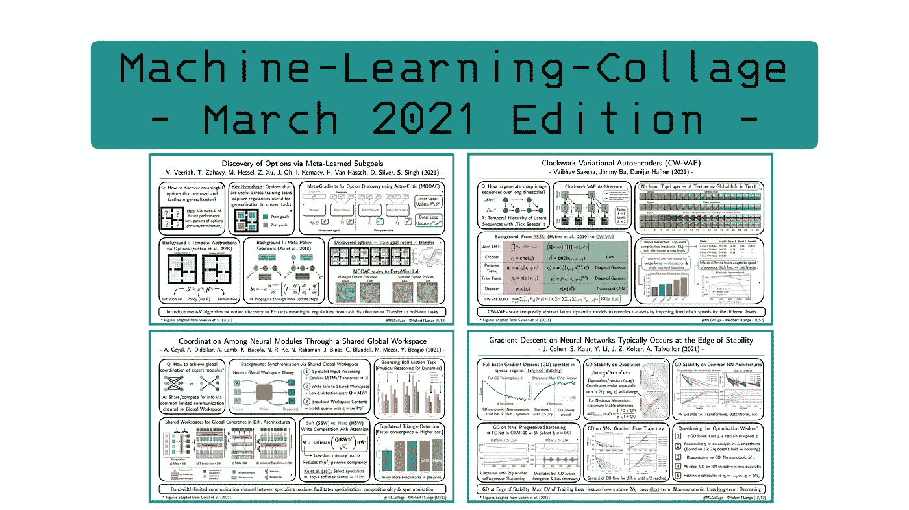
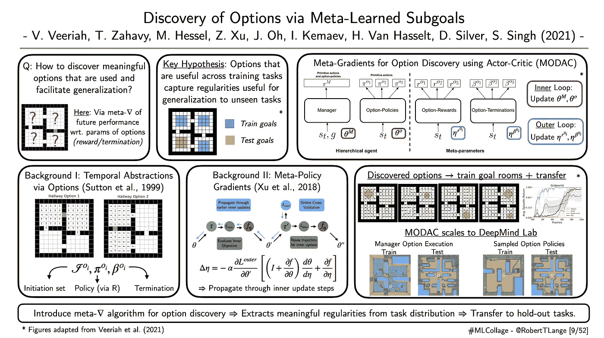
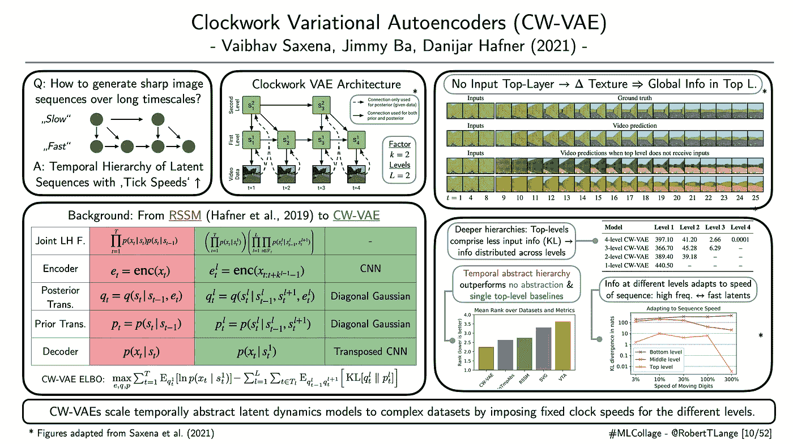
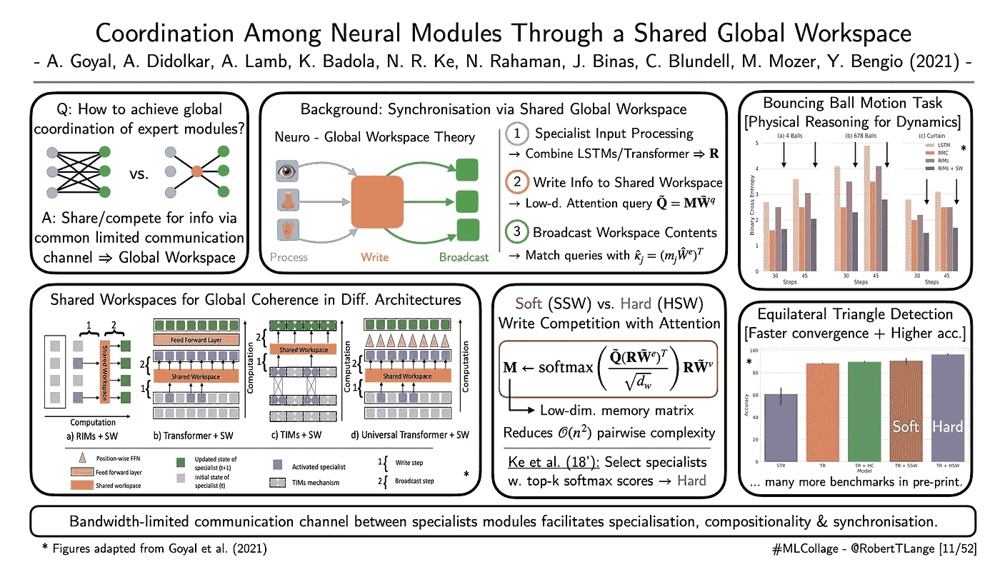
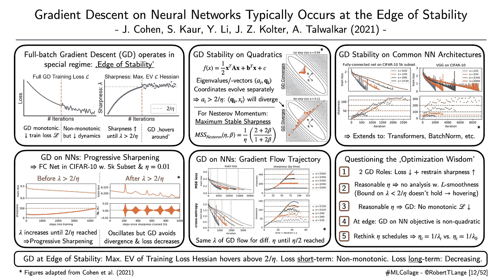

# 2021 年 4 月要读的四篇深度学习论文

> 原文：<https://towardsdatascience.com/four-deep-learning-papers-to-read-in-april-2021-77f6b0e42b9b?source=collection_archive---------6----------------------->

## [思想和理论](https://towardsdatascience.com/tagged/thoughts-and-theory)

## 从元梯度到时钟值，神经网络的全局工作空间理论和训练稳定性的边缘

欢迎来到四月版的【T2:机器学习拼贴】系列，在这里我提供了不同深度学习研究流的概述。那么这个系列是关于什么的呢？简单地说，我为我最近最喜欢的一篇论文起草了一张幻灯片的视觉摘要。每一周。在月末，所有的视觉拼贴画都被收集在一篇总结性的博客文章中。因此，我希望给你一个视觉和直观的深入了解一些最酷的趋势。所以，废话不多说:这里是我在 2021 年 3 月读过的四篇最喜欢的论文，以及为什么我认为它们对深度学习的未来很重要。

## “通过元学习子目标发现选项”

*作者:Veeriah 等人(2021)* 📝[论文](https://arxiv.org/abs/2102.06741)

**一段话总结:**电机控制是一个极具挑战性的问题。我们人类非常擅长这一点，因为我们在多个扩展的时间尺度上进行规划:我们不是绘制出每一个肌肉动作，而是在抽象的层面上进行推理，并执行一系列精细的动作。分层强化学习(HRL)旨在借助所谓的时间抽象来模仿这种方法。简单地说，时态抽象就是一个在一段时间内执行的机动程序。选项([萨顿等人，1999](https://www.sciencedirect.com/science/article/pii/S0004370299000521) )是这种时间抽象的一种特殊类型。它们由一个子策略和一个相应的终止条件组成。选项策略由更高级别的管理器调用并执行，直到终止条件停止它。HRL 的一个关键问题是如何自动推断出有用的选项，这些选项可以在多项任务中转换？Veeriah 等人(2021)提出通过[元梯度](/meta-policy-gradients-a-survey-78dc742d395d)学习选项参数化。在外环中，元梯度通过优化更新步骤过程传播高阶梯度来优化超参数，这取决于它们(以可微分的方式)。在本文中，优化的超参数被选择为指定选项的神经网络。所提出的称为 MODAC 的多寿命元梯度方法能够发现有用的选项，这些选项转移到新的设置，其中仅允许管理器策略被重新训练。因此，元梯度方法可以从任务分布中提取有意义的规律。他们在一个标准的四个房间的问题上测试他们的方法，然后将其扩展到更具挑战性的 DeepMind 实验室领域。

ML-Collage [9/52]:数字改编自 Veeriah 等人(2021) |📝[论文](https://arxiv.org/abs/2102.06741)

## **“发条变分自动编码器”**

*作者:Saxena 等人(2021)* 📝[论文](https://arxiv.org/abs/2102.09532)

**一段话总结:**递归生成模型在生成长序列的清晰图像和捕捉视频中的长期依赖关系方面存在困难。Saxena 等人(2021)的时钟变分自动编码器(CW-VAE)旨在通过扩展[递归状态空间模型](https://arxiv.org/pdf/1811.04551)(RSSM；Hafner et al. 2019)，这是一类复发性 VAEs。CW-VAEs 的核心是通过引入以不同固定时钟速度变化的潜在时间层次来扩展这些潜在动态模型。顶层以较慢的速率适应，并调节较低层的生成过程。等级越低，速度越快。在最低层，该模型通过转置 CNN 的上采样输出生成的图像。使用证据下限(ELBO)目标对整个递归 VAE 架构进行端到端训练。作者证明，这种动态潜在变量的时间抽象层次优于许多基线，这些基线不包含潜在层次或所有级别以相同的速度跳动。我特别喜欢 cool ablation 研究，它旨在提取存储在不同级别的内容信息。通过切断流入顶层的输入信号，作者能够证明顶层向较低层提供全局非特定信息。最后，他们还表明，潜在的动态能够适应预先条件序列输入的速度:高频序列导致更多的信息被快速的低水平潜在变量捕获。总之，作用于不同时间尺度的机制的层次结构不仅对于强化学习非常有用，而且对于生成模型也非常有用。

ML-Collage [10/52]:数字改编自 Saxena 等人(2021) |📝[论文](https://arxiv.org/abs/2102.09532)

## **“通过共享的全局工作空间协调神经模块”**

*作者:Goyal 等人(2021)* |📝[论文](https://arxiv.org/abs/2103.01197)

一段话总结:最突出的意识理论之一是[全球工作空间理论](https://en.wikipedia.org/wiki/Global_workspace_theory)。它提出了一个简单的认知架构，其中经过处理的感官知觉被投射到一个共享的工作空间，也称为“黑板”。来自不同来源的信息被选择性地写入这个工作空间，并被下意识地处理。这个处理阶段集成了不同的模态并丢弃了不相关的特征。之后，转换后的信息被传播到与意识过程相关的其他大脑区域。Goyal 等人(2021)从这种高级意识的神经科学理论中获得灵感，并概述了一种将工作空间与注意力机制相结合的计算框架，以促进学习到的神经模块之间的协调。更具体地说，作者提出了一个低维瓶颈(也称为共享工作空间)来促进专家模块的同步。不同的神经网络(例如变压器或不同的 LSTMs)必须竞争写入“瓶颈”工作区。然后，基于软或硬注意机制更新输出表示。关键思想是带宽限制有助于独立但整合的机制的协调学习。使用一组详尽的实验，作者表明，所提出的机制促进了模块之间的专业化，并有助于稳定它们的端到端训练。此外，工作空间的低维特性减少了专家之间昂贵的成对注意力交互。因此，它不仅有益于训练，而且有益于推理。

ML-Collage [11/52]:图片改编自 Goyal 等人的作品(2021) |📝[论文](https://arxiv.org/abs/2103.01197)

## **“神经网络上的梯度下降通常发生在稳定性的边缘”**

*作者:科恩等人(2021)* 📝[论文](http://arxiv.org/abs/2103.00065)

一段话总结:深度学习中最迷人但仍未得到充分解释的观察结果之一是，我们似乎能够仅使用随机梯度下降等简单算法来有效优化数十亿个参数。但是我们对学习动力和趋同行为到底了解多少呢？Cohen 等人(2021 年)后退一步，研究批次由整个数据集组成时梯度下降的特殊情况。作者表明，这种全批次梯度下降版本在一个非常特殊的制度。也就是说，处于“稳定的边缘”。这个边缘是关于什么的？神经网络训练有两个阶段:在最初的第一阶段，训练损失 Hessian(也称为锐度)的最大特征值逐渐增加，直到它达到 2/学习速率。在这个阶段，训练损失单调下降。一旦这个特征值达到 2/学习率，就达到了“稳定边缘”。之后，梯度下降抑制了清晰度的进一步增长。相反，它徘徊在 2/学习率阈值之上。在短时间内，训练损失不再表现为单调，而是波动的。但是在更长的时间尺度上，梯度下降仍然可以减少损失。作者通过多项任务和不同架构(包括标准 CNN 和变压器)验证了这一经验观察。由此产生的发现质疑了关于梯度下降的传统优化智慧的许多方面:梯度下降如何抑制清晰度的持续增长？这对学习费率表意味着什么？我们真的需要让它们随着时间退火吗？好的科学工作开启了许多有趣的未来研究问题，这项工作无疑属于这一范畴。

ML-Collage [12/52]:数字改编自 Cohen 等人(2021) |📝[论文](http://arxiv.org/abs/2103.00065)

> 这是这个月的。让我知道你最喜欢的论文是什么。如果你想获得一些每周 ML 拼贴输入，查看 Twitter 上的标签[# ML collage](https://twitter.com/hashtag/mlcollage)。你也可以看看我上一篇博文中的拼贴画:

 [## 2021 年 3 月要读的四篇深度学习论文

### 从合成梯度到胶囊网络，网络训练守恒定律&多主体生成模型

towardsdatascience.com](/four-deep-learning-papers-to-read-in-march-2021-9d933f52aafa) 

> 最后，如果你想了解更多关于 RL 和其他领域的元梯度的潜力，你可以查看我以前的调查博客。我也有机会在[最近的 ML Street Talk 播客插曲](https://youtu.be/hfaZwgk_iS0)中采访了主要的元渐变作者之一——来自 DeepMind 的汤姆·萨哈维: