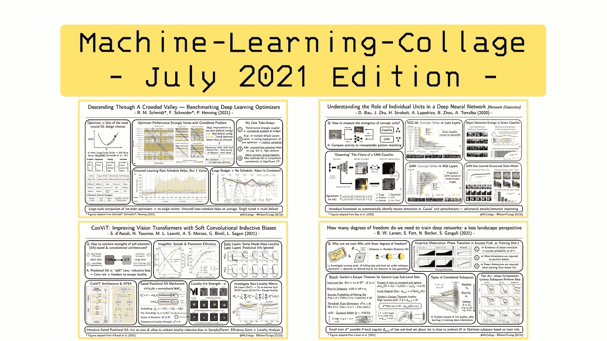
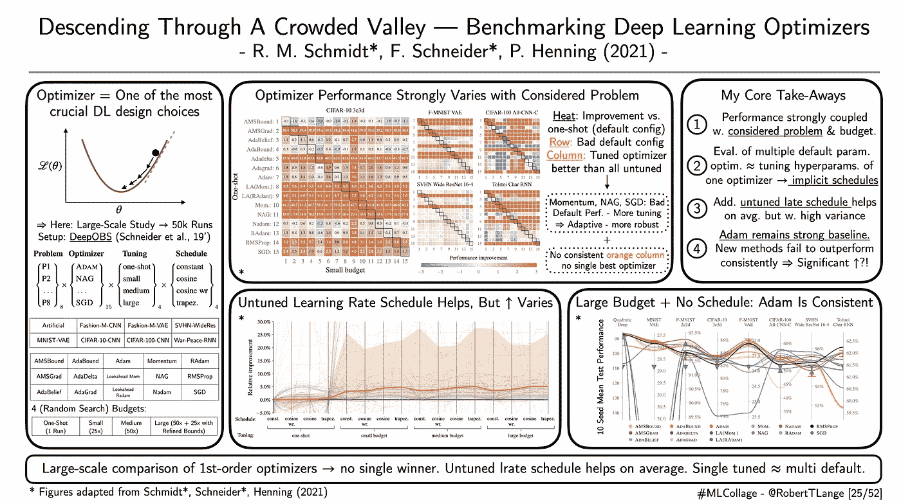
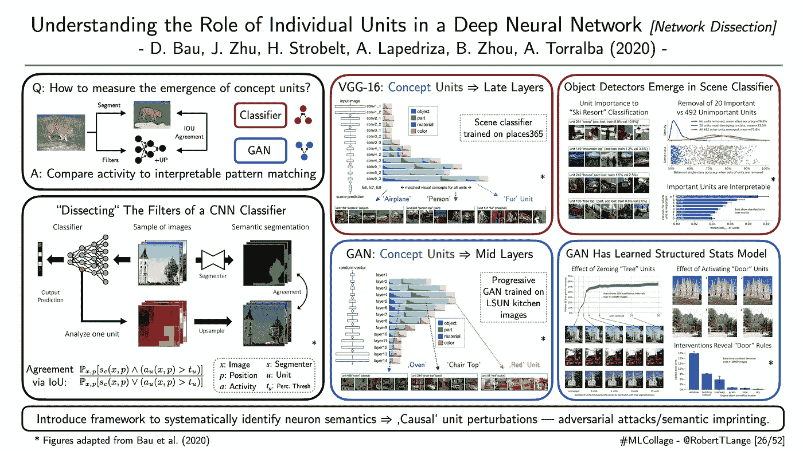
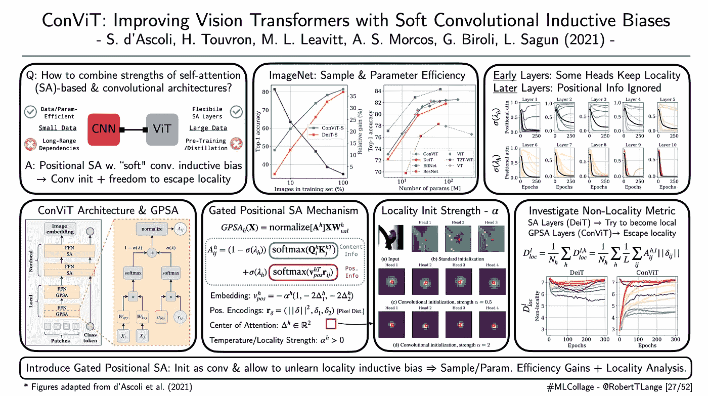
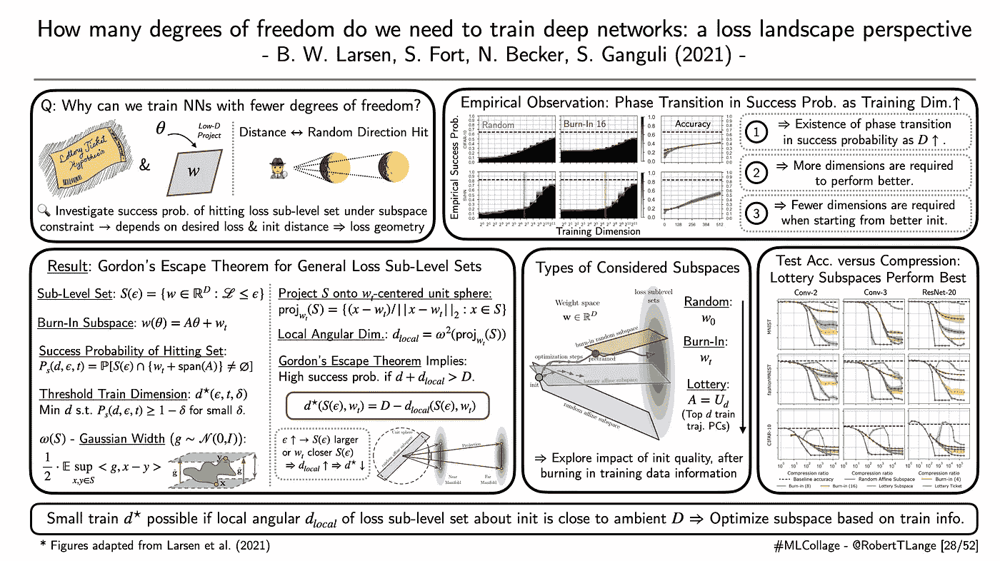

# 2021 年 8 月要读的四篇深度学习论文

> 原文：<https://towardsdatascience.com/four-deep-learning-papers-to-read-in-august-2021-7d98385a378d?source=collection_archive---------2----------------------->

## **从优化器基准到网络剖析，视觉变形器&彩票子空间**

欢迎来到八月版的【T2:机器学习拼贴】系列，在这里我提供了不同深度学习研究流的概述。那么什么是 ML 拼贴呢？简单地说，我为我最近最喜欢的一篇论文起草了一张幻灯片的视觉摘要。每一周。在月底，所有由此产生的视觉拼贴都被收集在一个摘要博客帖子中。因此，我希望给你一个视觉和直观的深入了解一些最酷的趋势。所以，废话不多说:这里是我在 2021 年 7 月读过的四篇我最喜欢的论文，以及为什么我认为它们对深度学习的未来很重要。

## **“穿越拥挤的山谷——深度学习优化器的标杆”**

*作者:施密特*、施耐德*、亨宁(2021)* |📝[论文](https://arxiv.org/abs/2007.01547) | 🗣 [谈话](https://www.youtube.com/watch?v=cz9RzlstFdE) |🤖[代码](https://github.com/SirRob1997/Crowded-Valley---Results)

**一段话总结:**调优优化器是每个基于深度学习的项目的基本成分。存在许多试探法，例如臭名昭著的学习率起点 3e-04(又名卡帕西常数)。但是，我们能超越轶事，提供跨任务空间优化器性能的一般见解吗？在他们最近的 ICML 论文中，Schmidt 等人(2021)通过运行超过 50，000 次训练运行的大规模基准来调查这个问题。他们针对不同的调优预算、训练问题和学习率计划，比较了 15 种不同的一阶优化器。虽然他们的结果并没有确定一个明确的赢家，但他们仍然提供了一些见解:

1.  不出所料，不同优化器的性能很大程度上取决于所考虑的问题和调优预算。
2.  评估多个优化器的默认超参数大致与优化单个优化器的超参数一样成功。这可能是由于自适应方法(如 Adam)的隐含学习速率表。
3.  平均来说，添加一个未调优的学习率计划可以提高性能，但是相关的差异相当大。
4.  亚当仍然是一个强大的基线。较新的方法无法始终胜过它，突出了专门优化器的潜力。

不幸的是，该基准不包括任何深度 RL 或 GAN 风格的训练任务。尽管如此，这样的实证研究帮助了那些在有限的计算中挣扎的从业者。

ML-Collage [25/52]:作者的数字。|📝[论文](https://arxiv.org/abs/2007.01547)

## **“理解深度神经网络中单个单元的作用”**

*作者:鲍尔等人(2020)* |📝[论文](https://arxiv.org/abs/2009.05041) | 🗣 [谈话](https://www.youtube.com/watch?v=Xy6RcjXMa2c) |🤖[代码](https://github.com/davidbau/dissect)

**一段话总结:**理解卷积神经网络(CNN)中个体激活的功能性作用具有挑战性。Bau 等人(2020)揭示了与语义概念相关的单元的出现(即过滤器激活)。他们引入了“网络剖析”——一个系统识别这种语义的框架。通过将卷积过滤器产生的上采样激活与语义分割模型的预测进行比较，他们定义了概念一致性分数。该技术被应用于 VGG-16 场景分类器和在厨房图像上训练的渐进 GAN。对于基于 CNN 的分类器，他们观察到与物体和部分相关的单元出现在后面的层中，而前面的层主要与颜色相关。作者表明，这种神经元对于网络的分类准确性非常重要，它们的切除会损害性能。另一方面，对于生成器网络，在早期层中可以更频繁地发现对象/部分神经元，而后期层则专注于颜色。这凸显了一个训练有素的辨别网络和一个必须生成场景的网络之间的信息流差异。最后，GAN 的生成输出可以通过人工修剪概念单元来进行因果操作。这开启了许多围绕靶向特定神经元的有趣应用，例如对立的例子和图像的结构化印记。

ML-Collage [26/52]:作者的数字。|📝[论文](https://arxiv.org/abs/2009.05041)

## ConViT:用软卷积电感偏置改善视觉变压器

*作者:d'Ascoli 等人(2021)* |📝[纸张](https://arxiv.org/abs/2103.10697) |🤖[代号](https://github.com/facebookresearch/convit)

**一段话总结:**卷积提供了很强的电感偏置。隐含的重量共享和局部性概念导致翻译等值变异，使人想起在初级视觉皮层中观察到的激活模式。尽管在小数据领域表现强劲，但 CNN 在捕捉空间长程相关性方面仍存在困难。另一方面，视觉变形器和它们的自我注意机制是灵活的，并且擅长于大数据体制。但是它们需要许多参数、数据和某种形式的预先训练或提炼。d'Ascoli 等人(2021)试图通过引入门控位置自我注意(GPSA)来获得两个世界的最佳结果。GPSA 为位置 SA 配备了软卷积感应偏置，并且具有额外的自由来逃离局部性。它充当普通软注意层的插入，并且可以被初始化以模仿卷积。训练过程可以调整门控参数，该门控参数调节对位置和内容信息的关注。作者表明，与标准视觉转换器架构相比，这导致 ImageNet 在样本和参数效率方面的显著改善。此外，他们还分析了不同的 GPSA 层和他们的头部对局部性的了解程度。有趣的是，他们发现早期层保留了更多的局部化初始化，而后期层则更多地关注内容信息。

ML-Collage [27/52]:作者的数字。|📝[论文](https://arxiv.org/abs/2103.10697)

## **“我们需要多少自由度来训练深度网络:损失景观视角”**

*作者:拉森等人(2021)* |📝[纸](https://arxiv.org/abs/2107.05802) |🤖[代码](https://github.com/ganguli-lab/degrees-of-freedom)

**一段话总结:**[彩票假说](/the-lottery-ticket-hypothesis-a-survey-d1f0f62f8884)假设稀疏可训练神经网络的存在。它质疑过度参数化在优化网络中的作用。但是为什么会这样呢？有什么理论支撑，又是什么决定了稀疏度？Larsen 等人(2021)根据达到期望损失子水平集的成功概率推导出一个理论。直观地说，随着网络可用的自由度越来越多，这种可能性也越来越大。但是有更关键的因素决定所需的维数:参数子空间与子水平集的距离及其几何形状。作者证明了一个强有力的定理，该定理将[戈登逃脱定理](https://ocw.mit.edu/courses/mathematics/18-s096-topics-in-mathematics-of-data-science-fall-2015/lecture-notes/MIT18_S096F15_Ses15_16.pdf)推广到一般集合。主要结果强调了成功概率中存在相变。当从更好的初始化开始时，需要更少的维度。直觉上，看向一个随机方向(子空间)并看到月亮(损失子水平集)的概率取决于你与月亮的距离。作者针对各种架构/问题设置验证了这些理论见解，并提出了所谓的“彩票子空间”:通过利用来自先前训练运行的信息，他们基于轨迹的 top-d 主分量构建了参数的低维投影。他们表明，对于可比的压缩比，这些子空间约束的神经网络甚至可以胜过彩票。

ML-Collage [28/52]:作者的数字。|📝[论文](https://arxiv.org/abs/2107.05802)

这是这个月的🤗让我知道你最喜欢的论文是什么。如果你想获得一些每周 ML 拼贴输入，查看 Twitter 上的标签[# ML collage](https://twitter.com/hashtag/mlcollage)。你也可以在最后的总结中找到拼贴画📖博客帖子:

 [## 2021 年 7 月要读的四篇深度学习论文

### 从大规模深度强化学习到对抗鲁棒性，SimCLR-v2 &学习神经网络空间

towardsdatascience.com](/four-deep-learning-papers-to-read-in-july-2021-e91c546d112d)