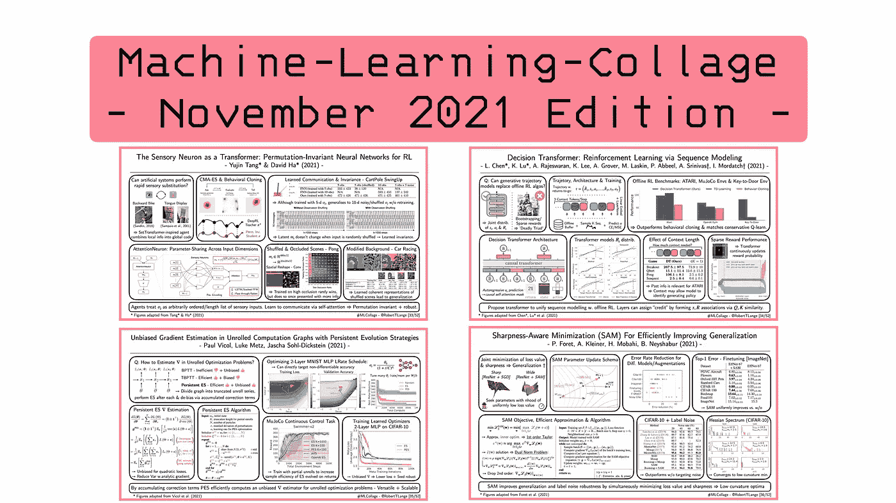
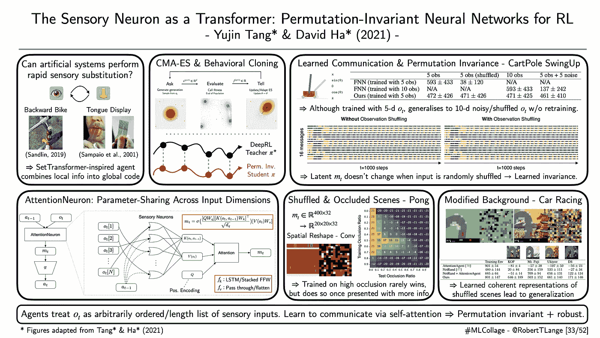
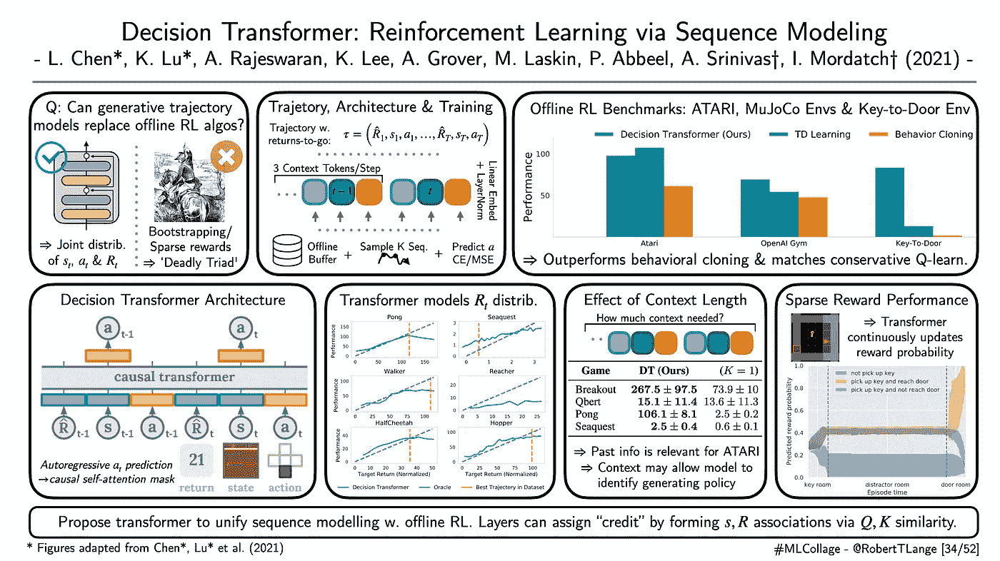
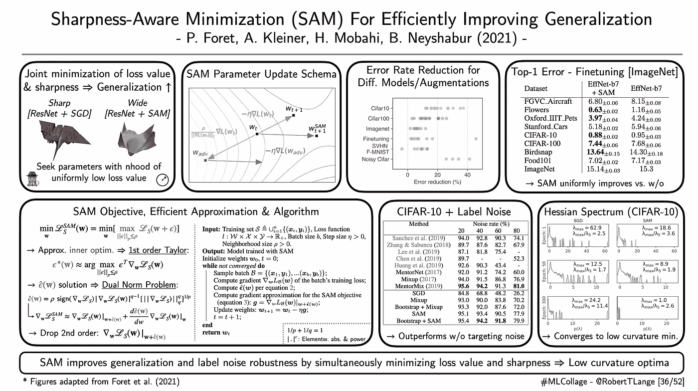

# 2021 年 12 月要读的四篇深度学习论文

> 原文：<https://towardsdatascience.com/four-deep-learning-papers-to-read-in-december-2021-e28f31e6aab4?source=collection_archive---------2----------------------->

## **从感官替代到决策转换器、持续进化策略和敏锐感知最小化**

欢迎来到 12 月份的【T2:机器学习-拼贴】系列，在这里我提供了不同深度学习研究流的概述。那么什么是 ML 拼贴呢？简单地说，我为我最近最喜欢的一篇论文起草了一张幻灯片的视觉摘要。每一周。在月底，所有由此产生的视觉拼贴都被收集在一个摘要博客帖子中。因此，我希望给你一个视觉和直观的深入了解一些最酷的趋势。所以，废话不多说:这里是我在 2021 年 11 月读过的四篇我最喜欢的论文，以及为什么我认为它们对深度学习的未来很重要。

## **‘作为变压器的感觉神经元:用于强化学习的排列不变神经网络’**

*作者:唐* &哈** |📝[论文](https://arxiv.org/pdf/2109.02869.pdf) | 🗣 [谈话](https://www.youtube.com/watch?v=m8POyrJ7Pgg&t=1939s) |🤖 [WWW](https://attentionneuron.github.io/)

**一段话总结:**人类有令人难以置信的可塑性适应能力。我们可以从很少的数据中学习交换完全分离的感觉形态的信息流。例如，人类能够使用[电极阵列](https://en.wikipedia.org/wiki/Brainport)学习用舌头看东西。这种现象通常被称为感官替代。另一方面，众所周知，神经网络易受输入空间变化的影响。例如，dqn 很难处理颜色变化或噪声扰动 [(Lake et al .，2016)](https://arxiv.org/pdf/1604.00289.pdf?source=post_page---------------------------) 。那么，我们如何才能让神经网络变得更加健壮呢？他们会比我们人类更容易被塑吗？唐&哈(2021)在这个方向上迈出了第一步，提出了一组受变压器启发的代理，将本地信息组合成一个全局代码。该架构通过设计是位置不变的，并且在不同的输入维度上共享参数。因此，网络处理一组任意排序的输入维度或面片。此外，它是循环的，因此甚至可以捕捉在线发生的排列。如果需要，这可以允许网络恢复。作者使用进化策略来训练网络，并表明它能够处理低维控制和高维视觉任务的混乱，嘈杂和闭塞的输入。此外，当输入被混洗时，潜在代码不改变，这表明模型确实已经学习了输入不变性。最后，他们提出了一种简单的行为克隆方法，使用非排列不变专家来有效地教授排列不变学生。

ML-Collage [33/52]:作者的数字。|📝[论文](https://arxiv.org/pdf/2109.02869.pdf)

## **“决策转换器:通过序列建模进行强化学习”**

*作者:陈*、陆*等(2021)* |📝[论文](https://arxiv.org/abs/2106.01345) | 🗣 [谈话](https://www.youtube.com/watch?v=83QN9S-0I84) |🤖[代码](https://github.com/kzl/decision-transformer)

**一段话总结:**强化学习问题从根本上来说是硬的。一个空白的代理人必须处理探索问题，面对不断变化的数据分布，并且必须从嘈杂且通常稀疏的奖励信号中学习。普通的 RL 算法试图通过利用自举的概念来求助于近似的动态规划:代理基于环境回报信号和未来回报的另一个估计的组合来改进它自己的估计。这在例如 DQNs 中是成功的，但是由于预测目标的变化性质，这也可能破坏学习动力。决策转换器(Chen 等人，2021)将 RL 问题颠倒过来，并将其视为条件轨迹生成问题。更具体地说，在屏蔽掉序列中的未来轨迹之后，变压器被训练来自动回归预测动作。变压器以先前的状态和动作序列以及观察到的返回为条件。因此，网络可以被“操纵”以完成所观察剧集的剩余部分。它在长度为 K 的序列的离线轨迹缓冲器上被训练。作者表明，这种生成建模方法优于传统的行为克隆和标准的离线 RL 基线。此外，变压器有效地学习对回报分布建模。这意味着人们可以向网络提供一个目标回报作为输入，而代理实际上设法生成一个实现它的轨迹。这意味着网络不仅学会了模仿，还能概括预期收益。此外，决策转换器可以很好地处理稀疏奖励，并学习根据其观察到的轨迹不断更新其奖励概率。

ML-Collage [34/52]:作者的数字。|📝[论文](https://arxiv.org/abs/2106.01345)

## **‘具有持续进化策略的展开计算图中的无偏梯度估计’**

*作者:Vicol 等人(2021)* |📝[论文](http://proceedings.mlr.press/v139/vicol21a.html)

**一段话总结:**现代深度学习充满了展开的优化问题:例如训练递归网络，基于梯度的元学习如 MAML，通过动力学模型进行区分或训练已学习的优化器。最终，这需要通过一个动态系统传播梯度，这可能导致梯度消失或爆炸。为了克服这种不稳定性，研究人员经常求助于进化策略，这种策略避开了解析梯度的显式计算。相反，它们依赖于对网络参数群体的评估，并基于观察到的适应度来构建“进化梯度”。所得到的梯度是无偏的(与随时间截短的反向传播 TBPTT 相比)，但是没有从截短的展开所带来的存储优势中获益。Vicol 等人(2021)引入了持续进化策略(PES)，它允许通过一系列截断展开进行无偏梯度估计。这是通过累积与用于生成网络群体的噪声相关联的校正项来实现的。作者导出了一个二次损失的理论结果，并提供了一个可以利用解析梯度知识的版本。该算法为标准的[开放 NES 算法](https://openai.com/blog/evolution-strategies/)提供了一个易于实现的补充，作者表明它在一组基准任务上表现良好:这些任务包括优化用于训练神经网络的超参数，训练已学习的优化器，甚至更有效地训练 RL 代理。与传统的 ES 梯度相比，PES 梯度导致更低的损耗，并表现出小得多的变化。

ML-Collage [35/52]:作者的数字。|📝[论文](http://proceedings.mlr.press/v139/vicol21a.html)

## **‘有效提高泛化能力的清晰度感知最小化’**

*作者:Foret 等人(2021)* |📝[纸张](https://arxiv.org/abs/2010.01412) |🤖[代码(JAX)](https://github.com/google-research/sam) |🤖[代码(PyTorch)](https://github.com/davda54/sam)

**一段话总结:**“平坦最小值假说”( [Hochreiter & Schmidhuber，1997](https://www.bioinf.jku.at/publications/older/3304.pdf) )将损失面的几何形状与神经网络的泛化特性联系起来。低曲率网络通常可以获得更好的测试性能。直观上，参数空间中的鲁棒性隐含着输入空间中的鲁棒性。如果我们可以摆动 W，我们可以摆动 Foret 等人(2021)的锐度感知最小化(SAM)直接将这种直觉表述为目标函数。更具体地，作者提出联合最小化训练损失值及其锐度。因此，优化过程在具有均匀低损耗的邻域中寻找参数。这样做需要解决最小-最大优化问题:最小化关于参数的损失，同时在固定半径邻域内最大化它。作者提供了最大化问题的有效近似，它基于一阶泰勒级数近似和对偶范数问题的解。最终，这归结为另一个反向传递的额外计算成本。他们表明，当从头开始训练时，这种简单的修改导致许多数据集、增强和模型的测试性能提高。此外，在许多情况下，使用 SAM 对预训练网络进行微调也会得到改善。此外，该模型对标签噪声下的训练更具鲁棒性。在 CIFAR-10 的嘈杂版本中，他们显示 SAM 与为这种情况设计的专用数据增强技术相比非常有竞争力。最后，他们根据经验分析了找到的最小值的曲率，并表明与没有 SAM 训练的模型相比，它表现出更小的曲率。

ML-Collage [36/52]:作者的数字。|📝[论文](https://arxiv.org/abs/2010.01412)

这是这个月的🤗让我知道你最喜欢的论文是什么。如果你想获得一些每周 ML 拼贴输入，查看 Twitter 上的标签[# ML collage](https://twitter.com/hashtag/mlcollage)。你也可以在最后的总结中找到拼贴画📖博客帖子:

 [## 2021 年 9 月要读的四篇深度学习论文

### 从 Auto-ML 到 Vision Transformer 培训和演示以及灾难性的费希尔爆炸

towardsdatascience.com](/four-deep-learning-papers-to-read-in-september-2021-3650a30725d)