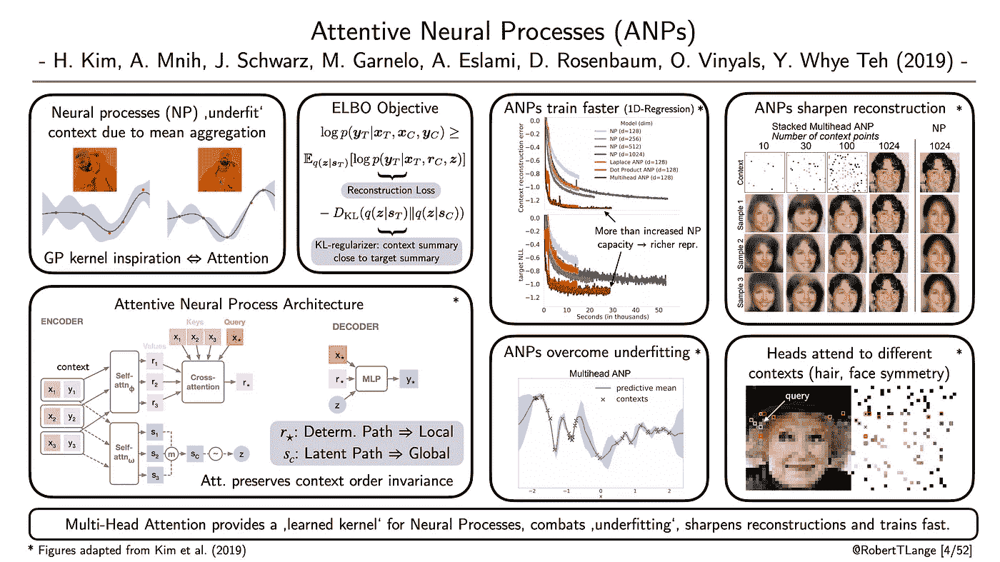

# 2021 年 2 月要读的四篇深度学习论文

> 原文：<https://towardsdatascience.com/four-deep-learning-papers-to-read-in-february-2021-abc9e30db3ab?source=collection_archive---------6----------------------->

## [入门](https://towardsdatascience.com/tagged/getting-started)

## **从神经科学到自动分化，神经网络理论&神经过程中的欠拟合**

您是否希望更好地了解目前正在进行的不同深度学习研究流？您是否有太多打开的 arXiv 标签，以至于无法浏览？看完整视频时间太少？如果有一篇论文的关键思想和概念的快速总结就好了。然后我很高兴地向大家介绍[:机器学习拼贴’系列](https://twitter.com/hashtag/mlcollage)。在这个系列中，我为我最近最喜欢的一篇论文起草了一张幻灯片的视觉摘要。每一周。到了月底，我会把所有的拼贴画收集到一篇总结性的博客文章中。这是第一版。以下是我在 2021 年 1 月读到的四篇我最喜欢的论文，以及我为什么认为它们很重要。

## **“无监督深度学习识别单个 IT 神经元中的语义解缠结”**

*作者:希金斯等人(2020)* |📝[论文](https://arxiv.org/abs/2006.14304)

**一段总结**:Ramon y Cajal 提出的“神经元学说”指出，神经系统由独立的离散单元组成。这导致人们特别强调神经元是认知计算的核心。从那以后，细胞神经科学迅速从单细胞记录转向群体记录，越来越多的工作集中在神经元群体的潜在集体动力学上。随着神经科学研究的焦点转移，神经元学说也被新的群体学说所掩盖。Higgins 等人(2020 年)回到过去，研究了猕猴下颞(IT)皮层中的-VAEs 潜在代码如何模拟单个神经元记录。他们发现，当改变视觉刺激的不同语义特征时，解开的潜在单位可以很好地解释单细胞活动的大部分变化。此外，他们发现增加的解缠结(更高)导致神经数据的更好拟合。这提供了证据表明，它的神经元可能实际上服务于一个特定的功能:语义视觉概念的分离。最后，Higgins 等人(2020)表明，在人脸上训练的 VAEs 实际上可以基于非常有限的神经记录(最多只有 12 个神经元)来重建视觉刺激。

ML-Collage [1/52]:数字改编自 *Higgins 等人(2020)* |📝[论文](https://arxiv.org/abs/2006.14304)

## **“随机自动微分”**

*作者:奥克泰等人(2020)* 📝[论文](https://arxiv.org/abs/2007.10412) | 🗣 [谈话](https://slideslive.com/38942370/randomized-automatic-differentiation) |🤖[代码](https://github.com/PrincetonLIPS/RandomizedAutomaticDifferentiation)

**一段话总结**:反向模式自动微分(AD)又名反向传播是现代深度学习成功故事的支柱。我们使用链式法则、由模型定义的线性化计算图、可区分的目标…以及随机采样的小批量数据来计算梯度。所以最后我们只能依靠随机估计。从统计学的角度来看，这不是一个问题，事实上，人们长期以来一直在争论由随机梯度下降引起的隐式正则化。但是，如果我们完全接受随机性，我们能降低反向传播的记忆复杂性吗？Oktay 等人(2020)提出了两种随机修改:
1)从计算图中穿过的所谓鲍尔路径的二次采样。
2)在计算雅可比矩阵需要大量内存的位置注入随机矩阵。
得到的梯度估计是无偏的，但是具有较大的方差，这与减少的存储器需求相权衡。对于标准的 MLP、CNN & RNN 设置，给定固定的内存预算，他们提出的随机 AD 算法优于经典 AD，并且可以帮助解决更多的问题。

ML-Collage [2/52]:数字改编自 *Oktay 等人(2020)* |📝[论文](https://arxiv.org/abs/2007.10412)

## **“关于神经网络的谱偏差”**

*作者:拉哈曼等人(2019)* |📝[论文](https://arxiv.org/abs/1806.08734) |🤖[代码](https://github.com/nasimrahaman/SpectralBias)

**一段话总结** : ReLU 神经网络是通用函数逼近器。但是 ReLU nets 喜欢学习什么函数，以及学习动态如何调整拟合的函数空间？Rahaman 等人(2019)使用傅立叶分析表明，他们偏向于首先学习低频模式。它们提供了 ReLU 前馈网络的精确解析频谱分析以及可解释的上限。拟合的傅立叶分量取决于权重的谱范数，作者发现该范数(以及拟合的最高频率)在训练过程中增加。此外，他们根据经验表明，低频成分对随机参数扰动更为稳健。他们在简单的正弦和 MNIST 回归任务上验证了他们的见解。最后，他们介绍了一个花瓣分类任务，这表明数据流形的复杂性可以在很大程度上决定一项任务的学习难度。更复杂的流形可能更容易在傅立叶空间中吸收。这对对抗性鲁棒性的设计以及课程学习有直接的影响。

ML-Collage [3/52]:数字改编自 *Rahaman 等人(2019)* |📝[论文](https://arxiv.org/abs/1806.08734)

## **“注意力神经过程”**

*作者:金等人(2019)* |📝[论文](https://arxiv.org/abs/1901.05761) | 🗣 [谈话](https://youtu.be/q-4lo5luKgc) |🤖[代码](https://github.com/deepmind/neural-processes/blob/master/attentive_neural_process.ipynb)

**一段话总结**:神经过程(NP)学习将上下文数据映射到回归函数的分布。传统上，这种映射是通过保持顺序不变的自动编码器架构来建模的。该架构在确定性输出路径和第二潜在路径之间进行分离，确定性输出路径捕获上下文中的局部结构，而第二潜在路径模拟与底层随机过程相关联的全局结构。为了在单个上下文点上聚合，NPs 意味着在确定性嵌入上聚合。Kim 等人(2019)认为，这导致了环境的淘汰和不适应。相反，他们建议使用注意机制来有效地学习 NPs 的参数化核函数。他们表明，尽管注意力增加了计算的复杂性，但获得一个好解的有效运行时间却大大减少了。此外，从几个像素进行图像重建可以产生清晰的视觉印象。正如在其他基于注意力的论文中常见的那样，它们表明多头注意力层的不同头关注不同的关键上下文点。

ML-Collage [4/52]:数字改编自 *Kim 等人(2019)* 📝[论文](https://arxiv.org/abs/1901.05761)

> 这是这个月的。让我知道你最喜欢的论文是什么。如果你想获得一些每周的 ML 拼贴输入，在 Twitter 上查看标签[# ML collage](https://twitter.com/hashtag/mlcollage)。罗伯特·兰格