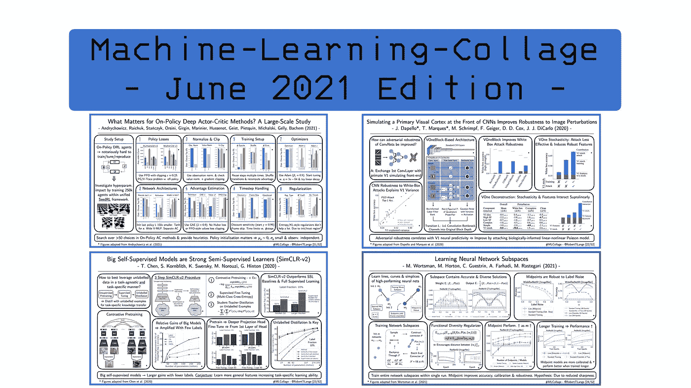
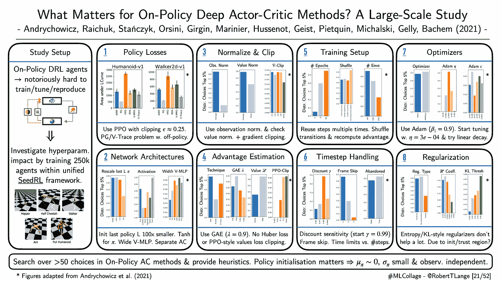
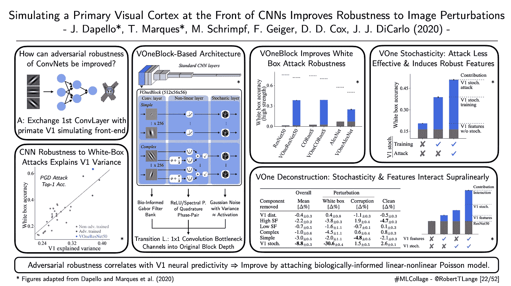
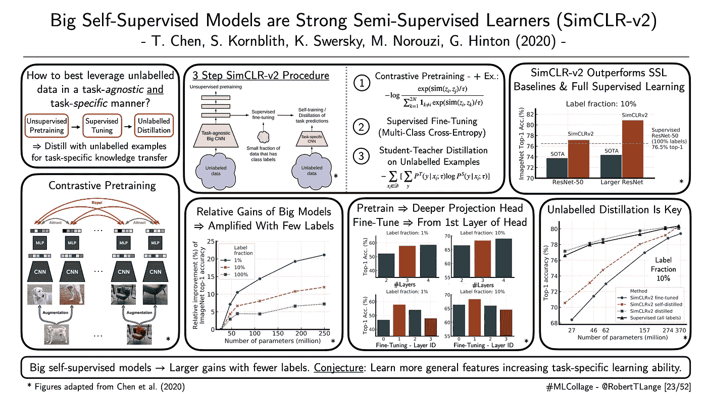
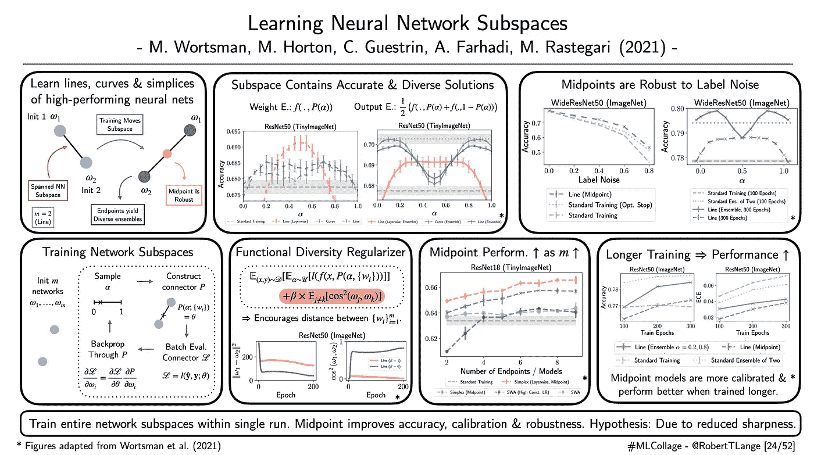

# 2021 年 7 月要读的四篇深度学习论文

> 原文：<https://towardsdatascience.com/four-deep-learning-papers-to-read-in-july-2021-e91c546d112d?source=collection_archive---------6----------------------->

## **从大规模深度 RL 到对抗性鲁棒性，SimCLR-v2 &学习神经网络空间**

欢迎来到七月版的【T2:机器学习拼贴】系列，在这里我提供了不同深度学习研究流的概述。那么什么是 ML 拼贴呢？简单地说，我为我最近最喜欢的一篇论文起草了一张幻灯片的视觉摘要。每一周。在月底，所有由此产生的视觉拼贴都被收集在一个摘要博客帖子中。因此，我希望给你一个视觉和直观的深入了解一些最酷的趋势。所以，废话不多说:这里是我在 2021 年 6 月读过的四篇最喜欢的论文，以及为什么我认为它们对深度学习的未来很重要。

## **‘什么才是对政策有深度的演员的批评方法？**大规模研究

*作者:Andrychowicz 等人(2021)* 📝[纸](https://openreview.net/forum?id=nIAxjsniDzg) |🤖[代码](https://github.com/google-research/seed_rl/blob/master/mujoco/what_matters_in_on_policy_rl.ipynb)

**一段话总结:**政策上的深度强化学习代理是出了名的难调。结果的再现可能具有挑战性，并可能导致类似“深度 RL 还不起作用”的陈述。有一点是肯定的:深度 RL 训练循环不像训练有监督的 MNIST CNN 分类器那样防弹。那么，如何弥合这一差距呢？Andrychowicz 等人(2021 年)首次尝试对 DRL 超参数稳健性进行实证研究:他们训练了 25 万名代理人&评估 50 多个基本选择的超参数。这项研究是使用 MuJoCo 控制环境的子集和谷歌的 [Seed RL](https://github.com/google-research/seed_rl) 框架进行的，该框架为培训分布式演员-评论家代理提供了一个通用基础设施。作者比较了不同的政策损失目标，网络架构，优化，正则化和优势估计技术。他们的结果证实了许多常见的 DRL 智慧:例如，使用 PPO 裁剪目标、tanh 激活和训练单独的演员-评论家网络。但它们也强调了一系列新的见解:策略的初始化似乎相当重要，建议确保策略分布和观察的零均值和独立性。此外，观察值的平均归一化显著提高了性能。就我个人而言，我非常喜欢这种大规模的研究，并相信它们提供了一种有价值的资源，可以节省相当多的时间和令人头疼的调优问题。

ML-Collage [21/52]:作者的数字。|📝[论文](https://openreview.net/forum?id=nIAxjsniDzg)

## **‘模拟中枢神经系统前部的初级视觉皮层提高了对图像扰动的鲁棒性’**

*作者:达佩洛和马克斯等人(2020)* |📝[纸张](https://biorxiv.org/content/10.1101/2020.06.16.154542v2) |🤖[代码](https://github.com/dicarlolab/vonenet)

**一段话总结:**如何让卷积神经网络不那么容易受到对抗性攻击？Dapello 和 Marques 等人(2020)从我们的视觉皮层中获得灵感，并将 V1 的经典 Gabor 滤波器模型与标准计算机视觉架构相结合。更具体地说，他们提出将具有加性高斯噪声的固定权重生物约束滤波器组作为标准 CNN 的前端。他们称这个前端为 VOne 块，它与 1 乘 1 瓶颈一起为标准类 ResNet CNN 的第一卷积层提供了一个替代。作者表明，这种简单的前端块大大提高了对白盒攻击的鲁棒性，同时保持了有竞争力的 ImageNet 性能。他们执行了一组消融实验来解开滤波器组和随机性的贡献。他们的实验表明，类 V1 特征和随机性以非平凡的方式有益地相互作用:将两种成分结合起来的总改善超过了它们各自贡献的总和。作者推测，随机性不仅在推理时使攻击不那么有效，而且在训练时促进了健壮特征的学习。最后，作者表明，中枢神经网络的对抗性鲁棒性与其 V1 脑反应预测性相关。这篇论文提供了一个如何将深度学习与经过实验验证的自下而上的神经科学建模相结合的美丽例子。

ML-Collage [22/52]:作者的数字。|📝[论文](https://biorxiv.org/content/10.1101/2020.06.16.154542v2)

## **‘大的自我监督模型是强的半监督学习器’**

*作者:陈等(2020)* |📝[纸](https://arxiv.org/abs/2006.10029) |🤖[代码](https://github.com/google-research/simclr)

一段话总结:这些年来，我们已经看到了自我监督预培训的革命。这包括大型自然语言模型，如 GPT，以及对比预训练的计算机视觉模型，如 [SimCLR-v1](https://arxiv.org/abs/2002.05709) 和 [MoCo](https://arxiv.org/abs/1911.05722) 。一个关键的研究问题是如何充分利用未标记数据？我们如何仅使用无监督的信息来提取核心表示，这对下游任务是有用的？SimCLR-v1 使用图像不同的增强以及对比损失来最大化/最小化正/负图像对的代表性相似性。之后，使用少量标记数据对预训练的架构进行微调。因此，未标记的数据以一种纯任务不可知的方式被使用。在 SimCLR-v2 中，Chen 等人(2021)建议再次使用未标记的数据:在对网络进行微调后，仅使用未标记的示例将其预测提取到不同的架构中。因此，SimCLR-v2 结合了无监督的与任务无关的预训练，调整&特定于任务的提取。作者认为，这种对未标记示例的特定任务使用允许大型神经网络更好地传输它们的一般知识。较大的模型在“小标签数据体制”中表现出色，并且它们能够胜过那些纯粹使用监督分类损失训练的对应模型。最后，他们还表明，更深的投影头和第一个投影头的微调可以提高最终性能。

ML-Collage [23/52]:作者的数字。|📝[论文](https://arxiv.org/abs/2006.10029)

## **‘学习神经网络子空间’**

*作者:沃茨曼等人(2021)* |📝[纸张](http://arxiv.org/abs/2102.10472) |🤖[代码](https://github.com/apple/learning-subspaces)

**一段话总结:**还有什么比训练单个神经网络更好的呢？在一次运行中训练性能良好的网络的整个子空间。Wortsman 等人(2021)介绍了一种新的训练范例，它使得在 5 个步骤中训练神经网络的线性(或非线性)组合成为可能:1)独立初始化 *m* 神经网络。2)从 *m-1* 单工中取样一个点。3)基于先前采样的点计算 m 个网络的(可能是非线性的)组合。4)根据一批数据计算“连接”神经网络的损失。5)通过线性/非线性组合操作传播梯度，执行反向传播以更新 m 个网络。作者表明，这允许在 ImageNet 上训练表现良好的网络的整个线条、曲线和简化。此外，他们引入了正则化器，通过最小化 m 个网络端点之间的余弦相似性来促进功能多样性。直观上，子空间端点之间的距离由此被最大化。这有助于子空间中点，其对于标签噪声是鲁棒的并且被很好地校准。一个假设的原因可能是中点提供了一个不太尖锐的最小值，这已被证明可以更好地概括 [(Dziugaite 和 Roy，2017)](https://arxiv.org/pdf/1703.11008.pdf) 。如果你对 Frankle 等人(2020)的[线性模式连接](https://arxiv.org/abs/1912.05671)的发现感兴趣，那么你会喜欢这篇文章。

ML-Collage [24/52]:作者的数字。|📝[论文](http://arxiv.org/abs/2102.10472)

这是这个月的🤗让我知道你最喜欢的论文是什么。如果你想获得一些每周 ML 拼贴输入，查看 Twitter 上的标签[# ML collage](https://twitter.com/hashtag/mlcollage)。你也可以在最后的总结中找到拼贴画📖博客帖子:

</four-deep-learning-papers-to-read-in-june-2021-5570cc5213bb> [## 2021 年 6 月要读的四篇深度学习论文

towardsdatascience.com](/four-deep-learning-papers-to-read-in-june-2021-5570cc5213bb)