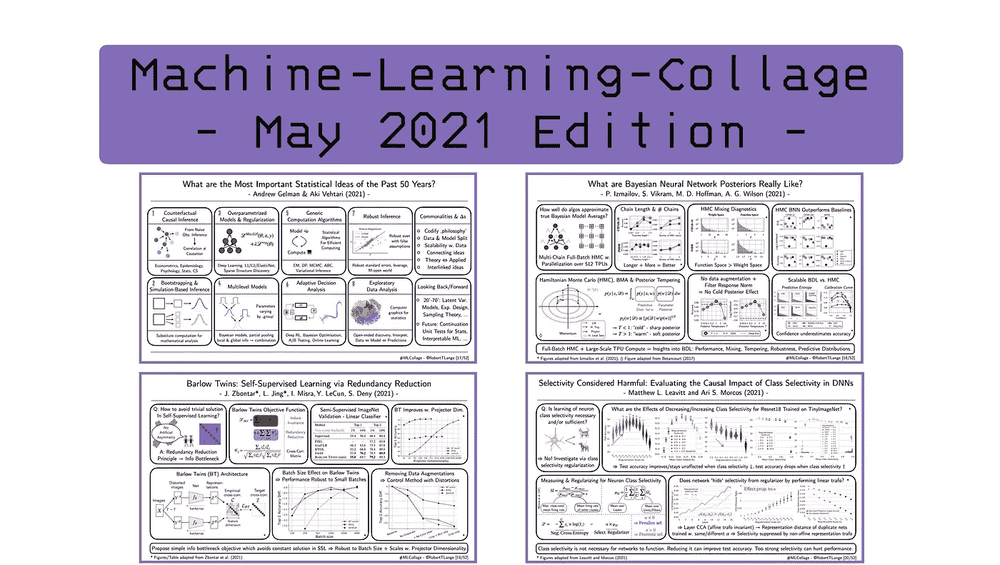
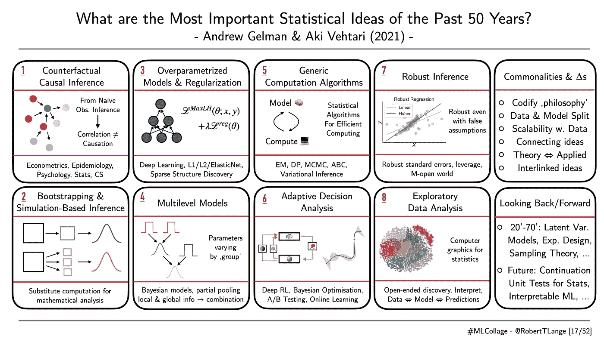
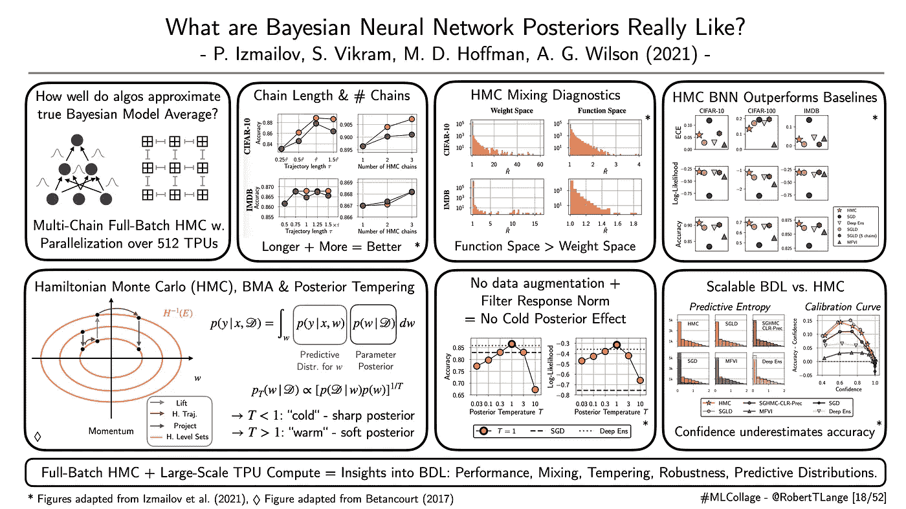
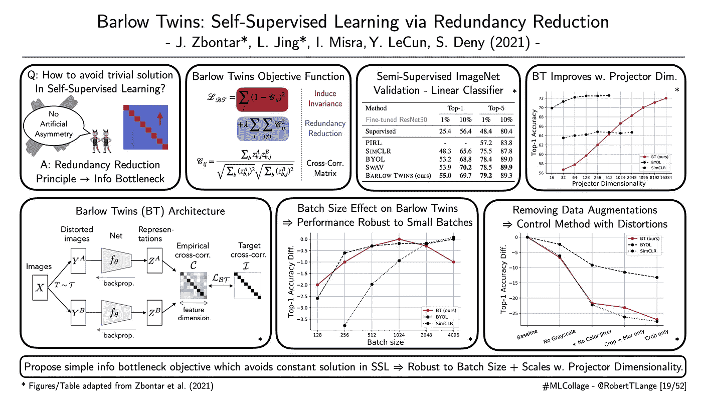
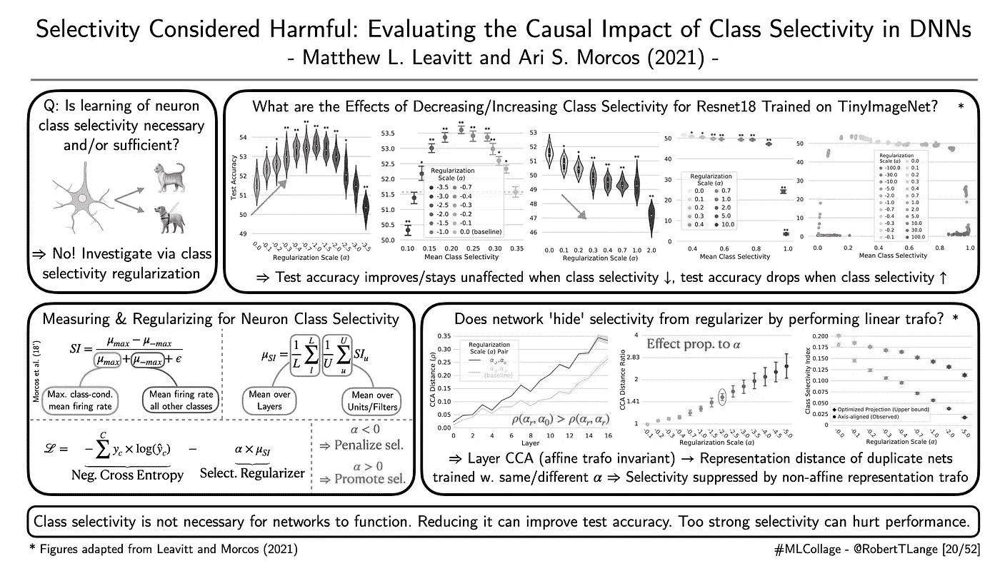

# 2021 年 6 月要读的四篇深度学习论文

> 原文：<https://towardsdatascience.com/four-deep-learning-papers-to-read-in-june-2021-5570cc5213bb?source=collection_archive---------6----------------------->

## **从贝叶斯神经网络到自我监督学习、类别选择性和来自统计学的核心思想**

欢迎来到六月版的[【机器学习-拼贴】系列](https://twitter.com/hashtag/mlcollage)，在这里我提供了不同深度学习研究流的概述。那么什么是 ML 拼贴呢？简单地说，我为我最近最喜欢的一篇论文起草了一张幻灯片的视觉摘要。每一周。在月底，所有由此产生的视觉拼贴都被收集在一个摘要博客帖子中。因此，我希望给你一个视觉和直观的深入了解一些最酷的趋势。五月是一个相当不错的月份，包括虚拟 ICLR 2021 会议、ICML 审查决定以及 NeurIPS 截止日期。因此，让我们深入研究我在 2021 年 5 月读过的四篇最喜欢的论文，以及为什么我认为它们对深度学习的未来很重要。

## **“过去 50 年最重要的统计思想是什么”**

*作者:盖尔曼&韦赫塔里(2021)* |📝[论文](http://arxiv.org/abs/2012.00174)

**一段话总结:**深度学习位于统计学和计算机科学的交汇点。许多流行的核心思想源于结合计算技巧来解决基本的统计问题。例如，权重正则化在统计学中有着悠久的传统，并允许在高维回归模型中进行推断。同时，稀疏性提高了所考虑变量的可解释性。或者变分推理——在贝叶斯深度学习和变分自动编码器中非常突出——它提供了一个优化框架来近似一个难以处理的贝叶斯推理。因此，重要的是反思统计的核心思想，并问问我们自己它们是如何塑造我们今天的思维的。Gelman 和 Vehtari (2021)提炼出 8 个核心思想:反事实因果推理、基于引导/模拟的推理、过度参数化模型&正则化、层次模型、通用计算算法、自适应决策、稳健推理和探索性数据分析。多好的名单啊！很难找到不属于这些类别的子领域。试试看。那么将他们团结在一起的共同主题是什么呢？它们合并多个范例，随数据缩放，并将拟合的模型与数据分开。总的来说，这是一个很好的周末读物，它提供了一个很好的历史发展概况。就我个人而言，我喜欢这一前景，包括统计的单元测试和可解释机器学习的近期努力的继续。

ML-Collage [17/52]:作者的数字。|📝[论文](https://arxiv.org/abs/2101.04882)

## **“贝叶斯神经网络后验概率到底是什么样子的”**

*作者:伊兹迈洛夫等人(2021)* |📝[论文](https://arxiv.org/abs/2104.14421)

**一段总结:**贝叶斯深度学习有望提供校准的不确定性估计，以支持有效的决策和精心的预测。但这也带来了为数百万个权重参数推断高维后验概率的挑战。为了解决这个问题，人们提出了许多近似的方法。这包括深度集成，它通过组合来自多个模型的预测或平均场变分推断来获得不确定性。但是这些方法实际上有多接近真实的后验概率仍然是一个悬而未决的问题。伊兹迈洛夫等人(2021)试图通过哈密顿蒙特卡罗(HMC)和 512 个 TPU 来回答这个问题。HMC 提供了一个梯度引导的抽样程序，它规模很好，并保证从真实的后验渐近产生样本。在大规模并行化的推动下，作者研究了关于后验混合、链数以及后验近似质量的基本问题。他们发现更长的链和更平行的链有助于推断更准确的后验概率。在多项基准测试中，HMC 的表现优于所有其他被考虑的基准。作者指出，许多技术提供的置信度估计不一定反映它们在分类任务上的准确性。以前有人认为,“冷”回火后验分布——由温度系数锐化——表现明显更好。伊兹迈洛夫等人(2021 年)表明，这实际上是一个假象，可以通过在 CNN 中禁用数据增强和使用滤波器响应归一化来克服。绝对是所有贝叶斯深度学习爱好者的推荐读物。

ML-Collage [19/52]:数字改编自伊兹迈洛夫等人(2021) |📝[论文](https://arxiv.org/abs/2104.14421)

## “巴洛双胞胎:通过减少冗余的自我监督学习”

*作者:Zbontar，Ling 等(2021)* |📝[纸张](http://arxiv.org/abs/2103.03230) |🤖[代码](http://github.com/facebookresearch/barlowtwins)

**一段话总结:**还记得那个[臭名昭著的乐村蛋糕](https://www.google.com/url?sa=i&url=https://medium.com/syncedreview/yann-lecun-cake-analogy-2-0-a361da560dae&psig=AOvVaw2MLuERiuuJ41FIL8kZsqsL&ust=1622642446095000&source=images&cd=vfe&ved=0CA0QjhxqFwoTCOCByKbM9vACFQAAAAAdAAAAABAD)以及相关的预测自我监督学习(SSL)是深度学习的未来吗？SSL 的核心是通过引导以前收集的数据样本来解决信用分配信号稀疏的问题。例如，这可以是视频序列预测、去噪或对先前灰度图像着色的形式。SSL 方法的一个流行前身是[暹罗网络](https://www.cs.cmu.edu/~rsalakhu/papers/oneshot1.pdf)。在暹罗网络中，人们扭曲样本，并训练网络生成与原始样本的扭曲版本接近的表示。因此，网络被推动以捕捉核心特征并压缩输入。在现代版本中，这种联合嵌入训练通常依赖于一系列技巧，例如在两种表示生成机制之间引入不对称性。Zbontar，Jing 等人(2021)通过提出一个简单的信息瓶颈目标来克服这些诡计，该目标作用于嵌入表示的互相关矩阵。更具体地，对角线元素被推到接近 1，而非对角线元素因大于 0 而被惩罚。因此，两件事情同时完成:表示对于失真应该变得不变，并且不必要的分量的冗余被强制减少。作者在各种半监督学习任务上测试了他们的方法，并表明与其他基线不同，提出的 Barlow Twin 目标即使在小批量的情况下也能很好地工作，并且它随着表示的维度而不断改进。

ML-Collage [19/52]:数字改编自 Zbontar 等人(2021) |📝[论文](http://arxiv.org/abs/2103.03230)

## **“被认为有害的选择性:评估 DNNs 中类别选择性的因果影响”**

*作者:莱维特和莫科斯(2021)* 📝[纸张](https://arxiv.org/abs/2003.01262) |💻[博客](https://ai.facebook.com/blog/easy-to-interpret-neurons-may-hinder-learning-in-deep-neural-networks)

**一段话总结:** [OpenAI 的显微镜](https://openai.com/blog/microscope/)项目试图弄清楚人工网络中复杂的内部工作原理。他们还提供了一套美丽的可视化论证非常选择性活跃的神经元的存在和功能。这种现象让人想起在大脑中发现的著名的[詹妮弗·安妮斯顿神经元](https://www.brainlatam.com/blog/what-does-jennifer-aniston-neuron-tell-us-about-the-brain-machine-interface-467)。但是，对于神经网络正常工作来说，学习神经元类别选择性是必要的和/或充分的吗？Leavitt 和 Morcos (2021)通过引入正则化项来研究这个基本问题，正则化项促进/抑制神经元或特征图变得有选择性。在一组实验中，他们能够表明，如果类别选择性降低，在 TinyImageNet 上训练的 ResNets 的测试准确性可以提高。此外，如果选择性太高，甚至会损害性能。因此，尽管有很强的选择性，但神经网络似乎更有效。但是，网络能简单地学会“隐藏”正则化子的选择性吗，例如通过神经元的线性组合来分配它？作者表明这一假设没有证据。为此，他们比较了用不同正则化强度训练的神经网络的 [CCA 转换表示](https://papers.nips.cc/paper/2018/file/a7a3d70c6d17a73140918996d03c014f-Paper.pdf)。神经网络不是隐藏选择性，而是通过非仿射表示变换来抑制它。那么这对深度学习研究意味着什么呢？也许我们应该对神经/拟人化更谨慎一点，并尊重我们自己在分析人工神经网络时的偏见。

ML-Collage [20/52]:数字改编自 Leavitt 和 Morcos (2021) |📝[论文](https://arxiv.org/abs/2003.01262)

这是这个月的🤗让我知道你最喜欢的论文是什么。如果你想获得一些每周 ML 拼贴输入，查看 Twitter 上的标签[# ML collage](https://twitter.com/hashtag/mlcollage)。你也可以在最后的总结中找到拼贴画📖博客帖子:

 [## 2021 年 5 月要读的四篇深度学习论文

towardsdatascience.com](/four-deep-learning-papers-to-read-in-may-2021-706e02071473)