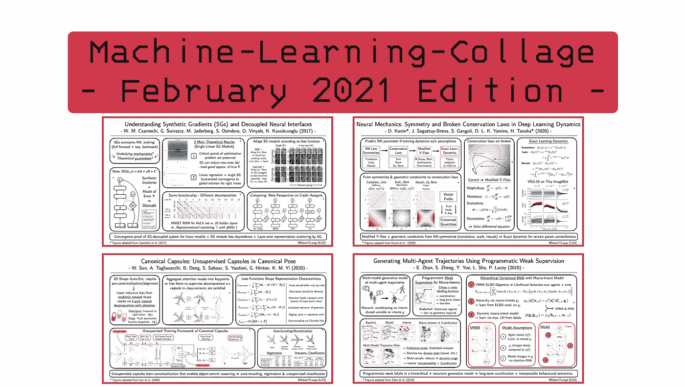
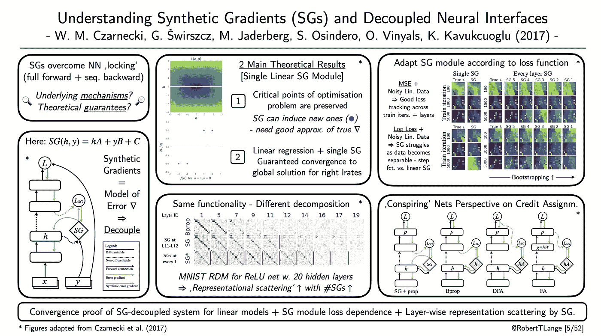
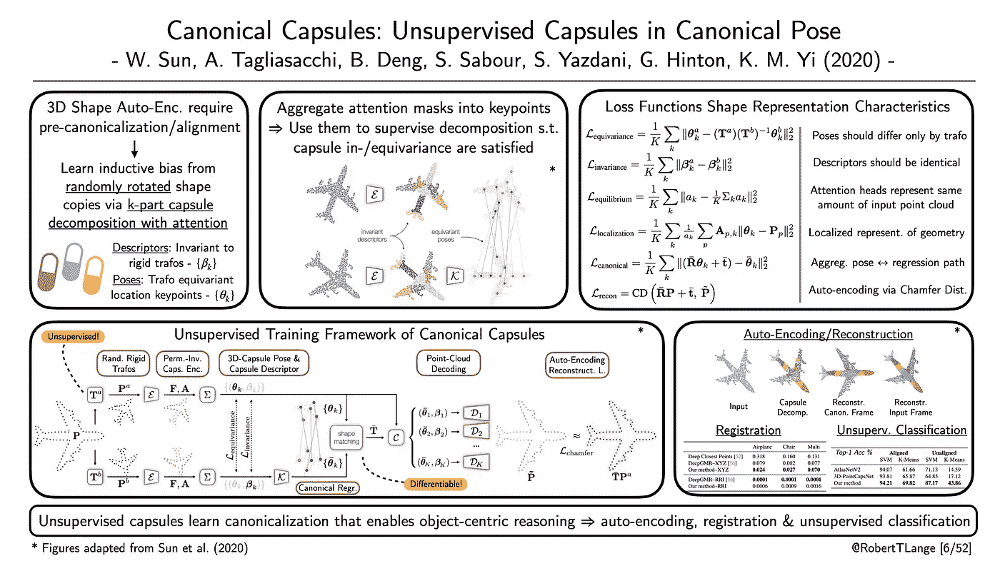
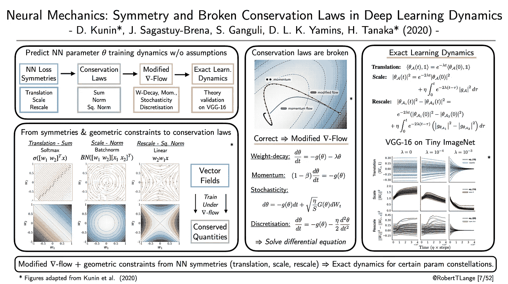
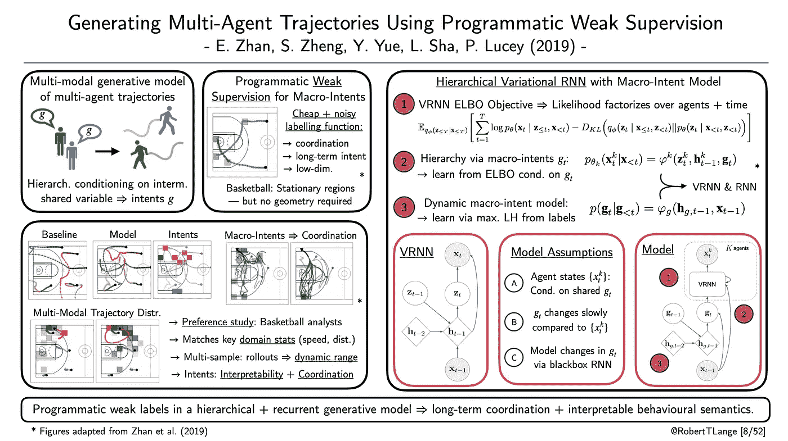

# 2021 年 3 月要读的四篇深度学习论文

> 原文：<https://towardsdatascience.com/four-deep-learning-papers-to-read-in-march-2021-9d933f52aafa?source=collection_archive---------2----------------------->

## [思想和理论](https://towardsdatascience.com/tagged/thoughts-and-theory)

## **从合成梯度到胶囊网络，网络训练守恒定律&多智能体生成模型**

欢迎来到二月底的[“机器学习-拼贴”系列](https://twitter.com/hashtag/mlcollage)，在这里我提供了不同深度学习研究流的概述。那么什么是 ML 拼贴画呢？简单地说，我为我最近最喜欢的一篇论文起草了一张幻灯片的视觉摘要。每一周。在月底，所有由此产生的视觉拼贴都被收集在一个摘要博客帖子中。因此，我希望给你一个视觉和直观的深入了解一些最酷的趋势。所以，废话不多说:这里是我在 2021 年 2 月读过的四篇我最喜欢的论文，以及为什么我认为它们对深度学习的未来很重要。

## **“理解合成梯度和解耦神经接口”**

*作者:Czarnecki 等人(2017)* |📝[纸张](https://arxiv.org/pdf/1703.00522.pdf) |🤖[代码](https://github.com/andrewliao11/dni.pytorch)

**一段话总结**:反向传播是当前深度学习革命的驱动力。从本质上讲，反向传播是对链式法则的图论解释:为了计算特定权重矩阵的损失梯度，我们必须首先计算正向传播中的必要梯度。但是如果我们不需要等待上游梯度的传播呢？合成梯度(SG)的框架试图通过使用误差梯度的代理模型来“解锁”向前和向后传递。该模型是同时学习的，并作为反向投影梯度的替代。SGs 可以对大规模分布式训练的神经模块进行解耦。我们可以在不同的加速器上以一种不纠缠的方式训练神经网络的不同部分。但是，潜在的机制是什么，以及由此产生的学习动力是否有一些理论保证？Czarnecki 等人(2017)证明了线性网络情况下线性 SG 模块的收敛保证。此外，他们表明，即使 SG 训练的网络实现了相同的功能，表示在各层之间更加分散。最后，他们介绍了不同的信用分配算法，如 backprop，SGs 和(直接)反馈校准的统一观点。所有这些都可以归结为多智能体问题:多个模块/网络同时学习“共谋”。

ML-Collage [5/52]:数字改编自 *Czarnecki 等人(2017)* |📝[论文](https://arxiv.org/pdf/1703.00522.pdf)

## **“标准胶囊:处于标准姿势的无人监管胶囊”**

*作者:孙等(2020)* |📝[纸](https://arxiv.org/abs/2012.04718) |🤖[代码](https://github.com/canonical-capsules/canonical-capsules)

**一段总结:**胶囊网络(Hinton et al .，2000)通过将特征分解为描述符和姿态来模拟层级关系。在一类变换下，描述符被训练为不变的(它们不会改变),而姿势被训练为等变的(它们以可预测的方式改变)。通过堆叠得到的特征并对它们进行端到端的训练，我们可以获得特征的层次结构，这些层次结构捕获输入部分之间的语义关系。Sun 等人(2020)将这种胶囊分解与注意机制一起应用于 3D 点云任务。不是使用预先对齐的点云，而是通过两次随机变换来增强对象。之后，胶囊网络学习在规范框架中表示两个变换的点云。整个过程是无人监督的，并且使用一组辅助目标来塑造表示特征。如同在自我监督学习中一样，所得到的特征可以用于不同的下游任务。这些包括自动编码和重建，但也点注册和简单的 SVM 分类。这表明网络已经学会了形成“心智图像”，这有利于以对象为中心的推理。

ML-Collage [6/52]:图改编自*孙等(2020)* |📝[论文](https://arxiv.org/abs/2012.04718)

## **“神经力学:深度学习动力学中的对称性和破缺守恒定律”**

*作者:库宁等人(2020)* 📝[论文](https://arxiv.org/pdf/2012.04728.pdf) |🤖[代码](https://github.com/danielkunin/neural-mechanics)

**一段话总结**:对深度神经网络的复杂学习动力学有一个坚实的理论把握是很难的。许多理论工作必须引入不切实际的假设，如线性激活或连续时间 SGD 动态。这些结果可能会提供一种直觉，但当你希望归纳为最先进的训练范式时，你仍然需要祈祷。Kunin 等人(2020 年)没有做出任何假设。相反，它们利用了 batch-norm 或 softmax 激活函数等常见操作引入的对称性。他们从统计物理学的角度出发，证明了这种运算会导致对称性，从而导致梯度和 Hessian 上的几何约束。另一方面，这些约束意味着在梯度流(SGD 的连续时间版本)下权重统计的守恒定律(例如，权重的和、范数或平方范数)。在对重量衰减、动量、批量随机性和离散时间进行了一些修改后，他们能够求解一个常微分方程。)描述了权重统计的时间演变。这表明他们的预测适用于在微型 ImageNet 数据集上训练的流行的 VGG-16 架构。总之，他们为推导实用的神经网络 Noether 定理提供了第一次尝试。

ML-Collage [7/52]:数字改编自库宁*等人(2020)* |📝[论文](https://arxiv.org/pdf/2012.04728.pdf)

## **“使用程序化弱监督生成多智能体轨迹”**

*作者:张等(2019)* |📝[纸张](https://arxiv.org/abs/1803.07612) |🤖[代码](https://github.com/ezhan94/multiagent-programmatic-supervision)

**一段话总结:**产生协调的多智能体行为是困难的。可能轨迹的空间在所考虑的因素的数量上呈指数增长。常见的方法利用中间变量，以便根据一些常见的静态输入来调节生成。但这些中间变量要么难以解释，要么推导/标注成本高昂。Zhan 等人(19’)提出利用弱编程标签来调节生成的变分 rnn。这些标签是通过廉价的启发式标签函数获得的，并提供了对共享宏意图的可解释的解释。宏观意图的动态可以通过第二个 RNN 的监督训练来学习。作者表明，宏观意图允许模型捕捉轨迹的多模态分布，并在篮球分析师的人类偏好研究中验证了他们的结果。该模型捕捉真实人类游戏的关键统计数据，并能够从相同的老化中生成一系列不同的协调轨迹。

ML-Collage [8/52]:数字改编自詹*等(2019)* |📝[论文](https://arxiv.org/abs/1803.07612)

> 这是这个月的。让我知道你最喜欢的论文是什么。如果你想获得一些每周 ML 拼贴输入，查看 Twitter 上的标签[# ML collage](https://twitter.com/hashtag/mlcollage)。最后，你也可以看看[之前的总结博文](/four-deep-learning-papers-to-read-in-february-2021-abc9e30db3ab)。