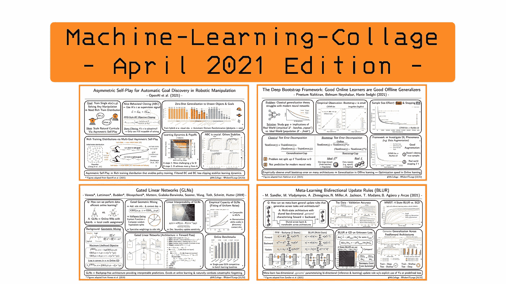
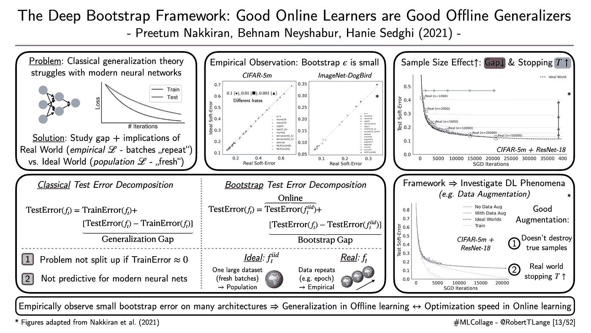
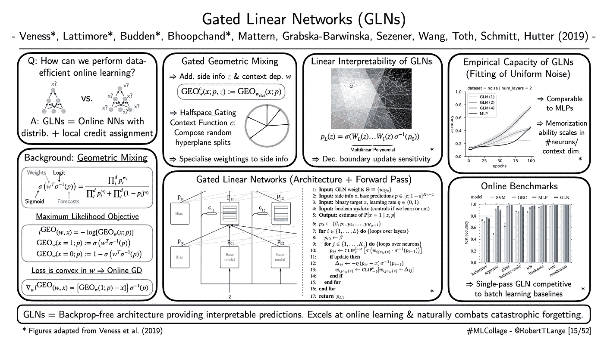
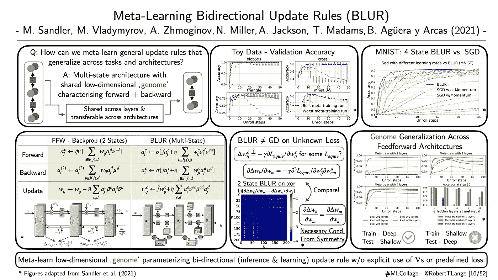

# 2021 年 5 月要读的四篇深度学习论文

> 原文：<https://towardsdatascience.com/four-deep-learning-papers-to-read-in-may-2021-706e02071473?source=collection_archive---------5----------------------->

## [思想和理论](https://towardsdatascience.com/tagged/thoughts-and-theory)

## **从机器人的不对称自我游戏到网络的泛化，门控线性网络&元学习更新规则**

欢迎来到四月底的[“机器学习-拼贴”系列](https://twitter.com/hashtag/mlcollage)，在这里我将概述不同的深度学习研究流。那么什么是 ML 拼贴呢？简单地说，我为我最近最喜欢的一篇论文起草了一张幻灯片的视觉摘要。每一周。在月底，所有由此产生的视觉拼贴都被收集在一个摘要博客帖子中。因此，我希望给你一个视觉和直观的深入了解一些最酷的趋势。所以，废话不多说:这里是我在 2021 年 4 月读过的四篇最喜欢的论文，以及为什么我认为它们对深度学习的未来很重要。

## **“机器人操作中自动发现目标的不对称自我游戏”**

*作者:OpenAI 等人(2021)* |📝[纸张](https://arxiv.org/abs/2101.04882) |💻 [WWW](https://robotics-self-play.github.io/)

**一段话总结:**一年半前，OpenAI 发布了他们令人印象深刻的关于学习灵巧操作来解决魔方的工作。训练程序依赖于 LSTM-PPO 代理，该代理基于日益复杂的自然课程消耗大量数据。早在 2019 年，这一课程是由一种名为自动领域随机化的技术构建的。在最近的工作中，OpenAI 提出了一种替代技术来创建丰富的训练分布:他们缩放不对称的自我游戏，以实现对看不见的对象的零镜头概括。更具体地说，他们在一个普通的求和游戏中训练了两个代理，Alice 和 Bob。Alice 在环境中跑来跑去，为 Bob 提供了一个目标状态。后来，鲍勃试图实现这个目标。它们相互竞争，就像在 GAN 设置中一样。与许多其他课程学习方法不同，我们总是确信目标状态必须是可达到的。为什么？因为爱丽丝的政策能够到达那里。因此，我们可以使用她的轨迹作为额外的监督学习信号。但是我们需要小心，因为这个演示很可能不是最佳的。OpenAI 只在 Bob 自己无法达到目标时使用监督。此外，为了稳定学习动态，OpenAI 建议对政策更新进行 PPO 风格的剪辑。作者称这种选择性且稳定的机制为“爱丽丝行为克隆”(ABC)。他们提供了一套广泛的消融，表明自我发挥涵盖了广泛的目标空间，ABC 提高了采样效率。

ML-Collage [14/52]:数字改编自 OpenAI 等人(2021) |📝[论文](https://arxiv.org/abs/2101.04882)

## **“深度引导框架:优秀的在线学习者是优秀的离线概括者”**

*作者:Nakkiran 等人(2021)* |📝[论文](https://t.co/MQUMvI0s3z?amp=1)

**一段话总结:**研究神经网络中泛化的正确框架是什么？传统方法限制了测试和训练错误之间的泛化差距，难以为深度学习提供见解。通常，神经网络将训练误差降低到 0。在这种情况下，训练测试误差分解不能提供有效的见解。Nakkiran 等人(2021 年)提出研究不同的差距:在每个更新步骤中对新批次进行训练的网络之间的性能差异。“理想”世界又名。在线学习)和一个训练有素的网络。“真实的世界”又名。线下学习)。作者在一组合成数据集和通用架构上证明，这种差距在现实设置中似乎很小，这反过来允许以下猜想:*离线学习中的一般化似乎等同于在线学习中的快速适应。*那么为什么这可能是一个重要的见解呢？简而言之，它为研究深度学习工具箱中许多可以说是不透明的“黑客”开辟了一个新的视角。例如，在这篇论文中，作者讨论了 SGD 的隐式正则化、过度参数化和欠参数化，以及什么使数据增强技术变得优秀。

ML-Collage [13/52]:数字改编自 Nakkiran 等人(2021 年)|📝[论文](https://t.co/MQUMvI0s3z?amp=1)

## **“门控线性网络”**

*作者:Veness 等人(2019)* |📝[纸张](http://arxiv.org/abs/1910.01526) |🤖[代码](https://github.com/deepmind/deepmind-research/tree/master/gated_linear_networks)

**一段话总结:**现代深度学习大多依靠反向传播和离线梯度下降训练。神经科学家声称，向前和向后传递所需的重量对称性以及误差的全局传播在生物学上是不可信的。另一方面，门控线性网络(GLNs)提供了一种新的神经架构家族，其通过凸规划被无反向传播地在线训练。每个神经元被直接训练来输出最终目标的预测，而不是学习渐进的特征层次。该预测被转发到另一层神经元，该层神经元再次被训练来预测目标。这就产生了专家混合的层次结构。训练参数是分配给相应输入预测的相对重要性。GLNs 允许边信息(又名。特征)，其由上下文函数处理并允许权重的专门化。将混合预测堆叠在一起会产生一个决策边界，该边界线性地依赖于输入。线性度允许轻松检查预测的稳健性和其他条件不变的情况下的*(如果一个输入维度发生变化，预测会发生什么？)*可解释性。Veness 等人(2019 年)表明，GLNs 的局部性对抗灾难性遗忘，并且它们特别适合在线/单遍学习。

ML-Collage [15/52]:数字改编自 Veness 等人(2019) |📝[论文](http://arxiv.org/abs/1910.01526)

## “元学习双向更新规则”

*作者:桑德勒等人(2021)* |📝[论文](https://arxiv.org/abs/2104.04657)

**一段话总结:**back prop 和 SGD 之后是什么？一个令人兴奋的未来方向是通用元学习，旨在学习归纳偏差和学习规则本身。训练包括学习算法的标准内循环执行和该算法的昂贵的外循环改进。在 BLUR(更新规则的双向学习)中，Sandler 等人(2021)提出元学习一个共享的低维基因组，它调节学习和推理。虽然在反向传播中有两种神经元状态(正向活动传播和反向梯度聚集)，但模糊允许神经元具有任意数量的状态。然后，元学习基因组由一组小矩阵组成，当执行权重更新和任务相关信息的传播时，这些小矩阵确定这些不同状态如何相互作用。根据不同前馈网络训练运行的任务分布对矩阵进行元训练。得到的基因组能够在元序列分布上胜过 SGD，并且学习不同于对未知损失的简单梯度下降的非平凡更新过程。它概括了任务和前馈体系结构。然而，重要的是，基因组必须在一组由大型网络组成的训练运行中进行元训练，以便推广到小型网络。

ML-Collage [16/52]:数字改编自 Sandler 等人(2021) |📝[论文](https://arxiv.org/abs/2104.04657)

这是这个月的🤗让我知道你最喜欢的论文是什么。如果你想获得一些每周 ML 拼贴输入，查看 Twitter 上的标签[# ML collage](https://twitter.com/hashtag/mlcollage)。您也可以查看去年四月版摘要中的拼贴画📖博客帖子:

 [## 2021 年 4 月要读的四篇深度学习论文

### 从元梯度到时钟值，神经网络的全局工作空间理论和训练的边缘…

towardsdatascience.com](/four-deep-learning-papers-to-read-in-april-2021-77f6b0e42b9b)