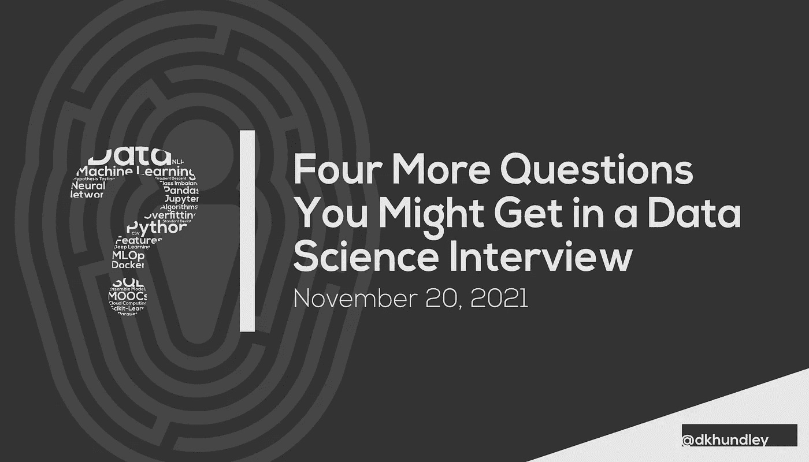

# 在数据科学面试中你可能会遇到的另外四个问题

> 原文：<https://towardsdatascience.com/four-more-questions-you-might-get-in-a-data-science-interview-703efd741d1d?source=collection_archive---------8----------------------->

## 由有数据科学采访经验的人制作的迷你系列的第 2 部分

朋友们，你们好！欢迎回来，继续我们关于数据科学面试中可能会遇到的面试问题的系列报道。如果你错过了第一篇文章，[你可以点击链接](/four-questions-you-might-get-in-a-data-science-interview-f7589ee44f56)查看。

由于我在最初的帖子中给出了更好、更全面的解释，所以我将保持这篇介绍简短而甜蜜。让我简单回顾一下这些帖子的结构。在所有四个问题中，您将看到两个小节:

*   **动机**:这描述了面试官在这个问题背后的意图。理解这一点很重要，因为有时问题如何回答比答案本身更重要。比如之前的帖子有一个关于考生如何学习新东西的问题。“获得学位”不一定是错误的答案，但这并不表明候选人一定愿意或能够随时学习新事物。
*   **潜在答案**:任何面试问题都很少有“放之四海而皆准”的答案，所以我尽量给你的潜在答案提供多个选项。

还有最后一个提醒:我在两篇文章中提出的问题涵盖了所有的数据科学技能。根据您申请的具体职位，您可能会也可能不会遇到类似的问题，但我仍然希望提供广泛的问题类型，以涵盖“全部”数据科学技能。

好了，我答应了一个简短而甜蜜的介绍，所以让我们开始提问吧！

## 1.跨各种云平台(包括 AWS SageMaker)，可以直接从 Jupyter 笔记本部署模型。你能解释一下为什么这不是一个更好的模式吗？你会考虑用什么来代替？

*动机*:这是一个与“纯”数据科学关系不大的问题，更多的是关于一般的软件工程，而且这个问题的答案没有如何回答的问题重要。简而言之，这不是一个更好的计划的原因是因为它没有坚持**软件工程效率和弹性**的核心原则。我的意思是，这种“部署在笔记本电脑中”的过程是一个笨重的过程，尤其是如果您想将其扩展到数百个型号。

从许多角度来看，这种“部署在笔记本中”的模式是非常低效的。我将在下面的列表中快速列举这些低效之处:

*   **不自动化**:在 DevOps 的世界里，我们更喜欢像 CI/CD 管道这样的东西尽可能自动化。您不仅需要手动将代码移动到这个 Jupyter 笔记本实例中，而且还需要在笔记本中手动运行代码来部署模型。
*   **不可扩展**:考虑到上面的要点，如果你的公司开始部署数百种型号，这将变得难以管理。即使您可以让所有的数据科学家进行初始部署…
*   **不可大规模维护**:即使你有很多人通过笔记本手动部署模型，它仍然不可大规模维护。如果你曾经不得不使用一个特定的软件库在任何模型上做一个软件补丁，我会不寒而栗地想到在这种模式下会做多少噩梦。

*潜在答案*:作为“动机”部分的一部分，我开始插入一些答案，但只是为了确保你特别清楚那些是什么，让我们在这里重申它们。再说一次，没有“放之四海而皆准”的答案，所以请允许我分享一些面试官希望听到的不同答案:

*   **使用云提供商的 ML 服务的另一个方面**:我 100%确定 AWS SageMaker 就是这种情况，我假设其他云服务也可能如此。尽管您可以从他们的 Jupyter 笔记本电脑上进行部署，但他们仍然有以不同方式部署您的模型的其他选项。AWS SageMaker 特别提供了直接部署批处理推理作业或实时 API 的选项。
*   **使用 CI/CD 管道**:从 DevOps 的角度来看，这是“必须的”。这个答案表明候选人理解自动化你的代码的好处。当然，这个答案本身还不够好，因为您需要解释管道是如何部署模型的，这导致了最后一个问题…
*   **通过“基础设施即代码”实现自动化**:这是你的面试官真正想听到的。它结合了前面两个要点，基本表述为:“我知道如何以一种高度可伸缩、高效和弹性的方式自动化云部署。”我很确定每个云提供商都有自己的“基础设施即代码”服务。AWS 的叫做 CloudFormation。但即使他们没有，我也不能在这里推荐足够多的 Terraform。我有一个关于 Terraform 的完整的其他系列，你可以通过这个链接了解更多。

## 2.您的公司已经部署了数百个模型，并希望通过产生一致的预期推理范围来确保每个模型保持高性能。当模型的性能随着时间的推移而下降时，这个概念叫什么？您可以采取什么步骤来确保这种下降不会在如此大量的模型中发生？

*动机*:因为企业使用预测模型的推理输出来支持商业决策，所以你总是希望推理输出尽可能准确自然是很重要的。一个产生负面结果的模型不仅会导致糟糕的商业决策，还会产生一些非常严重的后果。例如，如果特斯拉的自动驾驶算法停止正常工作，如果特斯拉汽车因算法性能不佳而发生事故，这可能会导致人员死亡。

虽然您可以让一个人手动检查每个模型以确保它正确执行，但问题特别指出，您需要确保数百个模型需要保持高性能。显然，如果进行手动测试，这将变得难以管理。尽管如此，这里的动机是确保候选人理解什么是模型性能退化，以及如何在更自动化的水平上管理它。我们将在下一节讨论具体的潜在答案，但我不会太担心记住我在下面列出的所有潜在指标。相反，我更关注的是您需要以自动化的方式保护模型性能的一般概念。

*潜在答案*:关于这个概念叫什么的问题，只有一个真正的答案，那就是模型漂移。**模型漂移是一个概念，因为输入到模型中的数据可能会随着时间的推移从最初的预期值范围发生变化，模型在生产中保持不变的时间越长，其性能可能就越差**。(这不要与遇到全新的价值观相混淆，我们将在下一个问题中讨论。)

从自动化的角度来看，**评估模型随时间漂移的方法将是通过捕捉各种可以用数值量化模型漂移的指标**。没有“一个标准可以统治所有人。”如果您想要评估二元分类模型的质量，您可能会查看精度、召回率、ROC AUC 或 F1 分数等指标。对于回归模型，您可能会查看均方根误差(RMSE)、R 平方或平均调整误差(MAE)等指标。您可能还应该运行数据质量指标，如群体稳定性指数(PSI)，以确保最近的数据不会偏离原始训练数据太远。

基于这些度量的结果，您可以拥有类似于“分层”自动化的东西来处理模型漂移，也许是类似于“交通灯”的分层系统。绿色层中的模型将是不错的选择。黄色层中的模型会自动向模型所有者发出通知，其中包含类似“嘿，我们发现这里有点不确定。你可能会想看看这个。”对于红色层中的模型，您可能希望有一个自动化的重新培训/重新部署机制。最后一层涉及到非常流行的概念，称为 **MLOps** ，虽然我不打算在这里讨论它，但我认为如果你能很好地阐述 MLOps，特别是在这种情况下，你的面试官会印象深刻。😃

## 3.几个月来，您部署到生产中的模型已经生成了一系列预期的推论。一天早上，你走进办公室，发现模型在过去的 24 小时内开始产生完全不同的推论。为什么模型会突然产生不同的推论，你会怎么解决这个问题？

*动机*:乍一看，这可能听起来像是另一个软件工程问题，因为我们正在谈论处理生产中的故障模型，但实际上这里完全不是这样。注意，在这个场景中，模型仍然产生推论，这意味着支撑模型的软件解决方案运行良好。现在，如果我用不同的方式来表达这个问题，并且注意到这个模型根本没有产生任何推论，那么是的，这可能更像是一个软件工程问题。

现在，您可能会认为这是一个模型漂移问题，因为我们已经讨论了上一个问题，但这并不完全是这里的问题。这里问题的真正根源很可能与数据质量问题有关。模型漂移更多地与更长的时间周期相关联，这里的问题指出了一夜之间的变化。同样，**这可能是一个数据质量问题，一些上游来源可能对他们发送给你的模型**的数据进行了彻底的新更改。例如，假设您有一个经过训练的模型来分析冰淇淋销售的价格预测。如果模型只在口味只有“巧克力”或“香草”的数据集上训练，那么如果你的上游来源开始在一夜之间发送关于新口味的信息，如“草莓”、“曲奇”、“朗姆酒葡萄干”和“洛基路”，你的模型将会崩溃。

所以基本上，你的面试官希望你明白，数据质量可以通过引入全新的、完全意想不到的价值，从根本上改变你的模型的性能。现在让我们开始讨论你可能如何处理这种情况。

潜在答案:这是一个潜在答案范围非常有限的问题。具体来说，我只能想到两个可行的选择:

*   **使用新值**对数据集重新训练模型:这种方法肯定有助于解决问题的根本原因，但也是两种方法中较为困难的一种。根据新值的构造方式，您可能需要修改培训代码来适当地处理新值。这可能非常耗时，并且取决于您的公司选择如何验证新模型，或者在这种情况下验证模型的新版本，这可能是一个需要更长时间的解决方案。但它也可能是值得的，所以我绝对不想阻止它作为一种选择。
*   **过滤掉任何带有新值的记录**:这并不能完全解决为模型处理新值的根本问题，但这绝对是一个快速的权宜之计，可以确保模型至少对它熟悉的记录仍然产生高质量的推论。回到我们上面的冰淇淋例子，这可能意味着要求您的上游来源只发送有关“巧克力”或“香草”口味的记录。关于其他新口味的记录将被丢弃。同样，这并不理想，但这将是一个快速的解决方案。

实际上，最佳解决方案可能是上述两种选择的组合。你可以建议第二种选择，作为目前的快速创可贴措施，这将为你赢得一些时间，用新的价值观正式重新训练模型。然后，当新的模型被训练和正确验证后，您可以部署它，然后要求您的上游源使用新的值释放记录中的闸门！

## 4.您正准备将一个模型作为可消费的软件解决方案部署到生产环境中(例如，实时 API、batch cronjob)。除了创建解决方案本身，在将解决方案部署到您的生产环境时，您还需要考虑哪些因素？

*动机*:最后一个问题包含了数据科学的软件工程方面，作为一个软件工程产品，你的建模解决方案需要遵循开发任何软件工程产品的最佳实践。具体来说，面试官希望你至少能完成三类特定的活动:**自动化部署，创建自动化测试，以及确保最佳安全实践**。

*可能的答案*:在这篇文章的所有问题中，这个问题可能是你可以回答这个问题的最广泛的选项。在“动机”这一小节中，我们谈到了面试官希望看到的三种特定类型的活动。让我们快速列出这些类别的项目列表。

从**自动化部署**开始:

*   您可以创建一个 **CI/CD 管道**，它从您的 Git 存储库中获取代码，对其进行适当的打包(例如用 Docker 进行容器化)，然后将其部署到适当的测试和生产环境中。
*   您可以使用**一个“基础设施即代码”工具**，如前面提到的 Terraform，在基于云的平台(如 AWS、Google 云平台)等提供商上创建部署。
*   如果您在一个类似 Kubernetes 集群的内部环境中工作，您可以创建 **YAML 文件**来配置您的模型应该如何在相应的环境中部署。

下一个类别是**创建自动化测试**。在这里分享一些选项之前，我应该注意到我实际上有一篇完整的、独立的博客文章,专门致力于您可以为模型部署创建的许多不同的测试。

*   应该为任何建模项目创建的最明显的一组测试是**单元测试**。顾名思义，单元测试有助于测试出您编写的代码，以确保无论您为代码编写多少单元测试，代码都能通过。
*   鉴于许多建模解决方案是作为实时 API 部署的，我认为下一组最重要的测试是**性能测试**。这一点很重要，因为如果进入 API 的流量超出了单个副本的处理能力，您可能需要注意可伸缩性。有一个很棒的工具叫做 Locust，你可以在你的 Python 代码中使用它，我已经在[这个链接的博客文章](/performance-testing-an-ml-serving-api-with-locust-ecd98ab9b7f7)中写了一篇关于这个工具的完整文章。

最后，最后一类是**确保最佳安全实践**。不幸的是，我们生活在一个有很多坏人的世界里，所以我们需要确保我们的建模解决方案得到适当的保护，以保护模型的完整性，并保护很可能是客户数据的数据。

*   许多建模解决方案被部署为 Docker 容器，有几个**容器扫描工具**可以扫描这些 Docker 容器，寻找潜在的安全漏洞。Docker Desktop 最近集成了一个名为 Snyk 的供应商后端，所以现在如果你用 Docker Desktop 执行一个`docker scan`命令，它将在幕后使用 Snyk 向你显示不同级别的潜在安全漏洞。(例如，低、中、高、关键)
*   如果您与 AWS 这样的云提供商合作，您将需要确保您的**身份&访问管理(IAM)策略**得到适当调整，以提供“最低特权”安全访问。IAM 不仅仅是 AWS 的本地服务。我确定它在谷歌云平台上，我猜它也在微软 Azure 上。这些服务有助于确保只有正确的参与者有权与您的建模解决方案进行交互。

我们的第二组面试问题到此结束！我希望这些对你考虑自己的数据科学面试有所帮助。在这个时候，我没有起草任何其他问题，但如果我想出另外几个问题，那么我可能会在这个系列中写第三篇文章。感谢您的阅读，祝您求职顺利！🏆