# 你在学校可能没学过的四种乘法

> 原文：<https://towardsdatascience.com/four-multiplication-methods-you-might-not-have-learned-in-school-fac2211a24b7?source=collection_archive---------7----------------------->

## 答案有许多不同的方式。

当我们学习乘法时，我们学习把等式分成几部分。首先，我们使用 1 的位置值找到产品。然后我们转向十位数，接着是百位数。最后，我们总结一切，得出我们的答案。这种方法很有效，但并不总是最有效的。这里有一些其他的方法可以加快这个过程。

在这些例子中，我使用的是 2 位数和 3 位数。这些方法也适用于较大的数字。


卢卡斯·范·奥尔特在 [Unsplash](https://unsplash.com?utm_source=medium&utm_medium=referral) 上的照片

# 晶格方法

画一个网格，用对角线分割每个方块。将一个数字写在顶部，另一个写在右侧，每列或每行一个数字。

586 x 45 =

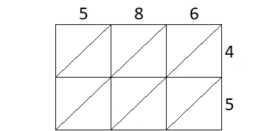

586 x 45:顶部 586，右侧 45

在每个单元格中，将行乘以列。将乘积分割成十位值和一位值。将十位数写在对角线上方，将一位数写在对角线下方。

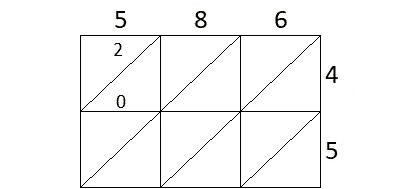

5 x 4 = 20。把 2 放在线上，0 放在线下

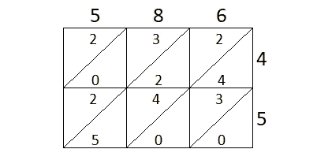

完整的网格

现在，用对角线来看网格。将对角线上的数字相加。如果总和大于 9，则将十位数进位值带入下一列。

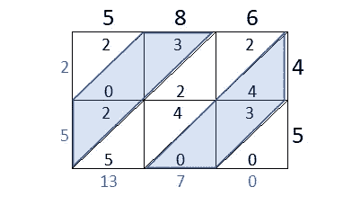

穿过蓝色和白色对角线求和

```
586 x 45
-> 2, (2+0+3), (5+4+2+2), (0+3+4), 0
-> 2, 5, 13, 7, 0
-> 2, 6, 3, 7, 0
= **26370**
```

最后，用数字写出对角线上的总和，你就会得到答案。

**586 x45 = 26370**


由 [Unsplash](https://unsplash.com?utm_source=medium&utm_medium=referral) 上的[摄影](https://unsplash.com/@photoholgic?utm_source=medium&utm_medium=referral)拍摄

# 直线法

当数字很小时，这种方法对于 2 位数和 3 位数的数字非常有效。当你有许多相交的线时，它会变得有点乱。

画一系列代表第一个数字的每一位的平行线。线条应该大致呈 45 度角，并且每个数字之间有一个间隙。

对于这个例子，我们将使用 **223 x 52**

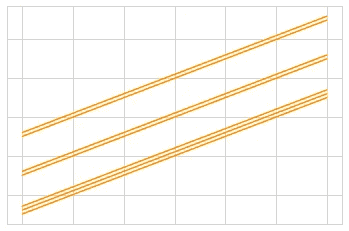

223 由线表示

百位值是 2；最上面的两条线代表它。接下来的两行表示十位，最后三行表示一位值。

接下来，我们画第二个要乘的数。我们通过绘制一组与第一组平行线相交的新的平行线来做到这一点。

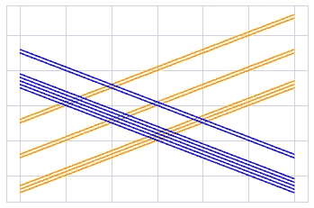

223(橙色)x 52(蓝色)

这次下面一组线代表五个十，上面两条线代表一。注意高位值线总是在左边。

现在我们在线的交叉处画点。

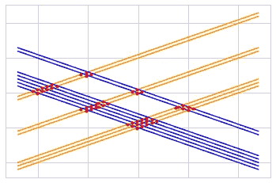

交叉点上的点

接下来，我们沿着 x 轴的位置对这些点进行分组。每组点代表我们最终答案中的一个数字。我们对每组中的点求和。如果总和大于 9，则将 10 的值带入下一列。

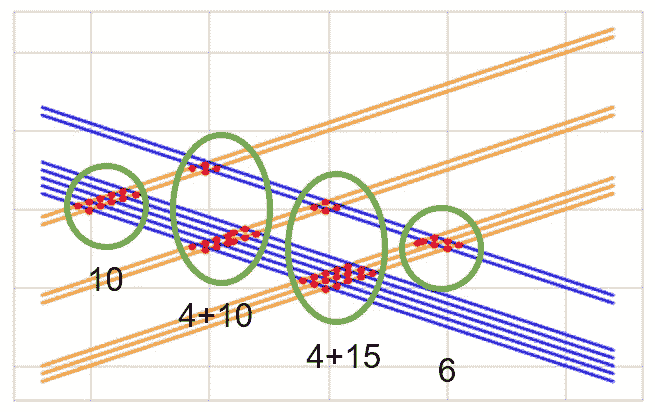

每组点代表一个数字。把这些点加起来

写出各组的总和作为答案。

```
223 x 52
-> 10 ,(4 + 10) ,(4 + 15) , 6   # sum the dots
-> 10, 14, 19, 6                # 14 and 19 are greater than nine
-> 10+1, 4+1, 9, 6              # carry the 1 from 14 and 19
-> **11596**
```

223 x 52 = 11596


由[瑞安·施拉姆](https://unsplash.com/@rschram?utm_source=medium&utm_medium=referral)在 [Unsplash](https://unsplash.com?utm_source=medium&utm_medium=referral) 上拍摄的照片

# **十字交叉法**

在这种方法中，你从右向左移动。在第一步中，我们将 1 乘以 1。接下来，我们进入十列，将十乘以一，将一乘以十，并将这两个计算结果相加。我们继续跨越等式。整体模式如下所示。

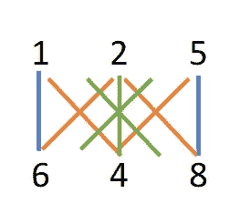

十字形图案

呀，看起来很复杂。当我们一步一步来看，就更有意义了。

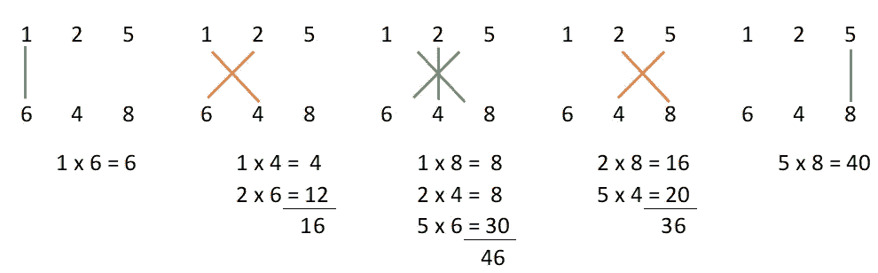

这个过程是对称的。我们在边缘只有一个计算(1 x 1 或 100 x 100)。在中间，我们有三个计算。

最棘手的部分是确保将正确的位置值带入下一列。

```
125 x 648
-> 6, 16, 46, 36, 40
-> 6+1, 6+4, 6+3, 6+4, 0
-> 7, 10, 9, 10, 0
-> 7+1, 0, 9+1, 0, 0
-> 8, 0+1, 0, 0, 0 
= **81000**
```

**125 x 648 = 81000**


照片由[扎卡里·卡道夫](https://unsplash.com/@zacharykadolph?utm_source=medium&utm_medium=referral)在 [Unsplash](https://unsplash.com?utm_source=medium&utm_medium=referral) 上拍摄

# 该滑动方法

这个方法几乎是神奇的。你从做与你预期相反的事情开始——反转一个乘数的数字。

这个颠倒的数字充当了一个窗口。它在等式中一次移动一个位置值。

424 x 83 =

从尽可能靠左的窗户开始。窗口的个位值应该在另一个乘数的最大位值之下。将这些数字相乘

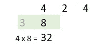

第一步:83 反过来变成 38。乘以 4 x 8

将窗口向右滑动一个位置值。将两列相乘，并对乘积求和。


第二步:向右滑动，将各列相乘并求和。

继续向右移动窗口。

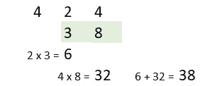

第三步:滑动，乘，和。

直到窗口的最大位值低于乘数的 1 位值。

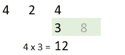

将每一步的总和组合在一起。将适当的位置值移到下一列。

```
424 x 83
-> reverse 83 -> 38 
-> 32, 28, 38, 12 # column sums
-> 32+2, 8+3, 8+1, 2
-> 34, 11, 9, 2
= **35192**
```

424 x 83 = 35192

快乐倍增！