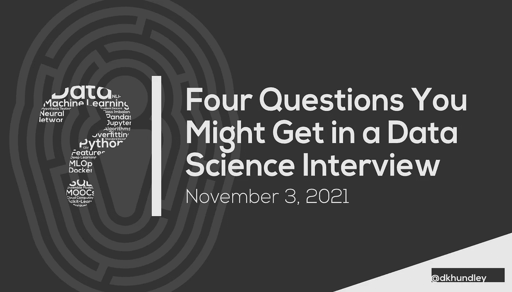

# 在数据科学面试中你可能会遇到的四个问题

> 原文：<https://towardsdatascience.com/four-questions-you-might-get-in-a-data-science-interview-f7589ee44f56?source=collection_archive---------22----------------------->

## DS 面试问题

## 招聘台另一边的人设计的问题的迷你系列的第一部分

朋友们，又见面了！随着我们进入一个在大流行后的世界中如何工作的新领域，你可能已经注意到，许多人正在抓住以前可能没有的新机会。我具体指的是远程工作的出现如何为以前可能成为障碍的职位带来了新的机会。还有一个不幸的巧合是，由于失业是疫情的一个原因，一些人现在可能正在寻找新的机会。

不管你的情况如何，在任何求职过程中，几乎都无法逃避这一令人生畏的活动:面试。我自己也经历过数据科学面试，我绝对能体会到面试过程有多紧张！数据科学面试流程通常是一个多阶段的方法，通常包括一个或多个编码评估、一个“文化契合度”面试，当然还有一个技术问答时间。在这个迷你系列中，我们将通过一些您在自己的数据科学面试中可能会收到的问题的具体示例来涵盖最后一点。

为了让你放心，我并不是一个凭空捏造问题的人，让我分享一点我的个人经历和背景。我目前是一家财富 50 强公司的高级机器学习工程师(MLE ),我有非常好的机会参与新 MLE 的招聘过程。我和其他队友一起设计了一系列我们自己面试时会用到的问题，我也曾站在招聘桌的一边，观察应聘者在被问到这些问题时的表现。

当然，我显然不能分享我们公司使用的问题，但我想我会精心设计一套全新的问题，这些问题与您在真正的数据科学面试中可能会得到的问题具有相同的总体感觉。为了帮助你从回顾这些问题中获得最大收益，我不仅分享了问题的潜在答案，还分享了问题背后的动机。虽然正确的答案总是好的，但问题背后的动机可能更重要，因为它能让面试官更多地了解你作为候选人的身份。

因为这些问题非常具体，所以我想在这篇文章中只关注四个问题。在我写这篇文章的时候，我已经精心制作了总共八个问题，所以在这个问题之后肯定会有至少一个帖子。这些问题涵盖了数据科学和机器学习的所有领域，所以请记住，这些问题中的一些可能与你申请的职位无关。

好了，让我们开始提问吧！

## 1.您被要求创建一个预测模型，为一家银行公司评估潜在的欺诈案例。为您提供了一个包含 100 万条记录的真实数据集，但只有 10，000 条记录被证明是真正的欺诈。(假设向你提供一个二进制特征，其中 0 =不欺诈，1 =欺诈。)在构建预测模型时，您可能会有哪些顾虑？

*动机*:这个问题的核心基本上是如何恰当地解决**目标阶层失衡**。二元分类模型是世界上最流行的模型之一，像这样的目标类不平衡是非常普遍的。你很少能在你的目标类上得到 50/50 的分成。它几乎总是会以这样或那样的方式倾斜，确实有像这样的情况，不平衡可能相当极端。因为这是一个如此普遍的问题，所以公司雇佣一个懂得如何恰当解决这个问题的候选人自然是很重要的。

*潜在答案*:在这个特定场景中，只有 0.01%的记录是欺诈性的。训练模型时使用完整的数据集通常是理想的，但像这样的目标类不平衡的一个大问题是**模型很可能不公平地偏向“非欺诈”类**。如果您要在这个完整的数据集上训练一个模型，您很可能会有许多假阴性，这意味着您的模型将允许太多的欺诈案件毫发无损地通过。

有几种不同的方法可以解决这样的问题。最理想的可能是只对数据的子集进行训练。换句话说，您可以保留所有的欺诈记录，但将非欺诈记录减少到原始数据集的一小部分。为了正确验证模型，您需要留出一部分数据集，这当然会使您的小数据集变得更小。围绕这一点的一个措施是实现某种类型的[交叉验证](https://en.wikipedia.org/wiki/Cross-validation_(statistics))，像 [Scikit-Learn 的 K-Folds 验证](http://scikit-learn.org/stable/modules/generated/sklearn.model_selection.KFold.html)，这将使您能够最大限度地利用您的数据，同时保护您的模型的完整性。

其他解决方案可能包括用类似于合成少数过采样技术(SMOTE) 的东西[来合成与你的代表性较低的类相似的新数据。鉴于这个问题是围绕银行信息的，我可能不会选择这个选项，因为在这种情况下编造数据是一个巨大的禁忌，但作为一名面试官，我可能会给这个答案几点创造性思维！](https://imbalanced-learn.org/stable/references/generated/imblearn.over_sampling.SMOTE.html)

## 2.你的雇主决定采用你没有经验的新云平台(例如谷歌云平台、微软 Azure)。你知道该平台作为机器学习环境是可行的，但目前缺乏该平台的机器学习服务如何工作的知识。您可能会采取哪些步骤来了解新平台的更多信息？

*动机*:这是一个实际答案并不那么重要的问题。**面试官问这样一个问题实际上是想了解你如何自学一项新技能**。数据科学世界是一个快速发展的世界，因此候选人表现出他们能够努力掌握这些新技能是非常重要的。

潜在答案:同样，这个问题的具体答案在这里并不重要。只要你能表现出学习新事物的能力，你就能很好地回答这样的问题。也就是说，这里有一些你可以提供的答案:

*   查看云平台是否有任何官方培训材料
*   通过 Coursera、Udemy 或 Udacity 等平台参加在线课程或 MOOC
*   获得支持该云平台的认证
*   通过双手工作
*   咨询在线出版物中的文章，如《走向数据科学》!*眨眼*

## 3.给我解释一下有监督和无监督学习的区别。你能不能提供一个场景，在这个场景中你可能会采用这些不同的机器学习类型？

动机:如果你认为这是一个“垒球”问题，那你绝对是对的。这并不完全是面试官试图欺骗你。更重要的是，面试官会像这样抛出一个简单的问题来快速淘汰不合格的候选人。当然，对于普通人来说，这不是一个简单的问题，但是任何数据科学家都应该能够毫无疑问地回答这个问题。只是要意识到这些问题确实会被问到，所以不要被迷惑，给出一个比你需要的更复杂的答案。

*潜在答案*:同样，这应该是一个简单的答案，但为了保持一致，我将继续写在这里。**监督学习算法利用基础事实目标——无论是分类还是回归问题——在数据中寻找模式，以便在未来对类似数据进行推理**。监督学习的一个经典例子是在第一个问题中提到的银行欺诈模型。在这种情况下，监督学习算法将在提供的输入特征中寻找模式，以尽可能接近地匹配地面真实目标。

**无监督学习没有利用地面真实目标，因此这些算法主要用于聚类目的**。根据所选择的算法，您可以定义一些分类，模型将在这些分类中对数据进行适当的分段。像这样的聚类通常用于生成关于客户概况的洞察。通过将志趣相投的消费者组合在一起，公司可以更好地针对特定客户群提供服务，为他们提供更适合该群体更具体需求的服务。例如，我曾经为 Udacity nanodegree 做过一个项目，该项目使用关于星巴克客户的数据的聚类算法来确定哪些群体可能对某些广告或优惠券做出最佳回应。(以防你好奇，[这是我为那个项目写的完整博文](https://dkhundley.medium.com/starbucks-reward-program-project-cfdad91d4779)。)

## 4.您正在合作的一位数据科学家训练了一个模型，并将其序列化为 pickle(。pkl)文件。他们为您提供序列化的 pickle 文件，并要求您将其部署到生产环境中进行推理使用。在测试过程中，您不能让序列化模型为您生成一个推理，因为它会抛出一个错误。(假设提供给您用于测试的样本数据是正确的。)这里的问题可能是什么，您如何着手解决它？

*动机*:创建一个预测模型是一回事，但知道如何正确使用它是另一回事。无法回避的事实是**现代数据科学模型是使用现代软件工程实践**部署的，因此，我们在尝试实现这些模型时经常会遇到典型的软件问题。这是你可能会看到也可能看不到的问题之一，取决于你申请的职位类型，因为许多公司都有专门从事这类活动的职位。即使您申请的角色不将实现模型作为其核心活动，这也是数据科学领域的任何人都需要理解的重要问题之一。

*潜在答案*:在尝试使用反序列化模型时，有很多事情可能会出错。这可能是一些细微的差别，比如加载时不小心指向了不正确的文件。以我个人的经验，遇到这些问题的最普遍的根本原因是**模型被加载到一个不同于它最初被训练的运行时环境**。作为一个软件产品，一个模型在某个时间点用特定版本的编码语言和编码库来训练。例如，使用旧版本的 Python 库(如 Pandas 或 Scikit-Learn)在 Python 3.6 上训练的模型很可能无法在使用相同库的最新版本的 Python 3.10 上工作。这是因为底层软件会随着时间的推移而改变，尽管反序列化模型可能会寻找那些较旧的软件依赖关系，但当那些较旧的软件依赖关系已经更新并因此不再存在时，它很可能会失败。

**这就是为什么在培训和后期服务模特时使用虚拟环境或 Docker 容器非常重要**。这些工具帮助我们恰当地固定软件版本，以确保一个模型可以在将来继续被正确地使用。对于这个特定的问题，一个答案可能是您获取现有的序列化 pickle 文件，并将其包装在 Docker 容器中，该容器模拟它最初被训练的运行时环境。虽然这个答案当然可行，但是更好的选择——如果可能的话——是用最新的软件依赖集重新训练模型。之所以是更好的选择，是因为 Python 库经常更新以修补安全漏洞，所以最好有一个最新的运行时环境来帮助缓解任何安全问题。

伙计们，这篇文章到此结束！希望这些问题对你继续准备下一次数据科学面试有所帮助。同样，我已经策划了更多这样的问题，所以我肯定会再写至少一篇这样的帖子。感谢阅读，下期再见！