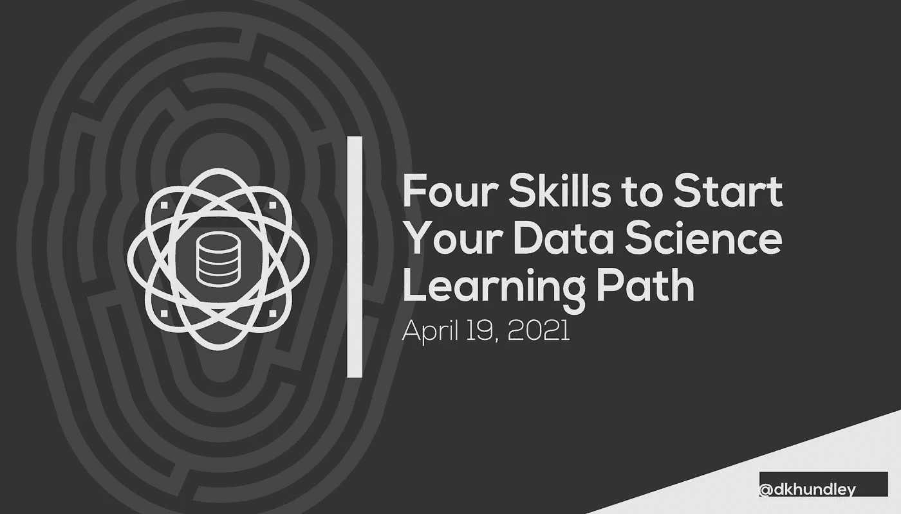
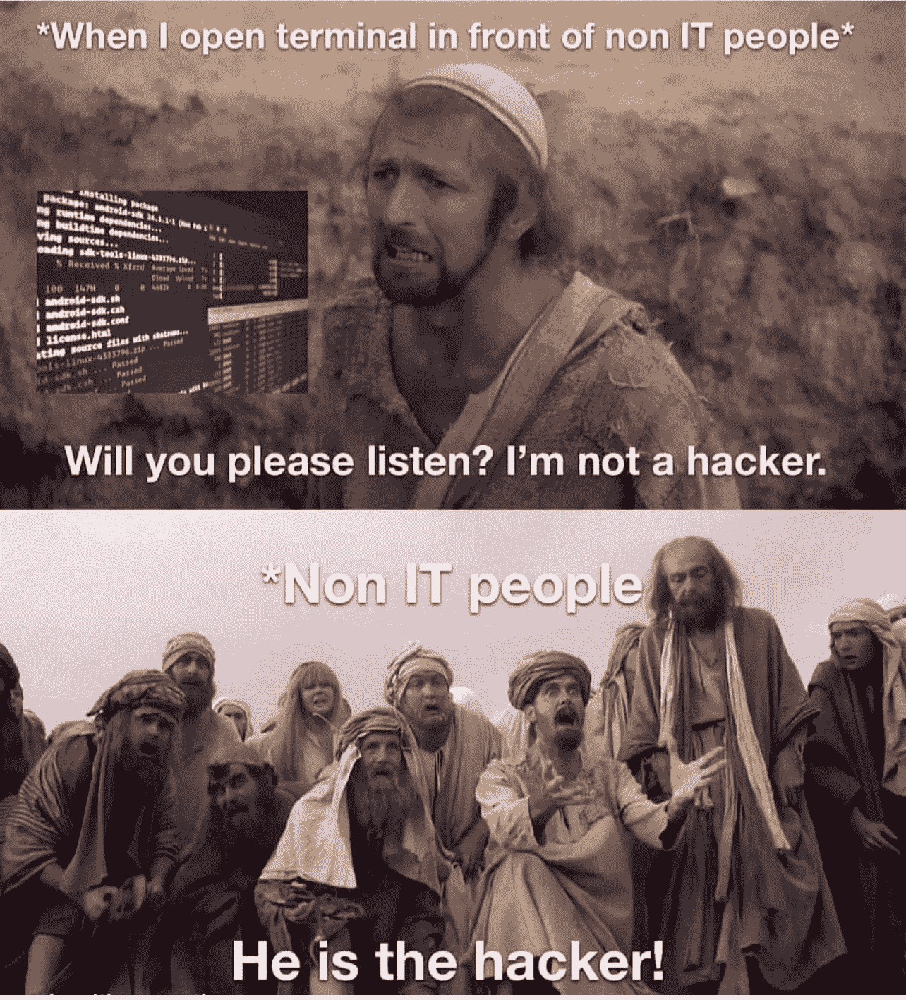

# 开启数据科学学习之路的四项技能

> 原文：<https://towardsdatascience.com/four-skills-to-start-your-data-science-learning-path-5d0cff95a941?source=collection_archive---------19----------------------->

## 从哪里开始数据科学学习之旅的初学者指南！

每周至少有两次，技术人员和非技术人员都会来问我关于从哪里开始学习数据科学和机器学习的想法。人们联系我的原因是因为我有一个非常非传统的背景。简而言之，我从一个几乎没有技术知识的纯商业职业道路转向了在非传统教育资源的帮助下成为一名成熟的机器学习工程师。(非传统=我在这方面没有拿到正式学位。)

在 2020 年初，我写了一个非常强大的指南，分享我做的每一件小事，但我发现这对初学者来说太难消化了。此外，与我交谈的人有着不同的背景。有些人像我一样，没有什么技术技能，希望从另一条职业道路转向，有些人在计算机科学方面更有经验，只是他们目前的重点可能是 web 开发。在这两种情况下，我写的健壮指南都太多了，我承认我在那里有点疯狂。😬

也就是说，我在这里创建了一个新的入门指南，大大缩小了关注范围，并帮助人们涉足这个数据科学的世界。如果你是初学者，并且对我是如何撰写这篇文章感到好奇，我希望你记住的主要事情是:**数据科学是在*数据*中寻找趋势的实践，主要目的是做出更明智的商业决策**。我在这里强调了“数据”这个词，因为，正如你可能猜到的，如果你没有任何数据可以使用，那么数据科学就会失败！

对于本入门指南，我们不打算深入研究机器学习或您可能感兴趣的任何更复杂的实践。考虑到数据科学就是与数据打交道，我们将在本文中介绍的前两项技能——Python 和 SQL——通常都与数据打交道有关。此外，我非常支持实际应用，因此后两种技能——Git 和命令行界面——将开始向您介绍一些更通用的计算机科学技能，所有数据科学家和机器学习工程师都经常使用这些技能。学习这些技能没有特别的顺序，所以你可以从任何你喜欢的地方开始。

好了，让我们进入 Python 的第一部分吧！

# 计算机编程语言

尽管在许多计算机科学领域都有使用，Python 无疑是当今数据科学领域最流行的编码语言之一。(仅供参考，其他的包括 R 和 Julia，但是 Python 仍然是最广泛使用的。)我个人是通过 Java 开始学习编码的，让我说……Python 要容易学得多。Python 还允许添加模块来增加额外的功能，称为 Python 库。数据科学中最常用的 Python 库包括 Pandas、Numpy、Scikit-Learn、Matplotlib 等等。不要担心那些库名对你来说是陌生的。作为一个初学者，我鼓励你只是把重点放在学习 Python 上。

虽然你可以在网上找到很多学习 Python 的优秀资源，但我个人推荐的是 [Udacity 的 Python 编程入门](https://www.udacity.com/course/introduction-to-python--ud1110)。我个人今天从 Udacity 学到了 75%的技能，所以我真的很欣赏他们如何组织他们的内容。此外，本课程是免费的，可以通过任何带有网络浏览器的设备轻松完成。

# 结构化查询语言

结构化查询语言(SQL)是当今每个计算机科学行业中最古老、最容易使用的数据查询语言之一。我认识的几乎每个人都以某种形式使用它。SQL 很有趣，因为它在基础级别上非常强大，或者您可以真正进入兔子洞学习更高级别的东西。在我的日常工作中，我通常不需要那么深入，我用来学习 SQL 的课程是 [Udacity 的数据分析 SQL](https://www.udacity.com/course/sql-for-data-analysis--ud198)。另一个免费课程，他们实际上与 Mode(一家专门从事数据分析软件的公司)合作创建了这个课程内容。我真的认为这可能是我上过的最好的免费课程。它的结构非常好，可以帮助完全的初学者快速掌握一些更高级的 SQL 主题。这门课怎么推荐都不为过！

# 饭桶

虽然这不完全是数据分析或数据科学技能，但对于在任何代码库(包括数据科学代码库)上与其他人合作以及在 GitHub 之类的东西上构建工作组合来说，这仍然是极其重要的。幸运的是，Git 是一个非常容易学习的技能，虽然有大量优秀的免费资源，但我不得不再次向 [Udacity 的 Git](https://www.udacity.com/course/version-control-with-git--ud123) 版本控制脱帽致敬。本课程很好地利用可视化材料从概念上演示了 Git 是如何工作的，然后向您展示了如何通过命令行界面(CLI)应用这些 Git 命令。说到客户端…

# 命令行界面(CLI)

如果你曾经看过任何类型的黑客电影，包括像 1983 年的 *WarGames* 这样更愚蠢的电影，那么你很可能已经看过那种看起来不祥的黑屏，上面有奇怪的词，如“sudo”或“curl”这可能是我最喜欢用来描述 CLI 用户对这个话题的感受的迷因:

从 iOfficialHacker Instagram 帐户使用的 Meme

事实是，每个人——包括数据科学家而不仅仅是黑客——都使用 CLI 来执行某种活动。如上所述，Git 是我们数据科学社区如何经常使用 CLI 的一个很好的例子。对于最后一项技能，我将根据你的学习风格推荐两种不同的资源。如果你更喜欢面向视频的在线课程，我推荐 [Udacity 的 Linux 命令行基础](https://www.udacity.com/course/linux-command-line-basics--ud595)免费课程。如果你更喜欢一个基于文本的，交互式的大约一个小时的演练，Ubuntu——Linux 操作系统的官方维护者之一——创建了他们自己的教程[,你可以在这里找到](https://ubuntu.com/tutorials/command-line-for-beginners#1-overview)。

各位，今天的帖子到此结束！我们保持它的简短和甜蜜，以使它更容易被更多的观众所理解。提醒一下，如果你想看我的完整的健壮指南，[你可以在这里找到。感谢您查看这篇文章，请务必不要离开，因为我将继续在这个非常酷的数据科学世界中写我自己的心得！](https://dkhundley.medium.com/my-learning-path-toward-becoming-a-machine-learning-engineer-96c74c521ab8)