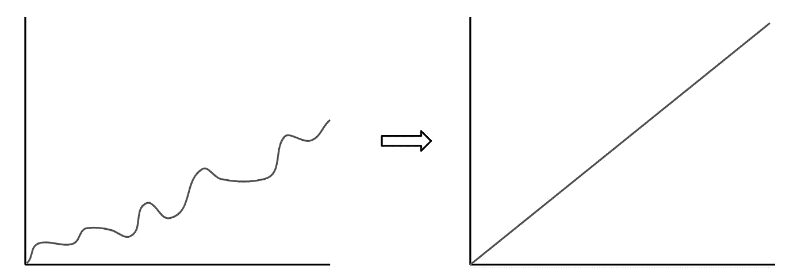
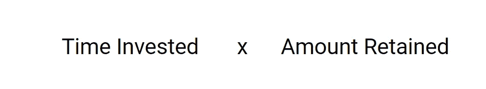

# 如何超级学习数据科学

> 原文：<https://towardsdatascience.com/four-tips-to-learn-data-science-fast-4ab7177a39e2?source=collection_archive---------29----------------------->

## 成为高效快速学习者的秘诀

Marc-Olivier Jodoin 在 [Unsplash](https://unsplash.com/?utm_source=unsplash&utm_medium=referral&utm_content=creditCopyText) 上拍摄的照片

我想写这篇文章，因为我收到了很多关于如何学习数据科学的问题，我理解这种挣扎。一开始真的很难应付**，尤其是当你发现你必须学习编程、统计、数学等等的时候。这份清单似乎是无穷无尽的，但是请相信我，它并没有你想象的那么糟糕。**

## 我的目标有两个:

1.  我想给你一些指导和建议，让你的学习之旅更加顺利
2.  我想和你分享一些帮助我加快学习速度的小技巧

作者创建的图像

说到这里，让我们开始吧！

# 1)你学了多少由两个变量决定…

首先，你要知道“学习”指的是知识**和**技能的获得。所以当我说“学习”时，我指的是学习理论(知识)和学习如何应用这些知识(技能)。

这不是火箭科学，但有两个主要因素影响你在给定时间内学到多少东西:

*   投入的时间:同样，这不是火箭科学。如果你每天花 2 小时学习数据科学，而不是 1 小时，你可以筛选两倍的材料，花两倍的时间应用你的技能(例如编程)。
*   **保留量:**学习技能是一回事，保留又是另一回事。你可能听说过[遗忘曲线](https://uwaterloo.ca/campus-wellness/curve-forgetting)。简单来说，你需要在学习数据科学和实践你所学的东西时保持一致。

就我个人而言，我认为我做出的最好的决定之一是承诺在 52 周内每周学习和撰写一次与数据科学相关的任何内容，因为这迫使我投入大量时间并保持一致。

# 2)从基本面开始

如果你读过我以前的文章，我可能在这一点上听起来像是一张破唱片，但从基本面开始会有很大的帮助。可能感觉这是一条较慢的路线，但是这将允许你在将来学习建立在这些基础上的更复杂的概念。

我建议学习的基础知识是:

*   **统计与概率:**数据科学和机器学习本质上是现代版的统计学。通过先学习统计学，在学习机器学习概念和算法时，你会轻松得多。
*   **微积分和线性代数:**像统计学一样，许多数据科学概念都建立在基本的数学概念之上。为了理解成本函数，你需要知道微分学。为了理解假设检验，你需要理解整合。再举一个例子，线性代数对于学习深度学习概念、推荐系统和主成分分析是必不可少的。
*   **编程(Python，SQL):** SQL 可以说是任何类型的数据相关职业中最重要的技能，无论你是数据科学家、数据工程师、数据分析师还是业务分析师，这个清单还会继续下去。至于 Python，它似乎是数据科学家使用的主要脚本语言(而我对 R 一无所知)。

关于上面的题目，你不一定要把**所有的**都学完，但是在一头扎进机器学习和深度学习之前，你绝对要先了解一下基本面。这就引出了我的下一个观点…

*如果你想要一些学习这些的资源，可以看看我下面的文章:*

</a-complete-52-week-curriculum-to-become-a-data-scientist-in-2021-2b5fc77bd160>  

# 3)不要试图记住所有的东西

理解你所学的是一回事，但试图记住所有的东西是另一回事。尤其是当涉及到 SQL、Python 和 Pandas 时，不要觉得你必须学习它们提供的每一个函数和方法。相反，在编程时，专注于学习如何谷歌正确的问题。

我曾与数据科学社区的资深人士交谈过，但我从未见过一个人能够记住每一个 SQL 和 Python 函数。这是一种低效的时间利用，可以更好地用在其他事情上，如建设项目！

# 4)在“做”中学习

正如我之前提到的，通过*做*而不仅仅是*学习，你会学到更多的知识和技能。*类似于你在学校学了一个新概念后怎么做作业，需要不断地把学到的东西运用到项目中。

而且不用担心完成复杂的项目。甚至像对数据集进行探索性数据分析这样简单的事情也会帮助你加速学习。

以下是让你开始的一些想法:

## 想法 1: SQL 案例研究

[**链接到案例**](https://mode.com/sql-tutorial/a-drop-in-user-engagement/) **。**

本案例的目的是确定社交网络 Yammer 用户参与度下降的原因。在深入研究这些数据之前，您应该先阅读一下 Yammer 的概述[这里是](https://mode.com/sql-tutorial/sql-business-analytics-training/)。您应该使用 4 张表。

以上案例的链接将为您提供更多关于问题、数据和应该回答的问题的细节。

如果你需要指导，请点击这里的[查看我是如何完成这个案例研究的。](/sql-case-study-investigating-a-drop-in-user-engagement-510b27d0cbcc?source=friends_link&sk=49cdc679e66cae75257b955db51f4fe5)

## 想法 2: Trustpilot 网络搜索引擎

学习如何网络搜集数据简单易学而且非常有用，尤其是在为个人项目收集数据的时候。抓取客户评论网站，如 Trustpilot，对公司来说是有价值的，因为它可以让他们了解评论趋势(变得更好或更差)，并通过 NLP 了解客户的意见。

首先，我会熟悉 Trustpilot 是如何组织的，并决定分析哪种业务。然后我会看一下[如何获得 Trustpilot 评论](/customer-reviews-identify-your-strengths-and-weaknesses-with-the-help-of-web-scraping-data-b87a3636ef55)的演练。

## 想法三:机器学习大赛

在我看来，没有比通过竞赛展示您的代码更好的方式来表明您已经为数据科学工作做好了准备。Kaggle 举办了各种各样的比赛，包括建立一个模型来优化某个指标，其中之一是[大型机器学习比赛](https://www.kaggle.com/c/titanic)。

如果您想获得一些灵感和指导，请查看其中一个解决方案的[分步演练](https://www.kaggle.com/yassineghouzam/titanic-top-4-with-ensemble-modeling)。

# 感谢阅读！

我希望这些建议对你有帮助！最重要的一点是，你要坚持学习——我认为这比你的学习方法和你使用的学习资源更重要。将其他一切都视为可以调整的更小的超参数；).

我祝你学习一切顺利！

不确定接下来要读什么？我为你挑选了另一篇文章:

</a-complete-52-week-curriculum-to-become-a-data-scientist-in-2021-2b5fc77bd160>  

**又一个！**

</how-id-learn-data-science-if-i-could-start-over-2-years-in-b821d8a4876c>  

# 特伦斯·申

*   ***如果你喜欢这个，*** [***跟我上中等***](https://medium.com/@terenceshin) ***更多***
*   ***报名我的邮箱列表*** [***这里***](https://forms.gle/tprRyQxDC5UjhXpN6) ***！***
*   ***我们来连线上***[***LinkedIn***](https://www.linkedin.com/in/terenceshin/)
*   ***有兴趣合作吗？查看我的*** [***网站***](http://terenceshin.com/)