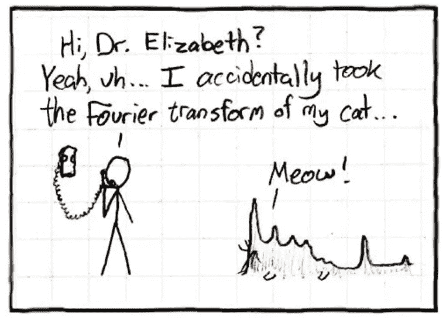
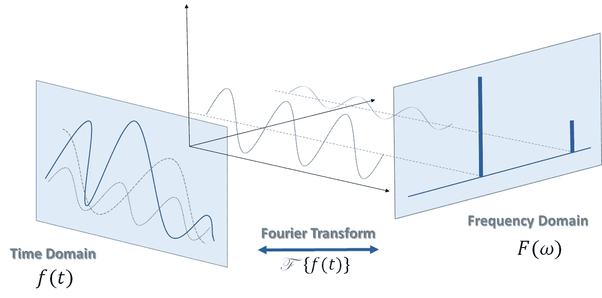
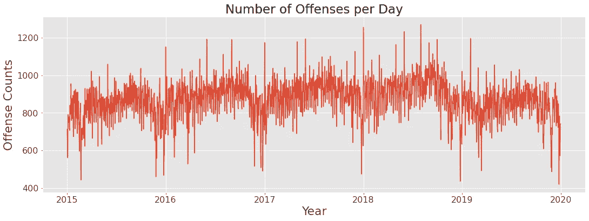
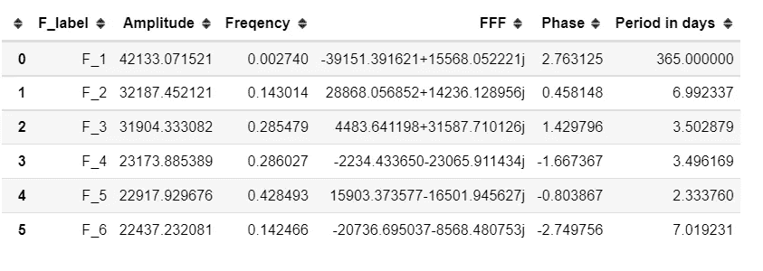
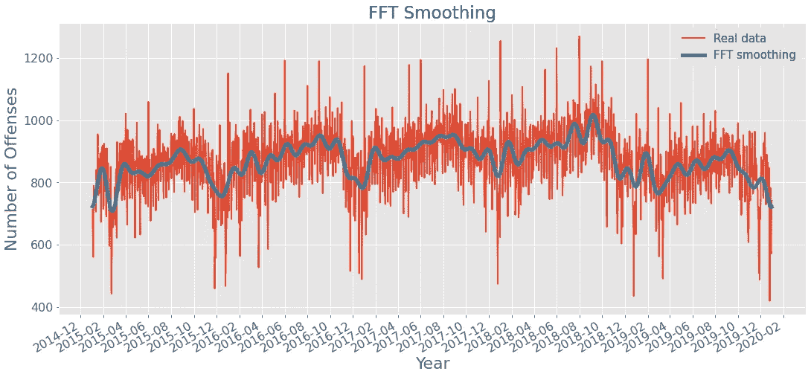

# 傅立叶变换，每个人都做

> 原文：<https://towardsdatascience.com/fourier-transform-everybody-does-it-f763c60f598e?source=collection_archive---------18----------------------->


安德烈·卡鲁茨基拍摄的图片

## 时间序列建模中的傅里叶变换



图片来自 [xkcd](https://imgs.xkcd.com/comics/fourier.jpg)

L 毫无疑问。我们的耳朵对所有到达它们的声音进行傅立叶分析；它们是大自然给我们的一个内置傅立叶变换设备。当然，对于任何能够处理音频信号的生物来说都是如此。本质上，我们的耳朵从不断从各个方向轰击我们的音频时间序列中构建了一个频谱。
我不会深入傅立叶变换(FT)的数学细节和公式，而是尽可能简单地解释它。傅立叶变换操作采用基于时间的模式(公平地说，它也可以是基于空间的模式，但让它保持简单)，通过“滤波器”运行，并返回正弦和余弦函数的组合以及相关的函数偏移、频率和幅度。信号可以是任何与时间相关的周期函数，由正弦和余弦函数组合而成，如下所示:


图一。作者图片

换句话说，FT 将时域中的周期函数转换为频域中的函数:



图二。作者图片

约瑟夫傅立叶定理指出，任何周期函数都可以表示为正弦和余弦函数的和。这个和可以是无限的。对函数形状有贡献的正弦和余弦函数称为傅立叶级数。

# 时间序列分析中的傅立叶变换

傅立叶级数如何用于时间序列分析？在这篇文章中，我想介绍几个应用。

**FT 在时间序列分析中的第一个应用**是检测季节性。其背后的想法很简单:将离散傅立叶变换(DFT)应用于时间序列，以找到傅立叶级数的频率，并查看哪些项具有最高的振幅。这些术语是最有影响力的，它们的周期指向一个系列的季节性。警告:因为时间序列不是连续函数，所以使用离散傅立叶变换是必要的。

我将使用 2015 年至 2019 年间我的项目之一科罗拉多犯罪数据的时间序列来说明这一应用。



图三。作者图片

目测指向系列的季节性成分(最有可能是年度季节性)。为了证实我的评估，我在训练集中使用了 *numpy.fft.rfft()* 和 *numpy.fft.rfftfreq()* 。

```
numobs = len(ts)
ts_ft = np.abs(rfft(ts))
ts_freq = rfftfreq(numobs)plt.figure(figsize=(18, 8))
plt.plot(ts_freq[2:], ts_ft[2: ])

plt.xlabel('Frequency (1/day)')
plt.show()
```


图 4。作者图片

```
ts_season = pd.DataFrame({'Amplitude':ts_ft[2: ], 'Freqency':ts_freq[2: ], 'FFF':ts_raw[2:], 'Phase':ts_phase[2:]})
ts_season['Period in days'] = (1/ts_season['Freqency'])
df=ts_season.sort_values(by=['Amplitude'], ascending=False).head(6)
df=df.reset_index()
df=df.rename(columns={'index':'F_label'})
for i in range(0,len(df.index)):
    df.iloc[i:, 0]='F_'+str(i+1)
df
```



表 1。作者图片

正如预期的那样，结果表明数据集的季节性具有强大的年度成分(365 天)和可能的每周成分(约 7 天)。

**第二个应用:**通过从时间序列的频谱中去除一些频率来平滑时间序列，也称为“去除噪声”其思想是将傅立叶变换应用于时间序列，去除阈值以上的频率，并将其逆傅立叶变换回时域。rfftfreq()函数中的 d 值控制 FFT 平滑函数的平滑程度。逆 irfft()函数中的参数 n 需要用于时间轴上的奇数个间隔；否则，你的函数会抛出一个错误(对于偶数，没有 n 不会产生错误。

```
def ts_smooth(df, threshold=2e4):
    fourier = rfft(df)
    frequencies = rfftfreq(len(df), d=2e-3 / len(df))
    fourier[frequencies > threshold] = 0
    return irfft(fourier, n=1825)df_ts['Number of Offenses, smoothed'] = ts_smooth(df_ts['Number of Offenses'])with plt.style.context('ggplot'):
    fig, ax = plt.subplots(figsize=(18,8))ax.plot(df_ts['Number of Offenses'],linewidth=2)
    ax.plot(df_ts['Number of Offenses, smoothed'], linewidth=5)
    ax.set_title('FFT Smoothing', fontsize=23);
    ax.set_ylabel('Number of Offenses', fontsize=22);
    ax.set_xlabel('Year', fontsize=22);
    ax.xaxis.set_major_locator(mdates.MonthLocator(interval=2))
    plt.gcf().autofmt_xdate()
    ax.tick_params(axis='y', labelsize=16)
    ax.tick_params(axis='x', labelsize=16)
    plt.legend(['Real data','FFT smoothing'], fontsize=15)
    plt.show()
```



图五。作者图片

上图使总体趋势和季节模式更加清晰。这也使得建模比有噪声的原始数据集更容易和更快。

# 结论

正如我们所见，傅立叶变换是一种有用的技术，可以检测时间序列的季节性或消除噪声信号。然而，在时间序列分析中，FT 并不是一个万能的工具。如果季节性很强，可以首先使用 rfft()和 rfftfreq()函数检测季节性成分，然后建立平滑曲线模型。然而，如果在你的时间序列中有一个意外的事件(突然下降或其他)，则不应该使用 FT。