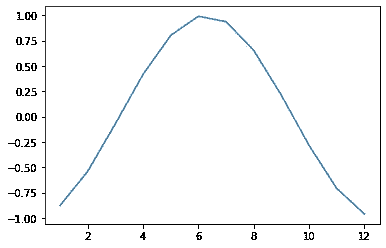
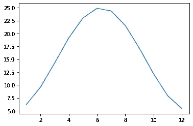
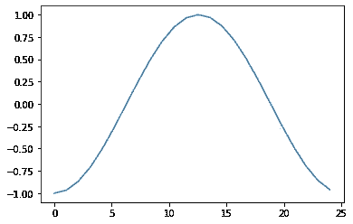
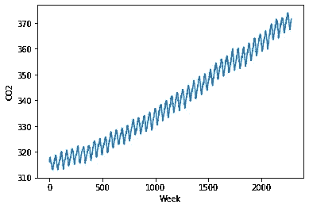
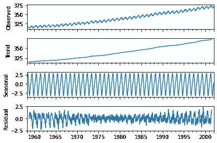

# 时间序列的傅立叶变换

> 原文：<https://towardsdatascience.com/fourier-transform-for-time-series-292eb887b101?source=collection_archive---------2----------------------->

## 了解什么是傅立叶变换，以及如何用它来分解时间序列。使用一个关于 CO2 时间序列数据的 Python 示例。

时间序列的傅立叶变换。[简·侯伯](https://unsplash.com/@jan_huber?utm_source=unsplash&utm_medium=referral&utm_content=creditCopyText)在 [Unsplash](https://unsplash.com/?utm_source=unsplash&utm_medium=referral&utm_content=creditCopyText) 上拍照。

在这篇文章中，你将通过一个最直观的应用*时间序列分解*来学习什么是傅立叶变换。您还将看到如何使用 NumPy 对一个著名的时间序列数据集执行快速傅立叶变换。

# 傅立叶变换

傅立叶变换的官方定义指出，它是一种允许你将依赖于空间或时间的**函数分解成依赖于频率的**函数的方法。**当然，这是一个非常技术性的定义，所以我们将使用一个时间序列数据**的**示例来“分解”这个定义。**

> 傅立叶变换将依赖于空间或时间的函数分解成依赖于频率的函数。

我写这篇文章的目的是，在这篇文章结束时，你将能够理解这句话。

傅立叶变换的其他常见应用是在声音或音乐数据中，但也在信号处理中。基本上，任何处理波形数据的领域都会受益于傅立叶变换。

# 时间序列:以固定的时间间隔测量变量

虽然傅立叶变换在许多应用中都很有用，但时间序列是最容易上手的。时间序列仅仅是测量一个变量随时间变化的任何数据集**。**

时序的**测量频率**表示测量发生的频率。例如，您可以测量日温度、月温度、年温度。

我们一般使用**有规律的时间间隔**。当然，你也可以不定期的测量温度*。然而，我暂时不考虑这一点，因为这不是标准，它使一切变得更加复杂。*

# *时间序列:季节性、趋势和噪声的组合*

*时间序列的一个非常重要的方面是季节性。许多变量，无论是销售、天气还是其他时间序列，通常都表现出固有的季节性。*

*让我们考虑几个例子。在月度温度数据中，我们可以预计夏季月份总是较高，冬季月份总是较低。温度也有每日季节性:夜间较冷，白天较热。例如，在销售数据中，我们可以预计圣诞节期间的销售额会逐年增加。*

*当一个时间序列变量仅依赖于某个季节性时，我们可以将数据呈现为一个重复的模式，它将遵循某种**波形**。然而，在大多数情况下，T2 不仅仅是季节性的。*

## *使用三角学创建示例波*

*作为一个例子，下图显示了温度时间序列中的**单季节效应。你可以清楚地看到全年的数据波动(夏季较高，冬季较低):***

*这是重温三角学基础知识的好机会。现在，我将只解释我如何创建波，而不涉及太多的细节。首先，我们基于著名的**余弦函数**创建一个基线温度。我们**让负**在夏天有峰值(标准从峰值开始)。我们还将月份乘以 0.5，这样每年就只有一个峰值(而不是两个)。*

*时间序列的傅立叶变换。创建基线温度数据集。*

*该图将如下所示:*

**

*基线温度数据。*

*我们仍然需要改进这一点:平均值和振幅完全不像温度数据。从 y 轴上的值可以看出这一点。让我们首先使用以下代码添加一个平均值:*

*时间序列的傅立叶变换。移动平均值。*

*这将导致 y 轴上的值向更高的值移动。现在，该图将如下所示:*

**

*时间序列的傅立叶变换。平均值较高的温度数据。*

*现在，作为最后一步，我们要增加振幅。最低值和最高值之间的当前差值不是温度数据的真实表示。您可以使用以下代码来实现这一点:*

*时间序列的傅立叶变换。增加振幅。*

*最小值和最大值现在相距更远。该图现在看起来像一年的实际温度数据(摄氏度)(x 轴上的月份):*

**

*时间序列的傅立叶变换。最终数据随季节温度变化。*

## *向时间序列添加第二个季节变化*

*下一步，让我们看看如果我们也创造一个白天/晚上的季节性会发生什么。日/夜模式以 24 小时为基础，可能如下所示:*

*时间序列的傅立叶变换。创造每日变化。*

*每小时的数据有 24 个值，白天上升，晚上下降。它看起来如下(查看轴以理解与前面的图的区别):*

**

*时间序列的傅立叶变换。昼夜温度变化的每小时数据集。*

*然后你可以通过对这些模式求和来组合它们。当然，你需要**提升月数据**，因为所有东西都需要在最小的尺度上:在这个例子中是在小时尺度上。*

*在气温数据中，各年的月平均值不会完全相同。两种影响会对此产生影响:**趋势和噪音。趋势**是增加或减少的长期过程。例如，随着全球变暖，我们的温度波动将逐年升高。*

*另一方面，噪声代表随机效应，使得温度每年并不完全相同。它代表了我们无法通过任何模型解释的东西。*

*在这一点上，我想你对我们如何将季节性的不同影响结合到一个单一的时间序列变量中有了一个感觉。然而，**现实是反过来的** : **我们获得一个作为混合过程的时间序列变量，我们想要分解它以识别不同的季节性、趋势和噪声。***

*我们可以使用傅立叶变换来检测时间序列中的季节性。*

# *时间序列数据的傅里叶变换*

*现在让我们通过使用傅立叶变换来分解时间序列，从而得到真实的东西。如前所述，傅立叶变换允许你把一个依赖于时间的函数分解成一个依赖于频率的函数。*

*我们的**时间序列数据是依赖于时间的函数**:我们有每个时间点的温度值。*

*如果我们假设时间序列数据中只有季节性，我们可以用不同的方式描述函数。我们可以**几乎完美地描述我们的数据**，说它是“**一个年度波动”**(夏天上升，冬天下降)。如果我们这样做，我们实际上**将数据集描述为一个频率:**毕竟， **yearly 只是一个频率**。*

> ***傅立叶变换是从单个时间序列变量中提取不同季节性模式的强大工具。***

*傅立叶变换可以让你做到这一点:**将时间序列描述为频率，而不是时间的函数**。最重要的是，当你在一个变量中混合了多个频率(多个季节性)时，它甚至可以被应用。*

***傅立叶变换是从单个时间序列变量中提取不同季节性模式的强大工具。**例如，对于每小时的温度数据集，傅立叶变换可以检测到昼夜变化和夏季/冬季变化的存在，它会告诉您这两个季节性(频率)存在于您的数据中。*

# *离散傅立叶变换*

*让我们看看傅立叶变换是如何工作的。对于时间序列数据，我们需要的傅立叶变换版本是离散傅立叶变换。之所以称之为**离散**是因为**输入数据是以离散间隔**测量的:我们的时间序列数据不是连续函数。*

*让我们首先了解离散傅里叶变换(DFT)的工作原理:*

1.  ***输入**是原始变量的数字序列(*每个时间步长*一个值)*
2.  ***输出**是*每个频率*的一个振幅(或信号强度)值。这些由**傅立叶系数**表示*

*这个新的级数通过使用傅立叶公式简单地计算，公式如下:*

**

*时间序列的傅立叶变换。公式。*

*计算之后，您获得了关于变量中出现的**频率的数据。结果系列中的每个值都是特定频率的强度。如果这个频率的振幅很高，那么这个季节性在你的时间序列(或者其他波)中很重要。***

***简而言之，你从数值开始，通过离散傅里叶变换的数学函数，你已经获得了每个频率的强度。***

# *快速傅立叶变换*

*离散傅立叶变换的快速版本称为快速傅立叶变换。它给出了与离散傅里叶相同的结果，但从算法的角度来看，它已经过优化。可以使用 **Cooley-Tukey FFT 算法计算快速傅立叶变换。***

***快速傅立叶变换**是许多领域的标准之一，作为傅立叶变换的切入点非常棒。*

# *在 Python 中对时间序列应用快速傅立叶变换*

*最后，让我们将所有这些放在一起，处理一个示例数据集。我们将使用来自 statsmodels 的著名 CO2 数据集。这是很好的工作，因为它有一个非常明显的年度季节性。*

*我们将使用 NumPy 代码完成快速傅立叶变换，并了解如何执行和解释它。最后，我们将把结果与一个专门用于分解时间序列的函数进行比较，这样我们就可以看到我们是否做对了。*

*您可以通过以下方式获得 CO2 数据:*

*时间序列的傅立叶变换。获取二氧化碳数据。*

*数据如下所示:*

**

*时间序列的傅立叶变换。二氧化碳数据。*

*让我们通过创建一个图来看看数据。您可以使用下面的代码来做到这一点:*

*时间序列的傅立叶变换。绘制二氧化碳数据。*

*您将获得下图，该图显示了一段时间内非常明显的上升趋势和年度季节性:*

**

*时间序列的傅立叶变换。二氧化碳数据图。*

*现在让我们应用快速傅立叶变换，并绘制结果。正如所料，我们现在获得了每个频率的强度图:*

*时间序列的傅立叶变换。应用快速傅立叶变换并绘制结果。*

*情节看起来如下:*

**

*时间序列的傅立叶变换。结果是每个频率的强度图。*

*为了更好地理解我们所看到的，让我们用时间段来代替频率。您可以使用以下代码将频率转换为时间段:*

*时间序列的傅立叶变换。将频率转换为周期。*

*您现在将获得一个以周为周期的 x 轴:*

**

*时间序列的傅立叶变换。改进的 x 轴。*

*我们能做的最后一件事就是让剧情变得更流畅。我们可以通过将每个周期的信号强度重新组合成每周的总和来做到这一点。这可以通过以下方式完成:*

*时间序列的傅立叶变换。平滑图表。*

*生成的图形如下所示:*

**

*时间序列的傅立叶变换。最终剧情。*

*在这个最后的情节中，你可以清楚地看到一个巨大的峰值:这个我们忽略了，因为它不相关。然而，最后的峰值是第 52 周的峰值:这个峰值向我们表明，52 周(每年)的季节性非常明显。*

***这就是你如何对时间序列使用傅立叶变换。理解这一理论对于信号处理和其他用例非常重要。***

*作为最后一步，我想向您展示一种更好的方法来为您可能有的任何日常使用进行时间序列分解。以下代码显示了如何使用 statsmodels 进行分解:*

*时间序列的傅立叶变换。Python 中分解时间序列的快速方法。*

*这样做的好处是，您可以在一次执行中获得快速而漂亮的结果，如下所示:*

**

*时间序列的傅立叶变换。Python 中的快速时间序列分解图。*

# *结论*

*在本文中，您了解了傅立叶变换的工作原理，以及如何用它来检测时间序列中的季节性。您已经看到了一个关于 CO2 数据的应用程序，其中我们使用傅立叶变换来检测每年的季节性。傅立叶变换有许多用例，例如在声音分析中，但我将在以后的文章中继续讨论。*

**现在，感谢你的阅读。我希望你已经学到了一些东西。请继续关注更多数学、统计和数据科学内容！**