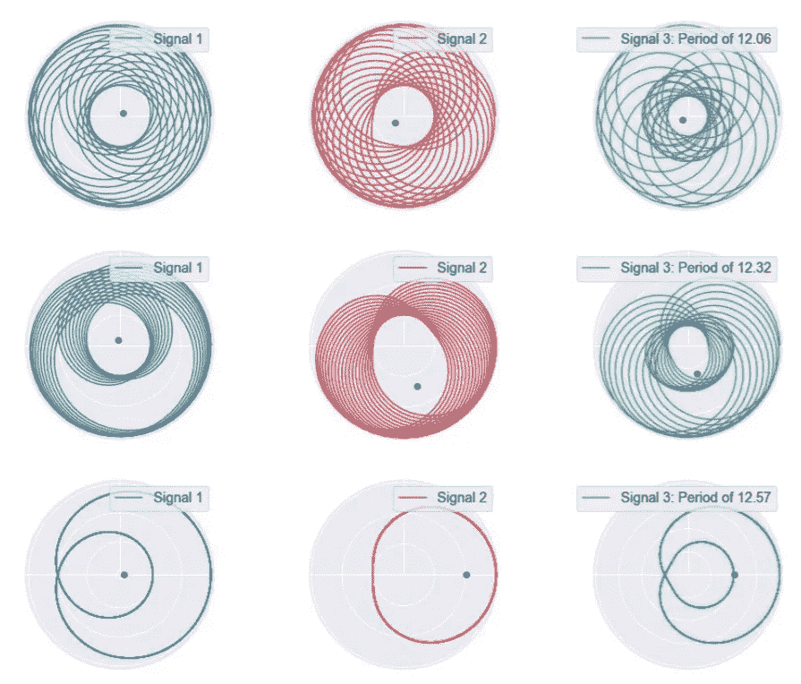
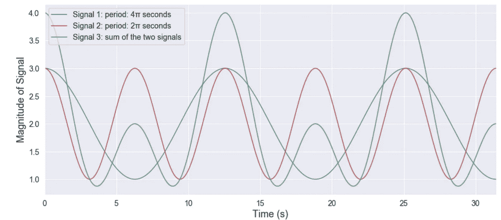
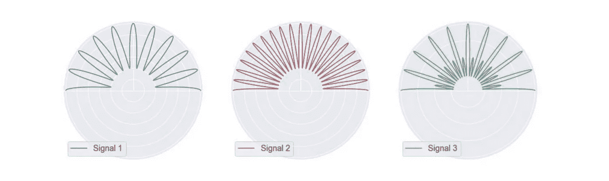
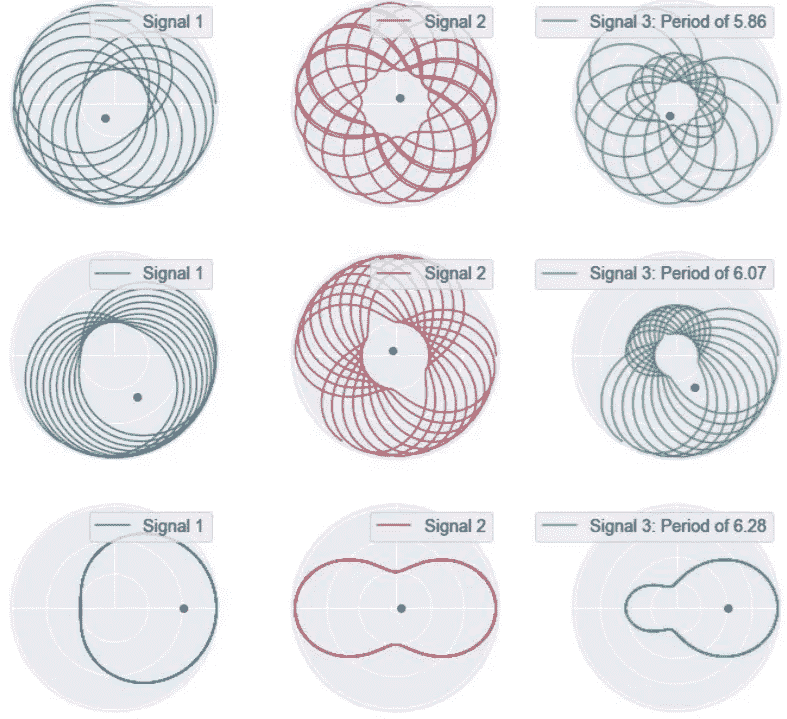
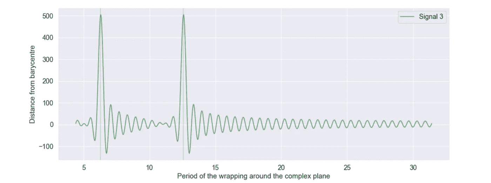

# 傅立叶变换:直观的可视化

> 原文：<https://towardsdatascience.com/fourier-transforms-an-intuitive-visualisation-ba186c7380ee?source=collection_archive---------7----------------------->

## 时间序列数据处理

## 应用于简单时间序列数据的离散傅立叶变换的直观可视化。

作者图片

这篇文章可视化的分解时间序列信号到其谐波使用傅立叶变换。以直观的方式解释该公式，以帮助理解其含义。

# **为什么是傅立叶变换？**

傅立叶变换是一种极其强大的工具，广泛应用于各种领域。它的强大之处在于它能够将时间序列信号分解成正弦波形。例如，当对信号去噪并试图找到波形的谐波时，这可能是有用的。

# **示例应用**

比方说，有人想从喷气发动机的振动信号中提取信息。这种信号非常嘈杂，因为喷气发动机可能包含数千个运动部件，每个部件都会产生振动信号。可以想象，由于发动机在旋转，每个分量的时间序列信号将大致为正弦曲线。如果您可以将时间序列解构为一组正弦信号，也许您可以识别特定组件的振动信号，然后识别这些部件是否按预期运行。

# **公式**

其中 g(t)代表时间序列信号，f 是频率，G 是每个频率幅度的函数

当第一次看傅立叶变换的方程时，它可能看起来令人望而生畏。在本文中，我将给出一个小例子，帮助您以直观的方式理解这个公式在做什么。

# **我们的任务**

为了理解傅立叶变换，让我们设定一个任务，如果你能完成它，你就会理解傅立叶变换！

作者图片

以上是三个时间序列信号。蓝色和红色信号是正弦信号(周期分别为 4π和 2π)。绿色是两者之和。假设我们只有绿色信号。我们可以只使用绿色信号提取蓝色和红色信号吗？

**极坐标包装**

回到公式，e ^ 2πi 项你可能很熟悉。这是复平面中的一个位置，具体地说是 e ^ 2πi = 1，并且位于实轴平面上。当取 e ^ 2πit 时，可以想象在复平面中描绘一个圆，圆的每个位置由时间 t 表示。当乘以 g(t)时，可以简单地将时间序列信号映射到复平面中的圆。

作者图片

正如你所看到的，这些是和之前一样的时间序列信号，围绕着 argand 图。公式中唯一缺少的是指数中的频率项和积分。

# **改变频率**

到目前为止，我们已经看到傅立叶变换的一部分仅仅是将时间序列信号包裹在极坐标中。但是，这如何帮助我们识别哪些正弦波用于构成绿色信号呢？

指数中的频率项可以被认为是我们在极平面中包裹时间序列信号的频率。频率越高，时间序列信号绕极坐标的圈数越多。

记住蓝色曲线的周期是 2π，红色是 4π，绿色是两者之和。让我们看看，当我们改变时间序列信号围绕极平面的周期时，会发生什么。

作者图片

正如你所看到的，信号似乎有点混乱，直到周期达到 2π，然后突然混乱变成有序。

这很漂亮，但我们仍然不知道什么正弦方式构成绿色信号。

# **重心和固有频率**

傅立叶变换公式中最后要解释的是积分。

在上图中，我将每条曲线的重心显示为一个灰点。这可以解释为傅立叶变换公式中的积分项。你可以看到，重心总是在零附近，然后当接近一个固有频率时，重心突然远离零。对于信号 1 和 3，2π的周期对应于它们的固有频率，并且重心远离原点。信号 2 的重心停留在零，因为它的周期是 4π，而不是 2π。

因为信号 3 的重心远离原点，所以我们可以确定 2π的周期对应于信号 3 的固有频率。

就是这样！傅立叶变换公式给你的，只是重心到我们看到的曲线原点的距离。当这个距离达到峰值时，我们知道我们正在接近一个自然频率。

# **回到公式**

因此，概括地说，我们已经看到，傅立叶变换公式中的 G(f)项表示包裹在复平面周围的时间序列信号的重心原点的距离。当离原点的距离很大时，这个频率就是时间序列的固有频率。

让我们画出信号 3 从质心到原点的距离。

作者图片

在周期 2π和 4π处，重心到原点的距离非常高，这意味着可以将信号 3 近似为周期为 2π和 4π的两个正弦波之和。任务完成！

# **结论**

这是傅立叶变换的一点介绍，以及如何用视觉的方式来解释它们。

## 支持我👏

希望这对你有所帮助，如果你喜欢，你可以 [**关注我！**](https://medium.com/@diegounzuetaruedas)

您也可以成为 [**中级会员**](https://diegounzuetaruedas.medium.com/membership) 使用我的推荐链接，访问我的所有文章以及更多:[https://diegounzuetaruedas.medium.com/membership](https://diegounzuetaruedas.medium.com/membership)

## 你可能喜欢的其他文章

[信息论应用于 Wordle](/information-theory-applied-to-wordle-b63b34a6538e)

[强化学习:简介](/reinforcement-learning-an-introduction-a8783f9ea993)