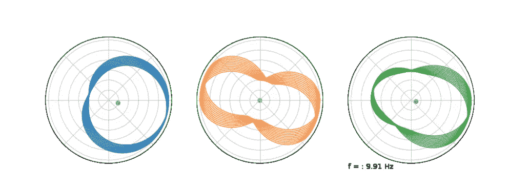
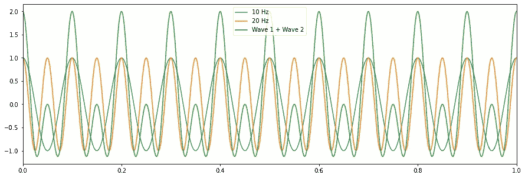
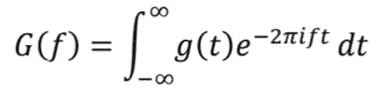
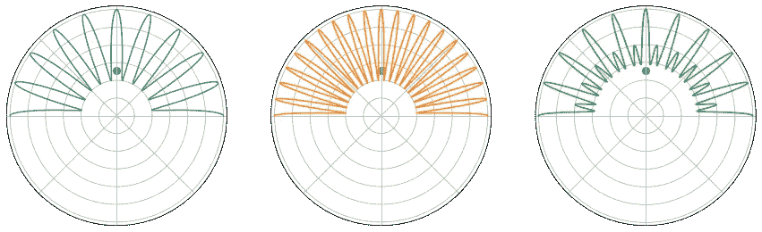
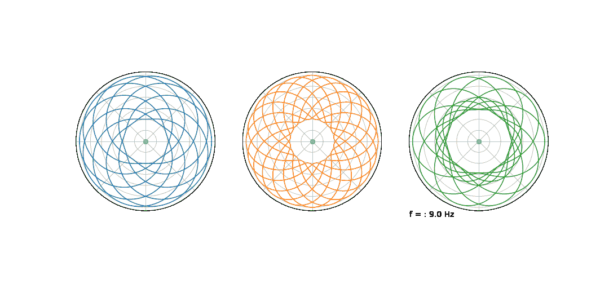
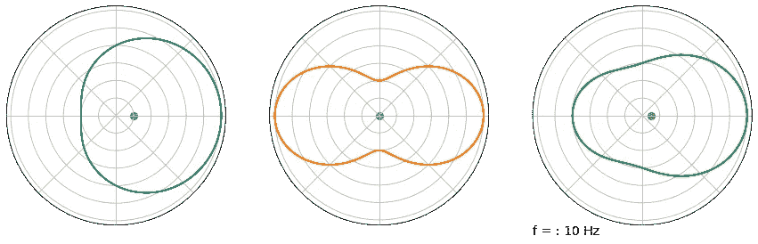
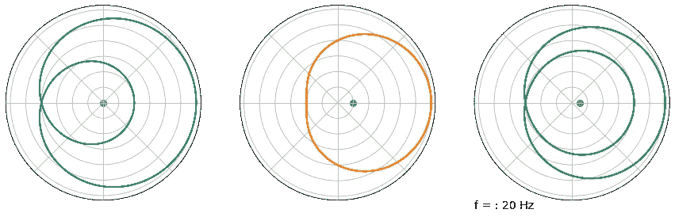

# 傅立叶变换:动画可视化

> 原文：<https://towardsdatascience.com/fourier-transforms-animated-visualization-5bdb43b4b3d2?source=collection_archive---------4----------------------->

## 时间序列数据处理

## 一个简单的傅立叶变换的动画例子

作者图片

# 介绍

傅立叶变换广泛应用于工程领域。它们有广泛的应用，从去噪和滤波到电子电路设计。在本文中，我展示了傅立叶变换的直观可视化，其中我通过将时间序列信号包装在极坐标中来实现傅立叶变换。最后，我表明傅立叶变换可以被认为是复平面的原点和时间序列信号的质心之间的距离。

在之前的一篇文章中，我用直观的方式解释了傅立叶变换。在这篇文章中，我将进一步介绍可视化，并详细说明我是如何制作这些可视化的。

# 为什么是傅立叶变换？

傅立叶变换可以帮助我们将时间序列数据分解成一系列正弦波。组成时间序列信号的核心频率是谐波。将信号分解成其固有频率在工程中有许多用途，例如预测工程系统中组件的未来故障。

# 合成时间序列数据

作者图片

这里有三个时间序列波，蓝色的频率为 10 赫兹，橙色的频率为 20 赫兹，绿色的是两个波的组合。你可以通过计算 x 轴上一个单位的周期数来判断这种情况。

**我们的目标是分解绿色信号，找到它的自然频率(10 赫兹和 20 赫兹)。**

# 在极坐标中换行

以上是傅里叶变换方程。当用正弦波逼近输入函数 g(t)时，得到的函数 G(f)给出了每个频率有多重要的函数。g(t)的自然频率将导致 g 的更大幅度。

在我以前的文章中，我解释了傅立叶变换的一部分实际上只是将时间序列信号包裹在 argand 图周围(来自方程中的指数项)。这是上面围绕原点从 0 辐射源到π辐射源的三个时间序列信号。

作者图片

最后，傅立叶变换中的积分可以被认为是围绕复平面的时间序列信号的原点和质心之间的距离。通过改变时间序列信号环绕复平面的速度，我们可以看到质心何时远离原点，从而识别自然频率。

# 动画片

您将只能在笔记本电脑上看到这些动画，而不能在移动应用程序上看到。我建议你换成笔记本电脑。

作者 GIF

这是复平面中合成时间序列数据的动画。我们包裹信号的频率接近蓝色曲线的自然频率。

在上面的 GIF 中，当频率接近 10 Hz 时，关注每个信号的质心。如您所见，蓝色和绿色曲线的质心突然远离原点，而橙色曲线的质心保持在中间。傅立叶变换就是这样告诉我们，10 赫兹是蓝色和绿色曲线的自然频率！

作者 GIF

这是一个从 0 到 22 赫兹的动画。记住蓝色曲线的自然频率为 10 赫兹，橙色曲线的自然频率为 20 赫兹，绿色曲线的自然频率为两者之和。

让我们看看静止帧，这样我们就不会太晕了:

作者图片

在 10 赫兹时，蓝色曲线的质心远离原点，在 20 赫兹时，它停留在中心。橙色曲线正好相反。最后，在两种情况下，绿色曲线的质心都远离原点，我们现在知道这是绿色曲线的两个固有频率。

# 画出离原点的距离

对于每条曲线，我们现在可以绘制质心到原点的距离，知道幅度的增加将表明分解为正弦波时频率影响的增加。

作者 GiF

蓝色曲线的距离尖峰为 10 Hz，橙色曲线的距离尖峰为 20 Hz，绿色曲线的距离尖峰为 10Hz 和 20Hz。因此，为了逼近绿色曲线，我们可以取频率为 10 Hz 和 20 Hz 的两个正弦波之和。

# 密码

我将为感兴趣的人快速浏览一些 python 代码。

为了创建时间序列数据，我创建了正弦波，从 0 到 1 绘制它们，这种方式适应了信号的频率。

为了将信号包裹起来，我取一系列从 0 到π辐射的角度，并将信号幅度作为复平面中每个矢量的幅度。

要获得质心，我只需将时间序列信号的角度和幅度转换为复数，取其平均值，将得到的复数绘制回 argand 图。

为了制作动画，我使用了一个名为赛璐珞的 python 库，它允许我在循环中拍摄情节的快照，然后将这些快照保存为 GIF。

# 结论

在这篇文章中，通过简单的动画形象化傅立叶变换。我展示了时间序列信号的自然频率如何与 argand 图中的信号相关。我表明，通过观察曲线的质心和原点之间的距离，可以找到时间序列信号的自然频率。

如果你想更好地理解这与傅立叶变换方程的关系，我推荐你去看看我的另一篇关于傅立叶变换的文章。

## 支持我

如果你喜欢它，你可以跟我来 [**！**](https://medium.com/@diegounzuetaruedas)

你也可以通过我的推荐链接成为**中级会员**，访问我所有的文章以及更多:【https://diegounzuetaruedas.medium.com/membership】T2