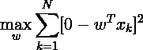
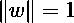
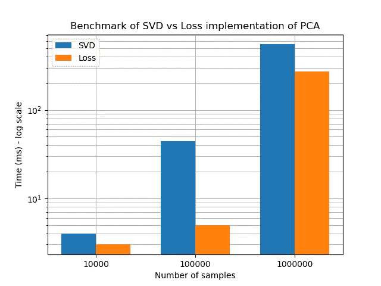
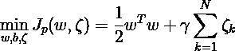
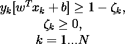
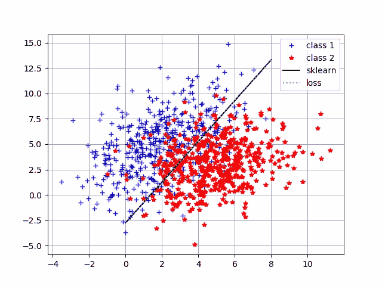
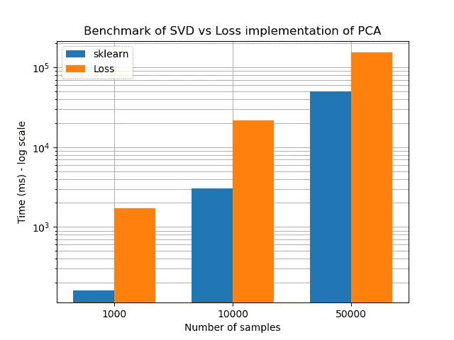

# 机器学习算法原型框架(Python)

> 原文：<https://towardsdatascience.com/framework-for-prototyping-of-machine-learning-algorithms-a3bd5f6f3a22?source=collection_archive---------10----------------------->

## 利用 Python 中的 scipy 开发损失函数的经典机器学习算法原型的通用框架

**简介**

阅读科学文章和尝试新的有前途的算法是许多数据科学家的重点。不幸的是，这些算法位于小的存储库中，并且通常包含几个错误，因此它们很难使用，并且您将花费相当多的时间来调试(或者解决依赖冲突)。幸运的是，这些算法通常可以简化并使用损失函数来表示，在本文中，我将使用主成分分析(PCA)和支持向量机(SVM)作为主要示例，但它适用于更多技术。

这种方法有多种优势:

*   了解机器学习算法的底层行为。
*   避免由于可用实现中的某些默认设置而导致的错误。
*   易于针对数据的某些特性进行定制(以防违反常见假设)。
*   不要浪费时间为你的问题寻找一个好的算法实现。
*   通过调整损失函数(如 Huber 或 Hampel)，容易为异常值建立鲁棒性。
*   大多数算法假设误差项呈正态分布，然而，这并不总是有效的。通过调整损失函数，这些误差项可以归一化。

可能的缺点:

*   性能/速度
*   数值不稳定性

**主成分分析的损失函数表示**

主成分分析(PCA)可以被表示为寻找最大化方差的投影，第一主成分可以被获得为:

其中 w 是第一主成分(p×1)的加载向量，p 是数据的维数，x_k 是样本 k(p×1)，总共有 N 个样本。更多信息可以在“支持向量机:方法和应用”(J. Suykens)中找到。

在当前形式中，如果 w 变得无限大，则该损失函数最大，因此范数通常被限制为 1(归一化):

这可以翻译成 Python 代码，如下所示:

这导致了一个约束优化问题，我们可以使用 scipy.optimize 轻松地解决它，它支持许多不同的求解器，具体取决于您的需求，并且已经根据您的输入选择了一个合适的求解器。

将生成一些随机高斯数据(维数 p=2 ),并且将使用来自 sklearn.decomposition 的 PCA 实现对其进行基准测试。

PC1 使用 sk learn:[-0.42388046 -0.90571814]
PC1 使用损失函数:[-0.42388046-0.90571814]

第一个主成分的加载对于两个实现是完全相同的，这表明该框架仅使用几行代码就可以强大地表示算法。

最后，我们将在 i7–8750h CPU(2.2 GHz，12 个内核)上对两种实现的速度性能进行基准测试，以获得第一个主成分。scikit-learn 实现使用 LAPACK 库(Fortran)解决了奇异值分解。我们将对 X 数据集中的多个样本进行比较。条形图中显示的时间包括创建实例和定义方法。

在这种情况下，损失函数的实现也明显快于用于计算第一主分量的奇异值分解。scikit-learn 实现赶上了大样本量，但这只是因为它开始对数据进行随机下采样，因此**损失函数实现更快、更准确**，而**在该基准测试中只有几行代码**。

**SVM 的损失函数表示**

支持向量机可以在原始空间和对偶空间中求解(如果使用的核可以在原始空间中表示)。为了简单起见，这里实现的 SVM 将在原始空间中求解。有关原始和对偶空间的更多背景信息，请参见“支持向量机:方法和应用”(J. Suykens)。

原始空间中线性 SVM 的损失函数被定义为:

有以下限制:

其中 w 是我们想要获得的权重向量(p x 1)，gamma 是一个超参数，它指定了二阶正则化和误分类数之间的理想折衷(如果 gamma 很大，将会有更多的过拟合)。x_k 是样本 k(p×1)，总共有 N 个样本。ζ_ k 是样本 k 的松弛变量，样本 k 被错误分类得越多(离判定边界越远)，该变量就越大。y_k 是样本 k 的标签，可以是正(+1)，也可以是负(-1)。b 是决策边界的偏移量。

将其转换为 Python 代码会产生以下类(铰链损耗的平方):

现在将基于损失函数的这个类与 sklearn 实现进行比较(就像我们对 PCA 所做的那样)。这会产生以下 python 代码:

重量 sklearn:[0.349575-0.17398369]
重量损失:[ 0.34916208 -0.17402776]

权重之间有微小的差异，但是如果我们画出决策边界，我们可以看到几乎是相同的。

现在，性能将进行基准测试，类似于我们对 PCA 所做的，两种实现都允许运行，直到收敛(迭代次数没有截止)。这导致:

对于 1000 个样本，定制实现大约慢 10 倍，对于 50000 个样本，这降低到大约慢 3 倍。总的来说，这对于一个两行长的原型来说是不错的。请注意，约束是以非线性方式定义的，而它们实际上可以写成线性约束。改进这一点也将改善定制应用程序的计时。

**结论**

通过编写一个优化损失函数的小类来原型化机器学习算法是快速、准确和容易的。这样做将增加你对问题的了解，从而允许你改进算法。如果原型满足您的需求，但是数值稳定性或速度对于您的应用程序来说不够，那么建议您在论文中搜索快速实现，或者查看一些 git 库。

**参考文献**

*JAK·苏肯斯，T·范·盖斯特尔，J·德·布拉班特，B·德·穆尔，J·范德瓦勒。(2002).“最小二乘支持向量机:方法和应用”。世界科学*

*n . Halko、p . g . Martins son 和 j . a . Tropp(2011 年)。《寻找具有随机性的结构:构造近似矩阵分解的概率算法》。暹罗评论，53(2)，217–288。*

*Martinsson，P. G .，Rokhlin，v .和 Tygert，M. (2011 年)。“矩阵分解的随机算法”。应用和计算谐波分析，30(1)，47–68。*