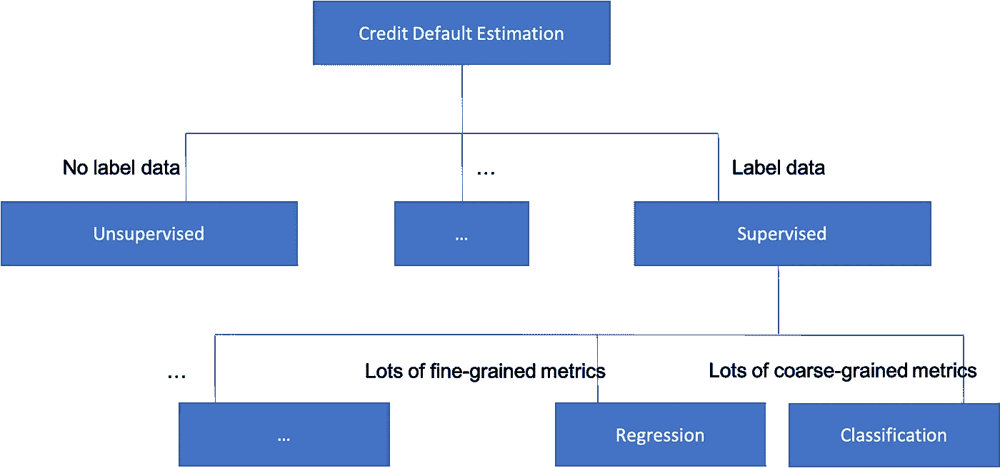

# 构建机器学习解决方案

> 原文：<https://towardsdatascience.com/framing-machine-learning-solution-4221f5da035d?source=collection_archive---------28----------------------->

## [行业笔记](https://towardsdatascience.com/tagged/notes-from-industry)

## 如何架构一个机器学习解决方案来实现一个产品目标？

现代产品的目标，无论在哪个领域，都在很大程度上依赖于由计算机解决的算法。典型的方法采用基于启发式的解决方案，即如何完成任务的逐步指令。通常这种方法不足以解决现实世界的情况。在存在代表这些情况的数据的情况下，机器学习(ML)是一种非常好的方法，它通过从数据中学习来找到概率解决方案。

图 1:使用机器学习识别小狗。如何区分小狗到松饼的图像，写一个循序渐进的指南是相当困难的。使用卷积神经网络可以更精确地建立模型。由[杰瑞米·霍华德](https://twitter.com/jeremyphoward)发布推文。

人们很容易认为任何产品目标都可以用 ML 来表达。然而，由于其对模式识别的严重依赖，ML 具有不确定性，因此，有必要确定产品目标的哪一部分应该成为基于 ML 的框架的候选者。例如，在财务问题上，申报多少税款并不适合 ML，因为做错了可能会被认为是重罪。有复杂的，但设定的指导方针，以计算出税额。另一方面，一个人来年在垃圾食品或衣服上的花费可能是 ML 的理想候选。没有固定的规则，可以根据口味、可用性、天气、全球趋势等变化很大。在这篇文章中，我将阐明这个问题。特别是，我将分享找出 ML 可解决的任务的方法，数据需求，以及不同任务类型的 ML 方法。

当面对只有少量数据需要处理的简单场景时，人类专家通常非常擅长提供明智的决策。在这种情况下，ML 解决方案的表现可能会差得多。例如，找到典型感染的治疗方法，确定餐馆的每周菜单等。另一方面，ML 解决方案可能会在面对大量数据的各种场景时表现得更好，例如推荐不同类型的电影、不同产品的价格建议等。虽然这些因素听起来很适合启动一个 ML 项目，但是这样一个简单的框架还不足以决定项目的成功。我们描述了可以简化估算的三个步骤。

# 第一步:关注问题

你应该从一个需要解决的产品目标开始。一旦解决了这个问题，你应该对实现目标的方法持开放态度。它不一定是 ML。避免追随让你兴奋的下一个最好的事情，尽量做到客观。有时，这可以通过从以前的经验中提取的简单启发来完成。有时需要设计一种基于一组复杂的、相互关联的信号的算法。有时简单的描述性统计可能会奏效。有时候以上都不行。解决方案需要从数据中学习。例如，电影推荐可以像最近的大片一样简单，可以来自更复杂的粉丝群驱动的类型分析，可以基于地理区域中其他人正在观看的内容，甚至可以基于映射为复杂电影数据的观看习惯。

一旦你确定简单的分析不能解决问题，就把产品目标框定为一个 ML 问题，并反复评估这个框架，直到你确定它足够简单。例如，如果问题是推荐电影，那么框架可以依赖于电影元数据和人们已经观看的内容之间的某种关联。虽然提出极其复杂的元数据映射可能很诱人，但必须有一个足够简单的版本，能够轻松涵盖常见情况。

框架应该在每次迭代中从宽到窄。你可以从识别它是有监督的，学习发生在已知标签上，半监督的，学习发生在弱标签上，还是无监督的，学习发生在没有任何标签的情况下开始。用不同的方法来描述同一个问题是可能的。例如，识别信用违约的情况可以基于先前违约的已知情况或异常值来完成。如果问题被当作监督学习来处理，它可以进一步被建模为回归、分类或其他众所周知的监督学习子类别。例如，信用违约问题可以被研究为研究违约金额或违约与否的二元情况。

图 2:将建模产品目标缩小到 ML 问题。作者图。

如图 2 所示，缩小到合适的建模方法应该主要依赖于手头的数据可以达到多少精度。例如，如果标签丢失，那么进行监督学习就没有意义，如果关于违约金额的数据很少，那么将其作为回归问题进行研究就不切实际。在许多现实世界的情况下，建模可能是复杂的，可能需要将目标划分为子任务，每个子任务可以如上所述进一步建模。

# 步骤 2:理解数据需求

数据是 ML 解决方案的血液。相关数据的缺乏将决定 ML 解决方案的成败。更重要的是，数据需要干净。如果数据不干净，就需要考虑，清理是否可行。如果答案是肯定的，那么您可以继续，但是要注意的是，大量的工作将用于清理数据。如果答案是否定的，您可能需要重新考虑建模方法。

比如，想象一下理解一套产品是否被客户喜欢/不喜欢的问题。如果大部分反馈文本都是垃圾邮件，你可能不得不放弃使用反馈文本来建立情感模型的想法。如果情况不是这样，但是文本中充满了混合语言，提取喜欢/不喜欢的有意义的表示可能太困难了。在这种情况下，必须努力清理/转换数据或收集更多有用的数据。另一方面，如果反馈包括数字/顺序/分类尺度上的评级，建模工作和随后的解决方法研究可能会非常有效。从数据中缺失的信号中提取特征通常非常有用。

# 步骤 3:探索健壮、高效的基线解决方案

一旦确定了建模类别，就该考虑解决方法了。通常有许多最先进的解决技术可供您考虑。对于回归/分类问题，可以考虑使用线性方法、集成方法、深度学习等来实现。从最复杂的开始，也从最简单的开始，都不是一个好主意。选择一些强大的，可以涵盖许多试验中最突出的案件。排除那些计算时间长或者解释复杂的。如果花费的时间太长，将会减慢所有后续的迭代，最终会阻碍改进。如果太难解释，就很难确定改进，最终可能迫使解决方案停滞不前。

通常集合方法，如随机森林，梯度增强树，提供了良好的基线。它们提供了不错的结果，对变化是健壮的，提供了一定程度的可解释性，并且可以相当快地执行。

一旦基线被实施和评估，就该计划改进方向了。所有被接受的改进试验必须比基线表现得更好。

# 重复 3 步流程

一旦您获得了第一个基线解决方案的结果，重复三步流程。看看是否有可能进行更窄的建模，以及是否有更好的代表性数据可用。如果是这样，转到可能给你更准确结果的替代方法。不要专注于使运行 ML 解决方案的过程更有效，因为可能会有进一步的改进，从而排除所有的改进。例如，在面对更多数据时，除了通常提高准确性的常见方法，如自动特征选择、超参数调整等，您还可以采用更高级版本的集成方法、深度学习方法。

尽量让迭代更简单。一个里程碑可能包括许多迭代，并且可以基于一个固定的期限间隔或主要的改进点。涉众应该至少在里程碑的演示过程中参与进来。没有利益相关者的同意就进入微调的兔子洞通常是一个大错误。

# 评论

我们的开发工作，主要是在 AI/ML/Data 领域，因为过于关注算法而受到困扰。虽然选择正确的算法会更快更容易，但是识别和使用正确的数据是扩展这类工作的关键。寻找正确的数据是一场冒险，在没有朋友和同事的情况下做这件事很难。所以，总而言之，不要忘记交很多你指导或被指导的朋友。如果你有不同或补充的观点，请联系我们。