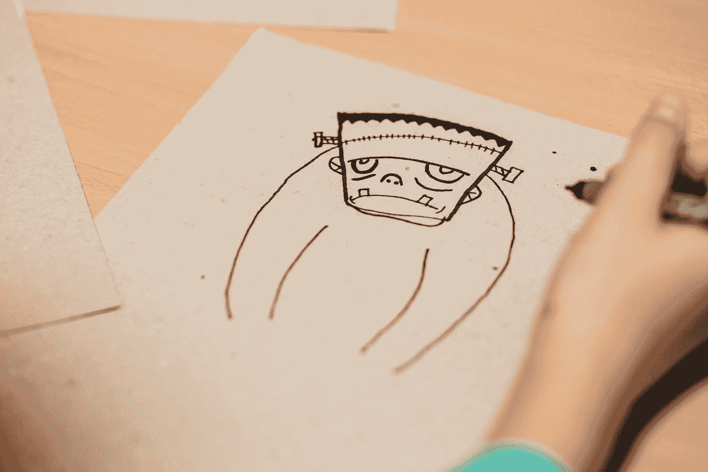

# 弗兰肯斯坦偏见

> 原文：<https://towardsdatascience.com/frankenstein-bias-6e2c906df595?source=collection_archive---------44----------------------->

## [公平和偏见](https://towardsdatascience.com/tagged/fairness-and-bias)

## 我们在创造 AI 怪物吗？

[自由股](https://unsplash.com/@freestocks?utm_source=medium&utm_medium=referral)在 [Unsplash](https://unsplash.com?utm_source=medium&utm_medium=referral) 上的照片

作为一名计算机科学家，当我说计算机程序正以惊人的速度让我们失望时，我不会掉以轻心。有一次，一个谷歌图片搜索程序意外地认为黑人是大猩猩。或者那次微软制造了一个人工智能聊天机器人，它在不到一天的时间里成为了希特勒的粉丝。还有，那次亚马逊建立了一个简历排名程序，这个程序对雇佣女性没有兴趣。

为什么这种令人挠头、可能改变生活、但看似可以避免的结果在计算机程序中如此频繁地发生？我认为这与我称之为**弗兰肯斯坦偏见**的东西有关。下面我来解释。

在 20 世纪 60 年代和 70 年代，心理学家丹尼尔·卡内曼和阿莫斯·特沃斯基进行了一系列实验，询问“当人们不知道正确答案时，他们是如何做决定的”。这听起来像是一个罕见的事件，但人们实际上一直在这样做。这个人会很适合我的公司吗？在这样的雪地上开车有多危险？现在买 GameStop 股票还来得及吗？没有办法提前知道这些问题和数以百万计的其他问题的正确答案，但你的大脑无论如何都会做出决定。怎么会？

卡尼曼和特沃斯基(K&T)的工作后来获得了诺贝尔奖，他们命名了一系列偏见。例如，“可用性偏差”说，当人们能够很容易地回忆起类似的事件时，他们会认为事件更有可能发生。这就是为什么人们在飞机失事后更加害怕飞行。K & T 说出了几十个偏差；生动性偏差、代表性偏差、锚定偏差——所有关于大脑在不确定时如何做决定的规则。

但是几十年后，人类不再是现代世界中唯一的决策者。电脑越来越多地参与到我们的日常生活中。他们做每一件事，从提供[指示](https://www.statista.com/statistics/865413/most-popular-us-mapping-apps-ranked-by-audience/)，到审查抵押[申请](https://www.businessinsider.com/automated-underwriting-system-mortgage)，到为法官决定判决[建议](https://www.theatlantic.com/technology/archive/2018/01/equivant-compas-algorithm/550646/)。

随着所有这些对软件的有效使用，我们有责任回答这样一个问题:这些计算机程序在做决策方面有多好？

奇怪的是，经常是那些编写计算机程序的人被问到这个问题，就像 K&T 的其他问题一样，没有真正的方法知道正确的答案。我认为这导致了另一种偏见，一种 K & T 没有研究的偏见，我称之为**弗兰肯斯坦偏见**。

在 1818 年玛丽·雪莱的小说中，一位年轻的科学家维克多·弗兰肯斯坦在多年的辛勤工作后创造了一种新的生物。这是书中的一段引文:

我(弗兰肯斯坦)努力工作了将近两年，唯一的目的就是给一个没有生命的身体注入生命。为此，我剥夺了自己的休息和健康。我热切地渴望着它，远远超过了克制。

好莱坞后来把这句话变成了现在著名的[“它活着”](https://www.youtube.com/watch?v=1qNeGSJaQ9Q)台词，但你明白了——创造东西是令人兴奋的，尤其是当它需要大量的努力和专业知识来完成的时候。

这种情绪同样适用于创造人工智能程序的计算机科学家和软件工程师。

其中一些人工智能程序非常复杂。AI 背后的数学有一些大多数人叫不出名字的符号。一些人工智能应用程序有数万行代码，用五种不同的 T21 语言编写。

因此，当计算机科学家和工程师最终拥有足够的知识来制造一个做某事的人工智能系统时，自然倾向于强调它的优势，有时不会充分考虑它潜在的缺点。

*为什么我们需要考虑健壮测试？这是我们的人工智能，它当然工作得很好。你看到我要做的数学运算了吗？*

这是弗兰肯斯坦偏见，随着我们越来越依赖人工智能技术，它的影响也变得越来越严重。

例如，弗兰肯斯坦偏见在 2020 年得到了展示，当时谷歌的计算机科学家偶然想到“[我们需要对人工智能做更多的测试](https://www.technologyreview.com/2020/11/18/1012234/training-machine-learning-broken-real-world-heath-nlp-computer-vision/)，也许我们建造这些系统的方式“存在根本缺陷”。尽管谷歌多年来在几乎所有可以想象的领域推出新的人工智能应用，从[唇读](https://www.newscientist.com/article/2113299-googles-deepmind-ai-can-lip-read-tv-shows-better-than-a-pro/)和[音乐](https://www.technologyreview.com/2020/09/04/1008151/google-ai-machine-learning-quarantine-music/)到[气候变化](https://www.cnbc.com/2020/12/17/climate-change-falls-down-the-agenda-at-ai-lab-deepmind.html)和[饥荒](https://developers.googleblog.com/2019/11/using-machine-learning-to-tackle-fall-armyworm.html)。

它回避了一个问题:在我们提议将人工智能用于重要的现实世界任务之前，我们难道不应该知道如何测试它吗？

我认为，在自动驾驶汽车世界中，弗兰肯斯坦偏见也陷入了持续的错误计算。记住，像[通用](https://www.wired.com/story/gms-cruise-rolls-back-target-self-driving-cars/)、谷歌 [Waymo](https://www.theatlantic.com/technology/archive/2018/03/the-most-important-self-driving-car-announcement-yet/556712/) 和[丰田](https://www.wsj.com/articles/toyota-aims-to-make-self-driving-cars-by-2020-1444136396)这样的公司都表示，他们将在 2020 年前大规模生产无人驾驶汽车。好吧，现在是 2021 年，结果是，[比](https://arstechnica.com/cars/2021/04/waymo-ceo-john-krafcik-steps-down/)更不准确。你几乎可以想象在 2015 年左右，当人工智能技术爆炸，无人驾驶汽车似乎不可避免地就要出现时，那些工程商店发出的乐观情绪。这些预测一头扎进了严酷的事实中，即在现实世界中测试一些对生死有影响的东西是多么具有挑战性。

最后，我们一次又一次地在计算机化的面部分析领域看到弗兰肯斯坦的偏见，出于某种原因，计算机科学家反复尝试使用面部图像来做一些事情，如"[犯罪](https://www.vice.com/en/article/7kpzeg/university-deletes-press-release-promising-bias-free-criminal-detecting-algorithm)"探测器、[政治派别](https://www.nature.com/articles/s41598-020-79310-1)传感器和[性取向](https://www.gsb.stanford.edu/faculty-research/publications/deep-neural-networks-are-more-accurate-humans-detecting-sexual)观察者。尽管没有证据表明一张脸可以预测这些特征(事实上与相反[)。不出所料，其他人随后出现并指出否定这些发现的基本事实，但没关系，标题已经被抓住，损害已经造成。](https://www.sciencedirect.com/science/article/pii/S0010945218301436)

是时候改变了。软件是呆在实验室里的神秘事物的日子已经一去不复返了。我们需要承认，我们如何测试软件和最初构建软件一样具有挑战性。

这始于大学课程，目前计算机科学(CS)课程中对测试的强调太少。大学不仅需要教计算机科学专业的学生如何用数据结构和面向对象设计之类的东西构建一个计算机程序，还需要教他们如何批判性地思考这个程序在现实世界中可能如何运行。随着[技术融入社会课程](https://ughb.stanford.edu/courses/approved-courses/technology-society-courses-2020-21)的开展，你已经开始看到一些这种情况，但它们仍然太不常见，每年都有新的计算机科学毕业生进入劳动力市场。

其次，生产面向公众的应用程序的公司需要接受第三方的测试。很多时候，公司都躲在[【专有信息】](https://aws.amazon.com/blogs/machine-learning/thoughts-on-recent-research-paper-and-associated-article-on-amazon-rekognition/)或[【用户隐私】](https://www.protocol.com/nyu-facebook-researchers-scraping)的声明后面，以避免他们的申请受到外部团体的审查。但是黑盒测试是我们知道如何做的事情。我们已经做了几十年，现在比以往任何时候都更需要它。

最近一个很好的例子是 [Markup 的公民浏览器](https://themarkup.org/citizen-browser)项目，该项目查看脸书向不同人展示的广告，以决定 FB 是否违反了自己关于如何定位广告的规则。令人惊讶的是，他们[经常做](https://themarkup.org/citizen-browser/2021/02/12/facebook-says-technical-issues-were-the-cause-of-broken-promise-to-congress)。这种测试应该被每一个生产面向公众的软件的团队所支持。

如果我们采取这两个小步骤，提高计算机专业学生的意识和在公司层面接受外部测试，我认为我们会看到软件向公众发布的方式有巨大的改进。希望我们甚至可以达到这样一个点，即围绕人工智能和计算机科学的坏消息循环似乎将被打破，并被对下一代更具启发性的东西所取代。这是这位计算机科学家的希望，我们朝着这个方向前进，并尽快做到这一点。

~约翰·j·霍华德博士

[*约翰·霍华德*](http://jjhoward.org/) *是一名计算机科学家，拥有生物识别算法有效测试方面的博士学位。这里提出的观点是他的。他们不代表他的任何附属机构的观点。如果你觉得这很有趣，你可以关注 Twitter 上的*<https://twitter.com/John_J_Howard>**或*[*LinkedIn*](https://www.linkedin.com/in/john-howard-ph-d-3bba2b15)*。**