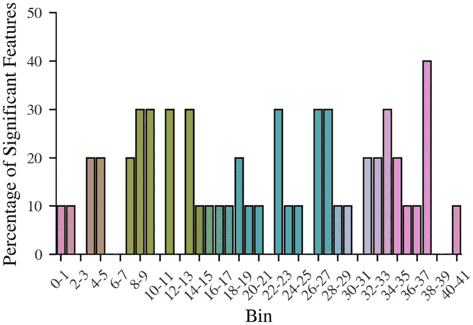
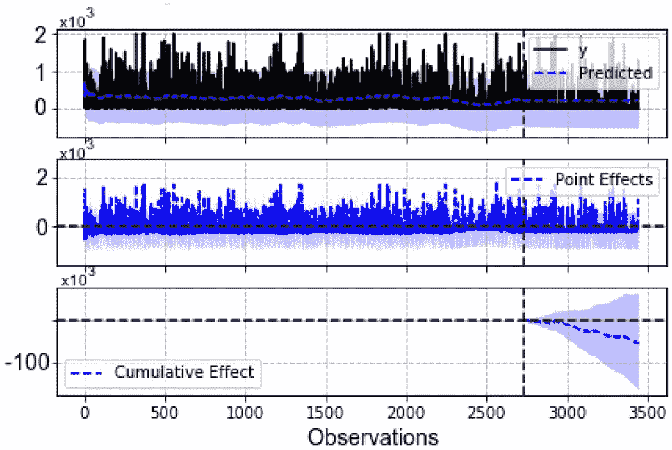
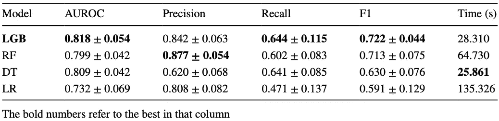
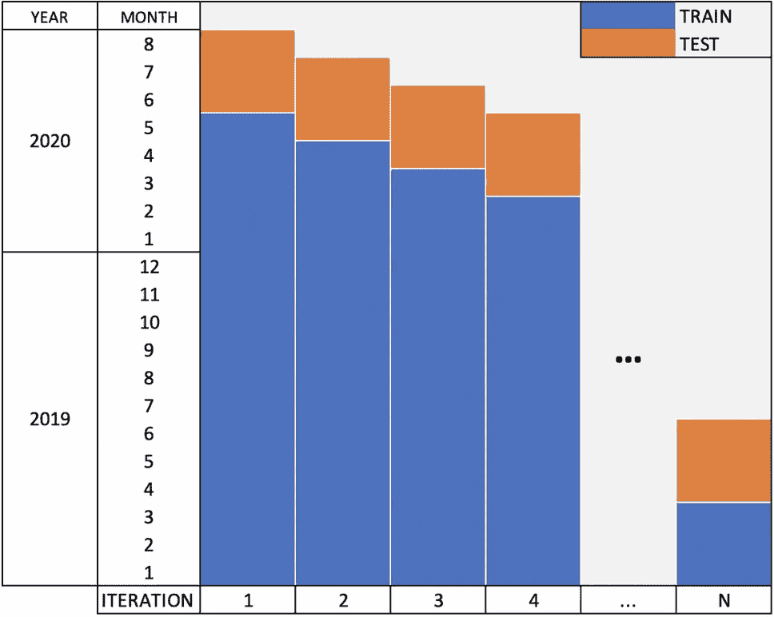
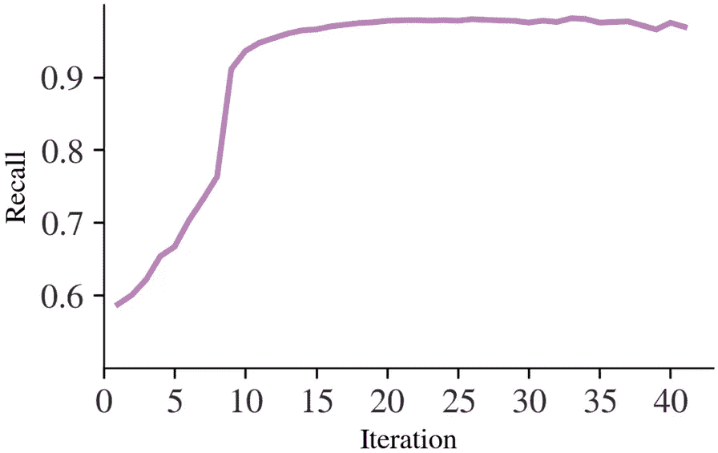
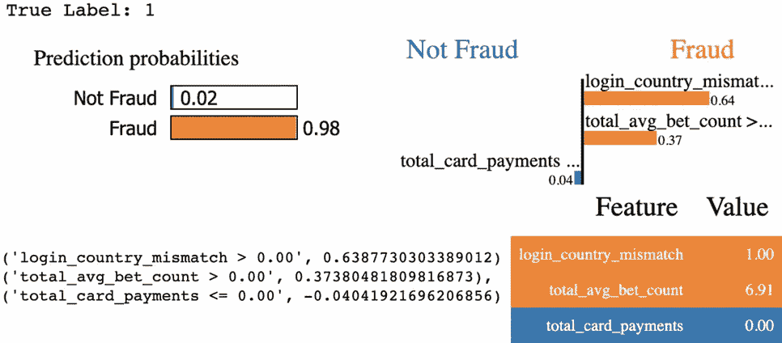

# iGaming 中的欺诈检测

> 原文：<https://towardsdatascience.com/fraud-detection-in-igaming-fb7f7dd6fba8?source=collection_archive---------19----------------------->

## 机器学习|数据科学|游戏

## 我们如何使用机器学习来标记欺诈和恶意行为

马库斯·斯皮斯克在 [Unsplash](https://unsplash.com?utm_source=medium&utm_medium=referral) 上的照片

我们生活在一个数字世界。我们所做的一切都直接或间接地受到某种数字技术的驱动。犯罪行为也已经数字化。网络罪犯利用技术进步及其弱点进行非法活动。我们这个世界的数字化为网络罪犯创造了一个环境，他们可以直接瞄准全球各地的个人和企业。世界上所有的行业都受到网络犯罪的影响。注册欺诈审查员协会报告称，企业因欺诈损失了约 5%的年收入[1]。仅在 2020 年，身份欺诈就造成了 560 亿美元的损失[2]。

赌博业(网上赌场)极易受到犯罪行为的影响。从洗钱到信用卡和身份欺诈，犯罪分子早在赌场行业转移到网上之前就已经瞄准了它。有人可能会说，iGaming 让犯罪分子更容易实施他们的恶意活动，特别是由于该行业随处可见[3]。

打击欺诈活动总是一个棘手的问题。尽管该行业受到高度监管和审查，但有创造力的罪犯仍设法逃脱法网。多个行业中存在多种欺诈检测解决方案[4，5，6]；然而，赌博活动的动态性和不可预测性受到众多因素的影响，这使得欺诈检测的任务更加困难！即使仅仅考虑不同类型的可能的欺诈活动(或者至少是已知可能的)，我们最终也会得到一个巨大的欺诈特征列表，每个特征都有所不同。

# 那么，我们是怎么做到的呢？

## 第一步:问题陈述

重要的事情先来。我们的目标是什么？我们有一个由分析师组成的内部风险和欺诈团队，他们手动审查玩家及其活动，以标记欺诈活动。作为数据科学家，我们希望帮助自动化他们的工作流程。分析师必须手动分析数百万笔交易；那么，为什么不让人工智能来承担重任呢？然后，人工智能会通知分析师潜在的欺诈玩家，然后他们会仔细检查。因此，大大减少了他们的工作量，提高了他们的效率。

因此，我们将我们的目标解决方案公式化为一个分类器，它将一个玩家标记为`**Fraud**`或`**Not Fraud**`。我们的分析师标记了他们分析的每一个账户。这一过程也促使我们决定构建一个分类器，因为我们可以访问由 *13，591 名*确认的欺诈者组成的 *451，123 名*玩家的标记数据集。正如所料，数据集严重失衡(约 3%的数据集是欺诈标签)。

## 步骤 2:数据准备和分析

我们排除了那些没有被贴上欺诈者标签且没有任何活动的玩家。这一过程共涉及 197，733 名玩家(其中 184，142 人之前未被标记为欺诈)。这种消除在两个主要方面帮助了我们的任务:降噪和对大多数类进行欠采样(我们的欺诈样本现在占整个数据集的 6.87%)。

我们收集、处理和设计了每个玩家超过 1000 个数据点。我们进行了特征选择和探索性数据分析，以达到每个样本 25 个特征的最终数量。

我们的特征库包括以下类别的变量:

> 1.多会话行为集合
> 
> 2.游戏模式
> 
> 3.会话识别和地理定位
> 
> 4.人口统计数据
> 
> 5.支付信息

我们的数据也受到缺失值的影响。在我们的例子中，缺失数据的百分比相对较低，所以我们决定使用中位数来估算缺失数据。由于高特征偏斜度和方差，我们选择了中值而不是平均值。我们将这种偏斜归因于不同的演奏风格以及样本中存在的异常现象。我们研究了不同的数据缩放和标准化技术及其对我们分析的影响。

由于欺诈行为往往会定期变化，我们还想了解欺诈在多大程度上受到概念漂移的影响。

我们将数据集分成几个部分，包括 1 年、6 个月、4 个月、1 个月和 1 周。使用 Mann–Whitney*U*测试，我们评估了我们的特征分布态射。

月度箱中显著不同特征的百分比。来源:作者

根据我们的分析，我们预计每月会有 10%到 40%的功能遭受数据漂移。我们观察到第 36 个月和第 37 个月之间的漂移率最高。这几个月代表 2020 年初，正好赶上新冠肺炎疫情爆发。我们使用基于贝叶斯结构时间序列的算法，调查了新冠肺炎疫情(2020 年 2 月/3 月)开始时对数据基本分布的因果影响。如果所述事件没有发生，该算法使用基于贝叶斯的模型来预测预期的后验行为，并将其与真实观察到的行为进行比较。

新冠肺炎开始对数据分布的因果影响。来源:作者

虽然我们可以观察到该事件的负面影响，但获得的结果在统计上并不显著。因此，从统计学角度来说，我们必须排除新冠肺炎作为样本中数据漂移的可能动机。尽管如此，这两个测试都证实了我们数据中的数据漂移。

## 步骤 3:预测建模

使用分层的 10 重交叉验证，我们评估了多种预测算法在几种管道上的性能(不同的缩放/标准化技术，有和没有过采样，以及其他实验技术)。性能较好的技术(LGB —光梯度增强、RF —随机森林、DT —决策树、LR —逻辑回归)的结果如下表所示。

评估技术的性能结果。来源:作者

我们的评估表明，LGB 技术取得了最好的结果。我们使用贝叶斯优化和分布式 Parzen 估计树(TPE)进一步调整了它的超参数。

我们还从建模的角度研究了概念漂移问题。使用月箱，我们建立了一个实验，包括对不同序列的箱进行训练和测试。我们首先在整个数据集上进行训练，并排除最后 2 个月的测试，随着每次迭代，我们将一个月的时间从训练集转移到测试集。

量化漂移率的模拟实验示意图。来源:作者

随着迭代的进行，我们进一步绘制召回衰减图。迭代 0 表示我们数据中的当前月份(即，我们通过每次迭代从当前移动到过去)。

上面的可视化清晰地显示了在大约第 9 次(2019 年 11 月/12 月)和第 8 次(2020 年 2 月/3 月)迭代时召回率的急剧下降。我们越深入到 2020 年，观察到的回忆就越糟糕。再次确认数据漂移。这个实验帮助我们确定了生产中模型重新训练频率的基线。

## 步骤 4:说明性分析

预测一个潜在的欺诈玩家对我们来说是不够的。我们想更进一步，向我们的欺诈分析师解释为什么我们要向他们发送可疑行为通知。这种额外的详细信息不仅可以更深入地了解我们的模型是如何工作的，还可以使欺诈分析师快速确定最佳行动方案；因此，节省了更多的时间。

我们通过使用局部可解释的模型不可知解释(LIME) [7]来实现这个任务。我在另一篇文章中解释了石灰的工作原理。请随意查看。

</understanding-lime-f94dab852617>  

使用 LIME，我们能够检索每个预测的前 3 个最有影响的特征。然后，我们处理这些数据，并向我们的分析师发出警报。下面我们展示了一个欺诈玩家的样本输出。

LIME 在欺诈玩家上提供的输出。来源:作者

从上面，我们知道，由于玩家的登录不匹配和投注行为，该特定玩家被标记为可疑。

# 结论

在本文中，我们讨论了如何使用机器学习来预测在线赌场环境中的欺诈行为。我们在 197，733 名玩家的数据集上使用交叉验证评估了我们的最终模型，欺诈样本占样本的 6.87%。表现最好的模型是 LGB，其精确度为 0.842 ( 0.063)，召回率为 0.644 ( 0.115)。我们还讨论了如何调查数据中的概念漂移问题，以及这些结果如何影响我们的训练策略。我们还展示了如何更进一步，使用 LIME 等技术从我们的模型中生成可操作的见解。

喜欢这篇文章吗？我们在发表的论文中对此进行了更详细的讨论。请查看《斯普林格自然计算机科学》。

<https://link.springer.com/article/10.1007/s42979-021-00623-7>  <https://david-farrugia.medium.com/membership>  

# 参考

[1]注册欺诈审查员协会:ACFE 向各国提交的报告| 2020 年全球欺诈研究。注册欺诈审查员协会技术报告。2020.[http://www.acfe.com/report-to-the-nations/2020/](http://www.acfe.com/report-to-the-nations/2020/)。

[2][https://www . javelin strategy . com/content/2021-身份-诈骗-举报-转移-角度-身份-诈骗](https://www.javelinstrategy.com/content/2021-identity-fraud-report-shifting-angles-identity-fraud)

[3]班克斯，詹姆斯(2012)。[网上赌博和犯罪:一个确定的赌注？](http://shura.shu.ac.uk/6903/) *《伦理杂志》*。

[4] Yamanishi K，Takeuchi Ji，Williams G，Milne P .使用有限混合和折扣学习算法进行在线无监督离群点检测。数据最小已知发现。2004;8(3):275–300.

[5] Burge P，Shawe-Taylor J .一种无监督的神经网络方法，用于描绘移动电话用户的行为，以用于欺诈检测。并行分布式计算。2001;61(7):915–25.

[6]波顿 RJ，手 DJ，H DJ。用于欺诈检测的无监督剖析方法。载于:《信用评分与信用控制论文集》第七卷，2001 年。第 5-7 页。

[7]里贝罗，M.T .，辛格，s .和盖斯特林，c .，2016 年 8 月。“我为什么要相信你？”解释任何分类器的预测。第 22 届 ACM SIGKDD 知识发现和数据挖掘国际会议论文集*(第 1135-1144 页)。*

想给我买杯咖啡吗？

<https://paypal.me/itsdavidfarrugia?country.x=MT&locale.x=en_US>  

# 想联系吗？

我很想听听你对这个话题的想法，或者其他什么。如果你想联系我，请给我发电子邮件，地址是 davidfarrugia53@gmail.com*。*

*[领英](https://www.linkedin.com/in/david-farrugia/) — [推特](https://twitter.com/davidfarrugia53) r*