# 利用图形分析进行欺诈检测

> 原文：<https://towardsdatascience.com/fraud-detection-with-graph-analytics-2678e817b69e?source=collection_archive---------5----------------------->

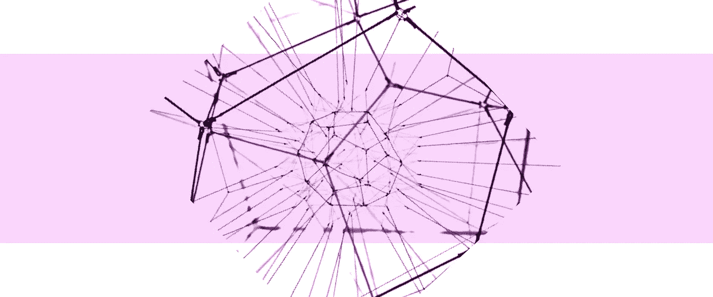

## 利用用例的网络结构提高预测性能

C 如今，用当今所有强大的机器学习算法来解决数据科学问题似乎轻而易举。如果经过正确调整和训练，这些算法能够有效地从数据中提取关键特征，学习常见模式，并最终提供准确的预测。

**但当问题不在于数量而在于网络时，会发生什么呢？**

> 通常在**银行业**中，仅依靠交易金额或其他特征很难发现隐藏欺诈性金融交易的空壳公司。然而，交易路径是模型可以用来提高其性能的关键信息。
> 
> 同样，在**医疗保健**中，检测欺诈也很困难，因为它涉及到医疗服务提供者、医生、受益人的同行共同提供虚假理赔。

**在这种情况下，还有哪些选择？**

面对这类问题，人们通常会在两个必要条件之间摇摆不定:**性能和可解释性。**

*   **性能:**使用 ***图形神经网络* ( *GNNs* )** 模型或其变体如*图形卷积网络(GCN)* 、*图形注意力网络(GAT)* 等，图形可以产生优异的效果。为什么？主要原因是它们**能够用向量表示图的节点、边或子图，并从中学习**。[ [1](https://www.sciencedirect.com/science/article/pii/S2666651021000012?via%3Dihub) ]但是，它们会导致模型过于复杂且难以解释。
*   **可解释性:**通过从一组机器学习算法中进行选择，可以获得可解释性模型，但有时会牺牲性能。

幸运的是，还有另一种选择:**结合了机器学习和图形分析。**

该方法包括以图形形式表示问题，计算网络特征，并使用该信息丰富 ML 算法学习的数据集。因此，这种方法有可能**提高模型性能，而不损害可解释性。**

本文的目标是通过一个具体的用例来解释和说明这种方法:**医疗行业的欺诈检测。**

**阅读本文后，您将了解:**

1.  如何**以图形方式可视化您的数据**并计算图形**主要特征**
2.  如何对你的数据进行**图聚类**？
3.  如何利用这些特性**提升你的模型性能**？

# 1.数据集丰富

# 1.1.关于数据集

## **数据由什么组成？**

该数据集来自 Medicare，由提供者提交的索赔以及每项索赔的受益人信息组成。

更具体地说，它包含以下信息:

*   关于索赔:开始和结束日期、状态、涉及的医生(提供者、主治医生、手术医生)、诊断等。
*   关于患者:年龄、性别、所在地、健康状况等。

有关数据集的更多信息可在此处获得[ [2](https://www.kaggle.com/rohitrox/healthcare-provider-fraud-detection-analysis) ]。

**目标是预测索赔是否具有欺诈性。**

## **我们希望发现哪些欺诈案件？**

它们主要是 **4 个欺诈使用案例**，通常在医疗保健行业占主导地位:

1.  对未实际提供的服务计费
2.  重复同一服务的索赔
3.  歪曲提供的服务
4.  收取比实际提供的服务更贵的费用

这些用例，尤其是前三个用例，在仅使用索赔、诊断或患者的可用信息时很难发现。

**然而，提供者在医师网络中的位置带来了有价值的信息。**例如:

*   对未实际提供的服务收费的从业者将倾向于具有更高数量的索赔，因此代表与其他节点紧密链接的中心节点。
*   重复索赔的医生将倾向于对相同的主刀医生和主治医生提出大量索赔，因此代表与相同节点紧密链接的节点，等等。

# 1.2.如何从表格到图形？

第一步是**通过图形化表示和可视化来探索数据。**

但是首先，图是由什么组成的？一个图形本质上包括:

1.  **节点(或顶点)**:表示数据中的实体。在我们的例子中，他们可以代表医生或病人。
2.  **边:**它们象征着实体之间的一种联系，可以按照一定的准则进行加权。

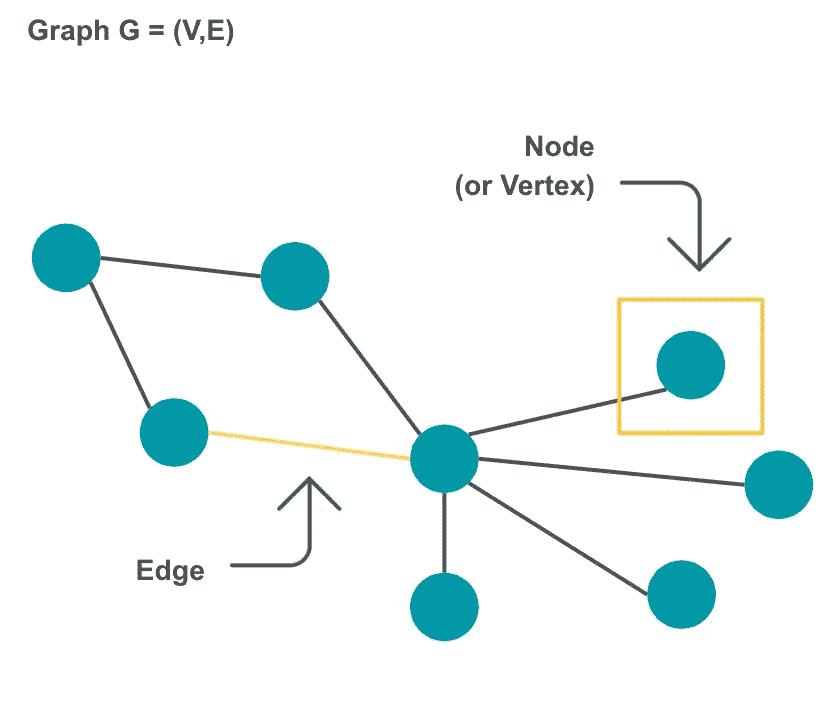

图 1 — *图形组件，i* 作者演示

在本文的其余部分，图表将由代表医生的节点和代表索赔的边组成。

使用库 *Networkx* [ [3](https://networkx.org/) ]可以很容易地将数据集转换成图形，如下例所示。

图形的可视化可以使用库 *Plotly* [ [4](https://plotly.com/) 来完成。代码示例可以在[这里](https://plotly.com/python/network-graphs/)找到。

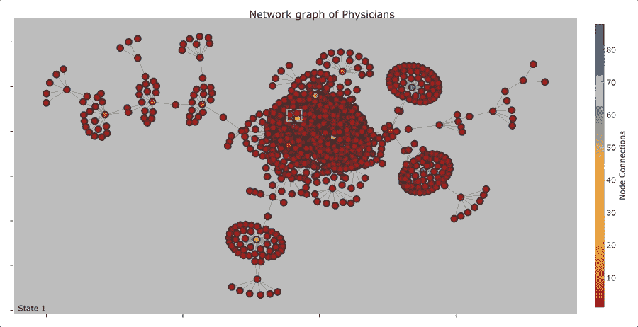

图 2—图表探索，作者提供的图片

# 1.3.从图表中可以提取出什么有用的信息？

一旦数据集被转换成图形，我们可以从中获得什么信息？可以为代表医生的每个节点计算各种各样的指标。给定我们的用例，我们将只关注 4 个:节点的度、紧密度中心系数、特征向量中心性和 PageRank。**它们主要捕捉一个节点在图中的中心位置和影响力。**

## **度**

它表示与顶点关联的边的数量

## **接近中心性**

顾名思义，接近中心性度量一个节点与其他节点的接近程度和中心程度。对于给定的节点 *u，*它表示从 *u* 到所有 *n-1* 其他节点的最短路径距离之和的倒数，如下式所示:

其中 *d(u，v)* 是 *v* 和 *u* 和 *n* 之间的最短路径距离，是图中的节点数。

为了说明这一指标背后的概念，让我们举一个简单的例子:

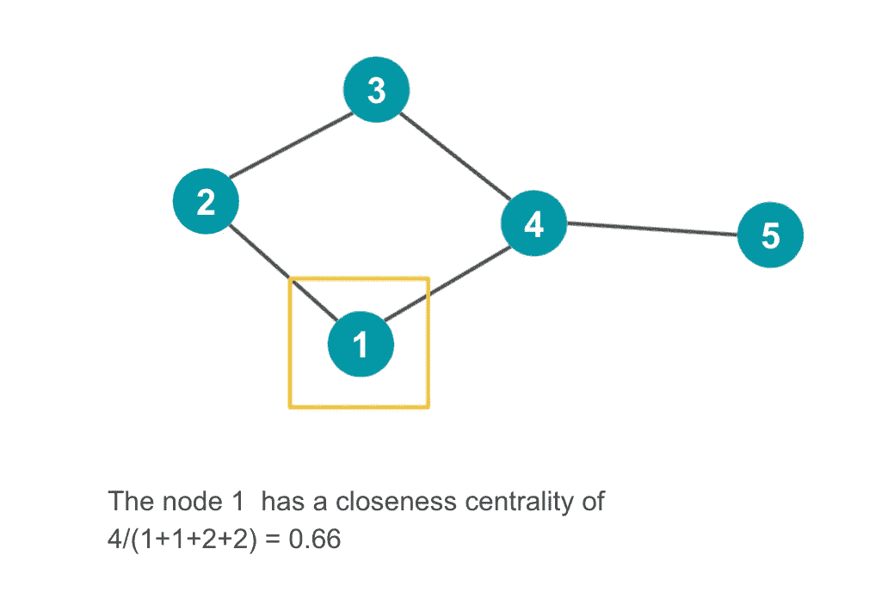

图 3——作者展示的接近中心性

## **特征向量中心性**

**特征向量中心性基于其邻居的中心性捕获节点的中心性。**这意味着具有高得分的节点是连接到同样具有高得分的其他有影响力的节点的节点。

它由什么组成？数学上，计算如下。对于给定的图 *G(V，E)* 具有|V|个顶点 *A* 是邻接矩阵，即如果顶点 *u* 链接到顶点 *v，则ᵤᵥ =1，否则为 0* 。

顶点 *v* 的相对中心度 *x* 可以定义为:

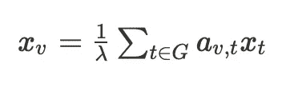

可以用向量表示法改写为特征向量方程:*Ax =*λ*x .**x*的 vth 分量给出了顶点 *v* 在网络中的相对中心性得分。

关于分数及其计算的更多信息可以在这里找到[ [6](https://en.wikipedia.org/wiki/Eigenvector_centrality) ]。

## **PageRank**

关于 PageRank 分数，它依赖于归一化的特征向量中心性或归一化的**声望 p.**

它由什么组成？使用标准化邻接矩阵 *N* 进行计算，定义如下:

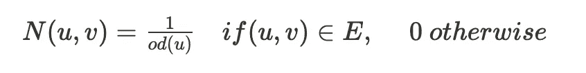

其中 *od(u)* 为节点 *u.* 的出度

节点 *v* 的**归一化特征向量声望分数** *p(v)* 通过求解以下等式来计算:

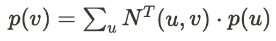

更多信息可以在这里找到。

**page rank 与特征向量中心性相比如何？**由于两个指标都使用其邻居的中心性来测量节点的中心性，因此让我们来研究两个具体示例的结果。

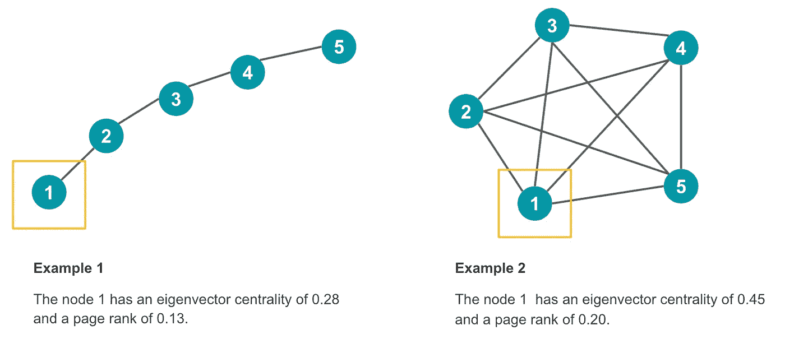

图 4-特征向量中心性和 PageRank， *i* 作者举例说明

计算这些指标可以使用库 *Networkx* [ [3](https://networkx.org/) ]来实现，如下面的代码所示。

下面是生成的数据帧的摘录。

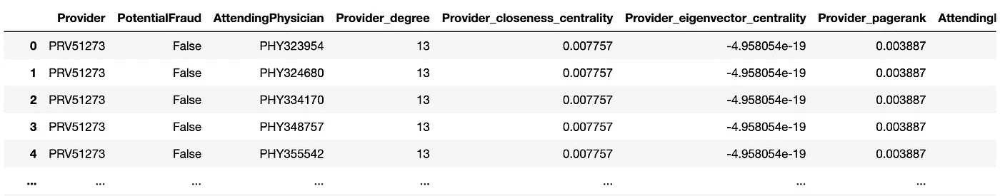

图 5—提取具有图形特征的数据集

下图显示了目标*潜在流量*和图表特征之间的相关性。

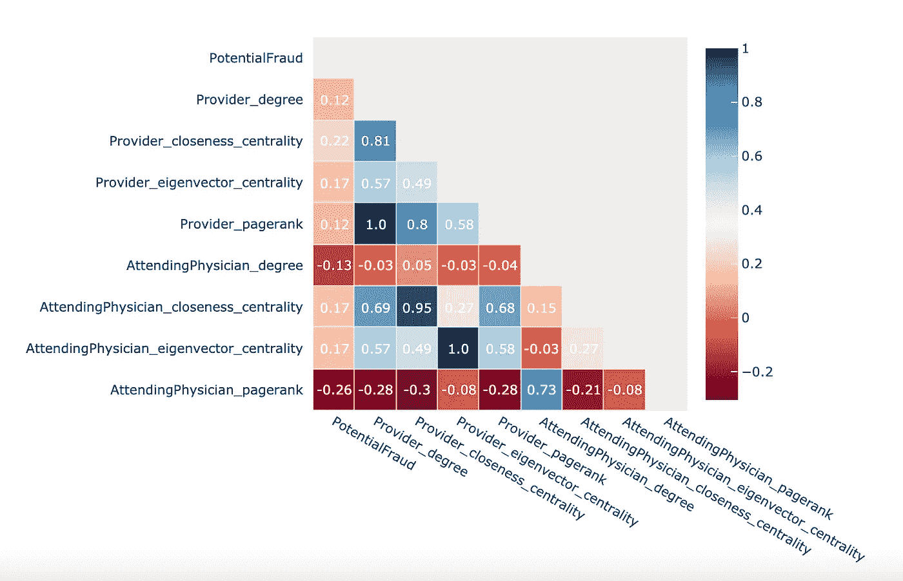

图 6—目标电势分布*与图形特征*的相关性

# 2.使聚集

一旦计算出图表的特征，**就可以更进一步，将医生分组。**如何？这可以通过使用**社区检测算法来实现。让我们探索一下最常见的方法:鲁文方法、信息图和随机漫步。**

# 2.1.勒芬

Louvain 方法通过最大化每个社区的模块性得分来检测大型网络**中的社区。**

## **什么是模块化得分？**

模块性得分测量**一个图到几个社区的给定聚类的强度。**为此，它依赖于**社区内边的集中与所有节点之间链接的随机分布的比较，而不管社区。**

更特别的是，它比较了:

1.  一个簇内的边数
2.  如果网络是一个随机网络，具有相同的节点数和每个节点的相同度，但边是随机连接的，则可以在集群中找到的预期边数

模块化得分的数学定义如下:

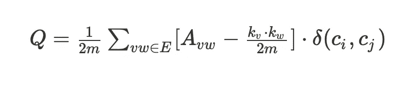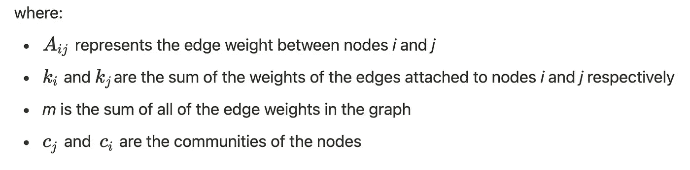

关于模块化得分的更多信息可以在这里找到[ [8](https://en.wikipedia.org/wiki/Modularity) ]。

## **鲁汶算法如何最大化分数？**

Louvain 方法使用了一种**层次聚类算法:**

1.  一开始，每个顶点代表一个社区。然后，在每一步，顶点被局部地重新分配给对模块性分数增加的贡献最高的社区。
2.  一旦没有顶点可以重新分配，每个社区就变成一个独立的顶点，这个过程重新开始。
3.  当一个步骤中只剩下一个顶点或者模块性不能再增加时，算法停止。

关于算法的更多信息可以在这里找到。

# 2.2.信息图

Infomap 过程类似于上面描述的过程，但是具有另一个目标函数:它不是最大化模块性得分，**而是最小化所谓的 map 等式。**

## **地图方程代表什么？**

在不深入数学细节的情况下，map 方程的基本思想是测量聚类的效果，当用作 Huffman 代码时，**压缩关于探索你的图的随机漫步机的信息。**

> 为了说明这个概念，让我们想象一个**随机漫步人**在探索网络。walker 在两个节点之间进行转换的概率由网络的结构和权重给出。
> 
> 到目前为止，网络的每个节点都被编码成一个单独的码字。**但是，如果您能够利用网络结构(即社区的存在)来最大限度地减少唯一代码字的数量，会怎么样呢？**
> 
> 事实上，考虑到网络中有一些区域，一旦进入，随机漫步机往往会无限期地停留，因此有优化的空间:我们可以为每个区域使用前缀代码，然后为模块内的每个节点使用唯一的码字。这些码字可以被其他区域的节点重新使用。

更多信息可以在[这里](https://stackoverflow.com/questions/48528648/infomap-community-detection-understanding/54292999)或者在这些论文 [10](https://arxiv.org/abs/cond-mat/0408187) 、 [11](https://www.biorxiv.org/content/10.1101/2020.04.14.040519v2.full) 、 [12](https://www.statworx.com/at/blog/community-detection-with-louvain-and-infomap/) 中找到。

# 2.3.步行陷阱

Walktrap 算法也是基于随机行走的**。**它通过运行短距离随机行走，在一个图中找到密集连接的子图，即社区。

这种方法背后的想法是，散步更有可能留在一个特定的社区建设。

更多信息可以在这里找到[ [13](https://medium.com/r?url=http%3A%2F%2Fjgaa.info%2Faccepted%2F2006%2FPonsLatapy2006.10.2.pdf%2F) ]。

运行这些社区检测算法可以使用库 *igraph* [ [5](https://igraph.org/) 来实现，如下面的代码所示。

这样就可以图形化地显示聚类的结果，如下图所示。

图 7—社区检测结果，作者提供的图片

# 3.系统模型化

现在，最终的问题来了:底层业务用例的网络表示为模型带来了真正强大和健壮的价值吗？让我们通过我们的用例来探索答案。

# 3.1.性能提升到了什么程度？

## 关于培训设置

我测试了 **3 个场景**，这些场景在用于模型训练的特性方面有所不同:

*   **场景 1 —基线:**关于索赔和患者的信息(参见第 1.2 节。)
*   **场景 2 —基线和图表的特征:**这些特征包括上述 4 个指标(参见第 1.3 节。):代表医生的节点的度、他们的接近度中心系数、特征向量中心性和 PageRank。
*   **场景 3——基线、图的特征和检测到的社区:**测试的算法是上面解释的算法(参见第 2 节。):Louvain 方法、InfoMap 和 RandomWalk。

关于训练设置，我将数据集分成两部分:一个训练集，代表初始数据集的 80%,和一个验证集。对于每个场景，我测试了多种分类算法，并使用三重交叉验证方法根据训练集的 AUC 选择了最佳算法。

## 结果

下表包含使用验证集上最佳模型的每个场景的 AUC 分数。它还包含 3 个最重要的变量。

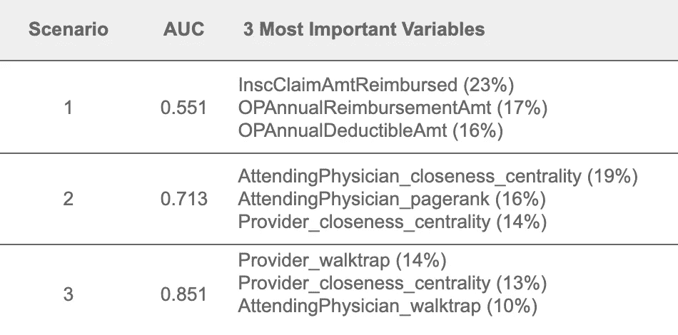

图 8—结果表

到目前为止，最后一种情况优于第一种情况。下图中的 ROC 曲线证实了这一观察结果。

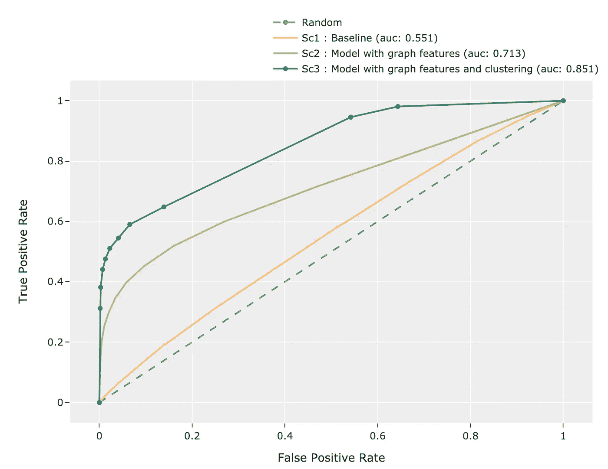

图 9-ROC 曲线

# 3.2.可变重要性呢？

场景 3 中的最佳模型是随机森林。因此，通过计算每个树中杂质减少累积的平均值和标准偏差，可以洞察每个变量的重要性。

下图显示了场景 3 最佳模型的最重要变量。

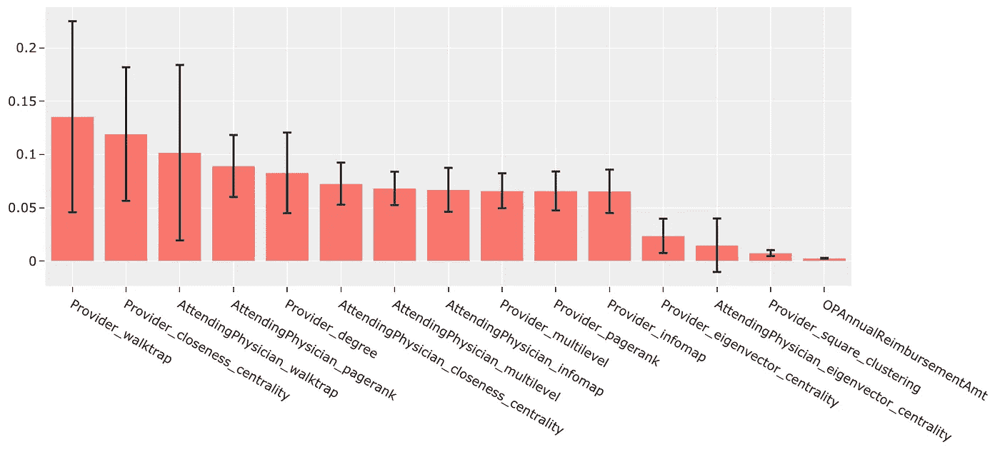

图 10—特征重要性(场景 3)

与图形相关的特征在模型预测中具有更高的重要性。这种重要性可能有较大或较小的可变性，这取决于它们在构造中包含的随机性的大小。

# 关键要点

**从这个用例中可以得到什么启示？**

*   **使用图形分析可以显著提高模型的预测能力。**为什么？常规的 ML 方法包括从单个观察中学习，而**带图 ML 使用现有的网络结构来检测新模式，并添加关于实体如何相互连接以及它们的关系性质的有价值信息**。由于初始特征集没有捕捉到这些信息，带图的 ML 可能会提高模型性能。
*   **使用图形分析会导致很高的计算成本。**根据所使用的算法，这可能比在特征工程步骤中添加一些根据手工挑选的信息手动构建的特征成本更高。

# 资源

[1]周杰，甘渠翠，，胡，张正彦，，程阳，，王，，孙茂松，[图神经网络:方法与应用综述](https://www.sciencedirect.com/science/article/pii/S2666651021000012?via%3Dihub)，艾开

[2] Kaggle，[医疗保健提供商欺诈检测分析](https://www.kaggle.com/rohitrox/healthcare-provider-fraud-detection-analysis)

[3] [Networkx 库](https://networkx.org/)

[4] [Plotly 库](https://plotly.com/)

[5] [iGraph 库](https://igraph.org/)

[6]维基百科，[特征向量中心性](https://en.wikipedia.org/wiki/Eigenvector_centrality)

[7] Günce Keziban Orman，Vincent Labatut。[人工网络社区发现算法的比较](https://www.nature.com/articles/srep30750)。发现科学国际会议，2009 年 10 月，葡萄牙波尔图

[8]维基百科，[模块化](https://en.wikipedia.org/wiki/Modularity)

[9]维基百科，[卢万法](https://en.wikipedia.org/wiki/Louvain_method)

[10] Aaron Clauset，M. E. J. Newman，Cristopher Moore，[在非常大的网络中发现社区结构](https://arxiv.org/abs/cond-mat/0408187)，2004 年 8 月

[11] Carmel Farage，Daniel Edler，Anna Eklö，Martin Rosvall，Shai Pilosof，[使用信息图确定生态网络中的流量模块](https://www.biorxiv.org/content/10.1101/2020.04.14.040519v2.full)

[12]尼克拉斯·勇克，[利用卢万和信息地图进行社区探测](https://www.statworx.com/at/blog/community-detection-with-louvain-and-infomap/)，2020 年火星

[13] Pons、Pascal 和 Matthieu Latapy，[使用随机行走的大型网络中的计算社区](https://arxiv.org/abs/physics/0512106)