# 用于训练深度学习模型的免费 GPU

> 原文：<https://towardsdatascience.com/free-gpus-for-training-your-deep-learning-models-c1ce47863350?source=collection_archive---------0----------------------->

## 是的，你没听错。它是免费的。

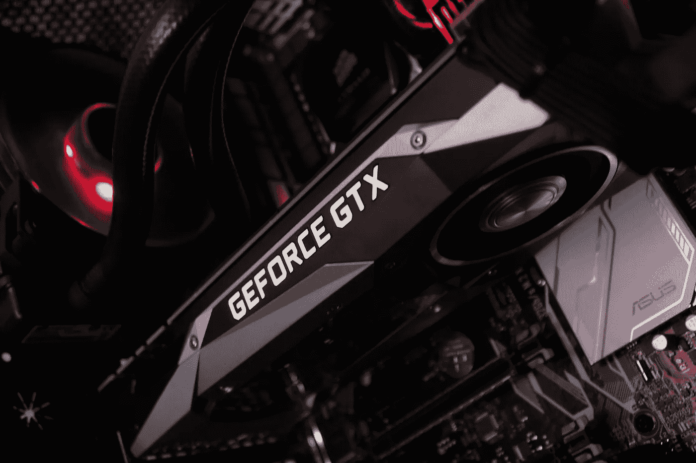

图片由[阿比盖尔·迪萨诺](https://pixabay.com/users/kampfhimmel-1527803/?utm_source=link-attribution&amp;utm_medium=referral&amp;utm_campaign=image&amp;utm_content=2810919)拍摄，来自[皮克斯拜](https://pixabay.com/?utm_source=link-attribution&amp;utm_medium=referral&amp;utm_campaign=image&amp;utm_content=2810919)

GPU 是训练深度学习模型的重要组成部分，而且价格不菲。在本文中，我们研究了一些提供免费 GPU 的平台，这些平台没有免费试用期、有限的免费积分或注册时需要信用卡的限制。

# 快速比较

我们正在考察的 3 个平台是 Gradient、Google Colab 和 Kaggle。下面是每个平台提供的一些硬件规格和特性的快速总结。

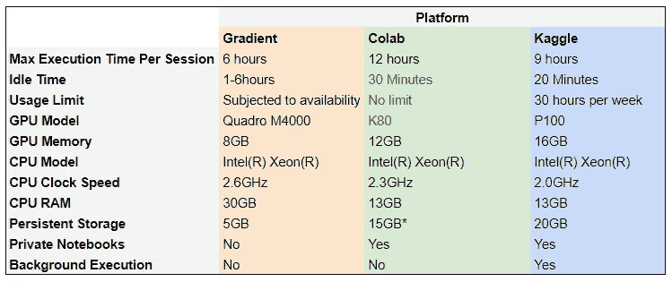

特征对比。(*图片作者)*

`Maximum Execution Time Per Session`:代码在超时前可以运行的最长时间

`Idle Time`:您可以让笔记本电脑在关机前空闲的最长时间

`*`:Google Drive 提供 15GB 免费存储空间

# 梯度

Paperspace 的 [Gradient](https://gradient.paperspace.com/free-gpu) 提供基于云的端到端 MLOps 解决方案。作为其产品供应的一部分，Gradient 提供社区笔记本电脑，这些笔记本电脑是公共的和可共享的 Jupyter 笔记本电脑，运行在免费的云 GPU 和 CPU 上。

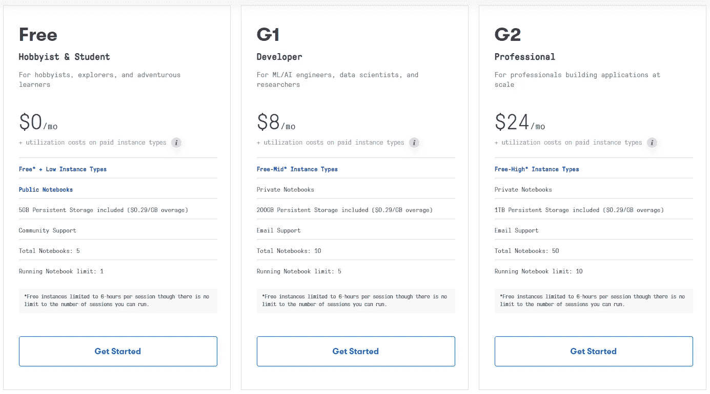

*(来自 Paperspace 的截图)*

# 赞成的意见

1.  8 个 CPU，30GB RAM，是所有 3 个中最高的
2.  1-6 小时之间的长空闲时间

# 骗局

1.  没有私人笔记本电脑，如果运行在免费的 GPU
2.  GPU 取决于可用性
3.  8GB 的低 GPU 内存
4.  5GB 的低可用存储空间

Gradient 有不同的定价层，允许不同级别的 CPU / GPU 实例类型。让我们来看看免费层。

# 1.注册一个账户

只需一键注册，就能轻松唱出渐变效果。

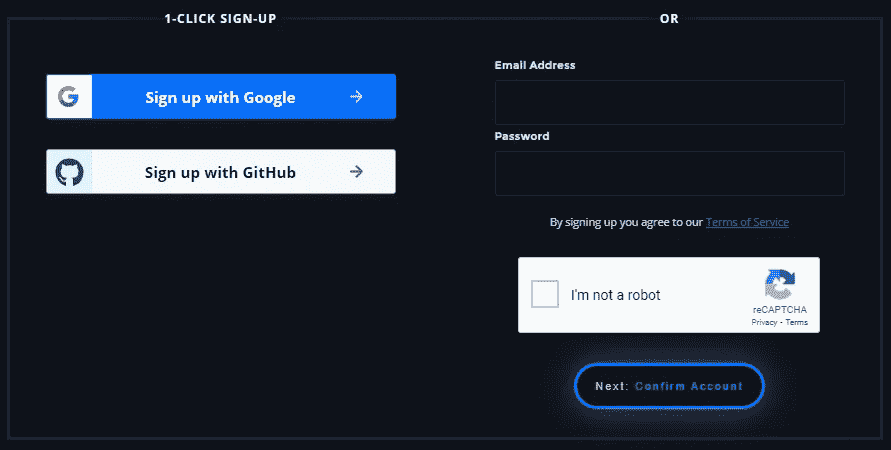

*(来自 Paperspace 的截图)*

# 2.创建笔记本

1.  命名您的项目
2.  选择运行时

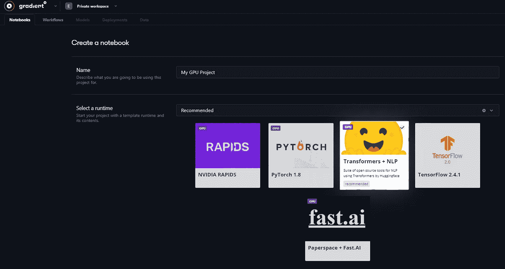

*(来自 Paperspace 的截图)*

3.选择一台 GPU 计算机。一定要选择那些标有“免费”的。在免费 GPU 上运行的笔记本电脑将是公共的，最多 6 小时后会自动关机。

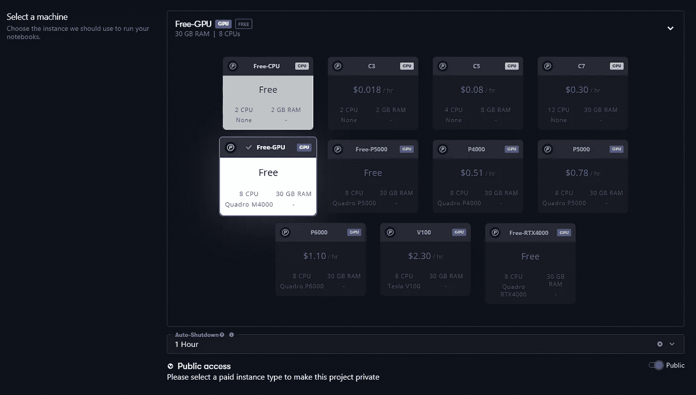

*(来自 Paperspace 的截图)*

业余爱好者和学生的免费层计划只允许选择 Quadro M4000 GPU。免费 GPU 也受到可用性的限制，在高峰时期可能不可用。

# 3.启动 Jupyter 实验室

启动笔记本会将我们带到一个允许我们启动 Jupyter Lab 的工作区。让我们使用 Jupyter 实验室的终端来检查 GPU 和 CPU 规格。

`nvidia-smi`

免费版本提供了一个带 8GB RAM 的 Quadro M4000 GPU

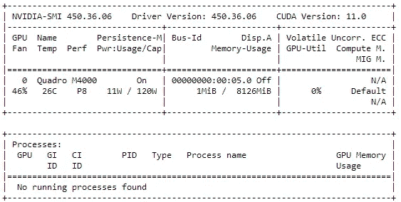

*(截图来自 Paperspace)*

`lscpu`

无梯度 GPU 机器还配备了 8 个英特尔至强 E5–2623 CPU 和 30GB RAM。

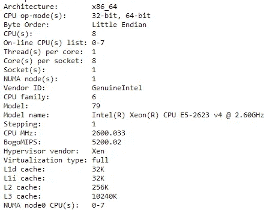

*(来自 Paperspace 的截图)*

`cat /proc/meminfo`

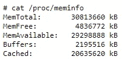

*(来自 Paperspace 的截图)*

# Google Colab

Google 推出的 Google Collaboratory 是一款 Jupyter 笔记本 IDE，可以使用免费的 GPU 和 TPU。你只需要一个谷歌账户就可以开始了。Google Colab 允许您将 Google Drive 作为 Colab 项目的存储文件夹，这使得读取和保存数据变得轻而易举。是的，你还可以免费获得 15GB 存储空间的 Google Drive

# 赞成的意见

1.  与 Google Drive 集成用于数据存储
2.  没有使用限制
3.  允许私人和公共笔记本
4.  12 小时的长执行时间

# 骗局

1.  大约 30 分钟的短暂空闲时间
2.  每次会话前需要重新安装和验证 Google Drive

要在 Colab 中使用 GPU，在顶部功能区选择硬件加速器的 GPU`Runtime`→`Change Runtime Type`

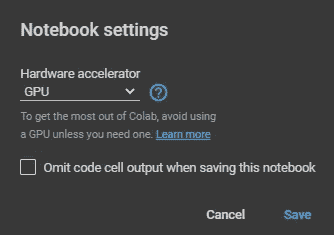

*(截图来自 Google Colab)*

根据谷歌 Colab 的常见问题，Colab 提供了多种 GPU，如 Nvidia K80s，T4s，P4s 和 P100s，但是您将无法选择特定的 GPU 类型。让我们来看看 Colab 必须提供的一些硬件规格。

`nvidia-smi`

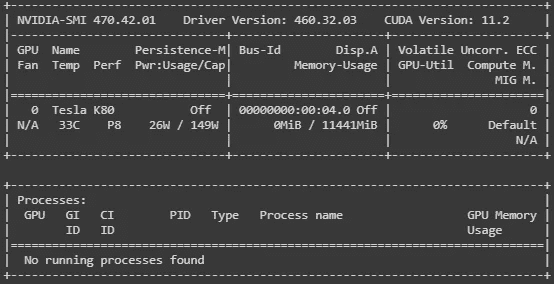

*(截图来自 Google Colab)*

在这个特殊的会话中，我被配备了大约 12GB 内存的 Tesla K80。

`lscpu`

*(截图来自 Google Colab)*

Colab 还提供 2 个英特尔 Xenon 2.3GHz CPU 和 13 GB RAM。

`cat /proc/meminfo`

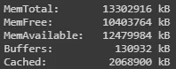

*(截图来自谷歌 Colab)*

# 卡格尔

[Kaggle](https://www.kaggle.com/) 是一个数据科学社区空间，以举办顶级机器学习和深度学习竞赛而闻名。它提供 Kaggle 笔记本，这是由免费 GPU 和 CPU 支持的可共享 Jupyter 笔记本。

Kaggle 提供至少 30 小时的动态 GPU 配额，该配额在 UTC 时间每周六午夜重置。我通常每周获得 30 到 41 小时的 GPU 配额。我喜欢 Kaggle 笔记本的一个原因是它的提交模式，允许用户在后台运行整个笔记本。这意味着我们不必在代码运行时保持浏览器打开。Kaggle 还允许通过简单地快速保存或在提交模式下运行笔记本来对笔记本进行版本控制。这使我们能够查看以前的笔记本版本并跟踪我们的进度。

# 赞成的意见

1.  提交模式允许代码在后台运行
2.  允许其他用户对笔记本发表评论
3.  16GB GPU 内存，所有 3 家供应商中最高的
4.  允许公共和私人笔记本
5.  访问 Kaggle 数据集
6.  笔记本版本控制

# 骗局

1.  每周 30~40 小时的动态 GPU 配额
2.  交互式 GPU 模式下 20 分钟的短暂空闲时间

让我们来看看 Kaggle 必须提供的一些硬件规格。

`nvidia-smi`

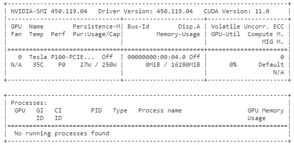

*(截图自 Kaggle)*

Kaggle 提供 16GB 内存的 P100 GPU。

`lscpu`

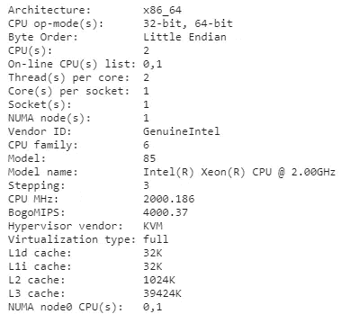

*(截图自 Kaggle)*

它还提供 2 个 2.00GHz 的英特尔 Xenon CPU，最大 13GB RAM

# 结论

我们审查了 3 个不同的平台，免费提供支持 GPU 的 Jupyter 笔记本电脑。之所以选择这些平台，是因为它们不需要信用卡来注册，没有信用额度限制或试用期。

如果我打算创建可共享的笔记本，Kaggle 是我的首选平台。在我之前关于[训练深度学习情绪分析模型](https://medium.com/@edwintan/how-to-train-a-deep-learning-sentiment-analysis-model-4716c946c2ea)的文章中，我利用 Kaggle 笔记本进行训练和推理，请随意查看。对于大量使用 GPU 的用户来说，每周的 GPU 配额可能会令人沮丧。Kaggle 提供了一些关于如何更有效地使用 GPU 的技巧。请随意分享您的经验和替代平台。

参考资料:

*   [https://gradient.paperspace.com/pricing](https://gradient.paperspace.com/pricing)
*   [https://research.google.com/colaboratory/faq.html](https://research.google.com/colaboratory/faq.html)
*   [https://www.kaggle.com/docs/notebooks](https://www.kaggle.com/docs/notebooks)

*   [加入 Medium](https://medium.com/@edwin.tan/membership) 阅读更多这样的故事。