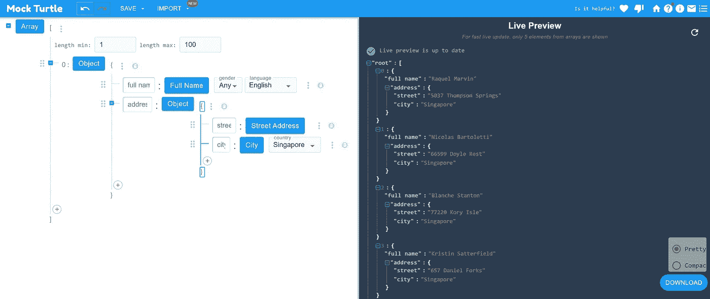

# 用于生成真实假数据的免费资源

> 原文：<https://towardsdatascience.com/free-resources-for-generating-realistic-fake-data-da63836be1a8?source=collection_archive---------0----------------------->

## 了解如何为您的数据科学项目创建模拟和虚拟数据

沃尔坎·奥尔梅斯在 [Unsplash](https://unsplash.com?utm_source=medium&utm_medium=referral) 上拍摄的照片

我们都知道数据是必不可少的。问题是很多时候我们没有足够的钱。当我们开发数据应用程序或管道时，我们需要用类似于生产中可能看到的数据来测试它们。

很难手动创建**足够数量和种类**的真实数据集(例如，不同的数据类型、特征)。此外，手工创建的数据容易受到我们潜意识和系统性偏见的影响。

幸运的是，有免费的在线资源可以生成**逼真的假**数据供我们测试使用。让我们来看看其中的一些:

> ***(1)***[*Faker*](#733e)***(2)****[*Mockaroo*](#c0f9)***(3)***[*generated ATA*](#7042)*

# *(1)造假者*

*术语“Faker”是模拟数据生成的同义词，因为有许多针对不同编程语言的 Faker 数据模拟库(例如， [NodeJS](https://github.com/Marak/faker.js) ， [Ruby](https://github.com/stympy/faker) ， [PHP](https://github.com/fzaninotto/Faker) ， [Perl](http://search.cpan.org/~jasonk/Data-Faker-0.07/) )。这里精选的 ***Faker*** 库是 **Python** 版本下的库。*

****Faker*** 是一个帮助你生成假数据的 Python 库。从文档中，我们可以看到，可以很容易地安装以下命令:`pip install Faker`*

*安装完成后，我们实例化一个 Faker 类对象并调用各种方法来生成我们想要的模拟数据类型:*

**

*来自 Faker GitHub Repo 的截屏图|根据 [MIT 许可](https://github.com/joke2k/faker/blob/master/LICENSE.txt)使用的图片*

*此外，Faker 有自己的`pytest`插件，它提供了一个可以在测试中使用的`faker`夹具。*

## *链接*

*   *[*Faker GitHub*](https://github.com/joke2k/faker)*

# *(2)摩卡鲁*

****Mockaroo*** 允许您根据您定义的规范，快速方便地下载大量随机生成的测试数据。*

*这个平台的奇妙之处在于**不需要编程**，您可以下载许多不同格式的文件(例如 SQL、XML、JSON、CSV)直接加载到您的测试环境中。注册后，您还可以创建并保存您的模式以备将来重用。*

*有了 Mockaroo，你可以[设计自己的模拟 API](https://www.mockaroo.com/mock_apis)并通过利用 Mockaroo [docker 镜像](https://github.com/mockaroo/mockaroo-enterprise)将它们部署在你的私有云中。*

**

*Mockaroo 主页截图|图片经 Mockaroo 许可使用*

## *链接*

*   *[*Mockaroo 网站*](http://www.mockaroo.com)*
*   *[*Mockaroo GitHub*](https://github.com/mockaroo/mockaroo-enterprise)*

# *(3)生成数据*

****GenerateData*** 是一款免费的开源工具，可以让你快速生成大量的自定义数据。像 Mockaroo 一样，该网站提供了一个易于使用的界面(带有**快速启动功能**)，用于创建各种格式的大量不同类型的数据。*

**

*在 [GPL3 许可](https://github.com/benkeen/generatedata)下使用的生成数据(V4) |图像的屏幕截图*

*在主网站上测试完演示之后，你还可以下载免费的、功能齐全的 GNU 许可版本。如果您需要的模拟数据超过了每次运行 100 行的最大值，那么 20 美元的小额捐款就可以让您一次生成并保存多达 5，000 条记录。*

*在撰写本文时，GenerateData (V4)的新版本接近测试版，所以请查看 GitHub repo 以获取更新。*

## *链接*

*   *[*生成数据网站*](https://site.generatedata4.com/) *(最新版本— v4)**
*   *[*生成数据网站*](http://generatedata.com/) *(旧版本— v3)**
*   *[*生成数据 GitHub*](https://github.com/benkeen/generatedata)*

# *(4) JSON Schema Faker*

*JSON 文件格式是存储和传输数据对象最流行的方式之一。因此，生成假数据和定义数据结构的 **JSON 模式**将是有益的。*

*JSON 模式伪造者将 JSON 模式标准与假数据生成器结合起来，允许您生成符合模式的假数据。*

*该网站有一个用户界面供您定义模式。您可以选择并构建已经为您准备好的**示例**列表，而不是手动编写模式。*

**

*JSON Schema Faker 工具|在[麻省理工学院许可](https://github.com/json-schema-faker/json-schema-faker/blob/master/LICENSE)下使用的图像截图*

## *链接*

*   *[*JSON Schema Faker 网站*](https://json-schema-faker.js.org/)*
*   *[*JSON 模式 Faker GitHub*](https://github.com/json-schema-faker/json-schema-faker)*

# *(5) FakeStoreAPI*

*到目前为止，您应该已经遇到了相当多的通用(即 Loren Ipsum)类型的模拟数据。这就是 **FakeStoreAPI** 改变事情的地方。*

*它是一个免费的在线 REST API，用于为**电子商务或购物用例**创建伪真实数据，无需运行服务器端代码。模拟数据将与需要 JSON 格式的零售相关数据(例如，产品、购物车、用户、登录令牌)的项目高度相关。*

*只需几行 API 调用代码，就可以轻松创建或修改模拟数据:*

**

*截图来自 FakeStoreAPI 网站|图片经 FakeStoreAPI 许可使用*

## *链接*

*   *[*FakeStoreAPI 网站*](https://fakestoreapi.com/)*
*   *【T42*FakeStoreAPI GitHub**

# *(6)素甲鱼*

*Mock Turtle 是一个用户友好的基于 GUI 的平台，用户可以在 JSON 模式中生成假数据。*

*该工具模仿 JSON 树结构，您可以在每次点击时直接看到模式的变化。*

*除了 JSON 模式解析，它还允许免费生成嵌套结构和大型数据集。*

**

*截图来自素甲鱼网站|图片经素甲鱼许可使用*

## *链接*

*   *[*素甲鱼网站*](https://mockturtle.net/)*

*知道其他优秀的模拟数据生成器吗？请在评论区告诉我。*

# *在你走之前*

*欢迎您来到**加入我的数据科学学习之旅！**点击此 [Medium](https://kennethleungty.medium.com/) 页面，查看我的 [GitHub](https://github.com/kennethleungty) ，了解更多精彩的数据科学内容。同时，享受生成假数据的乐趣吧！*

*</enhance-your-python-codes-readability-with-pycodestyle-9838976077cb>  </analyzing-english-premier-league-var-football-decisions-c6d280061ebf> *