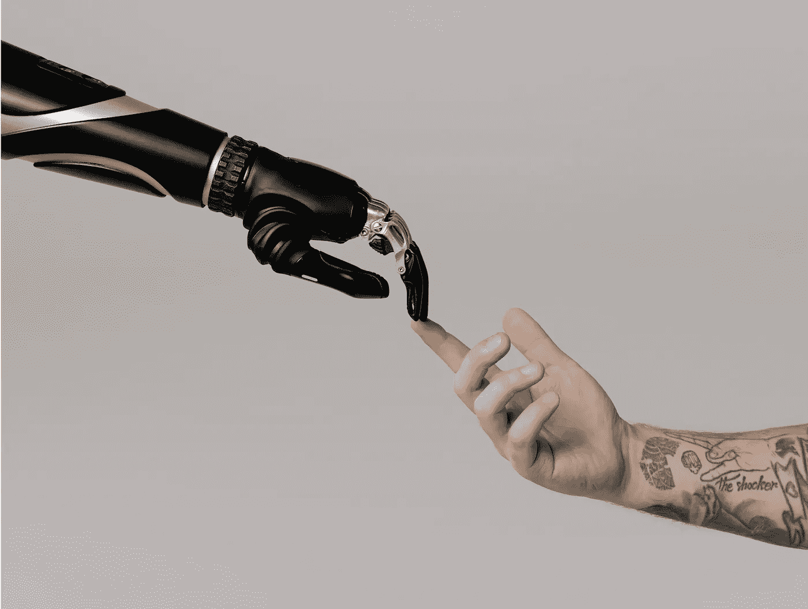

# 自由意志和人工智能(AGI)

> 原文：<https://towardsdatascience.com/free-will-artificial-general-intelligence-agi-c30169997f5e?source=collection_archive---------38----------------------->

## 关于人工智能的课程来自于关于我们大脑的课程。专注于自由意志的本质。

两年来，我一直试图通过冥想来训练我的大脑。对我来说，你能注意到大脑的*实际*工作方式不同于*感知的*工作方式的频率和容易程度是不寻常的。像在你的视野上叠加图像，注意到任意选择是如何做出的(它们出现了)，甚至是自我想象的负面情绪的短暂性质都可以很容易地挑战我们的现状。

[唤醒应用](https://wakingup.com/)有一个新的系列，简洁地描述了自由意志的短暂感觉。毫不奇怪，我们如何看待我们通过自己的主观经验创造的人工智能。也就是说:我们通过我们如何思考和看待世界来看待人工智能。我们的思想和景象并不完全反映现实，当你冥想和检查现实的本质时，你可以观察到的差距就是我们决定是否要向我们的机器创造灌输的差距。

最终，大脑的本质使其感觉像是有人类的感觉，这可能是硬连线在代码中的，以确定它如何成为一个人工智能。一些感觉在代码中设置起来更直观，一些代表了人工智能研究中的开放问题。在硬币的另一面，我们可以让没有承载或期望的人工智能感受到我们作为人类时经常体验到的任何感觉。在这篇文章中，我将带你看一下《自由意志》在山姆·哈里斯的 90 分钟课程，重点是它对人工智能的意义。

*   第四节 *1。原因&效果*， *2。没有思想者的思想*， *3。选择、理由、&知识*和 *4。爱&恨*与**创造**智能计算机系统关系最大，所以我会在那里花更多的时间。
*   最后三课 *5。罪名&刑罚*， *6。责任的悖论*和 *7。为什么做任何事？*根据这些心理结构，与伦理和功能社会的创建有更多的关系。这三个将不是关于创造人工智能，而是人工智能如何更好地融入这个社会。

在写这篇文章的时候，很多主题都提到了人工智能(AGI)和计算机意识。提出的观点是早期的探索，我怀疑随着我们了解更多，这些主题将被重新审视。

照片由来自 [Pexels](https://www.pexels.com/photo/four-rock-formation-668353/?utm_content=attributionCopyText&utm_medium=referral&utm_source=pexels) 的 [nicollazzi xiong](https://www.pexels.com/@nicollazzi-xiong-208366?utm_content=attributionCopyText&utm_medium=referral&utm_source=pexels) 拍摄。

# 预赛

我在这篇文章中频繁使用的一些术语可能有多种含义，但在这篇文章中，我认为它们是:

*   *冥想*:研究心灵本质的行为，通常通过安静地专注于意识的个别方面(比如呼吸)。
*   自由意志:主观感觉，你的决定、生理以及主要是你的自我感觉在某种程度上决定了你的行动。
*   *人工智能*:推理并与世界互动的智能体。

作为一个说明性的精神练习(冥想)，让你对自由意志的幻觉有所了解，请密切关注这项随意的任务，以及你的大脑是如何得出结论的:在过去的一个月里，你读过的最喜欢的文章是什么？

(停下来仔细想想发生了什么)

现在，想想另一篇文章。

你能控制想到哪些文章吗？这种感觉是，随机的建议似乎是你当前状态的结果。这是一个明显的例子，说明我们没有自由意志，实际上，我们欺骗自己的幻觉是一种幻觉，即自由意志的幻觉根本就存在。我绝不期望你在做了这些之后认为你是一个自治的实体，这可能只是启发性的，让你想要进一步调查。

# 自由意志幻觉的核心幻觉和欺骗我们的人工智能

仔细研究心灵的本质，显示出我们对于经验的主观力量。存在的主观性是我们的联系，我们制造的机器主要反映了这一概念。就像上面的例子一样，我们大脑中的幻觉实际上是存在自由意志的幻觉——也就是说，当我们仔细检查正在发生的事情时，自由就消失了。

考虑这些状态和普通操作对于在回路中使用强大的人工智能进行规划是至关重要的。现在，我将从 Sam 身上学到一些东西，以及我们可以从中学到什么。

# 第一课。因果关系

考虑电话响铃的原因——一些数字信号被传输到扬声器(在此之前还有许多数字信号),电振荡产生声波。电话铃响的原因可以有不同的解释(在工程链上)，人类的思维也存在同样的模糊性。不同之处在于:在人类的思维中，除了我们自己，我们不会真正考虑其他可能的原因。最终，人类大脑中的启动(一组神经元对刺激做出反应)和代码中的中断触发动作几乎没有区别。在对人脑的认识上，我们受到神经科学的限制，而在计算机上，我们已经消除了大部分捏造的不确定性。对一个系统的基本科学理解的差异并不排除不确定性在高层次上表现相同。

## 对人工智能的影响:改变软件中因果的概念

对于人工智能来说，接受事件的**原因**实际上会更容易——我们希望我们的代理人根据他们拥有的信息采取行动(除非我们添加更多抽象的幻觉)。 ***我们可以很容易地连线一个 AI，让它察觉到许多事件都是它自己造成的*** 。这将通过用外部程序更新它的先验(任何信念的分布)来完成，但是让计算机认为这是它自己的成果。

# 第二课。没有思考者的思考

我们有两种行动和精神调查的模式，自愿的和非自愿的——只有前者(自愿的)表示思想。如果你重新考虑预备课程中提出的关于选择的冥想练习，很容易证明认同思想不是自由意志。认同思想与其说是控制，不如说是注意(这是许多冥想练习的第一课之一)。短语*没有思考者的思考*指的是我们都经历过许多想法，但仔细观察，我们的意识中没有一个思考者(以思考者的形式，对出现的大部分信息做出反应和策划)。

## 对人工智能的影响:人工数据流的分级人工智能

我们*可以*让机器人真正以其思想真正**与思考者**相关联的方式行动，但我认为这混淆了直接计算的好处(在一些研究好奇心中)的功效。一个具体的组织可以是一个具有计算结构的人工智能，因此似乎有两个计算级别:一个是控制，一个是信息进展的环境——有点像一个具有独立多模态数据处理单元的 RL 循环(在这一点上，我很明显，我们没有术语来讨论这些东西看起来会是什么样子)。这种结构可以反映人类对思想者和意识的感知。

# 第三课。选择、理性和知识

没有自由意志，推理行为和知识的实质就会受到质疑。运气似乎是对随机性的心理反应，而不是真正的属性。据我所知，对目标的推理是一种自我价值的更新，而不是一种选择。最终的决定不会直接在你的控制之下。本质上，有些违背直觉，缺乏自由使得推理成为可能。这个世界反对自由选择，因为它们可能是错误的(就科学等法律而言)并会受到惩罚。真正的自由是认识到你不能控制先前认同的经验。

## 对人工智能的影响:操纵计算机与随机性的关系

人工智能可以对运气(随机性和不确定性)以及它如何与其智力结构相结合有不同的理解。这种更直接的人工智能方法利用了计算的优势，但如果我们寻求创造意识，拥有将命运与随机性联系在一起的人工智能可以提供强大的自我来源。就像自我意识一样，在我们目前如何看待人工智能的问题上，知识的表述似乎不是很实用，这让我认为这可能是最大的改进机会之一。

# 第四课。爱与恨

我们如何体验不同类型的情感，以及*为什么体验不同类型的情感，这种二分法是人类魅力的一部分。很难描述发生了什么，但我们都感觉到了。爱是一种不可思议的感觉，它看起来像是偶然发现的，而仇恨则让人难以置信地专注。爱是对人或事物的一种感觉(而不是他们如何做决定)，而仇恨是非常具体的自由意志和行动判断(认为他们应该采取不同的行动)。自由意志的争论从这里开始引入伦理讨论，考虑这样的场景，比如原谅那些被证明犯下滔天罪行的人，部分原因是退化的生物学，比如脑瘤。*

## 对人工智能的影响:更容易制造爱计算机

乍一看，很难制造出同样仇恨的人工智能。人工智能可以被制造成想要*优化*，但是真正的仇恨代表了一种复杂的“如果”( what if)思维结构。让我们为爱机器人的人敞开大门吧——当机器人完美地完成任务，成为更大系统的一部分时，我们就会爱上它。这两者都有将人类价值提取为数字近似值的复杂问题，但经过这次分析，我比我最初想象的更加乐观。

photo by[**cotton bro**](https://www.pexels.com/@cottonbro?utm_content=attributionCopyText&utm_medium=referral&utm_source=pexels)from[**Pexels**](https://www.pexels.com/photo/person-holding-black-and-silver-hand-tool-6153345/?utm_content=attributionCopyText&utm_medium=referral&utm_source=pexels)**。**

# 幻想、设计、陷阱

机器学习研究人员已经通过研究大脑的**结构**学到了很多东西。基于头脑的感知本性来设计系统要复杂得多，但我认为这能让我们更深刻地理解感觉聪明意味着什么。很可能我们设计的变得**普遍智能**的人工智能将*而不是*具有反映人类大脑的精神行为(注意:*这取决于 AGI 研究如何进行，全脑仿真是研究的一个选项，但这需要神经科学的巨大进步，所以有些人持怀疑态度)。*

我工作过的所有学习系统都形成了智能，作为探索和近似的迭代计算设备。对我来说，现在还不可能考虑体验这样一个系统的世界会是什么样子。

清楚地理解给予人工智能的计算、引用和开发的本质对于减轻任何潜在的危害是至关重要的。我会说，我们希望让我们的人工智能在上面讨论的大多数轴上明显非人类(人性往往意味着矛盾和不确定性，但也创造了爱的能力)，以便明确量化这些试剂的潜在有害影响。

我非常感兴趣的是，我们可以从我们的存在本质中学到什么，以及它如何影响我们构建的系统。在我的第一篇关于基于模型的强化学习的文章中，我讨论了它与大脑结构和心理规划的内在联系。如果你认为我错过了什么或者想讨论这个，请留下评论或者联系我。将来我可能会更详细地探索冥想和计算机智能之间的联系。这有点像我们如何创造一个自由意志机器人的建议可能会导致[意识](https://en.wikipedia.org/wiki/Consciousness)仿真。

现在谈谈自由意志课程的其余部分。

来源——作者(普莱西德湖)。

# 幻觉的含义

我们的社会实际上是在个人拥有自由意志的假设下构建的。当有更多的人工智能明显缺乏自由意志时，看看它们是否被永久地视为与人类不同的独立实体类型将是有趣的(至少在减轻风险方面，法律先例很难远离自由意志的概念)。人工智能可以潜在地教会我们一些事情，比如减少对通过生物机会危害社会的人的惩罚，而是消除危险。在经历了互联网的黄金时代后，我将关注的下一波浪潮是与人工智能的互动如何重构我们社会的习惯、文化和法律。

# 第五课。犯罪与惩罚

如果一个人在森林里被一只熊和一个人攻击，责备的反应会非常不同。会因为自由意志而更加憎恨那个男人。这种直觉相当于我们对有计划的惩罚的反应——那些有自由意志幻觉的人应该有更多的控制权。我们能学到的是消除社会保护彼此免于个人错误指责的责任的歧义，尤其是当我们知道生物结构的失败会导致人类的行为时。

注:*有趣的是，律师在中世纪曾代表动物！老鼠因为吃猫可以上法庭，陪审团被告知老鼠太忙无法出席(* [*例*](https://slate.com/human-interest/2013/02/medieval-animal-trials-why-theyre-not-quite-as-crazy-as-they-sound.html#:~:text=Such%20a%20case%20might%20seem,they%20were%20treated%20as%20persons.) *，* [*例 2*](https://www.wired.com/2014/09/fantastically-wrong-europes-insane-history-putting-animals-trial-executing/) *)！*

# 第六课。责任的悖论

从自由意志的角度来看，真正的随机会支持个人控制。跟随你的道路的行动不那么自由；我们更偏向。对于一个职业高尔夫球手来说，错过一次推杆更令人震惊，因为他们的线路肯定出了什么问题——但有一个原因是可以辨别的。理论上，打高尔夫球的人应该承担更少的责任，因为它看起来更随机。

现在，计算机计算似乎与神经计算完全不同，但是随着大脑模型的改进，同样程度的决定论也很容易被观察到。大脑中事实的主观性(人类偏见)允许自由意志的主观性，但原因不会改变预先设置的神经组成。没有科学证据反驳我们在相同的神经状态和环境下会做出不同的决定；*我们生命中的每一刻都是* ***起因*** 。

如果人们不那么负责任，如果这种邪恶的疗法是有疗效的，那我们把它给谁呢？有没有我们认为“太邪恶”而无法治愈的人？

# 第七课。为什么做任何事？

结论回答了这个问题:如果我们没有自由意志，我为什么要做任何事情？没有自由意志，我们意识到我们是环境和我们相处的人的产物。没有自由意志，我们就是集体的一部分——一个共同更新每个人的集体。这一群人可以将社会最佳利益与过失分开，并可以驱散骄傲和羞耻的观念(通过意识到它们是有意识的构造)。更新是我们大脑和我们经验的生物学先验。

# 机器人是集体的一部分

仍然做任何事情的原因是因为你的行为创造了你周围的人。这成为了一个富有同情心的反馈循环，你让你周围的人变得有能力，他们也让你变得有能力。关键是，我们是集体的一部分，没有自由意志，许多*是*的负面因素就不存在。

通过探索这一点，我觉得人工智能可能比个人更符合集体观念。如果这是真的，这将是数字世界的一股有趣的力量。

如果你想支持这个:赞，评论，或者[伸手](https://twitter.com/natolambert)！

*像这样？原来是贴在我的* [*简讯* ***民主化自动化***](https://democraticrobots.substack.com/) *上的。订阅❤.*

 [## 自动化大众化

### 一个关于机器人和人工智能的博客，让它们对每个人都有益，以及即将到来的自动化浪潮…

robotic.substack.com](https://robotic.substack.com/)