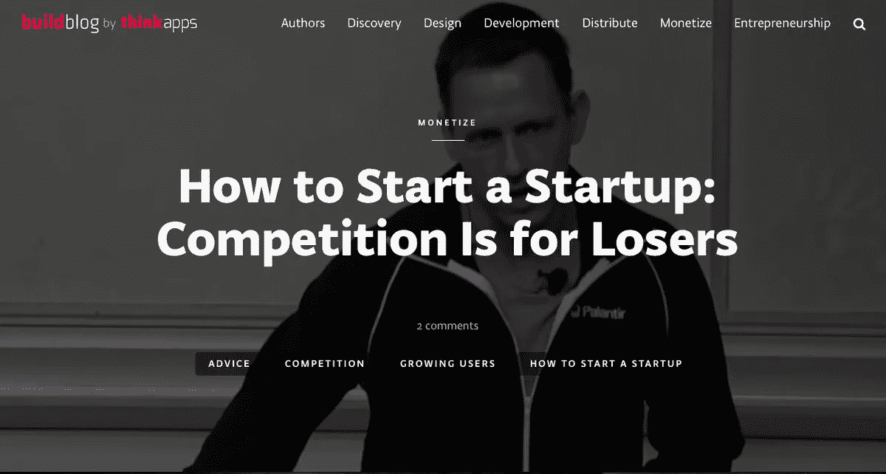
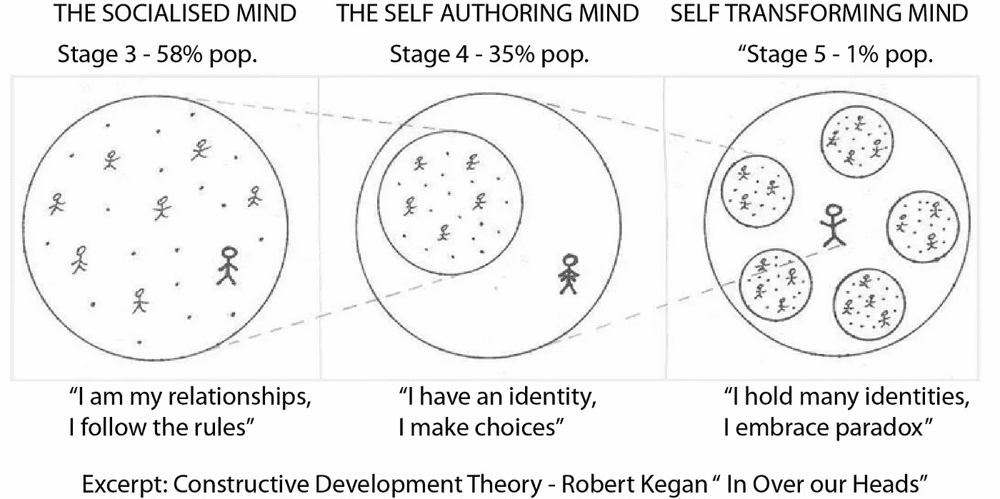
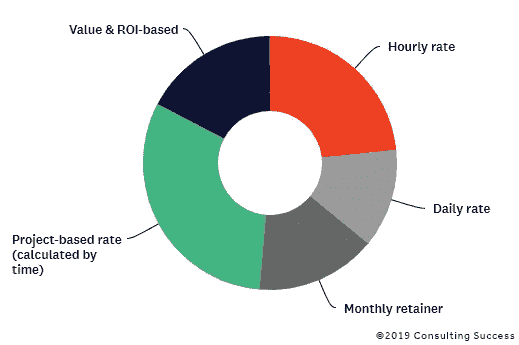
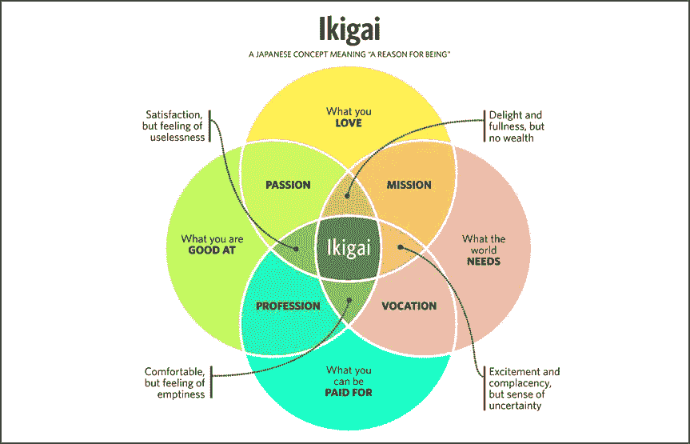

# 自由数据科学家？彻底忘掉“2021 年学习指南”

> 原文：<https://towardsdatascience.com/freelance-data-scientist-forget-about-2021-study-guides-once-and-for-all-18508fe0869f?source=collection_archive---------21----------------------->

## 学习新的库还是最终做客户想要的？

## 独立专家的战略和战术

插图来自[上卷](https://unsplash.com/photos/4U1VXdNso8w)

远程工作是当今的一种新常态。离开办公室的头几个月相当有趣，但那份工作还是那份工作:依赖固定的薪水/时薪，有限的机会，失去温暖工作的风险。我们很多人都尝试过单干，在网上寻找客户，学习新的热门技能。然而，你可能会注意到，你好不容易征服的新客户不会为 Udemy 证书和 Tensorflow 技能付钱——他们只想要*尽可能便宜的两周内 99%准确的解决方案。别忘了还有那个时间追踪"*。因此，对你来说——**更多的压力，更少的钱，更少的满足感** **来自所谓的独立、创造性和鼓舞人心的工作**。在这篇文章中，我想总结一下我在维罗纳大学会议上详细谈到的实用见解，它将帮助你建立一个独立的专家职业生涯。另外，我邀请你参加下周的俱乐部聊天，我们可以一起更详细地讨论我们的经历，并互相帮助:

 [## 🧑数据科学🏽‍💻当自由职业者🌴快乐的客户💰

### 讨论作为数据科学家的独立职业以及如何为您的客户提供最大价值🚀🚀🚀没有会所…

www.joinclubhouse.com](https://www.joinclubhouse.com/event/Md0N42wq) 

# 客户真正想从你这里得到什么

商业的建立是为了满足多种目标:创收、社会和环境影响、关系(用美元衡量)、创造就业机会、空气质量等。为了最大限度地提高上述数字，创始人和经理们创建了这样一种结构，在这种结构中，每个人都有自己的位置来完成合格的工作。作为一名员工，你产生了这个结果的一部分(在我们的例子中是技术)，但有时结构并没有像预期的那样做。

> 作为一名独立专家，你不会与工资单上符合该职能的受雇数据科学家竞争。那你为什么一直做和他们一样的事？

这就是使用外部帮助的地方，提供资金、关系、专业知识或任何其他资源**来实现结果**。在这里，你作为**独立专家**可以介入**提高数字，因为系统不能**。而一个体制内的被雇佣者和独立专家的区别在于工作的侧重点:*两者都可以写代码*，但是第一个向直接经理汇报通过 CI/CD 测试，18:00 离职，第二个向所有者汇报收入的增长，并对其负责。你想成为哪一个？你现在在做什么？

# 改变你的心态

图片来自[http://think apps . com/blog/post-launch/how-start-startup-competition-losers/](http://thinkapps.com/blog/post-launch/how-start-startup-competition-losers/)

听起来很吓人，对吧？如果你只是一个技术专家，你如何承诺业务增长？有三种典型的心理障碍会导致你和客户都不满意的结果:

*   **“我不够好”**。如果你用 FAANG 的标准来比较自己，他们有从 1 到 10 的等级——也许吧。但是，只有当你的目标是有一份稳定的工资单，并且是系统中的一个功能时，这才重要。从技术角度来看，你实际上可以为 4/10 的客户提供更多价值，但与拥有 10/10 的技术技能、4/10 的业务知识和 4/10 的独特性的人相比，你了解 10/10 的客户业务并拥有 10/10 的独特价值主张。

插图来自[https://libraryofconcepts . WordPress . com/2017/10/29/当今人类发展的三个最相关阶段-kegan-13/](https://libraryofconcepts.wordpress.com/2017/10/29/three-most-relevant-stages-of-human-development-nowadays-kegan-13/) 。雇员通常坐在“社会化思维”的队列中，自雇者是“自我创作”，企业家是“自我改造”。这个例子显示了思维上的差异:雇员希望符合群体规范，个体户希望与众不同，企业家了解他们所有人并把他们联系起来

*   **“不敢多问”**。忘掉金钱谈判中的情绪——这完全是关于投资回报的。如果你能在一个月内为你的客户赚到 100，000 美元，对客户来说要价 20，000 美元是一笔划算的交易:5 倍的投资！谁在乎在你的国家一个数据科学家的月薪是 3000 美元——他们满足于做一个功能，你决定提供结果！

来自[https://www.consultingsuccess.com/consulting-fees](https://www.consultingsuccess.com/consulting-fees)的插图显示，当然还有其他更经典的顾问收费财务模型，但我强烈建议你成为“基于价值和投资回报率”的那一组。这是顶级的！

*   **“我会失去我现在所拥有的”**。最常见也是最不相关的拦截器。如果你在做你喜欢的事情，并且做得很好，你可以每周工作 10-20 小时来取得成果。没有必要为了成为独立专家而辞职。法律上这也是不被禁止的(但是检查你的合同和当地法律)。你有晚上和周末的时间和新客户一起工作，之后，你可以决定哪种生活方式更适合你和你最亲近的人。

你是否已经看到你需要关注什么了？是网上全新的 ML 课程还是别的？让我知道:)

# 改变你的战略和战术

## 满足于你擅长的事情

有不同的技巧可以帮助你理解自己独特的竞争优势(通常被无耻地宣传为有目的的探索):

来自[https://zek luu . com/en/self-development-iki Gai-El-sentido-de-la-vida/](https://zekluu.com/en/self-development-ikigai-el-sentido-de-la-vida/)的插图显示，为了避免竞争并建立一个独特的、独立于其他技能和业务的平台，你需要在你的才能(你所热爱的)、你所训练的技能、经济价值和世界的要求的交叉点上努力

简而言之，你应该**利用你的才能**(而不是社会教条行为)**在一个**高薪且有影响力的专业领域使用你擅长的技能**(再次强调，而不是被认为很酷的东西**(而不是在别人告诉你的地方工作)。关于这个话题，我写了一整篇文章，请大家看看:

 [## 从开发商到企业家:你的上升之路是什么？

### 分解世界各地的技术摇滚明星和年轻企业家的职业生涯

medium.com](https://medium.com/@alexrachnog/from-developer-to-entrepreneur-what-is-your-way-up-497fd5512b9c) 

## 利用你的网络

这仍然是获得好客户的最简单的方法，几乎没有人使用这种方法，因为“这很酷”,而不是与你已经认识的人建立关系。你的家人、学校和大学的同学、老师、同事和老板、邻居和熟人——他们都认识认识其他人的人。开始对他们的生活感兴趣，帮助他们，告诉他们你的新的独特主张。如果你做的事情明显是你(为他人)擅长的，并且是受欢迎的和有影响力的领域，你会更快地得到你的项目，并且会和欣赏它并信任你的人一起做完全适合你的事情。

## 公开展示你的专业技能

我知道你的关系网可能是有限的，或者不包括你想工作的地区的人。怎么去？**开始对网上陌生人有用！**正如我们所商定的，你在人才、技能和业务领域的独特交汇处工作，因此开始帮助他人回答专业社区中的问题，参与讨论和在线会议，分析行业新闻，展示见解和案例研究。Hubspot 的销售之王也同意这一点(查看“权威消息”):

 [## 在专业服务行业中使用内容营销

### 如果您的企业提供专业的内容营销服务，那么您的内容营销策略应该有所不同

blog.hubspot.com](https://blog.hubspot.com/marketing/using-content-marketing-professional-services) 

在媒体上积极主动(选择你喜欢的一个)，你的网络会爆炸。

## 衡量你自己和你的努力

作为一名数据科学家，你明白，如果你根据垃圾数据进行建模和决策，结果将会是这样。衡量你的财务(甚至用 Excel)，你的工作努力(用 Toggle 之类的东西)，你的内容的参与度，作为一个最小的活动集。我建议将客观的关键结果作为设定目标和衡量后续进展的方法:

 [## 回复:工作指南:用 OKRs 设定目标

### 研究表明，致力于一个目标有助于提高员工的绩效。但更具体地说，研究…

rework.withgoogle.com](https://rework.withgoogle.com/guides/set-goals-with-okrs/steps/introduction/) 

现在你是一家单人企业，所以你集所有关键“角色”于一身:首席执行官、首席财务官、首席技术官、CMO。你在这些方向上所做的一切都必须被定期跟踪和反思，以便改进。

## 承担责任并寻求反馈

现在我们开始讨论你需要学习什么，而不是技术指南。问问你的客户哪些事情进展顺利，哪些事情不太规律，并专注于此！你的成功将只取决于你所帮助的人的满意度，这通常表现为节省或赢得的时间、金钱、健康、信息、关系和机会。对这些结果负责并关注它们，而不是你写的代码，你会发现你真正需要学习的包括:

*   **业务模式和流程**:因为你需要衡量你对客户业务的影响
*   **销售和营销**:因为你需要推销你独特的专业知识
*   **沟通与谈判**:因为你需要了解你的客户，建立双赢的关系

稍后，你会意识到所有的编码部分都可以由其他人来完成，这些人实际上只专注于此并**彻底地阅读每一篇“202x 数据科学指南”**，但这是另一篇博文的故事:)

# 结论

事实上，我这里有一个稍微长一点的演示，包含了一点更广泛的经济学和社会学观点，但是它的要点你已经在这篇文章中读到了:

我希望这篇文章可以向您展示，对于独立/自由职业的数据科学专家来说，技术技能、热门课程和书籍是很好的选择，但对于希望在公司内部建立职业生涯的人来说，这些并不重要。你可以用线性回归做更多的影响，知道在哪里应用它，而不是做非常复杂的事情，最终可能被遗忘。你可以选择自己的生活方式和人际关系。

我想再次提醒你下周俱乐部会所的谈话。我们人不多，团结互助吧:)

 [## 🧑数据科学🏽‍💻当自由职业者🌴快乐的客户💰

### 讨论作为数据科学家的独立职业以及如何为您的客户提供最大价值🚀🚀🚀没有会所…

www.joinclubhouse.com](https://www.joinclubhouse.com/event/Md0N42wq) 

**附言**
如果你觉得这个内容有用，有观点，可以[在 Bitclout 上支持我](https://bitclout.com/u/alexrachnog)。你也可以在[脸书](https://www.facebook.com/rachnogstyle.blog)博客或 [LinkedIn](https://www.linkedin.com/in/alexandr-honchar-4423b962/) 上与我联系，在那里我会定期发布一些对媒体来说太短的人工智能文章或新闻，并在 [Instagram](http://instagram.com/rachnogstyle) 上发布一些更私人的内容。如果你期待成为一名人工智能企业家并解决具有挑战性的问题，ping [神经元实验室](http://neurons-lab.com/)，我们正在与顶级人工智能自由职业者合作:)