# 频繁模式挖掘、关联和相关性

> 原文：<https://towardsdatascience.com/frequent-pattern-mining-association-and-correlations-8fa9f80c22ef?source=collection_archive---------3----------------------->

## 利用 Apriori 算法识别数据集的频繁模式并通过 Weka 软件关联数据集


马文·迈耶在 [Unsplash](https://unsplash.com/s/photos/technology?utm_source=unsplash&utm_medium=referral&utm_content=creditCopyText) 上的照片

在数据挖掘中，频繁模式挖掘是一个主要关注点，因为它在关联和相关性中起着重要作用。首先要知道什么是频繁模式？

> 频繁模式是在数据集中频繁出现的模式。通过识别频繁模式，我们可以一起观察强相关的项目，并容易地识别它们之间的相似特征和关联。通过进行频繁的模式挖掘，它导致进一步的分析，如聚类、分类和其他数据挖掘任务。

在开始挖掘频繁模式之前，我们应该关注“支持度”和“置信度”这两个术语，因为它们可以提供一种衡量关联规则对于特定数据集是否合格的方法。

**支持**:给定规则在被挖掘的数据库中出现的频率

置信度:给定规则在实践中被证明为真的次数

让我们通过一个样本数据集来练习一下；

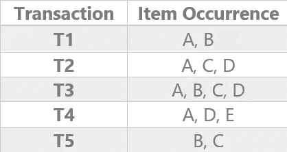

作者图片


支持计算-按作者分类的图像

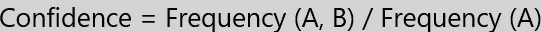

可信度计算-按作者排序的图像

示例:一个可能的关联规则是 A => D

交易总数(N) = 5

Frequency(A，D)= > A 和 D 的实例总数为 3

频率(A)= > A 中出现的总次数

支持= 3 / 5

信心= 3 / 4

在对支持度和置信度这两个术语有了清晰的概念之后，我们可以转向频繁模式挖掘。频繁模式挖掘，有两类要考虑，

1.  利用候选生成挖掘频繁模式
2.  无候选生成的频繁模式挖掘

本文主要研究利用关联挖掘中常用的 Apriori 算法挖掘频繁模式并生成候选模式。让我们用一个例子来理解 Apriori 算法，它将帮助你清楚地理解它背后的概念。让我们考虑上面提到的样本数据集，假设**最小支持度=2** 。

1.  **生成候选集 1，进行第一次扫描，生成一个项目集**

在这一阶段，我们获得样本数据集，并对每个个体进行计数，得到频繁项集 1(K = 1)。

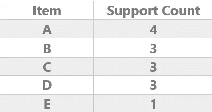

候选集 1

“候选集 1”图显示了单个项目的支持计数。因此，最小支持度是 2，并且基于此，项目 E 将作为不频繁项目(不合格)从候选集合 1 中移除。

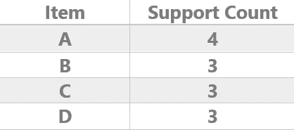

第一次扫描的频繁项目集

基于最小支持值的频繁项集将在图“第一次扫描的频繁项集”下显示为“**一项集**”。

**2。生成候选集 2，进行第二次扫描并生成第二个项目集**

通过这一步，您创建了频繁集 2 (K =2 ),并获得了它们的每个支持计数。

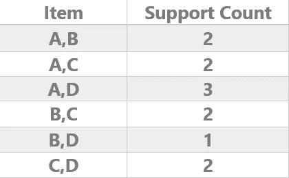

候选集 2

“候选集 2”图形通过连接候选集 1 生成，并取相关出现的频率。因此最小支持度是 2，项目集 B，D 将作为非频繁项目集从候选集 2 中移除。

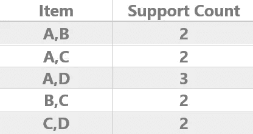

第二次扫描的频繁项目集

“第二次扫描的频繁项目集”是基于最小支持值的频繁项目集，它将生成“**第二个项目集**”。

**3。生成候选集 3，进行第三次扫描并生成第三个项目集**

在这个迭代中，创建频繁集 3 (K = 3)并计算支持度。然后与来自候选集合 3 的最小支持值进行比较。

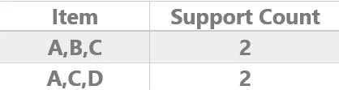

候选集 3

如您所见，我们将候选集 3 与生成的第三个项目集的最小支持值进行了比较。第三次扫描的频繁集与上述相同。

**4。生成候选集 4，进行第四次扫描并生成第四个项目集**

通过考虑频繁集，我们可以通过连接候选集 3 来生成候选集 4。那么可能的候选集合 4 是；最小支持度小于 2 的[A，B，C，D]。因此我们必须从这里停止计算，因为我们不能再进行迭代了。因此，对于上述数据集，频繁模式是**【A，B，C】**和**【A，C，D】**。

通过考虑频繁集之一为{A，B，C}和如下可能的关联规则；

1.  A => B，C
2.  a，B => C
3.  a，C => B
4.  B => A，C
5.  b，C => A
6.  C => A，B

然后我们假设最小置信度= 50%,并计算每个可能关联规则的置信度，然后我们可以识别最小置信度小于 50%的不合格关联规则。那么剩下的置信度大于或等于 50%的关联规则就是合格规则。

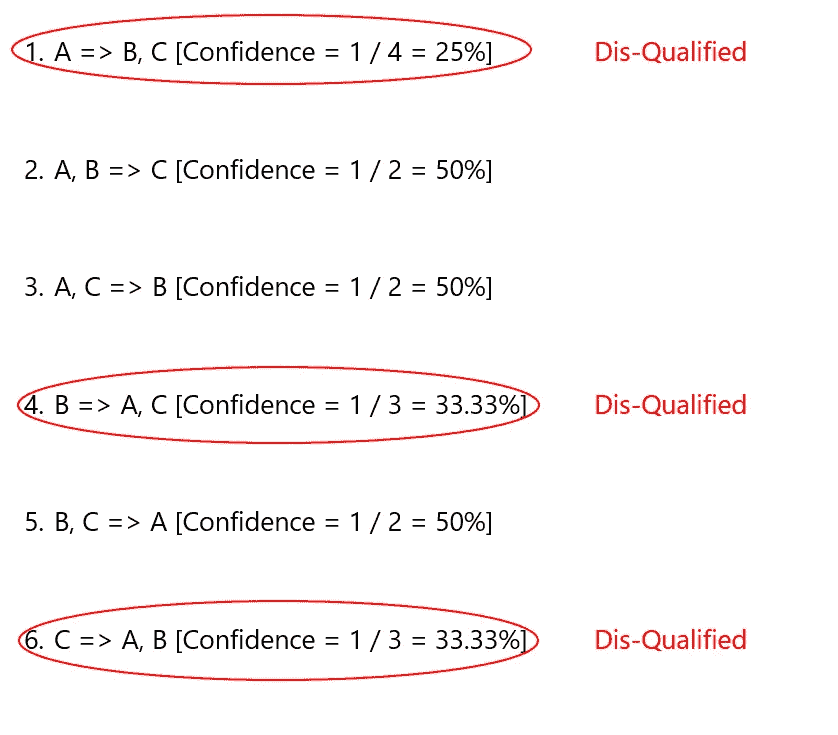

作者图片

正如你在 Apriori 算法中看到的，每一步它都在生成候选项，当候选项列表变大时，它会花费很多时间。

## 下面是 Apriori 算法的伪代码；

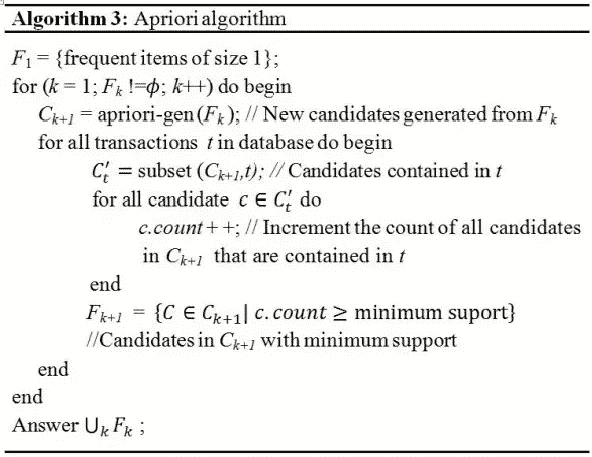

图片来自[关于用于优化数据挖掘过程的算法的研究问题](https://www.researchgate.net/publication/227487186_RESEARCH_ISSUES_CONCERNING_ALGORITHMS_USED_FOR_OPTIMIZING_THE_DATA_MINING_PROCESS) (2010)

现在让我们关注如何使用 [Weka](https://www.tutorialspoint.com/weka/what_is_weka.htm) 进行关联。您可以遵循以下步骤。

1.  打开 Weka 软件，点击“探索”按钮。

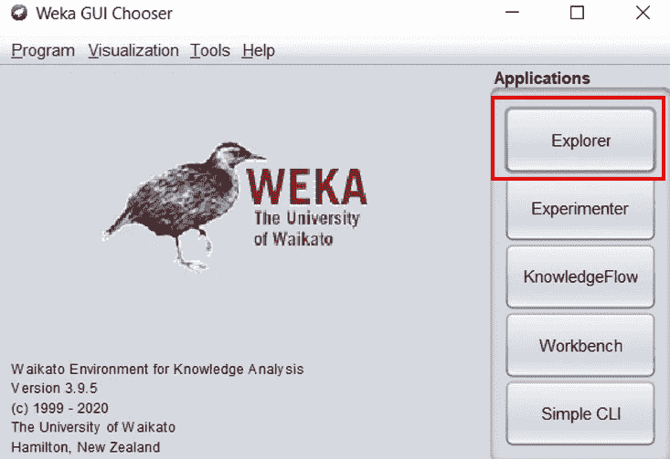

Weka 初始图形用户界面—作者图片

点击“浏览器”按钮后，你会看到一个名为“Weka 浏览器”的新窗口。

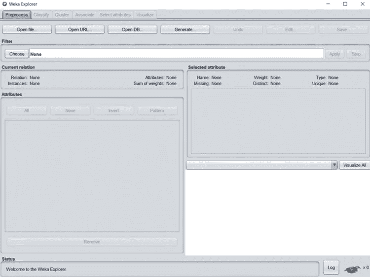

Weka Explorer —作者图片

2.打开首选数据集

```
Weka Explorer > Preprocess > Open File
```

按照上面的顺序，您可以通过选择一个内置数据集或任何想要应用于 Apriori 算法的数据集来加载数据集。

打开选定的文件后，您可以在预处理选项卡下看到属性和其他统计信息。然后，您可以单击“编辑”按钮，在查看器中打开当前数据集进行编辑。

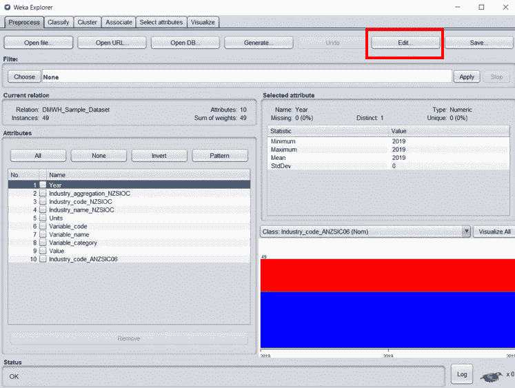

预处理选项卡中的编辑按钮—按作者排序的图像

*需要注意的是，您的数据集包括数值数据，您可以使用“预处理”选项卡下名为“离散化”的过滤器将其离散化*

3.转到“关联”选项卡，使用“选择”按钮选择“先验”。

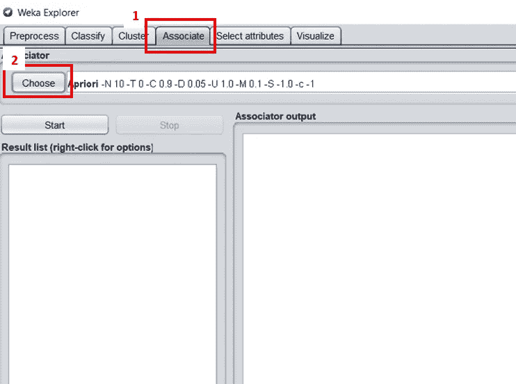

选择 Apriori 算法—作者图片

4.左键点击先验并选择“显示属性”

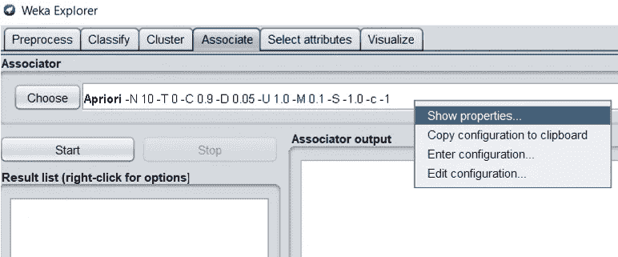

显示属性-按作者显示图像

5.自定义算法属性，然后点击“保存”

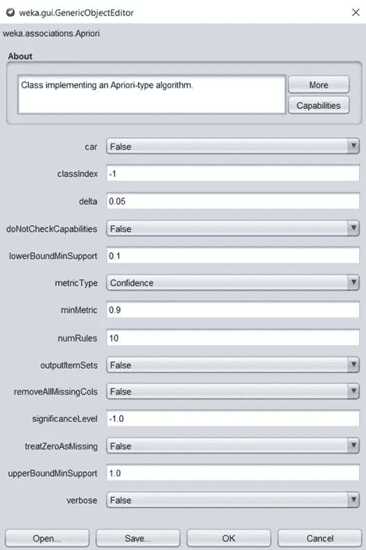

配置算法属性-按作者排列的图像

例如，在关联完成后，我们可以更改您从数据集中获得的规则数量。

6.点击“开始”按钮

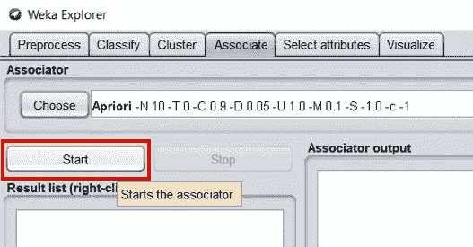

作者图片

T4:请注意，如果没有选择进行关联的离散数据，则不能启用“开始”按钮，这一点很重要

7.观察结果

Associator 输出如下，在这种情况下，算法已经为所提供的数据集找到了 10 个最佳规则。

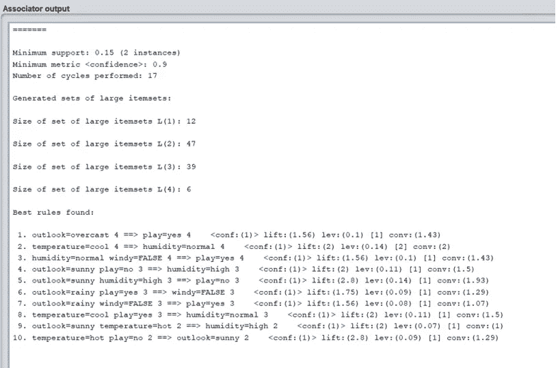

应用关联后的最终结果—图片由作者提供

## 结论

这篇文章提供了一些你可能知道的关于频繁模式挖掘、Apriori 算法、支持度、置信度以及如何通过 Weka 软件进行关联的事实。希望这篇文章能帮助你提高对上述几点的认识。

感谢您的阅读🤗！！！！！

参考

[1]扬·伦古，亚历山大·皮尔詹，[关于用于优化数据挖掘过程的算法的研究问题](https://www.researchgate.net/publication/227487186_RESEARCH_ISSUES_CONCERNING_ALGORITHMS_USED_FOR_OPTIMIZING_THE_DATA_MINING_PROCESS) (2010)