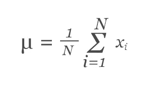
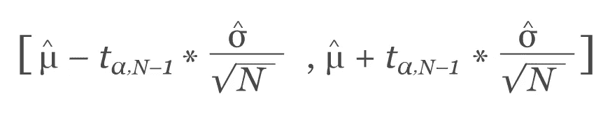
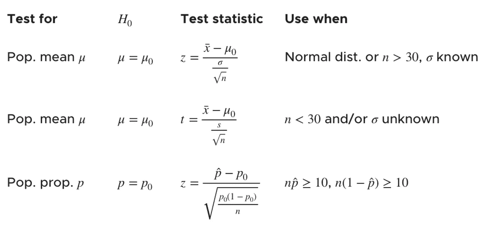

# Frequentist A/B 测试说明

> 原文：<https://towardsdatascience.com/frequentist-a-b-testing-explained-90b9ce8c28b9?source=collection_archive---------24----------------------->

## 本文将解释 A/B 测试的 frequentist 方法，并提供一个何时以及如何使用它的示例代码

图片由[飞溅](https://unsplash.com/photos/JVD3XPqjLaQ)中的[杰森·登特](https://unsplash.com/@jdent)

A/B 测试通常用于所有行业，以在业务的不同方面做出决策。从撰写电子邮件，到选择登录页面，实施特定的功能设计，A/B 测试可用于根据统计分析做出最佳决策。本文将涵盖 A/B 测试的 frequentist 方法的基础，并概述如何通过 A/B 测试得出决策的示例。我还将为一个特定的示例提供代码的相关 Python 实现。

**目录**

*   什么是 A/B 测试
*   频率主义方法
    -零&替代假设
    -样本均值估计
    -置信区间
    -检验统计量
    - P 值
*   例子
*   结束语
*   资源

# **什么是 A/B 测试**

推断统计学通常用于根据对总体样本的观察来推断总体的某些情况。A/B 测试是推理统计学在研究用户体验中的应用。它由 A 和 B 两个变量的随机实验组成[1]。一般来说，通过测试每个变体的用户响应，可以找到统计证据证明一个变体比另一个更好，或者你可以得出结论，选择 1 而不是另一个没有统计学意义。一个公司必须进行 A/B 测试的常见应用将是做出决定来提高他们的用户的转化率，提高他们的产品的适销性，增加他们的日常活跃用户，等等。

# 频繁主义方法

这是更传统的统计推断方法，通常在大学的基础统计学课程中介绍。这种方法的简单概述可以是以下方式。

1.  确定无效假设和替代假设
    - **无效假设**:指定人群之间没有显著差异，任何观察到的差异都是由于采样或实验误差造成的。
    - **替代假设**:与原假设相反的假设
2.  计算样本量以达到统计显著性(通常为 95%)
3.  计算测试统计数据，并将其映射到 p 值
4.  根据 p 值是否小于/大于 p 临界值，接受或拒绝零假设

## **无效&替代假设**

确定要测试的假设通常是通过你给定问题的领域知识。零假设通常是关于被认为是真实的总体的陈述。替代假设是与原假设相反的陈述。一个简单的例子可以概括在下面的场景中；你想通过增加一个独特的功能来提高用户访问你网站的转化率。无效假设是，在网站上添加这一独特的功能不会对转化率产生影响。另一个假设是，添加这个新功能会影响转化率。

## **样本均值估计值**

一组观察值的样本均值估计实质上是总体均值的估计[2]。它可以用下面的公式表示:

其中 N 代表样本中的项目总数，xi 代表事件发生的次数(图片由[西瓦·加比](https://www.dynamicyield.com/lesson/frequentists-approach-to-ab-testing/)【3】提供)

在理想情况下，我们希望方差(A 和 B)的样本均值估计值之间的差值较高。两者之间的差异越大，表明测试统计数据之间的差距越大，这意味着变量之间会有明显的赢家。

## **置信区间**

置信区间是这样定义的值的范围，使得参数值有一个特定的概率位于其中。它可以用下面的公式来概括:

u 代表样本均值估计值，t 是置信水平值，sigma 是样本标准差，N 是样本大小(图片由 [Siva Gabbi](https://www.dynamicyield.com/lesson/frequentists-approach-to-ab-testing/) 提供【3】)

## **测试统计**

检验统计量是正态分布上的一个点值，它显示了检验统计量与平均值的差距(以标准偏差的数量表示)。基于样本大小和其他因素，有各种各样的检验统计公式。下图中可以看到该公式的一些变体。

图片来自[克里斯塔·金](https://www.kristakingmath.com/blog/test-statistics-for-means-and-proportions)【6】

根据测试统计产生的值，可以将测试统计映射到 p 值，并根据 p 值是高于还是低于 p 临界值来接受或拒绝假设。

## **P 值**

在统计学中，*p*-值是零假设(被测试的理论是错误的)给出的特定实验结果发生的概率。*p*——值也叫概率值。如果*p*-值很低，零假设不太可能，并且该实验作为不同理论的证据具有统计学意义[4]。在许多领域，一个实验必须有一个小于 0.05 的*p*-值，才能被认为是替代假设的证据。简而言之，低 p 值意味着零假设为假的可能性更大。如上所述，一旦确定了 p 值，解释结果就相当简单了。

# 例子

一家大型银行的抵押贷款部门对首次借款者的贷款性质感兴趣。这些信息将用于定制他们的营销策略[5]。他们认为，50%的首次借款人会比其他借款人获得更少的贷款。他们进行假设检验，以确定该百分比是否与 50%相同或不同。他们对 100 名首次借款人进行了抽样调查，发现其中 53 笔贷款的规模小于其他借款人。对于假设检验，他们选择 5%的显著性水平。

**零假设** : p = 0.5
**备选假设** : p！= 0.5

这将作为双尾测试运行。

假设我们的显著性水平是 5%,并且这是一个双尾检验，我们的置信区间将是 1–0.05/2 = 0.975。通过运行上面的代码，您将得到 p 临界值 1.96

根据上面的代码，我们注意到测试统计量是 0.6。这仅仅是零的标准正态分布的平均值。就标准差而言，样本比例和假设比例实际上没有区别。

检验统计量在临界值内，因此我们不能拒绝零假设。这意味着，在 95%的显著性水平上，我们不能拒绝零假设，即 50%的首次借款人拥有与其他借款人相同规模的贷款

# 结束语

总之，A/B 测试的频率主义方法用于根据结果的统计显著性做出有利于两个变量 A 或 B 之一的决定。这是通过识别与测试相关的无效和替代假设、识别样本大小和计算某个置信区间的测试统计来完成的。一旦获得了检验统计量，我们就可以确定 P 值，并得出我们是接受还是拒绝零假设的结论。

# 资源

*   [1][https://en.wikipedia.org/wiki/A/B_testing](https://en.wikipedia.org/wiki/A/B_testing)
*   [2][http://www . stat . Yale . edu/Courses/1997-98/101/samp Mn . htm #:~:text = The % 20 sample %20mean%20 from % 20a，estimate % 20of % 20the %人口% 20 mean % 20。&text = For % 20 example % 2C % 20 假设%20the%20random，(70%2C5))。](http://www.stat.yale.edu/Courses/1997-98/101/sampmn.htm#:~:text=The%20sample%20mean%20from%20a,estimate%20of%20the%20population%20mean%20.&text=For%20example%2C%20suppose%20the%20random,(70%2C5)).)
*   [3][https://www . dynamic field . com/lesson/frequentists-approach-to-ab-testing/](https://www.dynamicyield.com/lesson/frequentists-approach-to-ab-testing/)
*   [4]https://simple.wikipedia.org/wiki/P-value
*   [5][https://opentextbc . ca/introbusinessstatopenstax/chapter/full-hypothesis-test-examples/](https://opentextbc.ca/introbusinessstatopenstax/chapter/full-hypothesis-test-examples/)
*   [6][https://www . kristakingmath . com/blog/test-statistics-for-means-and-proportions](https://www.kristakingmath.com/blog/test-statistics-for-means-and-proportions)

如果你喜欢读这篇文章，下面是我写的一些你可能也会喜欢的文章:

 [## Word2Vec 解释道

### 解释 Word2Vec 的直观性&用 Python 实现它

towardsdatascience.com](/word2vec-explained-49c52b4ccb71)  [## 贝叶斯 A/B 测试解释

towardsdatascience.com](/bayesian-a-b-testing-explained-344a6df88c1a)  [## 推荐系统解释

### 用 Python 解释和实现基于内容的协同过滤和混合推荐系统

towardsdatascience.com](/recommendation-systems-explained-a42fc60591ed)  [## 用 Jaro-Winkler 和 PageRank 实现 Python 中的文本摘要

### 用 Jaro-Winkler 和 PageRank 构建一个文本摘要器

towardsdatascience.com](/text-summarization-in-python-with-jaro-winkler-and-pagerank-72d693da94e8)  [## 使用 Node2Vec 的链接预测推荐引擎

### 使用节点嵌入进行链路预测

towardsdatascience.com](/link-prediction-recommendation-engines-with-node2vec-c97c429351a8)  [## 带重启的随机漫步解释

### 理解带重启的随机游走算法及其在 Python 中的相关实现

towardsdatascience.com](/random-walks-with-restart-explained-77c3fe216bca)  [## 马尔可夫链解释道

### 在本文中，我将解释并提供马尔可夫链的 python 实现。这篇文章不会是一篇深刻的…

towardsdatascience.com](/markov-chain-explained-210581d7a4a9)  [## 蒙特卡罗方法解释

### 在这篇文章中，我将向你介绍、解释和实现蒙特卡罗方法。这种模拟方法是一种…

towardsdatascience.com](/monte-carlo-method-explained-8635edf2cf58)