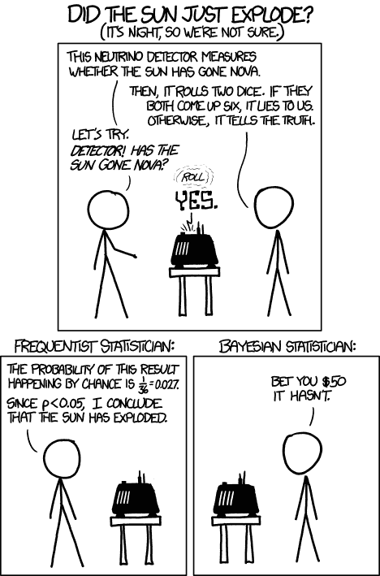

# 频繁主义者和贝叶斯推理

> 原文：<https://towardsdatascience.com/frequentist-and-bayesian-inference-83af2595f172?source=collection_archive---------9----------------------->

统计在不同的情况下有不同的用途。例如，描述统计学是一个分支，处理汇总现有的数据样本。描述统计学处理的是样本本身——不需要任何推断。然而，在现实世界中，我们必须经常解决的一个更具挑战性的问题是使用样本来推断样本所来自的*人群*的一些情况。例如，假设您掷骰子 10 次，并看到以下结果:

4 5 2 6 1 5 6 5 3 1

描述性统计可以告诉你，被滚过三次，5 就是你的样本的“众数”。但这可能还不够。我们可能会问这样一个问题“这是一个公平的死亡吗？”试着根据我们看到的滚动骰子有限次的例子来回答这个问题。回答这类问题是推理统计学的工作。

然而，推理统计学有两个对立的分支，试图使用不同的假设、理论基础和某种程度上的哲学信念来回答这些问题:频率主义统计学和贝叶斯统计学。这篇文章旨在解释这两个分支，以及这两个分支之间争论的主要来源。

## 频繁推理

频率主义统计学主要是在 20 世纪发展起来的，并逐渐成为当时占主导地位的统计范式。直到今天，它仍然是科学文献中使用的更流行的方法——我在我的[上一篇文章](/p-values-and-when-not-to-use-them-92cab8a86304)中描述的概念，如 p 值和置信区间属于频率主义范式。

其核心是，frequentist 统计是关于可重复性和收集更多的数据。概率的频率主义解释是可重复实验的长期频率。例如，假设一枚硬币正面落地的概率为 0.5，这意味着如果我们抛硬币足够多次，我们将有 50%的机会看到正面。

根据这个定义，你不能真正定义不可重复事件的概率。例如，在 2018 年国际足联世界杯之前，假设你在某处读到巴西赢得比赛的概率是 14%。这个概率真的不能用纯粹的频率主义者的解释来解释，因为实验是不可重复的！2018 年世界杯只会发生一次，不可能在完全相同的条件、球员和之前的事件下重复完全相同的实验。

根据 frequentist 推论，我们得出的概率估计中的任何不确定性都被认为是由于抽样误差造成的，即实际人口和最终抽取的样本之间的差异。所以对于常客来说，大样本解决了大多数问题，因为你的样本变得更接近真实的人口分布。

值得注意的是，常客们不相信被估计的参数有任何潜在的概率分布。例如，如果你试图估计一枚硬币正面朝上的概率，这个参数是一个固定的常数，我们不知道，但它不是固有的概率。我们只是不能确定它的价值，因为我们在处理一个样本，而不是人口本身。

置信区间是一个频率主义者的概念，似乎与这一观点相矛盾。例如，我们可以说硬币 p(H)的正面概率由一些特定值以 95%的概率限制:

L < p(H) < U，其中 L 和 U 取决于样本

这种情况下 p(H)不是概率性的吗？实际上并非如此——p(H)是固定且未知的，随机变量实际上是 L 和 U 的边界。L 和 U 是根据您绘制的样本计算的，因此这只是说，如果您不断绘制样本并每次都计算 L 和 U，则真实、固定、未知的参数在 95%的时间内都在这些边界内。并没有说 p(H)本身是概率性的！

现在，在上个世纪的大部分时间里，p 值和置信区间已经形成了跨越大多数学科的科学过程的支柱。然而，频率主义推理的一个关键问题是缺乏上下文和对抽取样本的完全依赖。正如我在以前的帖子中提到的，盲目使用 p 值会导致一系列问题，尤其是大量的“假阳性”——这些结果似乎是统计上的显著影响，但实际上并不是。但是我们如何将“语境”带入推理的问题中呢？这就是贝叶斯统计的用武之地。

## 贝叶斯推理

“贝叶斯推理”这个名字来自贝叶斯定理，而贝叶斯定理又是以 18 世纪英国统计学家托马斯·贝叶斯的名字命名的。事实上，大约在同一时期，贝叶斯定理背后的关键思想也被法国学者皮埃尔·西蒙·拉普拉斯独立使用。贝叶斯和拉普拉斯是非常不同的人——贝叶斯是长老会的牧师，而拉普拉斯现在被认为是不可知论者或无神论者。然而，他们都同意一个关键点——世界是完美的和确定的。

对这一观点最好的说明是著名的思想实验，被称为拉普拉斯的恶魔。这个想法是，如果有一个全知的实体知道宇宙中每一个粒子的位置和速度，它就能够知道过去发生的一切和未来将要发生的一切，只需要使用经典力学的定律(并且大概使用足够的计算能力)。这个恶魔是科学决定论的一个例子。

现在，这可能看起来和概率本身的概念有点不一致。如果这个世界是确定性的，那么我们得出的不确定性和概率性估计在哪里呢？对贝叶斯和拉普拉斯来说，概率更多的是由于我们对世界的不完善的知识，而不是世界本身的任何潜在的不确定性。所以在贝叶斯的世界观里，概率本质上代表了我们对某件事的相信程度，这大概更接近大多数人对概率的直观想法。

所以让我们来看看它的核心。假设你想评估一个假设 H，基于你在实验中采集的一些数据 D。贝叶斯定理的公式表述为:

> P(H|D) = P(D|H)*P(H) / P(D)

P(D)是一种归一化常数，虽然有很多关于计算它的有趣想法，但这不是本文的重点。让我们看看其他的术语。

> P(H|D) ~ P(D|H)*P(H)

P(H|D)是你想计算的概率，叫做后验概率。这是假设为真的条件概率，假设你看到了这个特定的数据。

P(D|H)被称为可能性，是假设假设为真，你得到这些数据的概率。这个术语实际上是我们在一个常客设置中唯一感兴趣的术语。如果假设为真，P 值被计算为观察数据至少达到这一极限的概率，其计算方式类似于 P(D|H)的计算方式。

贝叶斯定理的一个重要元素是 P(H)项——先验，这是贝叶斯主义者和频率主义者之间争论的主要来源。这是在我们看到数据之前，我们赋予假设为真的概率。这可能是一个难以理解的概念，这是有充分理由的。假设的概率正是我们想要计算的，对吗？在看到数据之前，我们怎么知道它是什么？

这就是你把“背景”正式带入问题的地方。先验知识代表了你过去的知识和经验的组合，包括你或学术界以前可能进行的实验的任何结果。其核心是，贝叶斯定理是基于最新数据更新你的信念。使用贝叶斯定理计算后验概率 P(H|D)后，实际上可以在下一个实验中使用这个后验概率作为先验概率！所以你不断收集新数据，每次都更新你的信念，希望随着时间的推移，有了足够的数据，你会向真理靠拢。

然而，你可以理解为什么常客们反对这个想法。先验不会只是代表实验者的偏见吗？根据我们选择的先验，我们会得到不同的结果吗？这些都是有效的问题，但先验是贝叶斯推理的关键部分，选择一个好的先验本身就是一个完整的研究领域。我们将在下一节看一个先验的例子。

## 比较这两种方法

首先，让我们谈谈贝叶斯推理解决的频率主义方法的一些缺点。一个是假阳性的问题。考虑一个试图在 1000 人中检测一种罕见疾病的测试。这种疾病只发生在 1%的人口中，也就是说 10 个人。该测试本身相当准确——当一个人患有疾病时，它保证能检测出来，而当这个人没有疾病时，它有 99%的机会正确识别他们没有疾病。如果你对所有人进行这个测试，会发生什么？

对于 10 个患有这种疾病的人，它会正确地识别出这一点。对于没有患病的 990 人，它会正确地识别出其中 99%的人，但对于其中 1%的人(9.9，因此大约 10 人)，它会将他们错误地分类为患有疾病。乍一看，这些似乎是合理的——测试做得很好，对吗？但是考虑一下这个。如果你做了测试，结果呈阳性，那么你真的患病的几率有多大？10 个人在实际患病时得到了阳性结果，但另外 10 个人在没有患病的情况下得到了阳性结果——所以阳性结果实际上意味着你患病的可能性只有大约 50%!尽管测试有 99%的准确率，但是哪里出错了呢？

这是检测人群中发病率低的任何东西的基本问题——频率主义者的推论不善于解释这种低发病率。在本例中，您可以用所有可能运行的实验来替换“人群”，用能产生具有科学意义的实际阳性结果的实验来替换“疾病”，用我们的标准 p 值/统计显著性测试框架来替换“测试”。真正的阳性结果可能很少，我们的统计显著性测试通常允许 5%的假阳性率(高于本例)。如果我们对前面的例子进行类似的分析，我们会再次得出这样的结论:也许许多发表的“有统计学意义的”科学研究只是假阳性。在一天结束的时候，频率主义者的推断在很大程度上只是给你一个二元的是/否，关于你的结果是否重要(尽管像置信区间这样的东西可以有所帮助)。如果你最终得到一个“是”，考虑到积极结果的罕见性，你的结果实际上有多大的可能性？频繁主义者的推论并没有试图回答这个问题。

现在，我们之前得出 50%的方法实际上是使用贝叶斯定理！换句话说，我们计算出:

P(疾病|阳性检测)= P(阳性检测|疾病)*P(疾病)/P(阳性检测)

之前的计算可能看起来非常直观，那是因为贝叶斯定理只是形式化了一个非常直观的想法。因此，贝叶斯推断可以通过考虑潜在发病率(这里是 P(疾病))较低的事实来帮助解释这些假阳性。频率主义者的推理并不试图计算像 P(疾病|阳性测试)这样的量，因为在频率主义者的概率定义中，你要么患有疾病，要么没有——这里不涉及“概率”。

一如既往，这个想法的一个最简单的表现是在 XKCD 漫画中捕捉到的:

来源: [XKCD](https://xkcd.com/1132/)

这可能是一个极端的例子，但这触及了频繁主义者推理的潜在问题的核心。太阳自发爆炸的可能性很低，所以这两个骰子出现的可能性比太阳爆炸的可能性大得多。由于频率主义者的推断没有考虑太阳爆炸的可能性(唯一重要的数据是掷骰子)，采取纯粹的频率主义方法可能会遇到这样的问题。虽然在这里很容易发现问题，但在科学研究这样的背景下，很难发现这可能发生在你的实验中。

因此贝叶斯推理更容易解释和推理，因为它帮助我们计算我们感兴趣的概率(频率主义者的推理并不试图计算)。然而，它也有自己的缺点，如前所述，这些缺点主要归结为先验的选择。

在这些先前的例子中，要么先验是清楚的(人群中疾病的发病率)，要么我们知道它足够低而不重要(太阳爆炸的概率)。但是计算这个先验并不总是容易的。例如，在学术出版的情况下，获得正面结果的先验概率是多少？甚至很难定义这个数量意味着什么。

有时当很难找到一个好的先验时，我们可以使用所谓的“无信息”先验。例如，如果我们试图根据数据评估两个潜在的假设，但在观察数据之前我们不知道这两个假设的可能性有多大，我们可以给每个假设设定 50%的概率。乍一看，这似乎是合理的，但是尽管没有提供任何信息，这种先验知识实际上可能会以你可能没有意识到的方式影响你的计算。在疾病的例子中，如果你不知道潜在的疾病发生率，并决定使用一个不提供信息的先验，将你患或不患疾病的概率(50%)放在一起，你的结果将会大相径庭。

从根本上说，这就是贝叶斯推理的问题。先验被认为是编纂主观信念，但在一个严格的科学过程中，真的有主观信念的位置吗？如果我们能够使用贝叶斯推断说我们的假设为真的概率是 70%，而其他人用不同的先验进行了相同的研究，得出的概率是 40%，我们如何确定哪个结果是可信的？谁有“更好”的优先权？这些都是具有挑战性的问题，不一定有好的答案。因此，你的结果对先验选择的稳健性是贝叶斯方法的一个重要方面。

## 结论

我相信贝叶斯方法的部分吸引力在于它是一种非常基本的人类思维过程的正式表示。有一个预先存在的信念，然后根据新的数据更新这个信念的想法——有一些非常自然的东西。如果我们先前的信念非常坚定，我们可能不会改变我们的观点，不管数据有多么令人信服(就像太阳爆炸的例子)。但是，如果我们持观望态度，那么基于新数据更新我们的信念肯定能让我们更接近真相。我们可能不会通过每天计算先验和后验项来明确地应用贝叶斯定理，但我们确实在生活的许多方面在精神上使用它。这也是其结果在疾病例子中如此直观的部分原因。将此与频率主义推理中使用的 p 值进行比较——它们一点也不直观，我们看到采取严格的频率主义方法会导致麻烦。

与此同时，将这种主观性的概念引入科学过程似乎一开始就有一点缺陷，即使量化你的主观性是关键所在。如果我们为谁拥有正确的先验知识而争吵不休，科学怎么会进步呢？与此同时，如果科学中的再现性危机是由于不适当地应用频繁推理的思想而引起的，那么转换到不同的框架可能无助于解决所有的问题。如果你可以误用频繁主义推理来得到你想要的结果，你当然可以对贝叶斯推理做同样的事情。

这两种方法可能更适合不同的问题，并且有许多混合技术正在考虑中，它们结合了两种框架的最佳方面。所以没有正确的答案，就像大多数事情一样，如果有*是*1，那么它很可能在中间的某个地方。

## 参考

[1] [统计学中的频率主义和贝叶斯方法](https://www.probabilisticworld.com/frequentist-bayesian-approaches-inferential-statistics/)

[2] [频率主义者和贝叶斯推理的比较](https://ocw.mit.edu/courses/mathematics/18-05-introduction-to-probability-and-statistics-spring-2014/readings/MIT18_05S14_Reading20.pdf)

[信号和噪音](https://www.penguinrandomhouse.com/books/305826/the-signal-and-the-noise-by-nate-silver/)

[4] [贝叶斯 vs 频率主义者方法](https://365datascience.com/bayesian-vs-frequentist-approach/)

【5】[概率概念讲解:参数估计的贝叶斯推断。](/probability-concepts-explained-bayesian-inference-for-parameter-estimation-90e8930e5348)