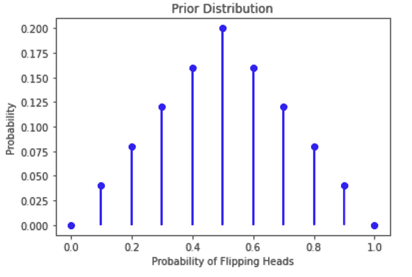

# 常客 vs 贝叶斯统计

> 原文：<https://towardsdatascience.com/frequentist-vs-bayesian-statistics-54a197db21?source=collection_archive---------6----------------------->

## 用 Python 进行参数估计的实用介绍

## 参数估计是统计推断、数据科学和机器学习工作流的关键组成部分。尽管这个主题可能很复杂，但我们还是用一些理论和代码介绍了比较两种方法的过程。


演职员表:[https://unsplash.com/@cgbriggs19](https://unsplash.com/@cgbriggs19)

无论是尚未发生的结果，还是我们尚无法一瞥的现实，我们都沉迷于了解未知。我们花费巨大的资源，希望对未来做出更准确的预测，并欣赏那些预测一贯正确的人。在过去的一个世纪里，新兴的统计推断领域已经为这些不可知的结果和关系提供了一个更强大的工具集。统计推断的目的是使用可观察的数据来推断一个**随机变量** (RV)的性质。术语“随机”可能会引起混淆，它并不意味着一个变量完全随机地取值，而是它取不同的值，这些值是由潜在的概率分布决定的。

在这篇博文中，我们将使用一个最简单的 RVs，即抛硬币的结果，来理解推理的一个基本方面，即参数估计。虽然硬币是一个简单的 RV，因为它可以取两个值-正面或反面，但您可以考虑其他 RV，如骰子滚动(在 6 面骰子的情况下可以取 6 个值)或股票价格(理论上可以取任何正值)。

在统计推断中，我们希望了解 RVs 之间的关系，以便了解和预测我们周围的世界。控制不同 RVs 之间关系的实体称为参数，通常用希腊字母θ (theta)表示。我们可以用以下方式用数学方法写出这种关系:


y 是我们的因变量(或结果变量)，X 是我们的独立变量(或预测变量)。θ是参数空间，包含所有决定 Y 和 x 之间关系的潜在值。

虽然**一个参数的真实值根据定义是未知的**，我们可以用它的近似值来工作。在这篇博文中，我们将探讨两种不同的方法。我们将从使用最大似然估计(MLE)的频率主义者(或经典方法)开始，然后我们将继续讨论贝叶斯框架。但在此之前，让我们简要讨论一下二项式分布，这是一种相对简单但却非常重要的分布，每个数据科学家都应该知道，以及如何通过编写 Python 代码来模拟它。

## 二项式分布

我们将围绕抛硬币的例子进行讨论(这是任何统计文本都必须的)。具体来说，我们感兴趣的是在一次给定的投掷中硬币正面朝上的概率。在这种情况下，我们抛硬币的结果是我们的 RV，它的值可以是 0(反面)或 1(正面)。

我们可以将单次抛硬币的结果表示为伯努利过程，这是一个有趣的术语，它表示 Y 是一个有两个潜在值的*单个结果*。形式上，我们有:


在这个上下文中， ***p* 是硬币正面朝上的概率，这是我们感兴趣的参数**。我们的任务将是尽可能精确地估计 p。

因此，我们有:


那么，给定一枚硬币，我们将如何估计 *p* ？我们可以只抛一次硬币，但这不会提供太多信息。想象一下，真相是 *p=0.5* (硬币是公平的，有相等的概率翻转正面或反面)，一次翻转后我们观察到一个正面。如果我们只依赖于那一次翻转，我们可能会得出 *p=1，*所以翻转头部的概率是 100%，我们会一直翻转头部，这听起来很可疑。

我们要做的是观察大量的翻转。当一个伯努利过程重复多次时，它被称为*二项式过程。*二项式过程建立在所有试验的假设之上，或者在我们的例子中是掷硬币，都是独立的——无论你现在掷的是正面还是反面，都不会对后面的迭代产生影响。

假设现在我们掷硬币 n 次。在这些 *n* 次投掷中，总的人头数 *Y* 是一个带有参数 *n* 和 *p 的二项式随机变量。n* 表示试掷或掷硬币的次数， *p* 表示成功的概率，或投掷人头的概率。最后，二项式分布的概率质量函数(PMF)给出了对于每一个 *p* 值，在 *n 次*试验中准确观察到 Y 个头的概率。

形式上，我们有:


既然我们对参数估计和将要使用的分布有了理论上的理解，我们就可以开始编码了。

## 模拟一些数据

现在让我们假设有人给了我们一个有 60%概率翻转正面的有偏硬币，但是我们不知道我们想自己估计这个概率。

我们可以使用`scipy.stats`库从二项式分布中得出结果。模拟是非常有用的，因为我们可以硬编码“真实”的参数，然后允许我们比较不同的框架在近似它方面的比较。

让我们模拟 10000 次抛硬币，观察一些结果。

```
import numpy as np
import scipy.stats as stats
from matplotlib import pyplot as pltnp.random.seed(42) # set seed for reproducibility# Set the probability of heads = 0.6
p = 0.6# Flip the Coin 10000 times and observe the results
n_trials = 10000data = stats.bernoulli.rvs(p, size = n_trials)# plot results
plt.hist(data);
```


10000 次抛硬币的直方图

```
sum(data)# 6108 coin flips out of 10000 are heads, since heads are coded as 1s and tails are coded as 0s
```

正如预期的那样，正面和反面的比例接近 60/40，在 10000 次掷硬币中有 6108 次是正面，这只是因为我们告诉虚拟硬币翻转器，硬币有 60%的机会是正面！

现在我们有了数据，让我们比较频率主义者和贝叶斯方法如何获得感兴趣的参数: *p* 。

## 频繁主义者的方法

频率统计使用最大似然估计(MLE)。虽然对极大似然估计的全面处理超出了这篇博文的范围，但它的工作就在它的名字里:它符合一个模型，这个模型最大化了观察到的观察数据的可能性。

对于二项分布，MLE 是成功的样本比例[1]。这仅仅意味着，在频率主义框架下，我们假设 *p* 的真实值是所有掷硬币中正面的数量:如果我们在 10 次掷硬币中有 6 次正面，那么我们认为 *p* 应该接近 6/10，或者 60%。


最大似然估计是成功的样本比例

在获得 p 的估计值后，下一步是量化该估计值的不确定性。记住，我们永远不知道它的真实价值，所以我们也必须量化它的全部潜在价值。这个范围称为置信区间，很容易计算出二项分布。首先，我们计算参数的标准误差，即其标准偏差乘以√N(样本大小)。然后，我们可以通过将标准误差乘以 95% Z-stat(等于 1.96)来找到我们的 95%置信区间。

总之，我们有:


捕捉二项分布的不确定性

让我们看看当我们投掷 10 枚硬币时会发生什么。在下图中，绿线表示 *p* 的“真实”值，我们在模拟数据时决定该值为 0.6。红色虚线表示最大似然估计，蓝色虚线表示置信区间，即 *p* 所在的可信值范围。


MLE 估计 10 次抛硬币

因为我们观察了 5 个头，MLE 是 0.5(回想一下 *p* 的真值是 0.6)。不确定性被置信区间捕获，置信区间表明 *p* 的真实值有 95%的概率在~ 0.2 和~ 0.8 之间。由于置信区间与样本大小成正比，我们可以预计它们会随着抛硬币次数的增加而缩小——我们拥有的数据越多，我们对自己的预测就越有信心。为了说明这一点，让我们看看当我们翻转越来越多的硬币时会发生什么。


随着 n 的增加，MLE 和 CI 估计值

在上面的图中，我们在 1 次翻转、10 次翻转、25 次翻转等多达 10，000 次翻转后拍摄结果的快照。这些图让我们了解了当我们掷硬币的次数越来越多时，我们的估计值以及我们对这些估计值的信心是如何变化的。

随着我们一遍又一遍地继续抛硬币，我们获得了越来越多的关于硬币性质的信息。因此，我们应该期待我们的估计会变得越来越精确，也越来越准确。当我们只抛硬币几次(比如 1 到 100 次)时，我们可以看到我们的置信区间相当宽。这是因为我们还没有看到足够的信息来排除头部的真实概率位于我们当前最大似然估计两侧的可能性。然而，随着我们继续抛硬币，观察到越来越多的关于我们感兴趣的参数的证据，我们看到我们的置信区间开始变窄并接近 MLE。当我们把硬币抛了 10，000 次后，我们的置信区间只是稍微偏向我们的最大似然估计。

让我们凭直觉思考这个问题:随着我们获得更多的证据，我们应该对我们的估计越来越有信心。此外，最重要的是，我们应该期待我们的估计越来越接近事实！**这是大数定律**:随着样本量的增加，其参数 estimand 越来越接近总体的真实值。我们将正面的真实概率设置为 0.6，这一点得到了证实，事实上，我们在翻转 1000 次后的最大似然估计为 0.61，并且在此之后不再波动(只是置信区间变窄)。

# 贝叶斯方法

本节素材——尤其是模拟代码，大量亏欠[https://tinyheero . github . io/2017/03/08/how-to-Bayesian-infer-101 . html](https://tinyheero.github.io/2017/03/08/how-to-bayesian-infer-101.html)[2]。

回顾一下，贝叶斯定理通过将模型参数建立为基于我们观察到的数据的分布条件来估计模型参数。


贝叶斯定理

*   P(θ)是我们模型参数的先验分布，它代表了我们在看到任何数据之前对结果和预测变量之间关系的看法。
*   P(X|θ)是似然项，表示先验数据与观测数据的拟合程度。
*   P(X)是预测变量的边际分布。换句话说，它代表观察到给定*所有*θ可能值的数据的概率。当处理离散分布时，P(X)可以通过对θ的所有值求和得到；在连续情况下，它是通过对θ积分得到的。

## 院长

贝叶斯工作流程的第一步是指定我们对结果变量的先验信念。对于这个例子来说，这意味着对我们关于抛硬币正面朝上的概率的信念进行编码:没错——我们把一个概率放在一个概率上。

上面的代码块创建了先验分布。首先，`np.linspace`函数创建 11 个介于 0 和 1 之间的值，间隔为 0.1。其次，我们硬编码了与先验分布中每个值相关的概率。随意使用不同的概率值——只要它们的总和为 1！



θ的先验:翻转头部的概率

先验分布概括了我们在没有看到任何数据的情况下对击中头部的概率的想法。为简单起见，我们将允许θ从 0 到 1 只取 10 个 0.1 增量的值。我们假设我们不知道硬币是有偏差的，也没有任何迹象表明它会有偏差。

因此，让我们建立一个峰值为 0.5，值为 0.2 的分布:我们说有 20%的机会硬币是公平的。我们也在考虑硬币可能不公平的可能性，这反映在θ从 0.1 到 0.9 的概率上。我们认为唯一不可能的情况是 p 等于 0(没有机会永远不摇头)或 1(没有机会永远不摇头)。

## 可能性

既然我们已经定义并编码了我们先前的信念，贝叶斯方法的下一步就是收集数据并将其纳入我们的估计。这一步与我们在 Frequentist 方法中所做的没有什么不同:我们将观察完全相同的数据，并再次使用似然函数来提取关于参数空间的信息。唯一的区别是，我们现在不仅仅是在 MLE 之后，或者我们在 Frequentist 方法中得出的点估计，我们需要参数空间中每个值的似然值。

可能性可能是一个难以理解的复杂概念，但它所做的基本上是返回一个数字，告诉我们某个值 *p* 符合数据的程度。一组 *p* 的高似然值意味着它们“适合”数据，反之亦然。我们基本上是在问:对于任何给定的 *p，*我们能确信它确实产生了我们所见证的数据吗？

二项式可能性的等式是其概率质量函数(PMF) [3]。


二项式似然函数

让我们解开上面的等式。我们说:给定 *n* 次投掷和 *y* 次投掷，与 *p* 相关的可能性是多少？对于θ中的每个 *p* 值，似然性评估该 *p* 值的概率。举个例子，如果我们观察到 1 个头像，那么 p= 0 的可能性一定是 0——因为我们观察到至少 1 个头像，那么永远不会翻转头像的可能性一定是 0。另一个例子，虽然不太可能(看我在那里做了什么？)将见证 10 次翻转中有 10 次正面朝上。在这种情况下，可能性将测量值 *p* = 1 是极有可能的，并且很可能分配它接近 100%的概率。

现在让我们计算可能性，并将其可视化。我们将保留前一个示例中的前 10 个数据点，因此 10 次翻转中有 5 次是正面。


观察 10 次抛硬币中 5 次正面的可能性

您会注意到，可能性在 0.5 左右达到峰值，离它越远，值就越小。这是有道理的:这种可能性用数据更新了我们之前对θ的信念，数据显示，10 次翻转中有 5 次是正面——根据我们观察到的数据，θ最有可能的真实值是 0.5。因此，0.5 将获得最高的可能性。反之亦然，像 0.1 和 0.9 这样的值不太可能是真实值，我们看到图表中相应地反映了这一点。反过来，极端值没有得到数据的证实，因此给出了非常小的似然值。

然而，需要注意的是**可能性不是有效的概率分布**。你可以自己检查一下，把θ的所有概率加起来，结果不等于 1！这就是归一化常数/分母的用武之地:将每个可能性概率除以归一化常数(它是一个标量)得到一个有效的概率分布，我们称之为后验概率。

## 后验分布

现在我们已经计算了似然值，我们通过将它们与先前的值相乘来获得贝叶斯定理的分子，这产生了θ和 x 的联合分布。反过来，分母通过对所得向量求和来获得(忽略θ)。

您可能已经看到，分母常常使贝叶斯推理在计算上难以处理。后面的博客文章将解释为什么会这样，但是对于这个场景，我们的优势是使用离散的参数空间(求和比积分容易),并且只取 10 个值，所以计算分母是完全可行的。

在下一篇博文中，我们将讨论当我们使用连续发行版时会发生什么。现在，请注意我们推导 X 的边际分布的能力是可能的，因为我们使用的是一个变量，而这个变量只有很少(11)个值。这使得对参数空间中的所有值求和变得容易，而如果我们处理的是可能有数千个(或无限个)预测值的多个预测值，情况就不一样了！如在连续的情况下)值的数量。


后验分布是可能性和先验之间的折衷

那么后验分布是怎样的呢？它反映了我们对我们感兴趣的参数的信念，包含了我们可以获得的所有信息。它是两个部分的产物:我们对θ的先验信念，以及反映我们从观测数据中获得的信息的可能性或证据。结合这两部分，**我们得到了我们感兴趣的参数**的概率分布。这是区分贝叶斯和频率主义方法的关键。在 frequentist 方法论中，我们的答案以点估计的形式表示(有一个置信区间)。然而，在贝叶斯方法中，我们的答案以概率分布的形式表达，允许我们对每个潜在的 *p* 正确的概率进行赋值。

在上面的例子中，在观察了 10 个翻转和 5 个头部之后，我们的先验分布已经被向θ= 0.5 的可能性挤压，这似乎越来越成为最有可能的答案。但是，我们还没有看到足够的信息来排除θ位于 0.5 一侧某处的可能性，所以我们将继续观察更多的数据。类似于我们在 frequentist 讨论中所做的，让我们看看当我们看到越来越多的数据时，我们的贝叶斯结论是如何变化的。

## 把所有的放在一起

现在让我们看看在贝叶斯框架下，随着抛硬币次数的增加会发生什么。下图覆盖了后验分布(蓝色，左侧 Y 轴上的值)和可能性(红色，右侧 Y 轴上的值)。


n 增加时的后验概率和可能性

让我们从分析我们已经抛过一次硬币并观察到正面的情况开始。在 frequentist 方法中，我们看到，在这种情况下，我们对 p = 1 的估计，显然是一个不正确的结论，然而我们没有其他方法来回答这个问题。在贝叶斯世界中，我们的答案非常不同。因为我们定义了我们的先验信念，即θ最可能的值是 0.5，所以我们只受到第一次翻转的轻微影响。凭直觉想一想，如果你真的相信一枚硬币是公平的，你抛了一次，硬币正面朝上，这足以证明这枚硬币不公平吗？大概不会！

当要处理的数据相对较少时，贝叶斯方法比频率主义方法表现得更好。频率主义者答案的可行性依赖于大数定律，因此在缺乏大量数据的情况下，结果并不总是可靠的。

然而，随着我们开始观察更多的硬币翻转，我们开始看到我们的贝叶斯答案变得非常清楚，最终我们将所有的鸡蛋放在 p = 0.6 的篮子里。仅仅翻转 100 次后，我们给不等于 0.6 的值分配了一个非常小的概率，最终我们分配给 0.6 的概率收敛到 1，或者大约 100%。这意味着我们接近 100%确定，60%的时间，我们的硬币将是正面。

在背景中，可能性(或观察到的数据)开始支配我们一开始建立的先验信念。这是因为证据是压倒性的，所以我们更依赖它。如上图所示，随着 *n* 的增加，似然性和后验分布收敛(注意，X 轴和 Y 轴上的比例不同，因为似然性不是概率分布)。当我们观察到更多的数据时，先验的影响会被冲掉，数据会自己说话。

## 结论

在这篇博文中，我们研究了估计未知参数的两种不同方法。在 Frequentist 方法中，我们让数据说话:我们通过建立一个尽可能符合观察数据的模型来估计 X 和 Y 之间的关系。这给了我们一个单点估计，最大似然估计，不确定性被模型的标准误差捕获，它与样本大小成反比。因此，典型的 Frequentist 努力收集尽可能多的关于感兴趣的参数的数据，以便达到更精确的估计(至少在理论上)。

在贝叶斯方法下，我们从变量之间的关系的概念开始分析:先验分布。然后我们观察我们的数据并更新我们对参数分布的信念:这给出了后验分布。**贝叶斯框架下的一个重要但微妙的区别是，我们将参数视为随机变量，以捕捉其真实值的不确定性**。这需要在建模过程的每个阶段都使用发行版。

如果我们回忆一下我们展示的频率主义方法的图表，我们会发现，随着样本量的增加，贝叶斯和频率主义的答案是一致的，这是理所应当的！随着我们获得关于我们感兴趣的参数的更全面的信息(即观察更多的数据)，我们的答案应该变得更加客观。

所以你可能会想，如果他们最终给出相同的答案，那么采用不同的方法又有什么意义呢？这实际上取决于用例。我们认为，在你有很多很多数据的情况下，部署一个完全成熟的贝叶斯框架可能是多余的。在数据较少的情况下，例如在社会科学中，处理后验分布的能力是非常有洞察力的。此外，在频率主义者的方法中，我们完全受制于数据的准确性。如果我们的数据不准确或有偏差，那么我们的估计也会如此。在贝叶斯方法中，我们可以通过设置更强的先验来抵消这种影响(例如，对我们先前的信念更有信心)。我们还认为，贝叶斯分析在简单性方面的不足，在整体精度方面得到了弥补，在许多情况下，向客户或同事展示后验分布比点估计更能提供信息。

在这篇博文中，我们将先验空间视为相对简单的空间，只有 11 个 p 可以取的任意值。但是如果 p 可以取 0 到 1 之间任何可能的值呢？当我们开始处理参数空间的连续分布时，事情变得有点不确定，这将是下一篇博客文章的主题，我们将了解为什么使用马尔可夫链蒙特卡罗近似法——敬请关注！

## 我们意识到有很多东西需要打开，所以这里有一个 TLDR 给你:

Frequentist 方法使用最大似然估计(MLE)来估计未知参数:在给定我们观察到的数据的情况下，点估计是参数最可能的真实值。

Frequentist 答案完全由观察到的数据形成，并以单点估计的形式交付。这使我们受到数据准确性和质量的支配。

-贝叶斯方法将先验概率分布与观测数据(以似然分布的形式)相结合，以获得后验概率分布。

-虽然贝叶斯方法也依赖于数据，但其估计值结合了我们关于感兴趣参数的先验**知识** ，其答案以感兴趣参数的概率分布的形式给出。我们可以通过设定更强的先验来抵消对数据的依赖。

-随着样本量的增加，统计推断变得客观，频率主义者和贝叶斯估计开始彼此相等。

## 完整代码

[https://github . com/gabgilling/Bayesian-Blogs/blob/main/Blog % 20 post % 201% 20 final . ipynb](https://github.com/gabgilling/Bayesian-Blogs/blob/main/Blog%20Post%201%20final.ipynb)

## 引文

[1]https://online.stat.psu.edu/stat504/lesson/1/1.5

[2][https://tinyheero . github . io/2017/03/08/how-to-Bayesian-infer-101 . html](https://tinyheero.github.io/2017/03/08/how-to-bayesian-infer-101.html)

[3][https://sites . warner CNR . colo state . edu/g white/WP-content/uploads/sites/73/2017/04/binomiallikelihood . pdf](https://sites.warnercnr.colostate.edu/gwhite/wp-content/uploads/sites/73/2017/04/BinomialLikelihood.pdf)

## 承认

感谢我们在 IBM 的同事:Alexander Ivanoff、Steven Hwang、Dheeraj Aremsetty 和 Lindsay Sample 的校对和评论！