# 从 0 到数据网格:Kolibri Games 打造数据驱动型公司的 5 年历程

> 原文：<https://towardsdatascience.com/from-0-to-data-mesh-kolibri-games-5-year-journey-to-building-a-data-driven-company-a4f25e760fae?source=collection_archive---------21----------------------->

## 数据网格案例研究

## 一家初创公司从零开始构建数据网格和数据驱动文化的经验教训。

图片由 [Unsplash](http://www.unsplash.com) 上的[丹·吉格斯](https://unsplash.com/photos/qWJ6zFUsX0A)提供。

总部位于柏林的 [**Kolibri Games**](https://www.kolibrigames.com/) 经历了一段疯狂的旅程，从 2016 年一家基于学生宿舍的初创公司飙升至 2020 年被育碧公司收购的头条新闻。

虽然五年来发生了很多变化，但有一点始终未变:该公司致力于建立一种洞察驱动的文化。随着几乎每周一个新版本的发布，他们的移动游戏不断变化并产生大量数据——每天处理 40 种不同事件类型的 1 亿个事件，有些事件有数百个触发器。

一路走来，该公司的数据组织从一个营销分析师团队发展到 10 多名工程师、分析师和科学家，他们负责确保数据运营的可靠性、可扩展性和自助性。为了推动这种爆炸式增长，该团队正在构建一个 [**数据网状架构**](https://www.montecarlodata.com/data-mesh-101-everything-you-need-to-know-to-get-started/) ，以数据驱动的文化为后盾，这将让成千上万更成熟的公司羡慕不已。

最近，我们与该公司的数据工程负责人 [António Fitas](https://www.linkedin.com/in/antoniofitas/) 坐在一起，讨论 Kolibri Games 的数据故事，分享他们的数据组织如何在每一步发展，包括他们使用的技术，他们雇用的团队成员，以及他们面临的数据挑战。

他们的故事非常吸引人，对于那些开始数据网格之旅的人来说，这是一个很好的资源。让我们开始吧。

# 2016 年:首次数据需求

2016 年，Kolibri Games 的创始人开始在德国卡尔苏赫理工学院的学生公寓里一起开发一款游戏。他们凭借自己的第一款手机游戏[闲散矿工大亨](https://www.idleminertycoon.com/)取得了早期的成功，创始人建立了一些与数据相关的基本目标和目的。

**数据目标和目的**

建立基本的商业报告，以确定游戏是否正常运行，以及公司是否赚钱，方法是:

*   报告应用内购买收入
*   报告广告收入
*   报告特定于游戏的 KPI
*   报告崩溃和错误

**数据团队和技术团队**

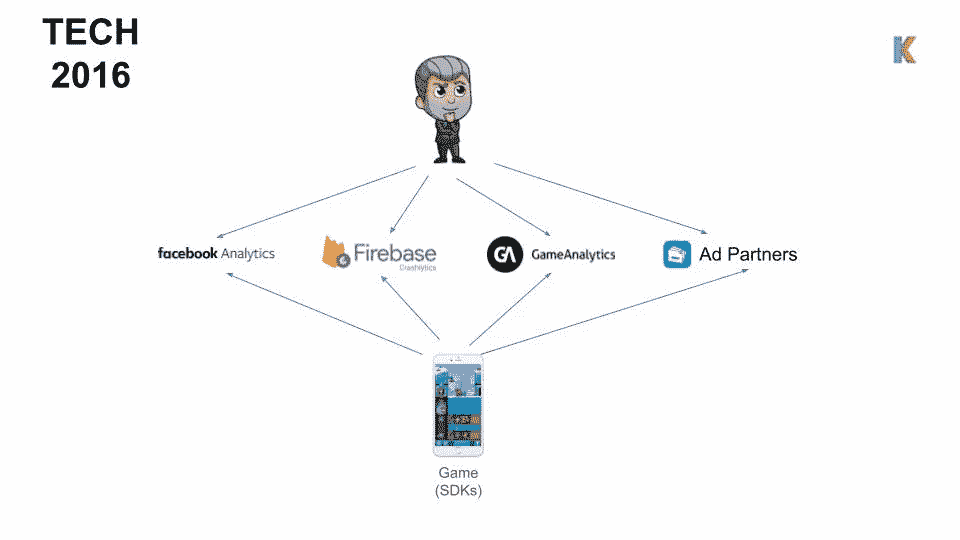

图片由 Kolibri Games 提供。

作为一家精益初创企业，创始人完全依赖第三方工具，包括:

*   脸书分析公司
*   广告合作伙伴
*   Firebase(帮助修复应用程序崩溃和错误)
*   游戏分析(针对游戏内关键绩效指标，如留存率)

**数据挑战**

*   跨不同工具的分散分析
*   KPI 的计算方式不透明
*   报告不同工具之间的不一致
*   SDK 集成带来的技术问题
*   技术限制，例如更深入地挖掘指标和缺乏灵活性

“这种方法远非完美，但这不是我们首先要解决的问题，”安东尼奥说。“我们很幸运，我们有很多玩家有机地加入了游戏，但我们希望得到更多。为此，我们希望借助数据提升我们的营销和用户获取运营。”

# 2017:追求效果营销

随着“无所事事的矿业大亨”越来越受欢迎，运营公司所需的团队也越来越受欢迎——搬出学生公寓，搬进卡尔斯鲁厄一间合适的办公室。随着该组织专注于获取新客户，该团队建立了数据功能来衡量和改善绩效营销。

**数据目标和目的**

加强绩效营销，让更多用户加入游戏，同时通过以下方式确定哪些活动是有利可图的:

*   计算活动的广告支出回报(roa)
*   创建简单的用户终身价值(LTV)预测
*   构建付费广告竞价脚本以优化活动绩效

**数据团队**

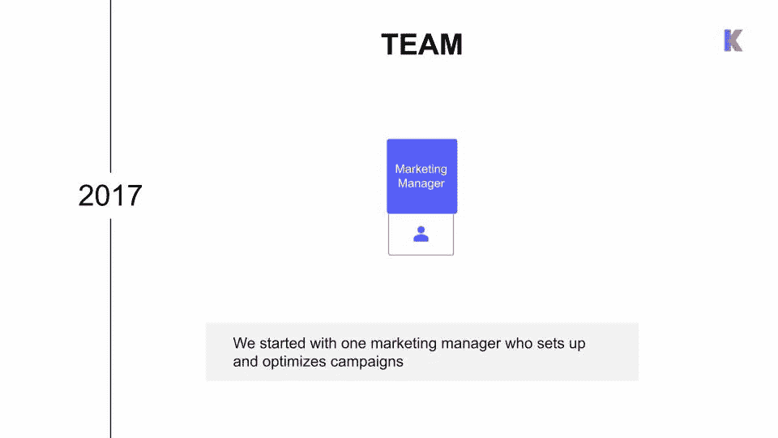

图片由 Kolibri Games 提供。

还没有招聘数据——一位营销经理负责绩效营销。

**数据技术堆栈**

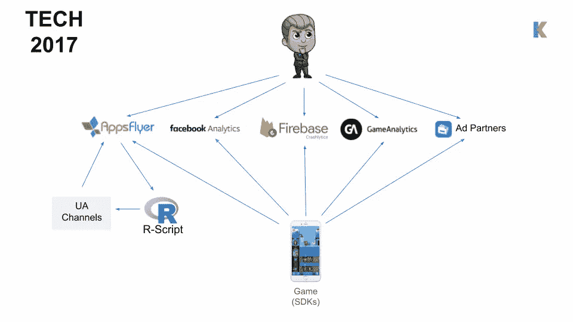

图片由 Kolibri Games 提供。

为了深入了解 ROAS 和 LTV，该团队在他们的武器库中添加了第三方移动测量合作伙伴(MMP)工具 AppsFlyer。这个工具帮助营销经理了解哪些用户获取活动表现良好，花费了多少，以及新获得的玩家产生了多少收入。AppsFlyer 还通知本地运行的脚本来优化投标管理操作。

**数据挑战**

*   缺乏透明度
*   易出错的
*   没有版本控制
*   数据更加分散

“我们基本上被蒙住了眼睛，”安东尼奥说。“我们没有任何版本控制或工程最佳实践来管理我们为设定出价而运行的代码。”

尽管如此，Kolibri Games 第二年的年收入仍超过 1000 万欧元。为了更上一层楼，是时候投资一些改进了。

# 2018:专业化和集中化

在第三年，这家年轻的公司搬到了柏林，雇佣了更多的开发人员和设计师，安东尼奥也及时加入了 5000 万下载量的庆祝活动。与另一名数据工程师和营销团队一起，一个专业的数据组织开始形成。

**数据目标和目的**

通过创建一个工具来收集所有信息，提供透明度，并通过以下方式更深入地挖掘数据，从而实现数据集中化和绩效营销专业化:

*   投资专有的自有解决方案来集中数据
*   收集原始数据
*   建立中央数据仓库
*   设置仪表板

**数据团队**

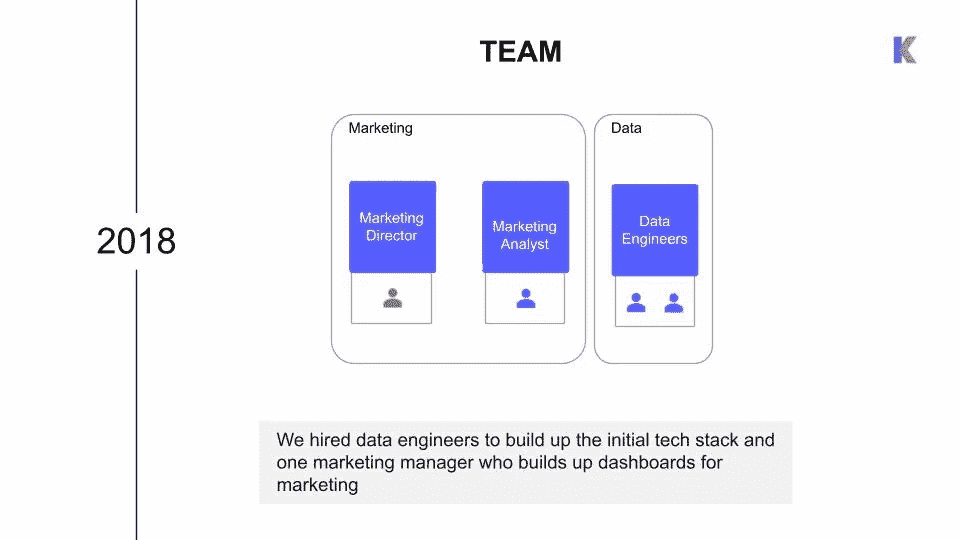

图片由 Kolibri Games 提供。

António 和另一名数据工程师致力于构建初始技术堆栈，而一名营销分析师则专注于构建仪表盘以实现绩效营销。

**数据技术栈**

图片由 Kolibri Games 提供。

António 和他的团队构建了他们的数据平台的第一个版本，他们将 Azure 用于几乎所有的服务。他们建立了事件遥测技术，为游戏中的特定事件或动作生成数据点，建立了批处理作业，将 API 中的数据集成到他们的数据湖中，并做出了他们的第一次技术转换:从 Power BI 迁移到 Looker，以获得另一层数据操作和现成的功能，如版本控制。

*   数据工厂(Azure)
*   活动中心(Azure)
*   流分析(Azure)
*   数据湖分析(Azure)
*   权力 BI，然后 Looker
*   SQL 数据库

**数据挑战**

*   查询性能
*   稳定性和可靠性
*   保持系统的活力

António 说:“我们的 SQL 数据库正在成为一种限制。“在我们的仪表盘运行的同时，集成数据的工作正在写入数据，或者分析师正在进行即席查询，基本上，整个服务开始变得非常不可预测和非常缓慢。我们开始发现我们的一些工作经常失败，而且我们的警报或监控很有限。我们决定以数据为导向，开始解决我们遇到的一些问题。”

# 2019:面向数据

随着又一次成功的游戏发布、品牌重塑和全球认可，Kolibri Games 在 2019 年迎来了更大的增长。该公司在 7 月份达到了 1 亿次下载和 100 名员工的双重里程碑。随着更多的用户和更多的产品，产生了更多的原始数据，安东尼奥和他的团队知道他们只是触及了数据如何推动公司前进的皮毛。

**数据目标和目的**

通过了解玩家行为、进行数据支持的实验，以及通过以下方式完善数据技术体系，为游戏创造洞察力:

*   建立一个货币化仪表板，显示公司通过优惠、商店和广告赚了多少钱
*   构建进度和参与度仪表板，以了解玩家如何与游戏互动(例如他们何时离开以及他们如何与某些功能互动)
*   运行 A/B 测试
*   提高仓库的性能和数据管道的可维护性

**数据团队**

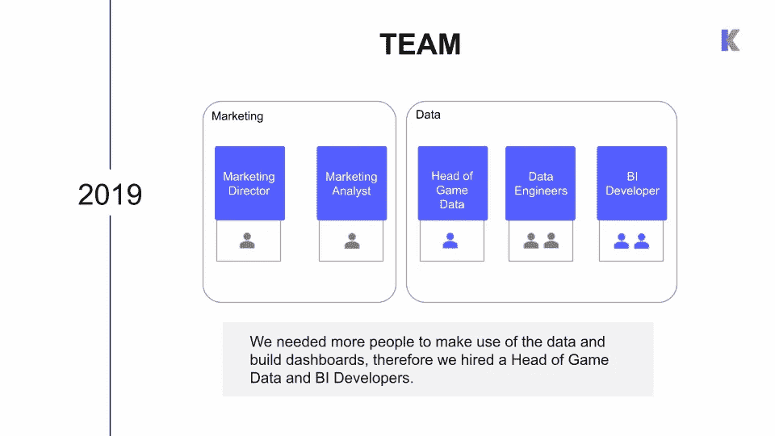

图片由 Kolibri Games 提供。

安东尼奥知道他们需要更多的人来让他们的海量数据变得有用。他们在数据平台团队中增加了一名游戏数据主管和两名 BI 开发人员。数据工程师与基础设施密切合作，维护系统、集成新工具和维护流用例，同时为 BI 开发人员构建框架，以处理数据集成、数据建模和数据库可视化。

**数据技术栈**

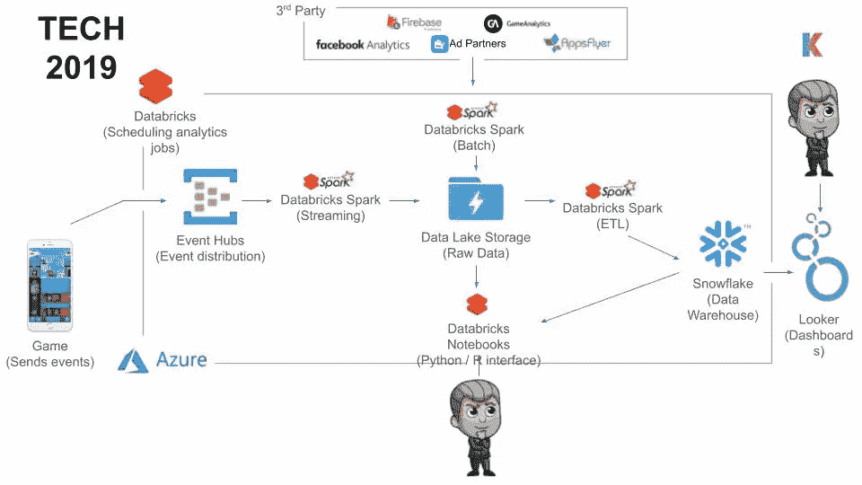

图片由 Kolibri Games 提供。

不断增长的数据团队需要更大的灵活性和更简单的协作，因此 António 用 Databricks 替换了一些 Azure 服务。他们尝试使用 Spark 来利用他们的数据湖作为他们的数据仓库，但发现在该平台上工作的人更喜欢 Python 和 SQL——他们在使用 Spark 时没有看到他们期望的 Looker 性能。因此，安东尼奥和他的团队最终用雪花取代了他们的 SQL 数据库，雪花成为他们所有分析的主要计算引擎。

**数据挑战**

*   A/B 测试很难设置，缺少透明度，并且无法显示或演示
*   游戏中没有数据驱动的决策

安东尼奥说:“大多数决定仍然是根据直觉和社区反馈做出的。“我们继续生成更多数据，但我们知道我们可以更多地利用这些数据，并围绕这些数据构建更多使用案例。”

# 2020 年:实现数据驱动

2020 年初，Kolibri Games 被法国游戏巨头[育碧](https://www.ubisoft.com/en-us/)收购。随着资源的增加，António 的团队继续发展，将机器学习功能分层到他们的平台中，并从关于数据网格架构和特定领域数据所有权的对话中受到启发。为了开始构建数据驱动的文化，他们引入了 [**特定于数据的服务级别协议**](https://www.montecarlodata.com/how-to-make-your-data-pipelines-more-reliable-with-slas/)(SLA)，并专注于增加对数据的自助式访问。

**数据目标、SLA 和目的**

做出完全由数据驱动的决策，以释放公司游戏的全部潜力，特别是让产品经理帮助跟踪:

*   90%的闲置矿业大亨决策需要数据支持
*   90%的问题的洞察时间需要少于 1 小时
*   90%的变更需要通过分析进行验证

为了实现这一目标，数据平台团队将:

*   改进 A/B 测试流程，以帮助对要实现的功能和更改做出明智的决策
*   通过为玩家群体创建游戏配置来提高个性化
*   使用预测分析来预测 LTV 和流失，以相应地调整游戏
*   让人们能够回答与数据相关的问题，而无需咨询数据分析师

**数据团队**

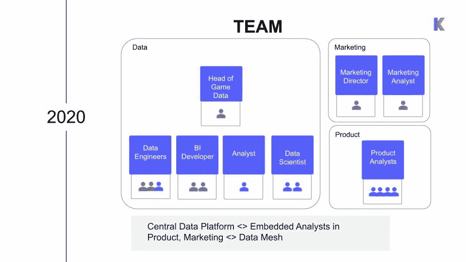

图片由 Kolibri Games 提供。

由于数据组织专注于特定领域的数据所有权，因此让新聘分析师直接融入产品团队是有意义的，他们与产品经理密切合作，了解需求并调整优先级，以反映产品的实际需求。第三名数据工程师和两名数据科学家也加入了数据平台团队，专门从事 ML 算法和 A/B 测试数据管道的工作。

**数据技术栈**

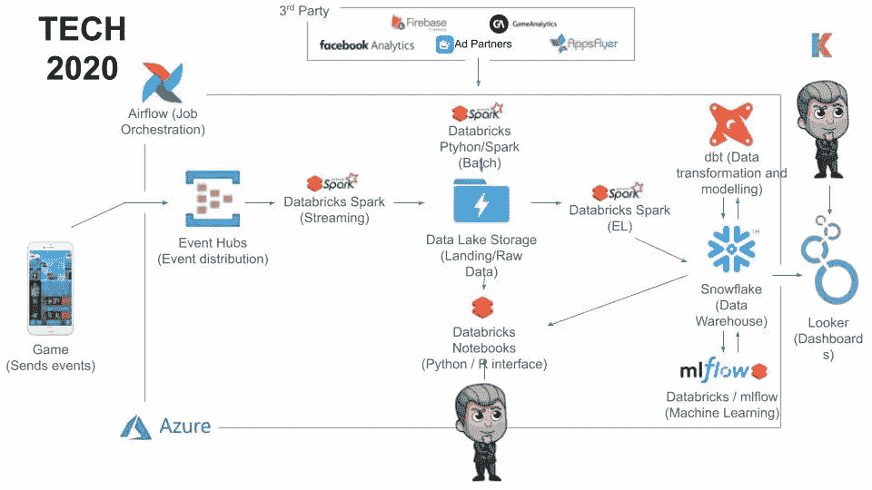

图片由 Kolibri Games 提供。

António 的团队将数据仓库架构添加到雪花中，更好地定义了他们应用业务逻辑的地方。他们也从做 ETL 转到了 ELT，直接在雪花里做清洗和转换。他们将其与数据转换工具 [dbt](https://www.getdbt.com/) 结合起来，在平台上工作的每个人之间进行协作，增加透明度和可见性。

数据工程团队还专注于抽象数据管道，以便产品分析师可以与游戏开发团队一起设计和定义新的数据事件。通过遵循数据工程师制定的指导原则，他们现在可以将数据放入仓库并对数据建模，而不需要数据工程师。António 和他的团队还引入了 Airflow 作为数据集成、所有 dbt 模型和数据验证的主要编排。

**数据挑战**

*   数据信任
*   软件稳定性
*   扩展个性化

“我认为，当我们试图衡量‘我们是否真的在利用数据进行产品开发’时，这项工作做得非常好。”安东尼奥说。“让这些 KPI 围绕我们的问题，并衡量这些事情，真的有助于人们更多地考虑它，并推动它。我认为，就让更多的人思考数据而言，这项工作本身证明是卓有成效的。但此时发生的情况是，我们获得了更多的数据，更多围绕数据的新用例，以及许多新模型，但监控所有这些并确保事情正确变得越来越困难。”

# 2021 年:构建数据网格

随着今年的展开，安东尼奥和他的团队专注于建立 [**数据信任和可靠性**](https://www.montecarlodata.com/what-is-data-reliability/)**——这对于他们实现具有特定领域数据所有权的数据网状架构的使命至关重要。**

****数据目标和目的****

**帮助公司利用可靠的数据进行扩展，同时构建数据网状架构，提高开发速度和减少事故，减少事故数量，并通过进一步的高级分析提高玩家个性化。安东尼奥和他的团队计划通过以下方式实现这一目标:**

*   **提高测试能力**
*   **构建通用的发布和开发流程**
*   **实施更多监控和警报**
*   **专注于高级分析**
*   **围绕数据监控和工程最佳实践协作扩展数据平台功能**
*   **构建领域跨职能团队**

****数据团队****

**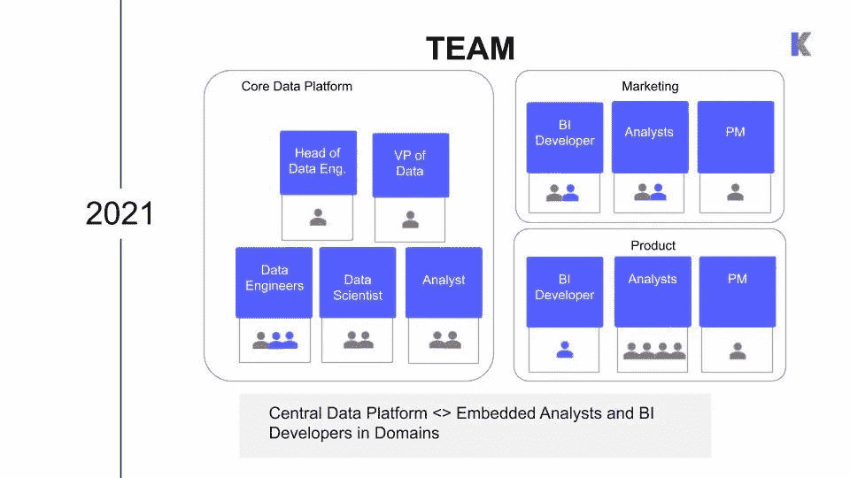**

**受数据网格概念的启发，该公司计划通过增加项目经理来扩展嵌入产品和营销的领域团队，项目经理将帮助他们的团队和 BI 开发人员定义工作，以帮助集成新的和维护现有的数据源。中央数据平台团队将继续专注于构建解决方案、框架、维护基础设施和高级分析。**

****数据技术栈****

**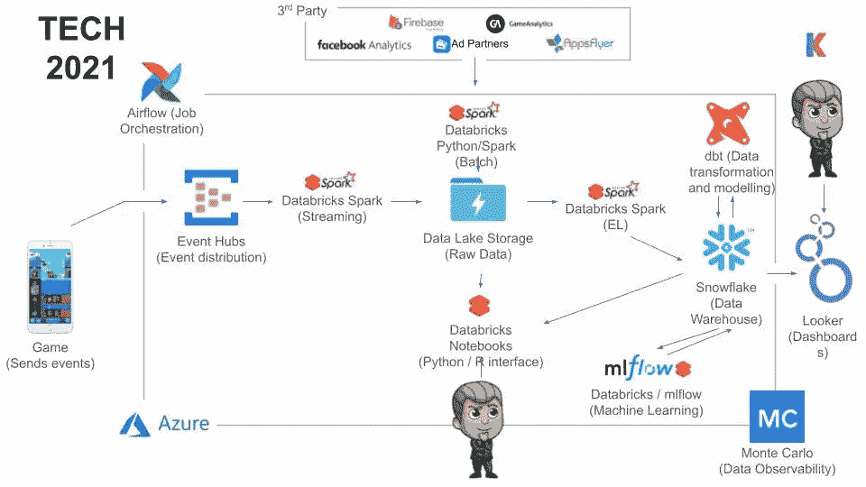**

**今年，数据团队正在努力集中开发和发布流程，以便数据平台、营销和产品团队都遵循相同的合并请求并发布到生产流程中。**

**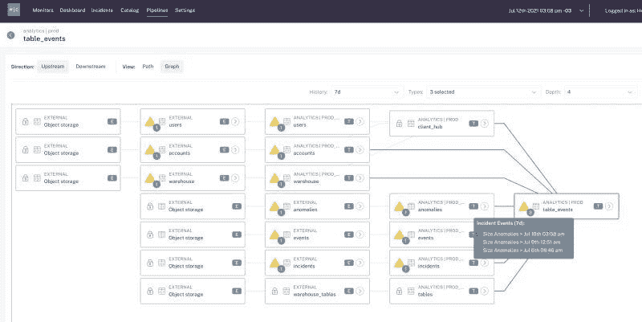**

**Kolibri Games 还增加了一个新工具 Monte Carlo，用于端到端、全自动的 [**数据可观测性**](/data-observability-the-next-frontier-of-data-engineering-f780feb874b) 和血统。在尝试构建自己的数据监控定制解决方案后，他们意识到需要一名全职人员来构建一个框架，以将其扩展到不同的用例并监控所有数据资产。数据可观察性通过使用机器学习来监控数据仓库中所有数据的质量，并提供自动生成的端到端数据血统来加快故障排除和 [**事件解决**](https://www.montecarlodata.com/how-to-conduct-incident-management-on-your-data-pipelines/) 来帮助解决这个问题。**

# **5 年数据之旅的 5 个关键收获**

**归根结底，建立一家数据驱动的公司是一场马拉松，而不是短跑。**

**对于 António 来说，实施数据网格和实现端到端数据信任是其团队旅程的顶点。以下是他在组建数据团队(无论其形状或规模如何)以在每个发展阶段取得成功时的关键要点。**

1.  **“构建您自己的数据堆栈是值得的，因为它为您提供了所有这些功能，并使您能够在产品开发或团队工作中以数据为导向。”**
2.  **“我们的数据平台已经经历了多次迭代，因此您必须选择并能够理解何时是改变技术的合适时机，针对哪种数据量，针对您正在运行的哪种流程。”**
3.  **“如果您想建立对数据的信任，拥有更高程度的数据质量和数据可观察性非常重要。重要的是，当出现问题时，你能够理解，并且能够很容易地指出来。”**
4.  **“在升级到更高级的数据应用程序之前，掌握基本知识非常重要。在我们的情况下，我们应该早点聘请分析师来更多地利用数据。”**
5.  **“建立数据驱动的文化非常重要，有时甚至比建立正确的技术堆栈更重要。”**

**随着越来越多的组织采用数据网格和分布式架构，创新、效率和可伸缩性的机会从未如此之大。尽管如此，重要的是要认识到，当涉及到实现数据网格和建立分布式数据团队时，技术和过程只能让您走这么远。归根结底，成为数据驱动型企业总是始于文化，也终于文化。**

**有兴趣了解数据可观察性如何促进数据网格架构？*[***巴尔***](https://www.linkedin.com/in/barrmoses/) ***和*** [***其余的蒙特卡洛团队***](https://www.montecarlodata.com/request-a-demo/) ***了解更多******

****还有别忘了 RSVP 对于* [***的影响:2021 年 11 月 3 日的数据可观测性峰会***](https://events.montecarlodata.com/impact-data-summit-2021?utm_source=blog&utm_medium=kolibri+data+mesh&utm_id=impact) *听听* [***扎马克***](https://www.linkedin.com/in/zhamak-dehghani/) *，数据网的创始人，以及其他数据界的领军人物！****

****特别感谢安东尼奥和他的团队分享他们的故事！****