# 从初学者的角度:理解可视化和用 Tableau 构建图表

> 原文：<https://towardsdatascience.com/from-a-beginner-perspective-understanding-visualization-building-charts-with-tableau-8ae258153719?source=collection_archive---------11----------------------->

## 了解可视化的背景，并使用 Tableau 构建仪表板


米利安·耶西耶在 [Unsplash](https://unsplash.com?utm_source=medium&utm_medium=referral) 上拍摄的照片

## **简介**

作为一名在数据科学和分析领域工作的顾问，我经常不得不处理大量的数据，构建模型并从中获得见解。然而，当涉及到与他人交流数据和发现时，以纯文本、excel 文件或电子表格的形式呈现结果对于其他人来说不容易快速掌握和理解所发现的信息。这就是数据可视化的价值所在——通过图形或地图以可视化的方式呈现数据，并突出显示数据中的关键见解、趋势或模式。

在本文中，我将分享数据可视化的含义，以及我们如何使用 Tableau 开发交互式可视化。工具“Tableau”是一种可视化工具，目前被许多组织广泛使用。Tableau 附带了一个用户友好的界面，这是一个拖放界面，这使它成为组织使用的一个很好的选择，因为组织中的任何人都可以很容易地掌握这项技能。

```
[**Table of Contents:** 
(1) What does Data Visualization mean?
(2) Tableau Overview
(3) Tableau Interface & Connecting to Data Sources 
(4) Understanding Our Data Set 
(5) Building Visualization
(6) Building a Final Dashboard](http://x)
```

## (1)数据可视化是什么意思？

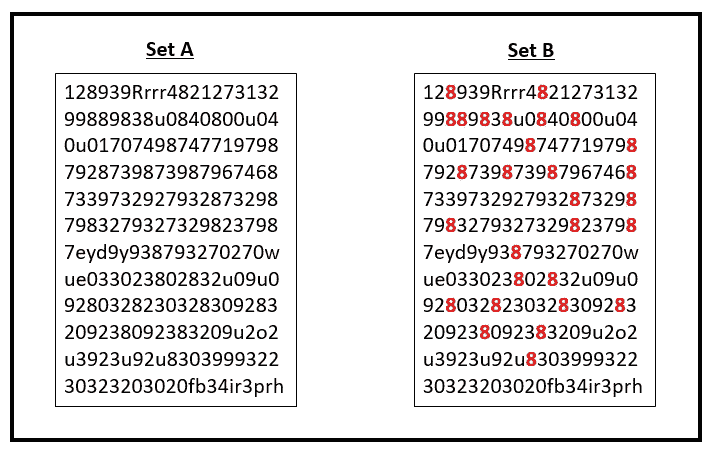

确定 A 组和 B 组中“8”的数量(图片由作者提供)

让我们从一个简单的活动开始，如上图所示，我们有两组随机字符的盒子——A 组和 B 组。现在让我们通过计算 A 组和 B 组中 8 的数量并比较所用时间来计时。你会注意到，与集合 A 相比，识别集合 B 中的数字“8”要容易得多，也快得多，因为它已经进行了颜色编码。

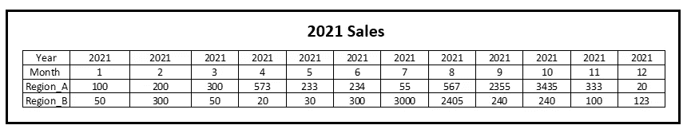

表格形式的销售额(图片由作者提供)

现在，让我们来看看这个包含区域 A 和区域 B 每月销售额的表，您能快速确定哪个月的销售额达到峰值或下降吗？

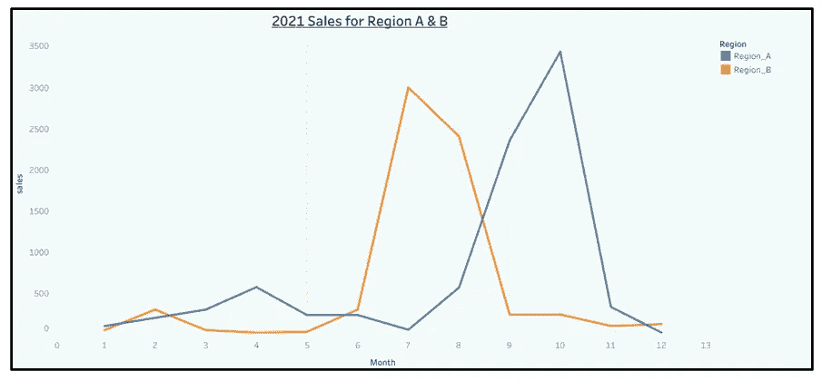

将地区销售额绘制成图表(图片由作者提供)

上面的折线图展示了 A 区和 B 区的销售情况，您能从折线图中看出哪个月的销售额达到峰值或下降得更快吗？从折线图中，我们可以很快注意到，A 地区的销售高峰出现在 9 月和 10 月，而 B 地区的销售高峰出现在 7 月和 8 月。

这些活动解释了可视化的目标，即更容易、更快地看到数据中的模式。数据可视化有助于人类更好地进行可视化，因为与口头/文本信息相比，人脑处理视觉格式信息的速度要快得多。使用带有正确颜色的图形格式来可视化数据有助于人类大脑轻松理解和处理信息，而不是花费时间缓慢而仔细地检查大量的文档、电子表格和报告。

> “能够可视化数据并利用数据讲述故事是将数据转化为可用于推动更好决策的信息的关键。”——Cole Nuss baumer kna flic

## (2) Tableau 概述

Tableau 是在“2003 年”由帕特·汉拉汉、克里斯蒂安·沙博特和克里斯·斯托尔特创建的，当时他们在斯坦福从事一个计算机科学项目。Tableau platform 提供了一系列产品，从数据准备到数据可视化，再到与他人共享您的可视化，此外还添加了治理和数据管理，以便为全周期的自助分析提供支持。用于建筑可视化的 Tableau 产品包括:

*   **Tableau Desktop** —最适合开发者开发仪表盘、故事、报告。
*   **Tableau Server** —最适用于将使用 Tableau Desktop 创建的仪表板、故事、报告发布到服务器，供其他人分析报告。(Tableau 管理员可以为每个用户设置权限，允许他们仅查看或通过编辑报告进行更改)。
*   **Tableau Online** —在完全托管在云中的分析平台上构建仪表盘、故事、报告，跳过软件安装和升级的设置时间。

除了上面提到的产品，Tableau 还有其他产品，如数据准备工具 Tableau Prep，一个任何人都可以免费在线探索、创建和共享数据可视化的公共平台，等等。如果你很好奇，想了解更多 Tableau 提供的产品，可以参考他们的[官网](https://www.tableau.com/products)。

我将在本文中使用的平台是 [Tableau Online ( *如果这是您第一次使用 Tableau*](https://online.tableau.com/) ，您可以注册 14 天的试用版)。

## **(3) Tableau 接口&连接数据源**

在 Tableau 上构建报告之前，您需要在 Tableau 工作区中做的第一件事是创建一个项目，该项目存储所开发的报告的工作簿。

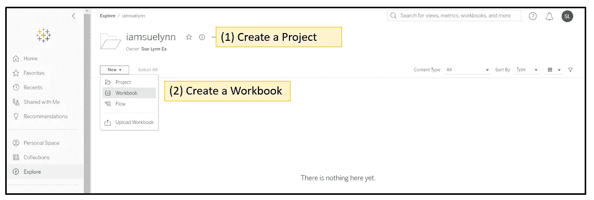

创建项目和工作簿(作者图片)

在菜单栏上—选择“浏览”→创建“项目”→在创建的项目中创建工作簿。

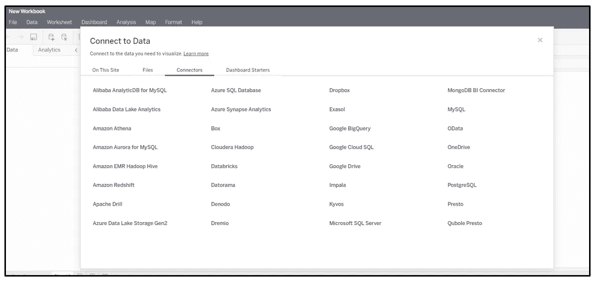

数据连接器列表(图片由作者提供)

第一次打开新工作簿时，Tableau 会提示您连接到数据。Tableau 提供的一个很棒的功能是不同连接器的列表，允许您连接到各种数据源，无论数据是本地文件、文本文件、本地数据库还是云中的数据，如 Google Big Query、Cloudera Hadoop 等。可用连接器列表可在“连接器”选项卡上查看。此外，单个 Tableau 工作簿可以连接到来自不同数据源的多个数据集。这些多个数据集可以在 Tableau 中使用“Join”表功能相互连接，或者在不同的工作表上单独使用。

我们将使用 Tableau 平台提供的可用公共数据集—超级商店数据样本。超级商店数据示例包含按类别、子类别、销售额、利润等分类的产品信息。如果您想下载数据并手动导入，您可以从 [Kaggle](https://www.kaggle.com/bravehart101/sample-supermarket-dataset) 下载 CSV 文件。

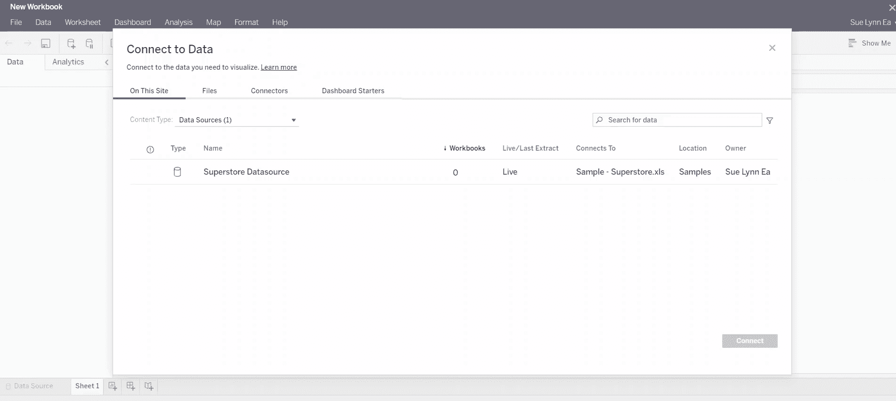

连接到超级商店数据源(Gif by Author)

在“连接到数据”对话框中，选择“超级商店数据源”并单击“连接”。连接到数据源后，将打开一个新的工作表，这是一个空白的工作表，您可以在其中开始开发您的第一个可视化视图。

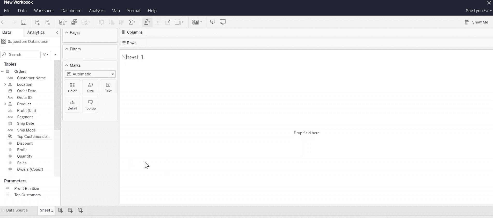

数据源(作者 Gif)

要更好地查看导入的数据，请选择“数据源”选项卡进行导航。在 Data Source 选项卡中，我们可以查看连接的数据源和关于数据的其他详细信息，例如列的类型和值。数据网格提供了默认情况下连接的前 100 条数据记录的示例视图。

现在，让我们开始回到工作表视图，以便更好地理解开发可视化的界面。

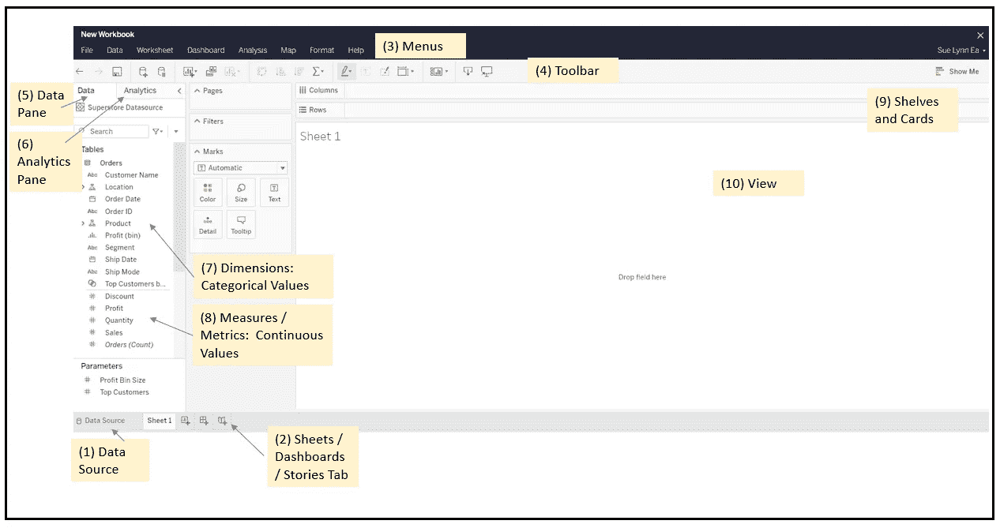

了解 Tableau 工作区界面(图片由作者提供)

上图显示的是“Sheets”视图，这是我们构建可视化的地方。让我们来看一下界面上可用的组件:

(1)数据来源:

*   单击 Data Source 选项卡会将您带到 Data Source 页面来查看您的数据集。

(2)工作表/仪表板/故事选项卡:

*   工作表[标签](https://help.tableau.com/current/pro/desktop/en-us/environment_workspace.htm)表示工作簿中的工作表，并表示用于开发可视化的工作空间(也表示特定的可视化，如条形图、饼图等)。)
*   仪表板[标签](https://help.tableau.com/current/pro/desktop/en-us/dashboards.htm)代表一个区域，用于组合从多个工作表创建的可视化。
*   story [选项卡](https://help.tableau.com/current/pro/desktop/en-us/stories.htm)可以像故事书一样包含顺序排列的表或仪表板的组合，以故事格式与他人共享信息。

(3)菜单:

*   菜单栏由各种不同的命令组成，如文件、数据、工作表、仪表板等。

(4)工具栏:

*   工具栏允许执行各种功能，如保存工作簿、添加新数据源、添加新工作表、复制工作表、清除当前工作区、按升序或降序对图表排序等。

(5)数据窗格:

*   数据源连接和数据字段显示在数据窗格部分。

(6)分析窗格:

*   分析窗格附加分析功能，如添加参考线、平均线、箱线图、分布带、趋势线、预测等。通过将分析窗格中的函数拖放到视图上，可以轻松地将它们添加到视图中。

(7)维度:分类值

*   由我们的数据集中被 Tableau 视为分类的列/字段组成。分类值允许我们对数字数据进行分割。*(注意分类值的图标颜色为蓝色)*

(8)测量/度量:连续值

*   由我们的数据集中被 Tableau 视为数字的列/字段组成。*(注意数值图标颜色为绿色)*

*提示:如果分配错误，您可以通过右键单击字段并选择“转换为度量”来手动将字段从分类转换为度量，反之，也可以将字段从度量转换为离散或维度。*

(9)货架和卡片:

*   这些是行架、列架、页架、过滤器架或标记卡。根据添加的数据，将列从数据窗格拖到卡片和架子上会在视图区域中创建可视化效果。

(10)视图:

*   这是创建可视化的工作区的画布。

如果您想了解工作区环境的更多细节，如按钮参考、状态栏等，您可以参考 [Tableau 帮助页面](https://help.tableau.com/current/pro/desktop/en-us/environment_workspace.htm)上的文档。

## (4)了解我们的数据集

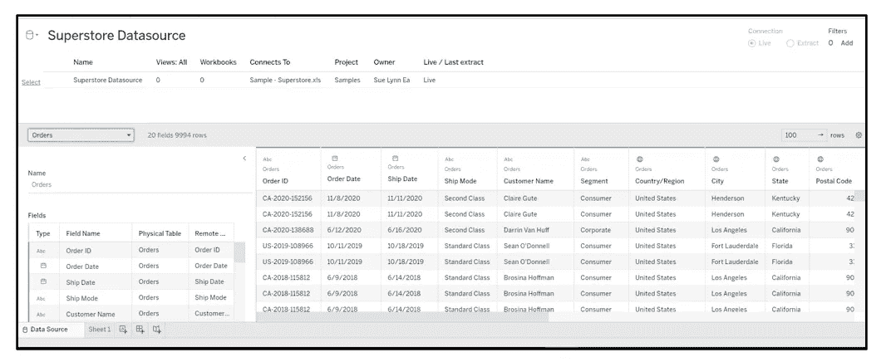

超市数据源(图片由作者提供)

Tableau 附带的示例超级商店数据源是一家销售家具、办公用品和技术产品的全球零售连锁店，每行包含每个订单的订单详细信息和信息，如运输模式、客户名称、地区、城市、州、产品类别、子类别等。这个数据集中总共有 20 个字段和 9994 行或记录。

现在，假设我们在一个场景中，您扮演商店经理的角色，利益相关者希望获得以下信息:

**(1)哪个品类的产品最赚钱？**

**(2)哪个类别在各个地区/州的表现更好？**

**(3)随着时间的推移，利润&销售趋势如何？**

让我们看看如何从我们的数据集中获得利益相关者要求的信息，并构建一个图表来可视化它们并获得答案！

## (5)建筑可视化

我们将从所需的最简单的信息开始构建— **哪一类产品最有利可图？**

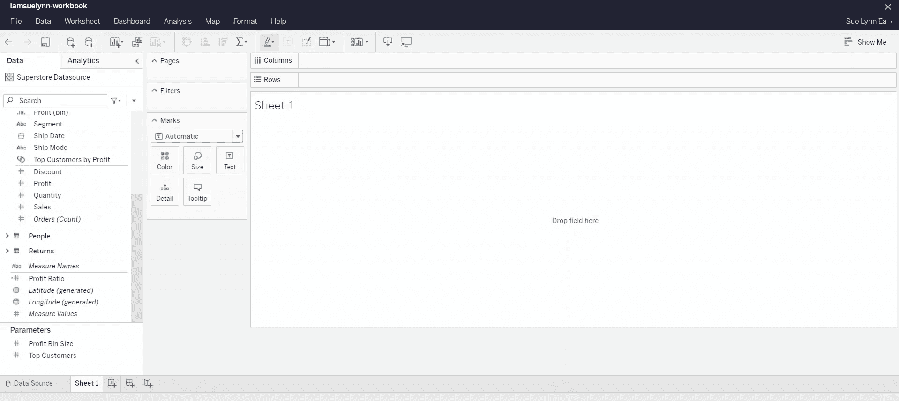

图表 1:按类别划分的利润(按作者划分的 Gif)

我们将构建一个高层次的概览来查看所有商店按类别细分的总体利润。

步骤 1:将列[ category ]从数据窗格拖到列架中。

第 2 步:将[sum(profit)]从数据窗格拖到行架上。

*~请注意 Tableau 如何基于所选*的测量名称&值自动创建视图

步骤 3:在右上方，有一个演示选项，它是 Tableau 根据所选的测量名称和值提供的关于可以使用的其他选项的建议。例如，在我们的场景中，建议使用饼图、条形图、打包气泡图等。单击“打包气泡”选项，查看图表如何变换。

第 4 步:将[sum(profit)]添加到标记架下的标签图标，以在图表中显示利润值。

*   调整标注文本大小-右键单击标记架下的标注并选择编辑标注，高亮显示文本并选择字体大小。

第 5 步:使用图表颜色——右键单击标记架下的颜色，然后选择编辑颜色，选择您喜欢的颜色。

第 6 步:通过点击文本<sheet>重命名标题，重命名为——按类别盈利。</sheet>

步骤 7:从工具栏上的 fit 图标将视图设置为整个视图，将可视化效果置于中心。

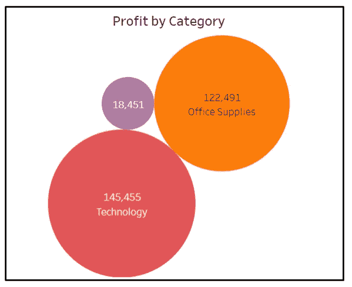

图表 1:按类别分类的利润(按作者分类的图片)

从包装泡沫图中，我们可以立即看出，根据泡沫的大小，“技术”类别的利润最高，而“家具”类别的利润最低。这表明超市的盈利能力高度依赖于科技产品，其次是办公用品。

祝贺你，你刚刚完成了你的第一个可视化画面！🤗

接下来，让我们更深入地探讨一下，在每个地区/州，哪个类别的表现更好？在新的工作表中构建这个新视图，通过底部的图标添加一个新的工作表。

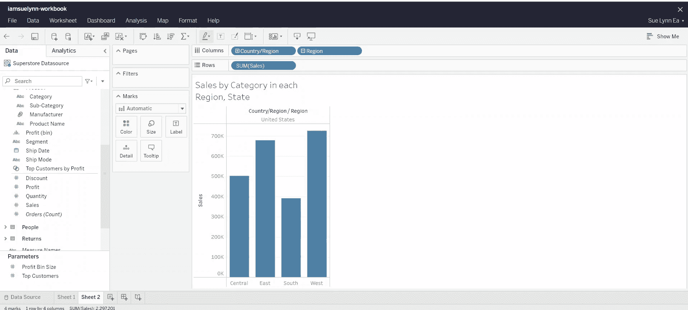

图表 2:各州各地区分类销售情况(作者 Gif)

层次结构概念可用于确定按地区和按州的销售业绩。例如，在我们的场景中，可以根据位置从较高的级别创建层次结构:区域→州→城市。

步骤 1:将[国家/地区]、[地区]、[类别]列从数据窗格拖到列架上。

第 2 步:将列[sum(Sales)]从数据窗格拖到行架上。

步骤 3:根据类别向图表添加颜色—将[类别]拖到标记架下的颜色图标上。

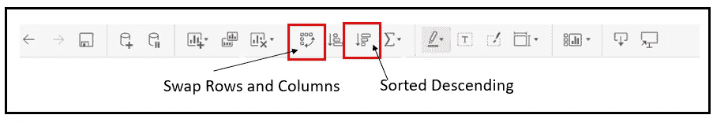

Tableau 工具栏(图片由作者提供)

第 4 步:交换行和列——Tableau 有一个快速功能，可以立即将行切换到列，将列切换到行。要执行这些更改，只需选择工具栏上的“交换行和列”图标。

第 5 步:根据类别内的销售总额对条形进行降序排序——要执行这些更改，只需选择工具栏上的“降序排序”图标。

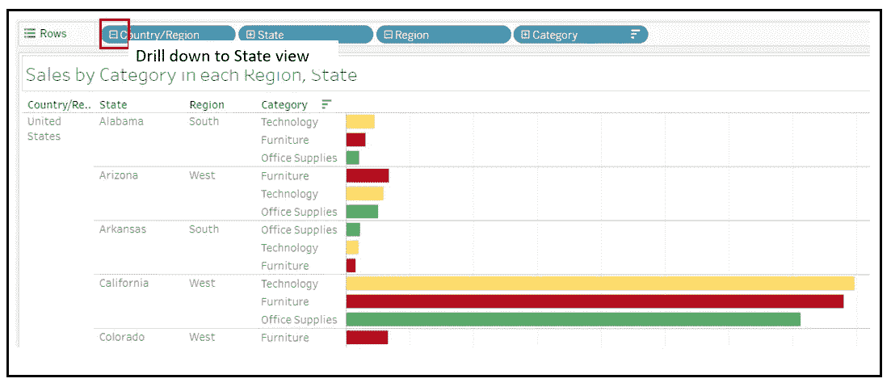

Tableau 中的层次结构(图片由作者提供)

步骤 6:通过单击字段[国家/地区]中的(+)按钮，从进入状态视图。

第七步:通过点击文本<sheet>重命名标题，重命名为——各州各地区分类销售。</sheet>

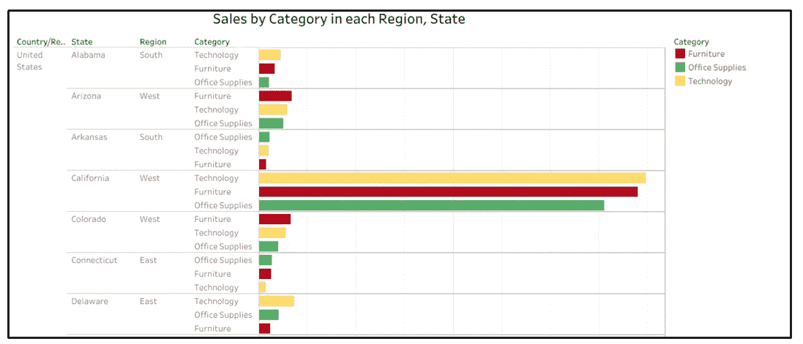

图表 2:各州各地区的分类销售额(图片由作者提供)

从层次结构图中，我们可以用一种交互式的方法来查看地区、州甚至城市的销售额。这使我们能够快速识别每个状态下哪些类别的表现更好。例如，技术产品在阿拉巴马州有更好的销售，家具在亚利桑那州表现更好。这让我们更好地了解每个州的不同需求，并有助于资源规划。

干杯！我们完成了第二个可视化的构建，并学习了如何使用层次结构来深入查看更详细的视图。😎

我们的下一个可视化添加了一个小的时间序列，用于确定— **利润&销售随时间的趋势是什么？**同样，从底部的图标为我们的第三次可视化添加一个新的工作表。

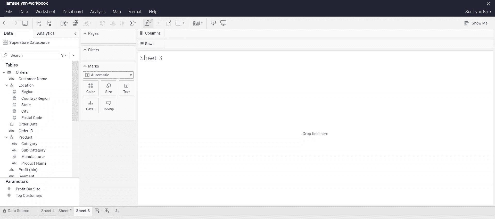

利润和销售趋势(作者 Gif)

该可视化引入的概念是参考线和趋势线，它们是“分析”选项卡下提供的功能。参考线向视图添加参考点。*(例如:如果您正在查看几个产品的每月销售额，添加一条参考线作为平均销售额标记可以让您快速查看每个产品相对于平均值的表现)*。趋势线突出显示趋势并显示基于数据的总体趋势，Tableau 提供不同的趋势线算法，包括—线性、对数、指数、多项式&幂。然后，Tableau 将根据选择的算法构建一个线性回归模型。现在让我们进入构建第三视图所需的步骤。

步骤 1:将列[Year(Order Date )]从数据窗格拖到列架*中(注意，日期字段从年份开始，因为 Tableau 会自动为日期属性创建一个层次结构)。*

步骤 2:向下钻取到月份字段并删除季度字段。

步骤 3:将[sum(Sales)]和[sum(Profit)]列从数据窗格拖到行架上。

第四步:切换到分析标签，并添加平均线和趋势线。

*   将“平均线”从“分析”选项卡拖到视图中，然后选择“表格”
*   将趋势线从分析选项卡拖到视图中，并选择“线性算法”

第五步:在马克卡下面为利润和销售额图表选择一种颜色。

第六步:通过点击文本<sheet>重命名标题，重命名为——利润和销售趋势。</sheet>

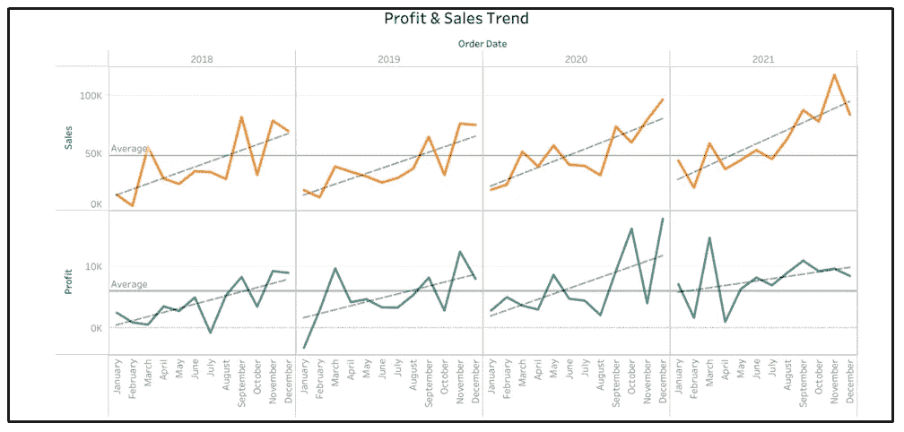

图表 3:利润和销售趋势(图片由作者提供)

在这张图表中，我们可以看到销售额和利润呈上升趋势，利润和销售额在接近年底时逐渐增加。此外，高层视图显示，每年 10 月份的销售额都会有所下降。这是一个可以被研究以识别新的商业机会的领域。

太好了！我们完成了第三次可视化的构建，并学习了如何使用 analytics 选项卡上的可用功能。😜接下来，我们将创建第一个仪表板，它将所有 3 个视图合并成一个仪表板。

## (6)构建最终仪表板

首先，我们没有添加新工作表，而是从工作区底部的图标中选择“添加新仪表板”。

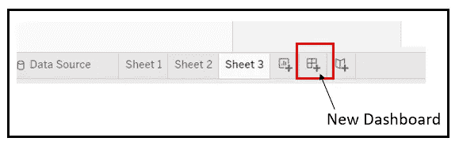

在 Tableau 中添加新仪表板(图片由作者提供)

仪表板是一种很好的方式来呈现一个或多个视图，包括在每个工作表、文本、图像、网页等中开发的可视化。请注意，在仪表板页面上，我们可以看到左侧已经开发的所有三个表单。要将所有 3 个视图添加到仪表板中，只需将工作表拖动到仪表板区域。

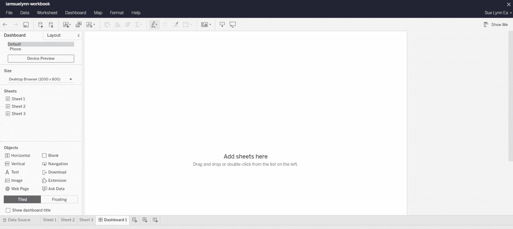

构建仪表板(Gif by Author)

第 1 步:将所有 3 张表拖动到仪表板区域。

*   请注意，第一个视图会自动填充整个仪表板区域。
*   调整每个可视化的大小

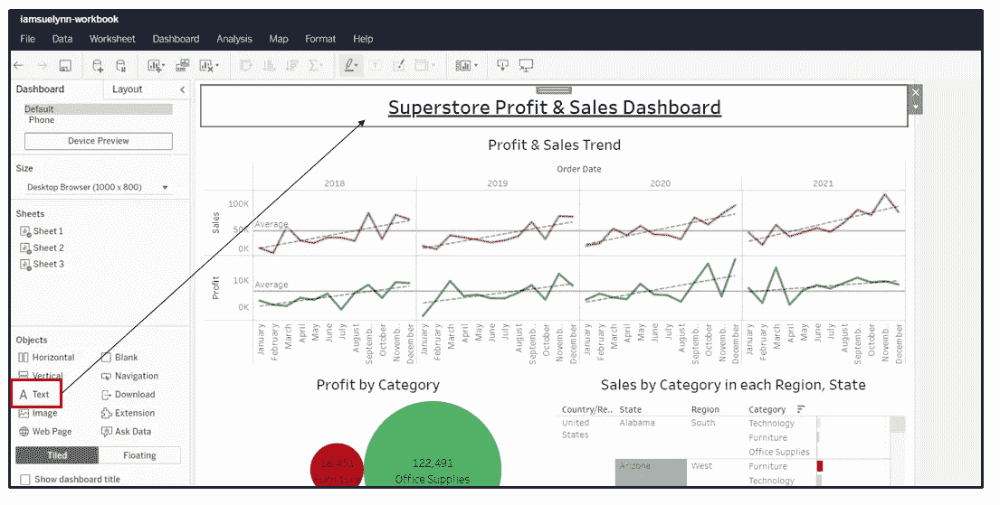

使用“文本”添加标题(图片由作者提供)

步骤 2:通过将文本对象拖入仪表板视图来添加标题。给一个标题:超市利润和销售仪表板。

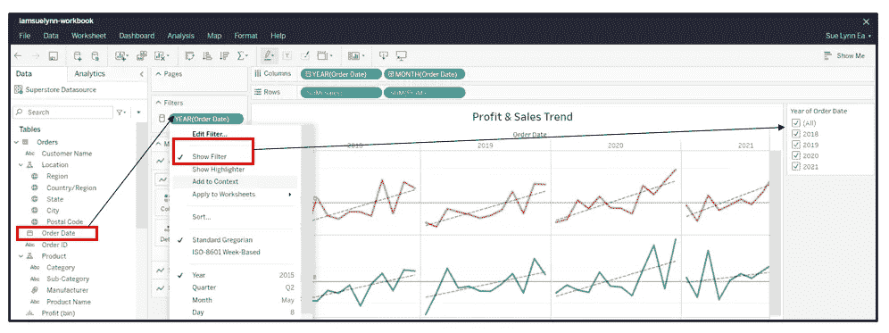

向视图添加过滤器(按作者排列的图像)

步骤 3:添加过滤器

*   要添加过滤器，请导航回我们的第三张可视化工作表。
*   将[订单日期]拖至过滤器架，并选择按年份过滤。
*   右键单击属性[YEAR(Order Date)]并选择 show filter，一个交互式过滤器将被添加到右侧的视图中。
*   请注意，工作表中被筛选的内容也将反映在仪表板工作表中。

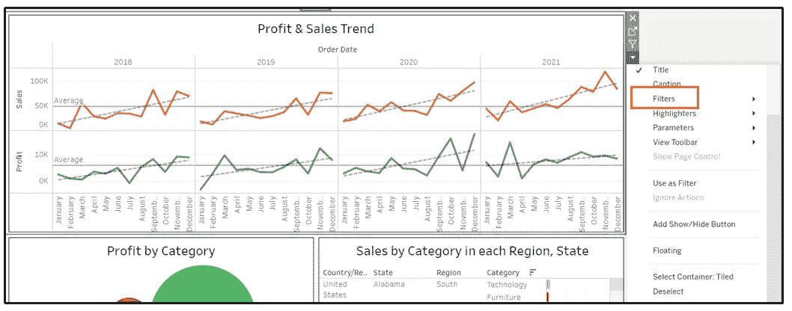

在仪表板视图中添加过滤器(按作者排序的图像)

步骤 4:从仪表板筛选

*   切换回仪表板选项卡，通过选择第三个可视化效果→过滤器→订单日期年份上的下拉选项来添加过滤器
*   试着摆弄一下过滤器，你注意到了什么？该过滤器仅适用于利润和销售趋势图。
*   要使过滤器也适用于其他可视化，只需选择“订单年数据过滤器”→“下拉选项”→“应用于工作表”→“全部使用此数据源”。

第五步:此外，美化你的仪表板，从布局选项卡添加颜色，边框，填充。

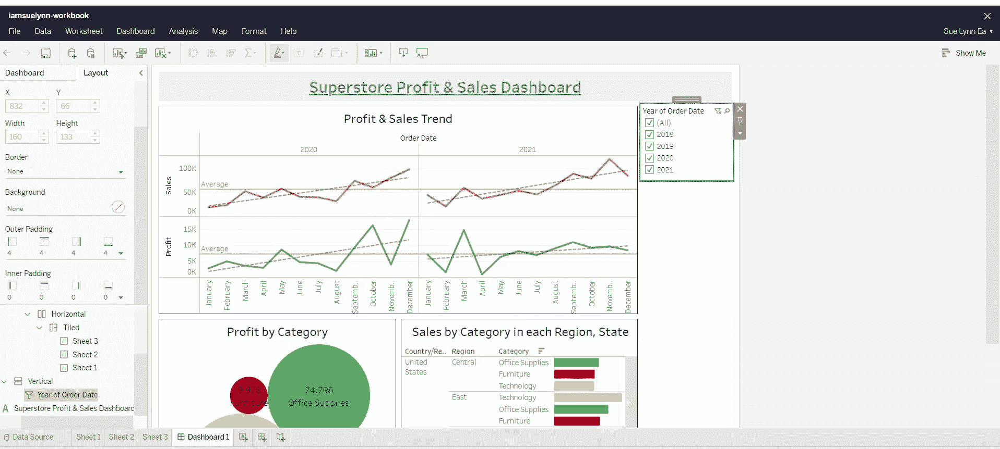

构建最终仪表板(图片由作者提供)

干得好！我们最终构建了一个仪表板，它将我们的可视化结合到一个添加了交互式过滤器的视图中。😄

除了在 Tableau 中构建仪表板，用户还可以选择将他们的视图组合成一个故事。Tableau 中的故事是一个或多个工作表或仪表板的遍历，每个视图或仪表板都被视为一个故事点。如果你想了解更多关于 Tableau 的故事，你可以参考 [Tableau 帮助页面](https://help.tableau.com/current/pro/desktop/en-us/stories.htm)上的文档。

## 结论:

数据可视化仍然是数据科学家需要的一项重要技能，我认为这是一项容易学习的技能，但要成为一名优秀的讲故事者需要时间来掌握，方法是构建一个能够吸引观众注意力并传递正确信息的可视化工具。为了培养这些技能，需要大量的实践、阅读、观察和参考其他仪表板设计。最后，在您开始学习数据可视化之前，了解您正在使用的工具，熟悉该工具，从那时起，您可以慢慢提高您的技能。

*感谢你阅读我的文章，如果你喜欢并愿意支持我:*

*   *跟我上* [*中*](https://iam-suelynn.medium.com/) 🙆🏻
*   通过我的[推荐链接](https://iam-suelynn.medium.com/membership)成为 Medium 会员🙋

参考和链接:

[1][https://www . interaction-design . org/literature/book/the-encyclopedia-of-human-computer-interaction-2nd-ed/data-visualization-for-human-perception](https://www.interaction-design.org/literature/book/the-encyclopedia-of-human-computer-interaction-2nd-ed/data-visualization-for-human-perception)

[[2]科尔·努斯鲍默·克纳弗利奇(2015)。用数据讲故事:商业专家数据可视化指南](https://www.storytellingwithdata.com/)

[3][https://help . tableau . com/current/guides/get-started-tutorial/en-us/get-started-tutorial-connect . htm](https://help.tableau.com/current/guides/get-started-tutorial/en-us/get-started-tutorial-connect.htm)