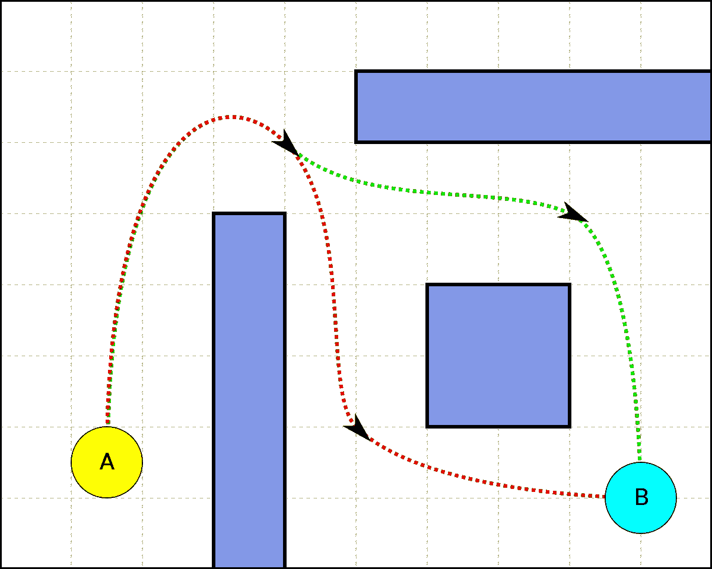
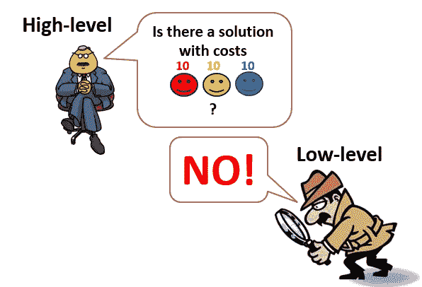
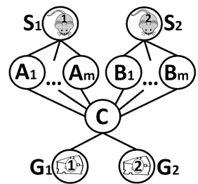

# 从 A*到泥灰(第一部分——MAPF)

> 原文：<https://towardsdatascience.com/from-a-to-marl-part-1-mapf-d4c0796ce1af?source=collection_archive---------21----------------------->

几个机器人，绝望地等待算法来建议他们如何在这个世界上行动。图片来自 [Unsplash](https://unsplash.com/photos/JEfwd_OkQGE) 。

## 对人工智能规划理论与当前多智能体系统强化学习研究之间的联系的直观高层次概述

在过去的十年中，强化学习和多智能体强化学习算法的研究取得了迅速的进展。有人可能会认为这是由于深度学习的兴起及其架构在 RL 任务中的使用。虽然在某种程度上这是真的，但 RL 的基础在于人工智能规划理论(已经发展了 50 多年)，RL 可以被认为是被公式化为学习系统的**规划问题。然而，RL 和规划理论之间的联系似乎很模糊，因为前者主要与当今大多数从业者的深度学习有关。**

这一系列文章旨在从经典的寻路问题开始，对我们正在处理的世界进行严格的**假设**(确定性的、集中式的、单代理等)。)和**逐渐放弃**假设，直到我们以泥灰问题结束。在这个过程中，我们将看到几种适合不同假设的算法。然而，我们总是假设**代理是合作的**。换句话说，他们一起行动来实现一个共同的目标。

值得注意的是，本系列将集中在从 A*到 MARL 的“多代理系统路径”上。这将通过阐明我们想要解决的问题和我们对我们所处的世界所做的假设来实现。它当然不会是对所有算法及其在每个主题上的改进的深入回顾。

具体来说，我将回顾最优多智能体寻路(第 1 部分)、经典规划([第 2 部分](https://omrikaduri.github.io/2021/08/07/Part-2-AI-Planning.html))、不确定性下的规划([第 3 部分](https://omrikaduri.github.io/2021/08/07/Part-3-Planning-Under-Uncertainty.html))以及部分可观测的规划([第 4 部分](https://omrikaduri.github.io/2021/08/07/Part-4-Planning-Under-Uncertatinty-and-Partial-Observability.html))。然后，我将结束我们在 RL 的旅程，并将其推广到多智能体系统([第 5 部分](https://omrikaduri.github.io/2021/08/07/Part-5-MARL.html))。我将挑选有代表性的算法和想法，并在需要时向读者推荐深入的评论。

**第 1 部分—路径查找**

A 和 b 之间的两条最短路径[图片来源](https://informatika.stei.itb.ac.id/~rinaldi.munir/Matdis/2010-2011/Makalah2010/MakalahStrukdis2010-016.pdf)。

寻路的根本问题是**寻找两点之间的最短路径。**具体来说，在寻路中，我们假设我们要为一个**单智能体**解决问题。此外，我们假设:

1.  时间是离散的，一次只能采取一个动作。
2.  动作是确定性的和无持续时间的，即应用动作是即时的，并且它将通过确定性函数来改变状态。
3.  我们对世界有全面的了解，即障碍物在哪里，有多少个点，等等。

当然，我们还做了其他假设(即代理是合作的，而不是自利的)。然而，我的目标是只明确地写出那些我们很快就会试图放弃的假设。

人工智能中用于解决寻路问题的经典算法是 A*。给定一个加权图，A*维护一个从起始节点开始的路径树，并根据启发式算法一次扩展这些路径的一条边，直到到达目标。如果您对图、试探法和 A*还不熟悉，请点击链接查看对[图](https://www.redblobgames.com/pathfinding/grids/graphs.html)和 [A*](https://www.redblobgames.com/pathfinding/a-star/introduction.html) 的精彩介绍。

**推广到多智能体路径发现(MAPF)**

A*解决了单智能体寻路问题。但是，在许多现实世界的应用中，我们要处理多个代理。因此，MAPF 举例说明了为所有代理**找到最短路径**以到达他们的目标**而没有冲突**的问题(即，没有几个代理可以同时在同一位置)。

**我们所说的“最短”是什么意思？**

对于单个代理，我们寻找它需要执行的最少数量的动作来达到它的目标。对于多个代理，目前有两个主要的路径长度度量标准:

1.  **成本总和** —听起来，简单地将所有代理路径的成本相加。
2.  最大完工时间 —取最大单个代理成本。

显然，针对每个度量进行优化将会产生不同的最短路径解决方案。我将把重点放在优化成本总和的算法上。

**指数搜索空间**

幸运的是，A*时间复杂度是多项式的(给定一个好的启发)。通常，在计算机科学中，多项式运行时间被认为是有效的。能不能推广到多智能体，保持多项式时间复杂度？

首先，我们需要记住一个* [分支因子](https://en.wikipedia.org/wiki/Branching_factor)。图的分支因子是每个节点的子节点数。对于具有单个代理的 A*,其中代理在每个时间步执行一个动作(来自 **b** 动作),分支因子是 **b** 。对于有 **k** 个代理的 A*，在每个时间步，我们需要考虑所有代理(k)的所有可能行动(b)，留给我们一个 b^k **的分支因子。对于一个有 5 个可能动作(等待，或向右/向左/向上/向下移动)的简单网格世界，20 个代理的分支因子是 **5 ⁰** =95，367，431，640，625。显然，把 A*简单地推广到 MAPF 是不可行的。此外，MAPF 已经被证明是 NP 难的。**

**A*改进**

那么，我们如何解决这个指数分支因子呢？早在 2010 年，[Stanley](https://ojs.aaai.org/index.php/AAAI/article/view/7564)提出了一个简单而强大的想法——让我们试着将问题分成更小的子问题，并解决每个子问题！具体来说，他提出了一个名为**独立性检测(ID)** 的迭代算法，该算法首先为每个代理单独搜索最短路径，并检查冲突代理。当发现几个冲突的代理时，它们被合并成一个*组。*重复这个重新计划和合并组的过程，直到所有*组*的计划之间没有冲突。尽管该算法没有改善 A*的最坏情况时间复杂度，但事实上，它通过最大独立子问题中的代理数量将运行时间减少到指数级。

然而，对于仅由几十个代理组成的依赖组的问题，我们仍然有一个非常昂贵的搜索空间来探索。

所以[斯坦德利](https://ojs.aaai.org/index.php/AAAI/article/view/7564)建议修改搜索空间。正如我们现在所知，在 A*的每个时间步，我们*为所有代理的所有可能动作生成*节点。然后，我们*扩展*具有最小 f 值(当前路径成本和未来成本的启发式预测之和)的节点。生成的成本高于最优成本的节点称为**剩余节点。**对 A*的一个重要增强是避免生成多余的节点。

斯坦德利避免产生多余节点的方法叫做**算子分解(OD)** 。OD 建议为代理商申请订单。当扩展一个节点时，OD 只应用第一个代理的移动，引入一个**中间节点。**在中间节点，仅考虑下一个代理的移动，从而产生进一步的中间节点。当最后一个代理动作被展开时，生成一个**常规节点**。

所以基本上，算子分解用树的宽度换取深度，希望一个好的启发式算法可以避免多余节点的产生。

另一个解决剩余节点生成问题的算法是 [**增强型部分扩展 A* (EPEA*)**](https://www.jair.org/index.php/jair/article/view/10882) **。**尽管这里没有解释 EPEA*，但重要的是要注意，实际上已经表明，给定关于域的*先验*知识，EPEA*在避免生成过剩节点的任务上优于 OD。

**移动到另一个空间**

以上所有算法都在代理状态空间上执行 A*。尽管 A*增强确实显著提高了算法的性能，但对于具有许多代理(超过 100 个)的大型地图，通常计算量仍然很大。因此，过去十年开发的两种 MAPF 算法试图改变它们搜索的状态空间。两者都可视为**两级解算器。**

[**【递增成本树搜索(ICTS)**](https://www.ijcai.org/Proceedings/11/Papers/117.pdf)

ICTS 结合了高层次和低层次的求解器。高级求解器搜索**递增成本树(ICT)。**在 ICT，每个节点包含每个代理路径允许的长度为 k 的成本向量。ICT 根节点包含一个向量，该向量具有每个代理的最短路径长度的成本(不考虑其他代理)。然后，低层求解器的工作是验证是否可以通过在高层求解器定义的成本下为每个代理单独规划来找到联合解决方案。值得注意的是，ICTS 低级解算器不为代理一起规划，而是只检查给定成本下单个代理路径之间的冲突。

如果低级解算器未能在给定成本向量下找到不冲突的最短路径，则高级解算器通过生成 k 个 ICT 节点来扩展 ICT 根，其中每个节点对应于将一个代理的成本增加 1。高级解算器执行 ICT 的广度优先搜索(这保证找到最优解)。

3 个代理的 ICTS 算法图解。*摘自* [*罗尼斯特恩的*](https://ronistern.wixsite.com/home) *幻灯片。*

对我来说，ICTS 会做得更好，这感觉很奇怪，但是通过对低级解算器的良好实现(使用 [MDD](https://www.ijcai.org/Proceedings/11/Papers/117.pdf) )和对 ICT 节点的修剪技术，ICTS 可能会胜过其他最优 MAPF 算法。

值得注意的是，ICTS 并没有神奇地消除时间复杂性的指数因素。它仍然是指数级的，但取决于另一个因素——信息和通信技术的深度。因此，直观地，当单独规划时，由于最优解单代理路径成本将进一步远离单代理路径成本，高级求解器将需要建立更深的 ICT。ICTS 时间复杂度与深度成指数关系。

[**基于冲突的搜索(CBS)**](https://www.sciencedirect.com/science/article/pii/S0004370214001386#:~:text=In)

CBS 也是一个两级求解器，在不同的状态空间中搜索。具体来说，它在**冲突空间中搜索。**

CBS 将代理与**约束相关联。**为特定的代理人 **(a)** 定义一个约束，一个他必须在特定的时间步( **t** )避开的位置( **v** )。一个约束由一个元组( **a** ， **v，t** )表示。

对于每个单个代理，CBS 低级解算器搜索在给定一组约束的情况下一致的最短路径。CBS 高级解算器搜索**约束树(CT)。**CT 是一棵二叉树，其中每个节点包含一组约束和一个与约束一致的解(一致意味着满足所有约束)。低级解算器为**每个单个代理找到一致的解决方案。**然后，CBS 高级解算器检查单代理最短路径中的冲突。如果没有发现冲突，我们就找到了最优方案。然而，如果发现冲突，高级解算器分割相应的 ct 节点并生成具有避免我们发现的冲突的约束的节点。在 CT 上执行*最佳优先搜索*可以保证找到最优解。

一个典型的 MAPF 例子。CBS 将在时间步长 2 的位置 C 为其中一只老鼠生成一个带有约束的节点，然后将找到一个最佳的连接路径。图片来自[哥伦比亚广播公司的论文](https://reader.elsevier.com/reader/sd/pii/S0004370214001386?token=2CA53FCC985635AFCF45CBD419B2C69B9E6D6C41659E8A8918445C819C4FF0AB45CA7D2767F35367ADF7DA101F50189B&originRegion=eu-west-1&originCreation=20210821160939)。

在 CBS 开发的 6 年间，它作为一种强大的 MAPF 算法出现，并被建议进行许多改进。正在解决的主要缺点是它的运行时间与它需要解决的冲突数量成指数关系。因此，在有许多冲突的拥挤问题中，它将表现不佳。

**将 MAPF 归结为另一个 NP 难问题**

MAPF 的另一个有趣的工作是通过简化到其他 NP 难题。其背后的想法是，在过去的几十年里，研究人员已经为其他 NP 难题开发了强大的算法。因此，我们不需要开发 MAPF 算法，只需要减少 MAPF，使用现有的解算器。

我不会深究这些减少的细节，但我会声明这一系列的研究最近被证明可以产生非常强大的 MAPF 算法。成功解决 MAPF 约简的 NP-Hard 问题的部分列表包含[布尔可满足性](https://www.andrew.cmu.edu/user/gswagner/workshop/IJCAI_2016_WOMPF_paper_5.pdf) (SAT)、[混合整数规划](https://ed-lam.com/papers/bcpmapf2019.pdf) (MIP)、[约束规划](https://ojs.aaai.org/index.php/ICAPS/article/view/3471/3339) (CP)。

那么…我应该使用什么 MAPF 算法呢？

嗯，看情况。基本上，如果你知道你的 MAPF 域的具体性质(它是一个大图吗？有多少特工？代理人拥挤吗？)，目前的研究有一些关于使用什么算法的指导方针。然而，为 MAPF 问题选择最合适的算法目前正在研究中。最近，[对不同的 MAPF 算法](https://ojs.aaai.org/index.php/SOCS/article/view/18560)进行了全面的分析，并指出一些算法优于其他算法的情况。

**动态问题需要不同的算法**

一个自主交叉路口模型，其中每辆车都是一个代理。交集旨在最小化由几个代理之间的协调引起的*延迟。视频来自* [*瞄准项目*](https://www.cs.utexas.edu/~aim/) *。*

MAPF 的动态变体将其扩展到广泛有趣的实际问题(如[自主路口管理](https://www.jair.org/index.php/jair/article/view/10542))。这是 MAPF 的一个非常有趣的变体。但是，在这一系列文章中，我们将重点放在从 A*到 MARL 的“多代理路径”上，不会深入探讨。我鼓励好奇的读者阅读关于[在线 MAPF](https://ojs.aaai.org//index.php/AAAI/article/view/4769) 和[终身 MAPF](https://arxiv.org/abs/1705.10868) 的论文。

**结论**

我们从单个智能体的最短路径搜索这一基本问题出发，将其推广到多智能体的路径搜索问题。我们看到，即使对于那个相对“简单”的问题，我们假设对世界、离散时间和确定性行为有全面的了解，找到一个最优解也是困难的，甚至可能是棘手的。然后，我们听到了 MAPF 对动力学问题的有趣概括。当然，MAPF 还有许多其他有趣的变体，比如自利的代理人，但我关注的是经典的 MAPF 问题。

[接下来](https://omrikaduri.github.io/2021/08/07/Part-2-AI-Planning.html)，我们将看看 AI 规划的广义问题，这是当我们的代理可以做的不仅仅是移动，而且需要完成更复杂的目标时的情况。然后，我们将继续去除越来越多的假设，直到我们最终得到多智能体强化学习。

**确认**

我要感谢我的理学硕士论文导师罗尼·斯特恩。我对这一领域和本博客系列的大部分内容的兴趣源于他在本古里安大学教授的关于多代理系统的精彩课程，我有幸参加了该课程。