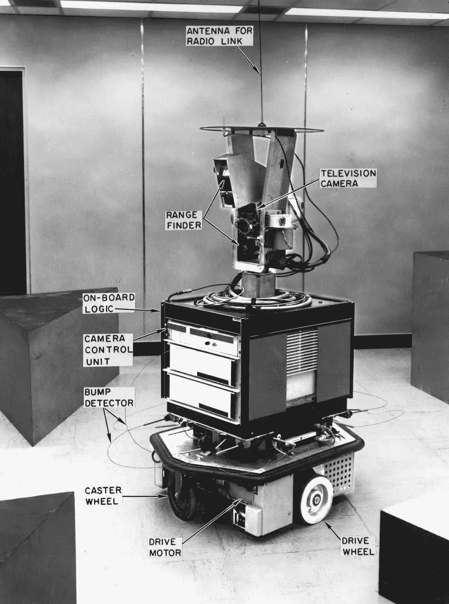
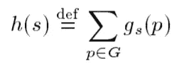
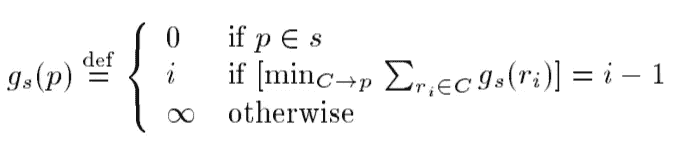
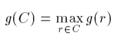

# 从 A*到 MARL(第二部分——人工智能规划)

> 原文：<https://towardsdatascience.com/from-a-to-marl-part-2-ai-planning-8ae635a6491d?source=collection_archive---------33----------------------->


许多智慧生物一起计划。人造的也能做到吗？图片来自 [Unsplash](https://unsplash.com/photos/wD1LRb9OeEo) 。

## 对人工智能规划理论与当前多智能体系统强化学习研究之间的联系的直观高层次概述

在过去的十年中，强化学习和多智能体强化学习算法的研究取得了迅速的进展。有人可能会认为这是由于深度学习的兴起及其架构在 RL 任务中的使用。虽然在某种程度上这是真的，但 RL 的基础在于人工智能规划理论(已经发展了 50 多年)，RL 可以被认为是被公式化为学习系统的**规划问题。然而，RL 和规划理论之间的联系似乎很模糊，因为前者主要与当今大多数从业者的深度学习有关。**

这一系列文章旨在从经典的寻路问题开始，对我们正在处理的世界进行严格的**假设**(确定性的、集中式的、单代理等)。)和**逐渐放弃**假设，直到我们以泥灰问题结束。在这个过程中，我们将看到几种适合不同假设的算法。然而，我们总是假设**代理是合作的**。换句话说，他们一起行动来实现一个共同的目标。

值得注意的是，本系列将关注从 A*到 MARL 的“多代理系统路径”。这将通过阐明我们想要解决的问题和我们对我们所处的世界所做的假设来实现。它当然不会是对所有算法及其在每个主题上的改进的深入回顾。

具体来说，我将回顾最优多智能体寻路([第 1 部分](https://omrikaduri.github.io/2021/08/07/Part-1-MAPF.html))、经典规划(第 2 部分)、不确定情况下的规划([第 3 部分](https://omrikaduri.github.io/2021/08/07/Part-3-Planning-Under-Uncertainty.html))和部分可观测的规划([第 4 部分](https://omrikaduri.github.io/2021/08/07/Part-4-Planning-Under-Uncertatinty-and-Partial-Observability.html))。然后，我将结束我们在 RL 的旅程，并将其推广到多智能体系统([第 5 部分](https://omrikaduri.github.io/2021/08/07/Part-5-MARL.html))。我将挑选有代表性的算法和想法，并在需要时向读者推荐深入的评论。

**第二部分——人工智能规划**

在第 1 部分中，我们处理了寻路问题，我们的目标是为一组代理找到从起点到终点的最短路径。在这篇文章中，我们将讨论人工智能规划，它可以被认为是 MAPF 问题的推广。总的来说，计划的任务是找到一系列动作，这些动作将把**开始状态**转变为**目标状态**。我们将从单智能体规划问题开始，并推广到多智能体，类似于我们上一篇文章中的路径。

**人工智能规划简史**

从早期开始，人工智能规划的圣杯就是创造一个独立于领域的问题解决者。这个独立于领域的问题求解器有望解决所有类型的规划问题，从玩游戏到制作 cookies。1959 年， [GPS 论文](http://bitsavers.informatik.uni-stuttgart.de/pdf/rand/ipl/P-1584_Report_On_A_General_Problem-Solving_Program_Feb59.pdf)介绍了一种通用问题求解器，可以解决由[良构公式](https://en.wikipedia.org/wiki/Well-formed_formula)表示的问题。它是为[定理证明](https://en.wikipedia.org/wiki/Automated_theorem_proving)而设计的。然而，由于几个原因，它不太适合规划问题。例如，如何表达并发事件和生成的计划的偏好是不直观的。

这项工作激励了斯坦福研究所的研究人员，他们已经在机器人[Shakey](https://en.wikipedia.org/wiki/Shakey_the_robot)上工作，开发了一种适合于规划的格式良好的语言和领域独立的规划算法，称为 [STRIPS](https://en.wikipedia.org/wiki/Stanford_Research_Institute_Problem_Solver) 。几年来，其他几种语言和规划者被提出。具有不同表达能力的几种不同语言的发展，使得规划者之间的比较成为一项困难的任务。一项标准化人工智能规划的尝试在 1998 年完成，叫做 PDDL。



机器人 Shakey，60 年代的一个高影响力研究项目。哦，你问为什么是“Shakey”？嗯，“[抖得厉害，绕着](https://www.computerhistory.org/revolution/artificial-intelligence-robotics/13/289)转。图片来自[维基百科](https://en.wikipedia.org/wiki/Shakey_the_robot#/media/File:SRI_Shakey_with_callouts.jpg)。

**经典人工智能规划假设**

在经典规划问题中，我们处理**可以完全观察到的确定性环境。目前，我们还假设只有一个代理。**

**规划领域定义语言(PDDL)**

PDDL 是一种我们用来定义初始状态、目标状态和我们的代理可以执行的动作的语言。本质上，PDDL 问题是由**条件、动作、初始状态和目标状态定义的。**一组条件描述了一种状态，以及由它们引起的**效果**和它们适用的**先决条件**所定义的动作。

一个著名的规划例子是[空运货物装载问题](https://www.researchgate.net/publication/326779615_The_air_cargo_load_planning_problem_-_a_consolidated_problem_definition_and_literature_review_on_related_problems)。我们将关注一个简单的问题，有两个城市(TLV 和纽约)，两架飞机(P2 的 P1)和两种不同的货物(C2 的 C1)，我们希望在这两个城市之间中转。在我们的初始状态，我们在 TLV 有 C1 和 P1，在纽约有 C2 和 P2。我们的目标是让 C1 在纽约，C2 在 TLV。让我们在 PDDL 写吧。

```
Init(At(C1, TLV) ∧ At(C2, NYC) ∧ At(P1, TLV) ∧ At(P2, NYC))Goal(At(C1, JFK) ∧ At(C2, SFO))
```

现在是时候定义行动了。基本上，我们希望我们的飞机能够装载货物，在城市之间飞行，然后卸载货物。非常简单。它可以简单地定义为:

```
action(LOAD(cargo,plane,city),
    precondition: At(cargo,city) ∧ At(plane,city)
    effect: ¬At(cargo,city) ∧ In(cargo,plane))action(FLY(plane,from,to),
    precondition: At(plane,from)
    effect: ¬At(plane,from) ∧ At(plane,to))
```

请注意，即使这可能是不直观的，一旦飞机装载货物，货物就不再被定义为在城市，如“装载”动作的效果所定义的。此外，您可能已经注意到“卸载”操作不见了。你自己能想出来吗？

**重要提示—** 为了全面定义 PDDL 的问题，我们需要正确定义我有意跳过的其他一些东西。例如，我们需要定义我们正在使用的类型(货物、飞机等。).你会在真实的 PDDL 问题定义中遇到这种情况，但我相信这并不是理解一个经典人工智能问题的本质所必需的。如果你对完整的定义感兴趣，我[写在纸条上——瞎搞](http://stripsfiddle.herokuapp.com?d=AXTAHgFSKyQ4xK5Xw&p=AwHemmuFeYFqaFaYF&a=BFS)。你可以解决它，找到 6 步解决方案！

**人工智能规划算法**

既然我们知道如何**定义**我们的计划问题，是时候学习如何**解决**它了。解决规划问题的简单方法是首先将所有适用的动作应用于初始状态，以创建一组后续状态。然后，我们将继续对这些后继者应用所有适用的动作，直到我们达到目标状态。然而，由于适用的动作数量可能相当大，这种幼稚的方法是不切实际的。它是否让你想起了不知情的图搜索算法，比如 BFS/DFS？是的，就是这样。因此，人们可能会要求遵循一个 A*知情的方法，并使用启发式。事实上，从经典的寻路中，我们知道添加一个好的可接受的启发式算法对于有效地解决大型状态空间问题是必不可少的。还有，我们记住，对于 A*到**保证最优性，启发式必须是**[](https://en.wikipedia.org/wiki/Admissible_heuristic#:~:text=In%20computer%20science%2C%20specifically%20in,current%20point%20in%20the%20path.)**(即永远不要高估达到目标的成本)。**

****独立于领域的计划者的试探法****

**然而，一个问题出现了。我们怎样才能提出一种启发式方法，以一种独立于问题的方式，对特定问题的知识进行编码？我们需要一种方法，从 STRIPS 问题定义中自动生成一个可接受的启发式函数。一种简单的方法是将我们的规划问题 P 简化为一个更简单的问题 P `,计算 P `的最优成本，并将其用作启发式算法。P 的一个可能的放松是移除所有动作“负面影响”(即，使条件为假的所有影响)。例如，在 p '中，即使在将货物装载到飞机上之后，它也停留在机场中。尽管这种方法确实会产生可接受的启发式算法，但是计算它可能仍然是 NP 难的，这错过了启发式算法的目标，即有效地通知搜索**朝向目标**。**

**1998 年， [HSP 算法](https://bonetblai.github.io/reports/aips98-competition.pdf)提出了一种近似启发式的方法。本质上，它建议**解耦**目标条件，并计算来自给定状态的动作数量，以分别满足每个条件。那么，启发值将是实现所有条件的所有动作的总和。**

****

**状态 s 中的启发式值是实现目标 g 的每个条件 p 的动作的总和。**

**为了计算满足每个条件的动作数量，我们迭代地更新下面的函数，直到观察到其值没有变化:**

****

**达到一个条件的动作数 p 迭代更新，直到函数不变。**

**在每一次迭代中，我们应用其相应的前提条件在当前状态下成立的所有动作。**

**假设目标条件是独立的，并且解决宽松的 p '问题结果给我们提供了信息启发，正如在各种 AI 规划竞赛中所示，这对于解决大型问题是有用的。然而，这些假设是有代价的。这种试探是不允许的，因为独立的目标条件可能包含多余的行动。**

**然而，如果我们选择用解决问题的数量来换取最优化，我们可以创造一个信息量较少但可接受的启发。我们可以采用上述启发式算法的一种变体，称为“最大启发式算法”。基本上，我们不是对所有独立的目标条件求和，而是取要满足的动作数量最多的条件。**

****

**通过计算实现目标的一个独立条件的最大动作数，给出一个可接受的启发。**

****倒退！****

**无论我们使用的是允许还是不允许的启发式算法，我们仍然需要为每个状态计算它，以便在启发式搜索算法中使用它，例如 A*。为每个状态**计算这个启发式算法消耗大约 80%的搜索时间**。一个简单而有效的解决方案是**反转搜索方向**。向后搜索，从目标状态到起始状态，称为**回归搜索**。**

**直观上，回归法就是“我要吃饭，所以我需要做晚饭，所以我需要有吃的，所以我需要买菜，所以我需要去商店”的过程。在每一步，它选择一个可能有助于满足目标条件之一的动作。**

**使用回归方法的关键点是初始状态在搜索过程中不会改变，因此我们可以利用已经计算的启发式算法，并且更有效地执行搜索。关于使用 HSP(表示为 HSP-r)的回归方法的实现，我忽略了一些微妙的地方。更多细节可在 [HSP-r 文件](https://bonetblai.github.io/reports/ecp99-hspr.pdf)中找到。**

****超越搜索算法****

**正如我们之前了解到的，在 MAPF 问题中，为一个问题开发的算法可能对解决另一个问题有用。在人工智能规划中也是如此，通过将规划问题转化为一个[布尔可满足性问题](https://en.wikipedia.org/wiki/Boolean_satisfiability_problem) (SAT)来给出一个强大的规划器。一个这样的计划者叫做 [SatPlan](https://www.cs.rochester.edu/u/kautz/satplan/) 。**

****快速回顾****

**在继续讨论多代理系统之前，让我们快速回顾一下。我们看到了一种语言来表示规划问题及其相应的领域，称为条形或 PDDL。然后，我们看到了为这些规划问题构建独立于域的求解器的几种方法。其中一些是天真的不知情的搜索算法，其他的稍微复杂一点。当然，这只是现有算法中试图解决人工智能规划问题的一小部分。查看关于人工智能规划的[章节，了解更多详情。](http://aima.cs.berkeley.edu/newchap11.pdf)**

****推广到多智能体规划(MAP)****

**在我们的物流玩具示例中，有 2 架飞机。我们可以很容易地想象现实世界中数百架或更多飞机的物流问题。正如我们之前在 MAPF 的上下文中所学的，对多智能体系统的简单概括会导致相对于智能体数量而言更加困难的问题。地图也是如此。因此，我们需要找到一种有效的方法来利用现实生活中多代理系统的一个共同事实——不同的代理可能是松散耦合的。这种将规划问题分解成子问题并合并其解决方案的重复出现的主题是大多数多智能体系统的核心的基本思想。事实上，我们已经在 MAPF 看到了它，我们也将在下一篇关于 MMDP 的文章中看到它。**

**此外，现实生活中的多智能体规划可能涉及几个不同的团体，它们合作实现一个共同的目标，但是希望保持某些信息(即，动作和条件)的**私密性**。考虑一个军事秘密任务，其中多个机器人在敌后协调工作。我们不希望每个机器人包含所有其他机器人的完整信息(例如机器人的数量、位置、设备等)。)，因为它可能会受到损害。我们也可以想到几家企业为了一个特定的使命而合作，不想泄露私人信息。**

**目前，据我所知，在多智能体规划领域，多智能体规划的隐私保护算法是一个非常活跃的研究领域。虽然它的动机是隐私保护，但它对分布式多智能体规划是有用的，这为松散耦合的多智能体规划问题提供了有效的算法。这是一个有趣的工作，但我们将跳过它，继续我们的道路上的泥灰岩。我建议好奇的读者去读一下[脱衣舞娘](https://www.aaai.org/Papers/ICAPS/2008/ICAPS08-004.pdf)、 [MAFS](https://www.jair.org/index.php/jair/article/view/10909/26012) 和[安全 MAFS](https://www.ijcai.org/Proceedings/15/Papers/219.pdf) 。**

****结论****

**我们从独立于领域的规划问题的定义开始。在快速的历史回顾和一个条状玩具问题之后，我们学习了基于搜索的算法，如何从规划问题中自动提取启发，以及搜索方向的重要性。然后，我们看到了解决规划问题的非基于搜索的算法。我们研究了广义 MA-STRIPS 问题的情况，并看到了它在分布式规划者和隐私保护条件下的应用。**

**[下一个](https://omrikaduri.github.io/2021/08/07/Part-3-Planning-Under-Uncertainty.html)，我们将继续我们的 MARL 之路，因为我们将放弃关于确定性动作和状态的全部知识的假设。特别是，我们将讨论马尔可夫决策过程(MDP)和部分可观测 MDP (POMDP)，正如我们将在后面看到的，它们是基于模型的 RL 的基础。**

****确认****

**我要感谢我的理学硕士论文导师罗尼·斯特恩。我对这一领域和本博客系列的大部分内容的兴趣源于他在本古里安大学教授的关于多代理系统的精彩课程，我有幸参加了该课程。**