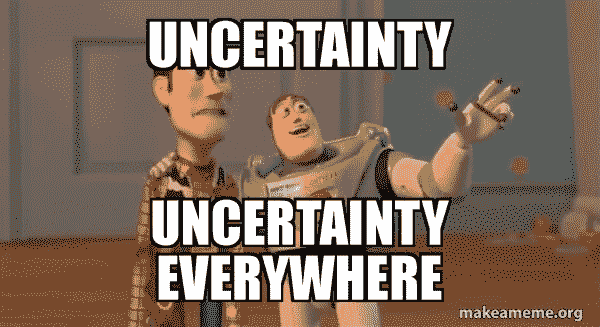
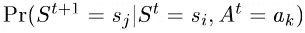
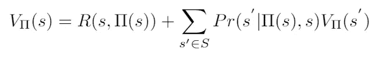
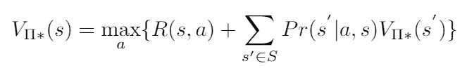
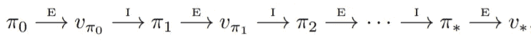
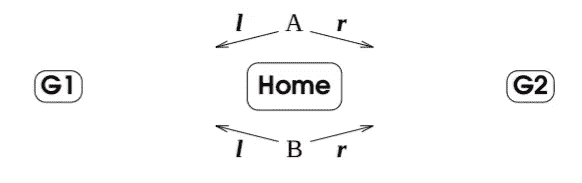

# 从 A*到 MARL(第三部分——不确定性下的规划)

> 原文：<https://towardsdatascience.com/from-a-to-marl-part-3-planning-under-uncertainty-ae2e2578591d?source=collection_archive---------35----------------------->

在计划的时候，我们不应该只依靠好运气。我们如何为不确定性做计划？图片来自 [Pixabay](https://pixabay.com/photos/dice-dice-cup-happiness-gambling-5214804/) 。

## 对人工智能规划理论与当前多智能体系统强化学习研究之间的联系的直观高层次概述

在过去的十年中，强化学习和多智能体强化学习算法的研究取得了迅速的进展。有人可能会认为这是由于深度学习的兴起及其架构在 RL 任务中的使用。虽然在某种程度上这是真的，但 RL 的基础在于人工智能规划理论(已经发展了 50 多年)，RL 可以被认为是被公式化为学习系统的**规划问题。然而，RL 和规划理论之间的联系似乎很模糊，因为前者主要与当今大多数从业者的深度学习有关。**

这个博客系列旨在从经典的寻路问题开始，对我们正在处理的世界进行严格的**假设**(确定性的、集中式的、单代理等)。)和**逐渐放弃**假设，直到我们以泥灰问题结束。在这个过程中，我们将看到几种适合不同假设的算法。然而，我们总是假设**代理是合作的**。换句话说，他们一起行动来实现一个共同的目标。

值得注意的是，本系列将关注从 A*到 MARL 的“多代理系统路径”。这将通过阐明我们想要解决的问题和我们对我们所处的世界所做的假设来实现。它当然不会是对所有算法及其在每个主题上的改进的深入回顾。

具体来说，我将回顾最优多智能体寻路([第 1 部分](https://omrikaduri.github.io/2021/08/07/Part-1-MAPF.html))、经典规划([第 2 部分](https://omrikaduri.github.io/2021/08/07/Part-2-AI-Planning.html))、不确定条件下的规划(第 3 部分)和部分可观测的规划([第 4 部分](https://omrikaduri.github.io/2021/08/07/Part-4-Planning-Under-Uncertatinty-and-Partial-Observability.html))。然后，我将结束我们在 RL 的旅程，并将其推广到多智能体系统([第 5 部分](https://omrikaduri.github.io/2021/08/07/Part-5-MARL.html))。我将挑选有代表性的算法和想法，并在需要时向读者推荐深入的评论。

**第 3 部分——不确定情况下的规划**

前一章讨论了确定性世界中的计划，计划者可以生成一系列**行动**，知道如果它们以正确的顺序执行，目标将必然**产生**结果。现在，我们转向**非确定性**世界的情况，在这里我们必须解决当事情不按预期发展时该怎么办的问题。

有人可能会对这个问题提出天真的解决方案。例如，我们可以(通过一些传感器)监控“故障”,并在这种情况下启动重新计划。然而，对于许多现实世界的应用程序来说，在每次失败时重新计划是不可取的，因为这样太慢了。另一方面，我们可以为计划执行过程中可能出现的每一种可能情况制定一个反应计划。它将生成一个快速且健壮的计划，然而为具有许多状态的非平凡域找到该计划将是非常昂贵的。因此，我们寻求在规划时处理**不确定性**并产生稳健计划的算法。

几乎任何事物都存在某种程度的不确定性。规划的时候怎么才能考虑进去呢？图片来自 [makeameme](https://makeameme.org/meme/uncertainty-uncertainty-everywhere-631709047c) 。

在上一篇文章中，我们学习了如何用长条/PDDL 来表示一个规划问题。我们用一组动作和条件定义了域。具体问题用初始状态和目标状态来定义。然而，如何扩展这种语言以包含不确定性并不简单。

规划社区采用了**马尔可夫决策过程(MDP)** 对问题建模。MDP 定义如下:**状态**、**动作、转移函数、**和**奖励函数**。状态和动作很简单，本质上与经典规划问题相同。**转移函数**为(s1，a，s2)的每个三元组分配一个概率。它定义了在状态 **s1** 应用动作 **a** 后，在状态 **s2** 结束的概率。****奖励功能**简单地分配处于一种状态并执行一个动作的奖励。**

**将规划问题建模为 MDP 的关键假设是 [**马尔可夫属性**](https://en.wikipedia.org/wiki/Markov_property) **。**基本上，它说**鉴于现在**，未来独立于过去。这就是为什么我们只能用(s1，a，s2)的三元组来定义它，认为(s1，a)是现在，s2 是可能的未来。如果我们不做这样的假设，我们将很难定义转移函数，因为我们需要将每条可能的路径与概率联系起来。然而，对于一个给定的问题，确定马尔可夫性质是否成立并不容易。一个玩具的例子将从这个 [MSE 答案](https://math.stackexchange.com/a/89414)考虑一个有两个红色球和一个绿色球的骨灰盒。两次抽签都是从骨灰盒中进行的，没有更换。只知道最后一次抽球的颜色与知道两次抽球包含的信息不同。然而，在这篇文章中，我们将假设马尔可夫性质成立。我建议好奇的读者去读读[马尔科夫或者不读马尔科夫](https://www.files.ethz.ch/isn/124233/kap1086.pdf)。**

**形式上，根据马尔可夫性质，**转移函数**定义为:**

****

**过渡函数。它模拟了在状态 Si 中应用动作 Ak 时到达状态 Sj 的概率。**

**假设问题公式化为由状态、动作、奖励函数和转移函数组成的 MDP，我们需要定义什么是该 MDP 的最优解？经典的规划问题是从初始状态到目标状态的一系列动作。然而，单一的动作序列不适用于不确定性问题。因此，我们寻求一个从状态映射到行动的**策略**。**最优策略**是使**期望**报酬最大化的策略。换句话说，在所有可能的政策中，遵循每个州的最优政策平均会产生**的最高回报。当我们以这种方式定义最优策略时，你看到我们所做的隐含假设了吗？在某种程度上，我们假设了一个理性的代理人。****

****你们中的一些人可能想知道 MDP 是如何概括规划问题的？嗯，典型的经典规划问题可以被视为 MDP，其中世界是确定的，并且只有一个目标(例如，除了目标状态为 1 之外，所有状态的回报都为 0)。****

****在继续研究旨在为 MDP 找到最佳策略的算法之前，请注意，我们现在处理的不确定性仅源于**控制误差**，而非**传感器误差**。我们假设我们**完全观察到状态**，并且在观察中有确定性。****

******寻找最佳策略******

****求解 MDP 的算法旨在找到最优策略。我们把它定义为平均来说，从每个州获得最高回报的政策。在数学上，我们希望找到最大化一个**价值函数**整体状态的策略。对于策略(由 *π* 表示)在状态 s 的价值函数是:****

********

****策略 ***π*** 的值函数，在状态 s 评估****

****寻找最优策略归结为解决以下优化问题:****

********

****最优策略是为每个状态选择最大化价值函数的行动的策略。****

****如果阅读这些公式感觉令人生畏或不直观，就想一想它们的基本意思。他们建议，为了找出在每个状态下采取什么行动来实现最优政策，我们只需要对所有可能的状态进行平均，从该状态开始遵循政策，收集奖励，并根据出现的概率来衡量每个奖励。在你的头上运行它，它会突然看起来像一个非常天真的蛮力解决方案。****

******重要提示—******

1.  ****通常，会使用该公式的一个变体，将其扩展到考虑**折扣奖励**。折扣奖励基本上意味着提前获得的奖励比推迟获得的奖励更有价值，这是许多现实世界问题的情况。****
2.  ****MDP 可以分为两类——有限和无限时域 MDP。简单来说，有限时域 MDP 处理的是执行时间跨度有限的问题，无限时域 MDP 处理的是“永远运行”的问题。在这篇文章中，我主要关注有限的 MDP。****

****这个优化问题最常见的算法，名为价值迭代和策略迭代，使用的是动态规划。主要思想是通过递归地将问题分解成更简单的子问题来解决问题。****

******值迭代&策略迭代******

******策略迭代**算法在两个阶段之间交替——策略**评估**和策略**改进**。在评估阶段，我们将当前策略视为固定的，并计算每个状态的值函数。在改进阶段，我们根据上一阶段评估的价值函数修改策略，为每个状态选择最佳动作。我们执行几个评估和改进步骤**,直到策略没有变化**。换句话说，改进步骤不会改变在每个状态下要采取的行动。执行的阶段顺序如下:****

********

****由策略迭代算法执行的一系列评估和改进阶段。****

******值迭代**算法建议将这两个阶段合并为一个阶段。从设置为零的初始值函数开始(即，所有状态都具有值 0)，它通过迭代每个状态的所有可能的动作并选择最大化当前奖励加上下一状态值函数的动作来更新值函数。它这样做，直到所有状态的值函数都没有变化。然后，使用最优值函数，通过选择使每个状态的值函数最大化的动作来构造最优策略。****

****因为这两种算法都是众所周知的，所以我不会深入算法实现的细节。我建议您查看一些简单而又不错的[策略迭代](https://github.com/dennybritz/reinforcement-learning/blob/master/DP/Policy%20Iteration%20Solution.ipynb)和[值迭代](https://github.com/dennybritz/reinforcement-learning/blob/master/DP/Value%20Iteration%20Solution.ipynb)算法实现。此外，尽管这些算法倾向于在相对较少的迭代中收敛，但是每次迭代都要求计算时间至少与状态空间的大小成**线性。这通常是不切实际的，因为**状态空间随着感兴趣的问题特征的数量呈指数增长**。这个问题有时被称为“维数灾难”。******

****推广到多代理 MDPs****

**将我们描述的 MDP 推广到多智能体的情况，需要我们记住一个关于智能体本质的重要假设。我们假设他们是合作的，因为他们一起行动来实现一个共同的目标。关于**非合作**智能体的研究是介于博弈论和人工智能之间的一个令人兴奋的研究领域。它着重于两个(或更多)具有不同兴趣的主体，通过它们的报酬函数形式化，共存于同一个世界，并且它们的行为可以影响彼此的报酬。这是题外话，但我希望下次再写。**

**回到我们的多智能体 MDP (MMDP)与合作智能体的操作，以最大化联合奖励功能，有人可能会问，为什么我们不能把它建模为一个“大 MDP”，其中行动空间是所有智能体的联合行动空间，状态空间是所有智能体的联合状态空间。这当然是可行的，但是做了一个关键的假设，这个假设对于许多多智能体系统是不合适的。它假设存在一个**中央实体**，该实体为所有代理导出计划并向他们发送各自的最优策略。因此，研究人员将注意力集中在分散的情况下，在这种情况下，每个代理人都应该得出自己的最优策略。在这种情况下，主要的挑战是如何将多个单独的最优策略组合成一个最优的联合策略。**

**事实上，MMDP 为多智能体系统指定了一个分散的 MDP，其中每个智能体都知道**完全问题 MDP** (所有状态，所有动作，以及所有智能体给定动作的状态之间的相应转移函数)。因此，每个代理都可以通过自己求解完全 MDP 来找到最优策略。从这些最优政策中，人们可以组成**联合政策。**联合策略是每个状态到每个代理动作之间的映射。然而，从几个单独导出的最优策略构建一个联合策略能确保最优吗？不幸的是，没有。既然最优策略不是唯一的，我们怎么能确定所有的代理都遵循相同的最优策略呢？下面是一个简单而著名的例子，它说明了由于以分散的方式得出多个最优策略而需要协调。两个代理(命名为 A 和 B)解决联合 MDP。当两个代理移动到相同的位置(G1 或 G2)时奖励是 1，当他们移动到不同的位置时奖励是 0。这个 MDP 有两个最优策略，第一个是双方都选择去 G1，第二个是双方都选择去 G2。然而，如果代理人 A 选择了第一个最优策略，而代理人 B 选择了第二个，会发生什么呢？**

****

**一个双代理协调问题。[图片来源](https://www.cs.toronto.edu/~cebly/Papers/tark96.pdf)。**

**这个问题一般被称为**协调问题。**解决这个问题主要有三种途径。首先，我们可以假设代理的能力是 [**沟通**](https://www.jair.org/index.php/jair/article/view/10304/24597) (“让我们左转！”).第二， [**共享约定**](https://www.cs.toronto.edu/~cebly/Papers/tark96.pdf) 可以被定义，这将导致对所有代理的最优策略的一致选择(“按字典顺序选择动作。如果左右都可选，那就选左！”).第三，如果没有给出共享约定或通信，代理可以 [**学习协调**](https://www.cs.toronto.edu/~cebly/Papers/tark96.pdf) 是否可以玩几个游戏(“啊-啊。我看到你在这种情况下选择向左。下次见！”).我们不会深入研究解决协调问题的不同算法。我鼓励你点击上面的链接获取更多信息。**

**然而，即使我们假设要解决的协调问题，让每个代理解决完整的 MDP 带来了很高的计算成本。正如我们在 MAPF 和多智能体规划中已经看到的，如果天真地对待多智能体问题，智能体数量的线性增长会导致计算复杂性的指数增长。一般来说，对于有多个代理的系统，求解每个代理的完全 MDP 是很困难的。此外，所有代理都知道所有其他代理、状态和动作的假设在许多现实世界系统中并不成立。**

**因此，建议采用 [DEC-MDP](https://arxiv.org/pdf/1301.3836.pdf) (分权 MDP)的模式。与 MMDP 相反，它不假设每个代理都知道完整的 MDP。它只假设联合 MDP 状态可以从所有智能体的状态集合中导出。但是我们怎样才能最优地解决一个 MDP 问题呢？不幸的是，已经证明[分散的多代理 MDP 很难最优求解](https://arxiv.org/pdf/1301.3836.pdf) (NEXP-Complete)。然而，已经有人提出了几种尝试，以一种易于处理的方式为**特定情况**的分散化 MDP 建模。**

**例如， [**变迁独立**](https://www.jair.org/index.php/jair/article/view/10395/24898)(TI-MDP)是 DEC-MDP 的一个特例，其中一个代理的状态变迁独立于其他代理的状态和动作**。本质上，当一个代理采取的行动不影响其他代理时就是这种情况。注意，这并不意味着我们可以将 n 个代理人的 MDP 分解成 n 个不同的 MDP。只有当我们进一步假设**奖励独立，**时，我们才能分解它，这基本上意味着奖励函数可以表示为 n 个不同奖励函数的总和，其中每个奖励函数只知道单个代理的行为。一个激励人心的例子是一组机器人一起扫描一个领域来寻找东西。如果另一个代理人之前已经扫描了一块给定的土地，那么扫描这块土地的奖励会更低，因此奖励不是独立的。TI-MDP 的最佳算法在他们的论文中有详细描述。****

****虽然 IT-MDP 和 DEC-MDP 的其他子类产生最优策略，但一般的 DEC-MDP 并非如此。因此，许多研究致力于寻找近似解。****

******DEC-MDP 的近似解******

****寻找 DEC-MDP 的近似解可以分为两种方法。第一种方法通过测量它们的解与最优解相比有多差来建议保证解质量的算法。Bernstein 在 2005 年的博士论文[中提出了一种收敛到ε-最优解的算法。第二种方法提出了没有性能保证的算法。我们将在下一章讨论 DEC-POMDPs 的算法时，看到这种方法的算法。](https://citeseerx.ist.psu.edu/viewdoc/download?doi=10.1.1.77.9024&rep=rep1&type=pdf)****

******结论******

****MARL 的一个重要里程碑是本文中介绍的不确定性概念。首先，我们定义了如何使用 MDP 对规划问题的不确定性进行推理，以及什么是不确定性下的最优概念。然后，我们学习了旨在找到最优策略的算法。最后，我们看到了几个将 MDP 推广到多代理设置的框架。这些框架的不同之处在于几个假设，如中央权威的存在和代理之间的相互依赖性。一般来说，分散多主体 MDP 的最优解很难找到，我们简要讨论了寻找近似解的方法。****

****[接下来](https://omrikaduri.github.io/2021/08/07/Part-4-Planning-Under-Uncertatinty-and-Partial-Observability.html)，我们将放弃另一个关于可观测性的关键假设，引入部分可观测 MDPs (POMDP)框架。类似于我们在本章中所做的，我们将看到这个 POMDP 框架对分散式多代理情况的推广。然后，我们将准备在马尔结束我们的旅程。****

******鸣谢******

****我要感谢[罗尼·斯特恩](https://ronistern.wixsite.com/home)，我的理学硕士论文导师。我对这一领域和本博客系列的大部分内容的兴趣源于他在本古里安大学教授的关于多代理系统的精彩课程，我有幸参加了该课程。****