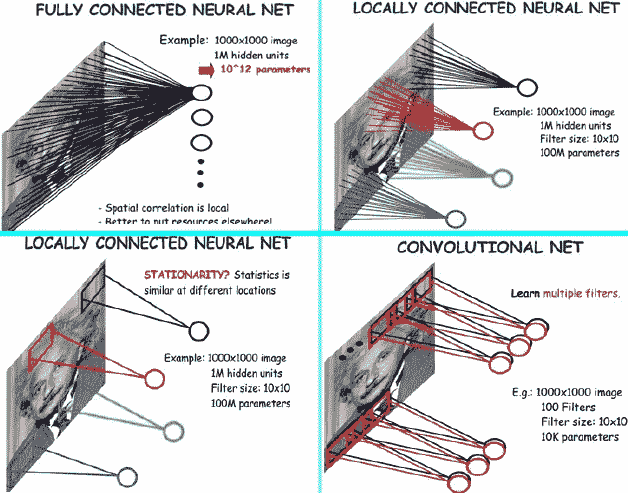
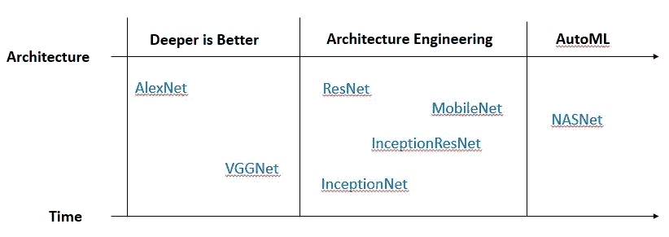
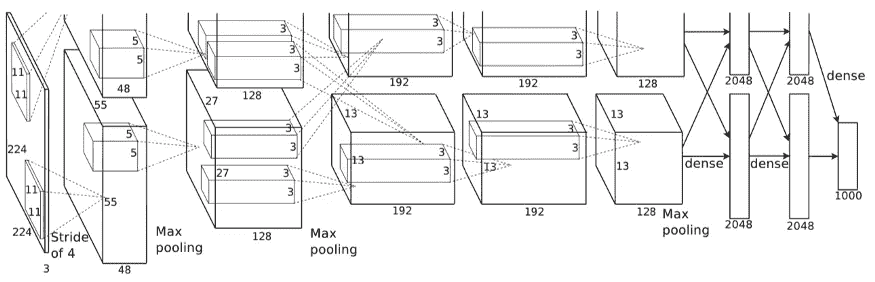
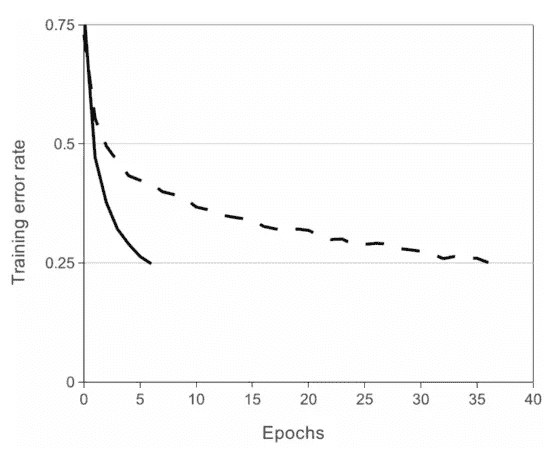
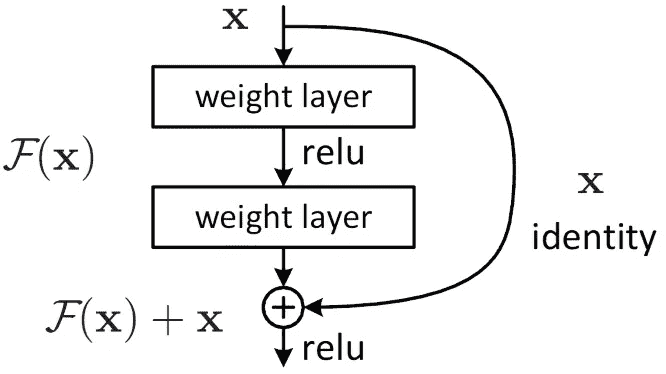
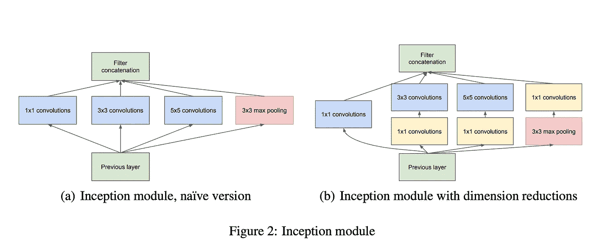
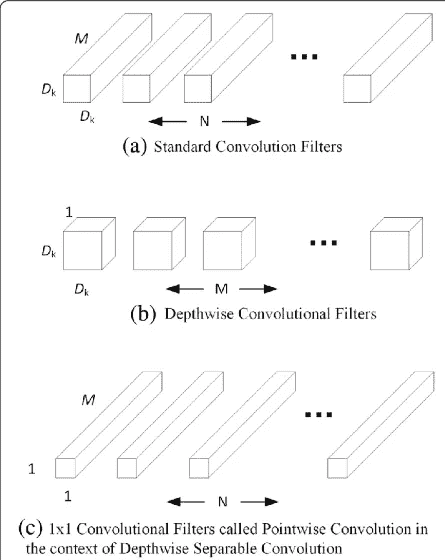

# 从 AlexNet 到 NASNet:卷积神经网络的简史和介绍

> 原文：<https://towardsdatascience.com/from-alexnet-to-nasnet-a-brief-history-and-introduction-of-convolutional-neural-networks-cf63bf3320e1?source=collection_archive---------10----------------------->

## 用 Keras 实现了一个简单的 ResNet

> 向昨天学习，为今天而活。
> 
> ——阿尔伯特·爱因斯坦

历史上，图像上的机器学习一直是一个巨大的挑战，直到 2012 年， [AlexNet](https://en.wikipedia.org/wiki/AlexNet) 赢得了 ImageNet 竞赛的一等奖，并得到了公众的关注。从那以后，卷积神经网络或 CNN 发展得如此之快，以至于 AlexNet 很快就成为了过去。在图像处理方面，CNN 已经大大超过了人类的表现。

然而，CNN 的概念早在 30 多年前就已经提出并付诸实践。CNN 或深度学习变得如此有效和流行的主要原因是过去十年数据和计算能力的丰富和民主化。

在接下来的几节中，我将首先谈谈为什么 CNN 要处理图像。然后，我将简要地向你介绍各种 CNN 类型，沿着时间和架构的演化轴。我还会讲一下 AlexNet，VGGNet，InceptionNet，MobileNet，ResNet，NASNet 这些有代表性的架构。最后，我将用一个我在 Keras 中实现的 ResNet 的简单实现来演示。

# 1.为什么 CNN 关注图像

## **1.1 图像上正常神经网络的问题**

每幅图像都有成千上万个像素，每个像素都被视为一个特征，这意味着对于一幅 1000 * 1000 的图像，有 1，000，000 个特征。对于正常的前馈神经网络，每一层都与前一个输入层全连接。

假设例如我们使用一个具有一百万个神经元的单层的普通前馈神经网络来处理图像，所需的参数数量是 1000 * 1000 * 10⁶ = 10。普通神经网络进行图像学习所需的参数太多了。

但是网络中参数太多的问题是什么？首先，它很容易过度训练，并且需要大量的数据来进行适当的训练。其次，训练和预测需要更多的内存和计算。

## **1.2 CNN 为什么工作**

让我们回到图像的主要特征。使 CNN 作用于图像的图像特征主要有两个，分别是**特征定位**和**特征独立于位置**。

**特征定位:**每个像素或特征与其周围的其他像素密切相关。例如，鼻子上的像素的相邻像素很可能也是鼻子的像素。

**特征位置无关:**每个特征都是相同的，不管它在图像中的什么位置。例如，不管鼻子在图像上的位置如何，它仍然是鼻子。

CNN 利用**局部连通网络** ( **特征定位**)的**共享参数** ( **特征位置独立**)解决了参数过多的问题，也称为卷积网。在前面的示例中，使用卷积网络可以将参数的数量从 10 个减少到 10 个。



[从神经网络角度看 CNN](https://arxiv.org/pdf/1706.09077.pdf)

## **1.3 CNN 的主要组件**

CNN 有 3 个主要组成部分，分别是**卷积**、**汇聚**和**全连接层**。

卷积层由**滤波器**和**步长**组成。**过滤器是本地连接的网络，每个网络学习图像的一些特定特征**。每个滤波器以配置的步长(称为步幅)在图像周围移动。例如，对于步长为 1 的大小为 10 * 10 的过滤器，每次过滤器窗口都会覆盖一个面积为 10 * 10 像素的图像，以计算像素值和参数之间的内积。并且它将在图像上水平和垂直移动 1 个像素(步幅)，直到它覆盖整个图像。

典型的池层[有两种类型](https://machinelearningmastery.com/pooling-layers-for-convolutional-neural-networks/)，分别是最大池层和平均池层。最大池层从每个窗口中选取最大值，平均池层从每个窗口中计算平均值。池层的直觉是增加滤镜的弹性。它还进一步减少了参数的数量，并施加了某种程度的正则化来减少过拟合。

完全连接层展平最后一个卷积层，并将神经元完全连接到输出层。你可以有多个完全连接的层。然而，全连接层的参数数目比卷积层的参数数目多得多。在典型的 CNN 中，来自全连接层的参数数量是整个网络的 60%到 80%。

# 2.CNN

自从 AlexNet 引起公众的注意以来，CNN 的发展经历了三个阶段，主题分别是我所说的**越深越好**、**建筑工程**和 **AutoML** 。每个阶段都有其代表性的网络架构。



CNN 的演变

## 2.1 越深越好

2.1.1 AlexNet

2012 年 AlexNet 参加 ImageNet 比赛[以 15.3%的错误率击败第二名 10.8%](https://en.wikipedia.org/wiki/AlexNet) 。



AlexNet 的架构。摘自 [AlexNet 论文](https://kr.nvidia.com/content/tesla/pdf/machine-learning/imagenet-classification-with-deep-convolutional-nn.pdf)

AlexNet 由 5 个卷积层、3 个最大池层和 2 个全连接层组成。AlextNet 的结构是用 2 个 GPU 拆分的，部分原因是因为当时的 GPU 内存不够大。

*激活功能*

AlexNet 是第一个使用 [**ReLU**](https://en.wikipedia.org/wiki/Rectifier_(neural_networks)) 作为激活功能，而不是[**Sigmoid**](https://en.wikipedia.org/wiki/Sigmoid_function)**功能的 CNN。ReLU 作为激活函数的引入大大提高了深度学习网络的训练速度。**

****

**ReLU vs 乙状结肠(虚线)。摘自 [AlexNet 论文](https://kr.nvidia.com/content/tesla/pdf/machine-learning/imagenet-classification-with-deep-convolutional-nn.pdf)**

***辍学***

**AlexNet 还在全连接层中使用了 [**Dropout**](https://medium.com/@amarbudhiraja/https-medium-com-amarbudhiraja-learning-less-to-learn-better-dropout-in-deep-machine-learning-74334da4bfc5) 。AlexNet 的退出使每个训练时期 50%的神经元失效。直觉上，辍学带来了两个好处。首先，它使每个神经元更加独立。其次，它就像每次训练一个子网络，最终结果是子网络的集合，这比单个大网络要好。**

**AlexNet 对全连接层应用 Dropout 的原因是，如前所述，来自全连接层的参数数量比来自卷积层的参数数量多得多。在完全连接的层上应用 Dropout 带来了一些正则化效果并减少了过度拟合。**

***数据扩充***

**AlexNet 输入图像的大小为 224 x 224，这些图像是从 ImageNet 的 256 x 256 图像中随机采样的。通过在比赛中进行这样的采样，AlexNet 将他们的训练数据量增加了 [2048 倍。](https://kr.nvidia.com/content/tesla/pdf/machine-learning/imagenet-classification-with-deep-convolutional-nn.pdf)**

****2.1.2 VGGNet****

**VGGNet 也在 2014 年的 ImageNet 比赛中声名鹊起。它的卷积层数比 AlexNet 多得多。**

****

**[VGG16 架构](https://neurohive.io/en/popular-networks/vgg16/)**

**除了更深层次的架构之外，VGGNet 的一些[引人注目的新概念](https://arxiv.org/pdf/1409.1556.pdf)是:卷积层大量使用的 3 x 3 滤波器(取代 5 x 5 或 7 x 7 滤波器，以具有更宽的扫描区域并减少参数数量)，非线性变换的 1 x 1 滤波器，在每个池层之后加倍通道数量，以恢复池层中丢失的信息。**

## **2.2 建筑工程**

****2.2.1 ResNet****

**当 CNN 的网络层数增加到一定数量时，CNN 的性能反而下降。原因是更深的网络更难优化[，因为众所周知的消失/爆炸梯度问题](https://arxiv.org/pdf/1512.03385.pdf)。**

****

**CNN 的性能随着层数的增加而降低。摘自 [ResNet 论文](https://arxiv.org/pdf/1512.03385.pdf)**

**有没有办法在避免渐变爆炸/消失问题的同时增加卷积层数？2015 年，发明了 ResNet 来解决这个问题。**

****

**[剩余学习](https://arxiv.org/pdf/1512.03385.pdf)**

**ResNet 引入了一个叫做[剩余学习](https://arxiv.org/pdf/1512.03385.pdf)的概念。直观上，每个剩余卷积层的输出至少与输入一样好。即。F(x) + x ≥ x。这种架构被证明可以很好地解决梯度问题。ResNet 的卷积层数最大可超过 1000 层。**

****2.2.2 收入网****

**在 [InceptionNet](https://arxiv.org/pdf/1409.4842v1.pdf) 之前，大多数改进 CNN 的方法是增加更多的卷积层。受益于谷歌卓越的工程实力， [InceptionNet](https://arxiv.org/pdf/1409.4842v1.pdf) 通过在卷积层中使用各种大小的滤镜，扭曲了卷积层的结构。**

**很难对所有图像都有一个最佳的过滤器尺寸，因为同一物体在不同的图像中可能具有非常不同的尺寸。InceptionNet 的主要思想是对同一对象使用不同大小的过滤器。直觉上，这个网络变得“更宽”而不是“更深”。**

****

**InceptionNet 架构。摘自[创意网论文](https://arxiv.org/pdf/1409.4842v1.pdf)**

**InceptionNet 经历了从 [v1 到 v4](/a-simple-guide-to-the-versions-of-the-inception-network-7fc52b863202) 。除了 v1，它的 v2 到 v4 版本通过[各种巧妙的技术](/a-simple-guide-to-the-versions-of-the-inception-network-7fc52b863202)降低了计算复杂度，提高了性能。它还与 ResNet 联合创建了 [InceptionResNet](/a-simple-guide-to-the-versions-of-the-inception-network-7fc52b863202) ，使网络**既“更宽”又“更深”**。**

**2.2.3 移动互联网**

**MobileNet 是谷歌的另一个 CNN 架构，试图将 InceptonNet 应用于移动设备。目的是减少参数和计算的数量，同时尽可能地保持性能。**

****

**MobileNet 中的深度可分卷积。摘自 [MobileNet 论文](https://arxiv.org/pdf/1704.04861.pdf)**

**MobileNet 推出了一种称为深度方向可分离卷积的滤波器架构，其主要思想是为不同的输入通道提供不同的滤波器。MobileNet 显著减少了参数的数量，因此所需的计算量通常仅为原始网络的 1/9，精确度略有下降。**

## **2.3 AutoML**

****2.3.1 NASNet****

**配备了丰富的计算能力和工程天才，谷歌推出了 [NASNet](https://arxiv.org/pdf/1707.07012.pdf) ，将寻找最佳 CNN 架构的问题框定为[强化学习](https://en.wikipedia.org/wiki/Reinforcement_learning)问题。**

**基本上，想法是搜索给定滤波器尺寸、**输出通道**、**步长**、**层数**等的**搜索空间的参数的最佳组合。在这种强化学习设置中，每次搜索动作后的奖励是在给定数据集上搜索到的架构的准确性。****

**[NASNet 在 ImageNet 竞赛中取得了最优秀的成绩](https://sh-tsang.medium.com/review-nasnet-neural-architecture-search-network-image-classification-23139ea0425d)。然而，NASNet 所需的计算能力如此之大，以至于只有少数公司能够利用相同的方法。**

# **示例:Keras 中的 ResNet 实现**

**我已经在 Keras 中从头实现了 ResNet 34，并使用它在 [CIFAR10 数据集](https://www.cs.toronto.edu/~kriz/cifar.html)中进行了训练和测试。参考请参考[笔记本。](https://github.com/ahhuisg/deep-learning-practice/blob/main/notebooks/resnet-keras.ipynb)**

**尽管有类似的实现，我仍然手动实现它，因为我想得到一些关于它的编码实践。我也想向你们展示和解释 ResNet 的内部运作。**

## ****剩余块****

**ResNet 的核心是剩余块。ResNet 中有两种基本残差块，一种输出通道数不变，另一种输出通道数加倍。**

**在通道数量保持不变的情况下，输入图像将通过 2 个 Conv2D 层，其大小保持不变，然后输出(残差)将添加到原始输入图像，作为该块的最终结果。**

**对于通道数量加倍的情况，输入图像将通过 Conv2D，输出图像宽度和长度减半。为了进行残差学习，原始输入图像的宽度和长度需要减半，其通道数通过填充增加一倍。直觉上，通道加倍和图像尺寸减半同时使得残余块能够以更大的粒度捕获特征。**

```
def _residual_block(self, x, num_output_channel):
    num_input_channel = K.int_shape(x)[-1] if num_output_channel == num_input_channel * 2:
        # number of output channel doubled. 3 things will happen:
        # 1\. The output image' width and length will be halved
        # 2\. The input image will go through a pooling layer with its width and length will be halved too
        # 3\. pad the number of channels of the input images for residual learning
        output_channels_doubled = True
        strides = (2, 2)
    elif num_input_channel == num_output_channel:
        # number of output channel remain the same
        # go through 2 convolution layers without changing image' size
        output_channels_doubled = False
        strides = (1, 1)

    conv1 = Conv2D(num_output_channel, 
                       kernel_size=(3, 3), 
                       strides=strides, 
                       padding='same', 
                       activation='relu')(x) conv2 = Conv2D(num_output_channel, 
                       kernel_size=(3, 3), 
                       strides=(1, 1), 
                       padding='same', 
                       activation='relu')(conv1) if output_channels_doubled:
        pooled_x = AveragePooling2D(pool_size=(2, 2),
                                        strides=(2, 2),
                                        padding = 'same')(x) padded_x = tf.pad(pooled_x,
                              [[0,0],
                               [0,0],
                               [0,0],
                               [num_input_channel // 2, num_input_channel // 2]]) else:
        padded_x = x #residual learning
    output_x = conv2 + padded_x return output_x
```

## **ResNet 配置**

**ResNet 34 具有 4 层残差块，每层分别具有 3、4、6 和 3 个残差块。对于每一层，输出通道的数量(num_filters)加倍，但是在该层内，每个残差块具有相同的数量。**

```
num_residual_blocks_arr=[3, 4, 6, 3],for num_residual_blocks in num_residual_blocks_arr:
    num_filters = num_filters * 2
    for _ in range(num_residual_blocks):    
        conv = self._residual_block(last_layer, num_filters)
        last_layer = conv
```

**在网络的末端，最后一个块被展平并连接到一个全连接的图层，用于标注输出。**

## **CIFAR10 上的结果**

**我已经在我的笔记本电脑中用 5 个纪元在 CIFAR10 数据集上训练了 ResNet。在测试集上准确率在 75%左右。**

```
Epoch 1/5
391/391 [==============================] - 2343s 6s/step - loss: 2.0021 - accuracy: 0.2924 - val_loss: 1.3157 - val_accuracy: 0.5139
Epoch 2/5
391/391 [==============================] - 2123s 5s/step - loss: 1.2212 - accuracy: 0.5572 - val_loss: 1.0442 - val_accuracy: 0.6267
Epoch 3/5
391/391 [==============================] - 2220s 6s/step - loss: 0.9501 - accuracy: 0.6587 - val_loss: 0.9108 - val_accuracy: 0.6772
Epoch 4/5
391/391 [==============================] - 2196s 6s/step - loss: 0.7628 - accuracy: 0.7299 - val_loss: 0.8016 - val_accuracy: 0.7155
Epoch 5/5
391/391 [==============================] - 2109s 5s/step - loss: 0.6145 - accuracy: 0.7821 - val_loss: 0.7327 - val_accuracy: 0.7482
```

# **结论**

**在这篇文章中，我沿着时间和架构的演化轴简要地讨论了各种 CNN 类型。我还用一个我在 Keras 中实现的 ResNet 的简单实现进行了演示。**

**CNN 是当今许多人工智能技术的基石，例如自动驾驶汽车和所有其他与图像或视觉相关的工业人工智能应用。CNN 的历史是一部用机器学习和工程技术对抗过度拟合的历史。尽管 CNN 的自动分类还处于初级阶段，但它将在 CNN 的发展中扮演越来越重要的角色。**