# 从贝叶斯定理到贝叶斯推理

> 原文：<https://towardsdatascience.com/from-bayes-theorem-to-bayesian-inference-b261124633a6?source=collection_archive---------18----------------------->

## 通过概率分布而不仅仅是点概率来理解定理

贝叶斯定理是概率论中的一个重要定律。它适用于频率主义者，以及贝叶斯统计。然而，使用贝叶斯定理本身并不等于我们所认为的“贝叶斯统计”。在本文中，我们将回顾贝叶斯定理，并仔细展示它如何推广到贝叶斯推理。

[廷杰伤害律师事务所](https://unsplash.com/@tingeyinjurylawfirm?utm_source=medium&utm_medium=referral)在 [Unsplash](https://unsplash.com?utm_source=medium&utm_medium=referral) 上的照片

# 贝叶斯定理

贝叶斯定理给了我们一个解决**条件概率**的方法。例如，假设(或有条件的)检测结果为阳性，患者患病的概率有多大？这是教科书上的典型例子。公式如下:

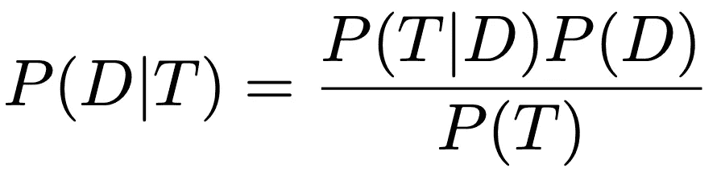

如果我们知道测试有多好(即给定患者有或没有疾病的阳性测试的概率，P(T=pos|D=true)或 P(T=pos|D=false))和疾病的基线概率 P(D)，那么我们可以获得给定阳性测试的疾病的更新概率。

我们如何获得 P(T=pos)，一个阳性测试的基线概率？

它只是两种可能性的总和:患者测试呈阳性并患有疾病，以及患者测试呈阳性但未患病。

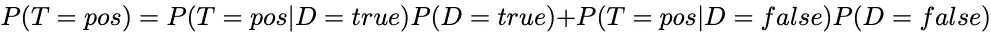

# 简单的例子

一项测试的真阳性率为 0.9，假阳性率为 0.05。在人群中，有 0.5%的患者患有这种疾病。假设患者检测呈阳性，那么患者患病的概率有多大？

我们可以将这些值代入贝叶斯定理得到我们的答案

所以给定一个阳性测试，病人得这种病的概率只有 8.3%。

# 概率分布

为了理解贝叶斯定理与贝叶斯推理的关系，我们必须通过**概率** **分布**来理解该定理，而不仅仅是点概率。概率分布只是给出了任何情况下所有可能结果的概率，而不仅仅是最可能的结果。

概率分布可以是连续的，如随机选择的人的预期智商(正态分布，均值=100，标准差=10):

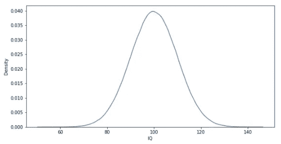

作者图片

或者像我们前面的例子那样是离散的。我们将展示给定疾病 P(T=1|D)的阳性测试结果的概率。这只是一个伯努利概率分布:

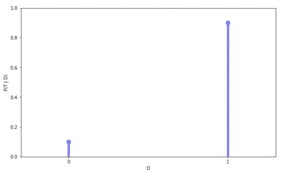

作者图片

# 离散推理

在贝叶斯推理中，我们希望在给定一些数据和关于这些参数的先验信念的情况下，学习模型参数的一些概率分布。我们使用贝叶斯定理来做这个推论:

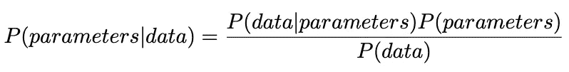

这似乎有点抽象，我们再举一个例子来说明这个推论。

假设我在地板上发现一枚 25 美分的硬币。当我把两角五分的硬币留在口袋里，不小心碰到要洗的衣服时，奇怪的事情发生了:硬币弯曲了，变得有偏差，翻转了 90%的正面和 10%的反面。不幸的是，我不知道我刚刚发现的这枚硬币是装的还是公平的。我相信硬币有 50%的机会被装上。幸运的是，我可以通过抛硬币来判断我的硬币是否公平。

在这个场景中，我们只有 1 个参数: *p* ，翻头的概率。我们为 p=0.5(无偏)分配 50%的先验置信，为 p=0.9(有偏)分配 50%的置信。

因此，我们的 P(参数)先验如下:

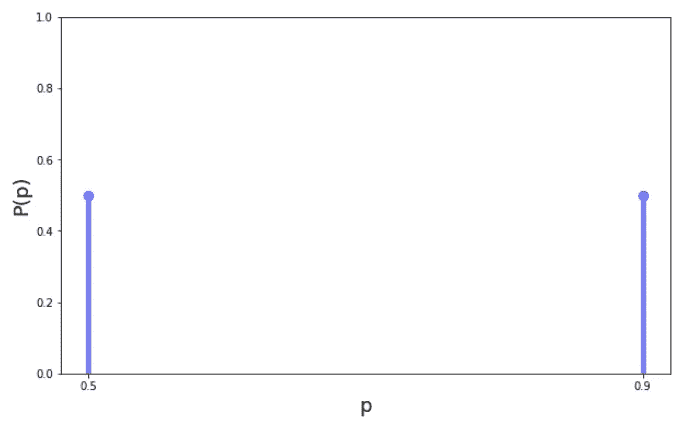

作者图片

这有点主观，因为选择先验可能是。

假设我们掷一次硬币。我们有人头了！

现在我们想知道*更新后的*我们的硬币被装载的概率:P(p=0.9 |头)。

让我们用贝叶斯定理来解决这个问题。注意:按照惯例，我们现在将使用 *θ* 来表示参数，使用 *X* 来表示数据。

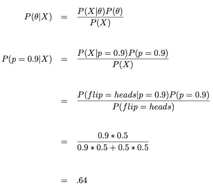

我们现在有 64%的把握硬币已经装好了！为了找到公平的概率，我们可以用 p=0.5 重做那个等式。或者，我们可以利用我们只处理 2 种可能性的事实，认识到 p(公平|数据)= 1-p(加载|数据)= 0.36。

重要的是，我们也可以忘记分母，计算两个 P 值的 P(X|p)P(p ),然后我们就有了相对后验概率。这是因为 P(X)对于两种计算是相同的。如果你更深入地阅读贝叶斯统计，你会发现贝叶斯定理被写成一种比例关系，比如:

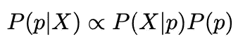

其中∝表示“成比例”。

我们的**后验**概率现在看起来是这样的:

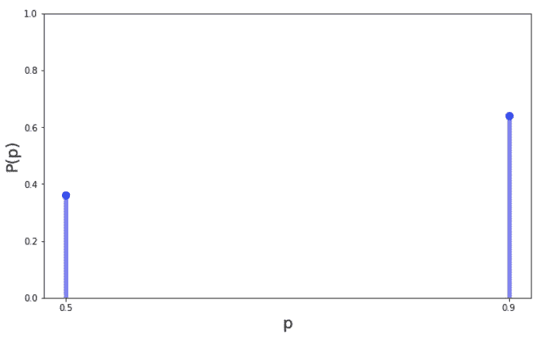

作者图片

如果我们再次抛硬币，我们现在可以**使用我们之前的后验概率(P(loaded) = 0.64)作为我们下一次迭代**的先验。所以我们第二次抛硬币，又是正面！让我们更新一下我们的后路。

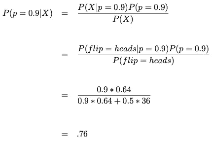

注意，这里的先验 P(p)是前一次迭代的后验

现在我们更加确信(76%确定)我们的硬币已经装满了。这是我们更新后的后验概率分布:

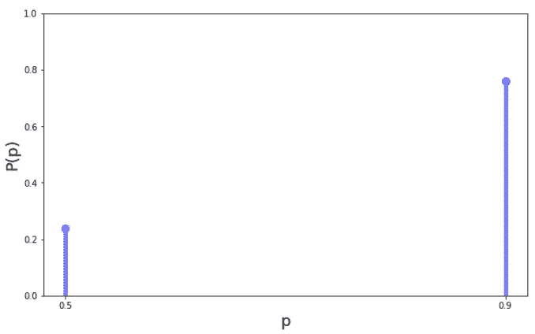

作者图片

这是贝叶斯统计的一个有趣的方面:随着越来越多的数据进来，我们可以不断更新我们的信念。

如果我们先抛硬币两次，然后我们想用所有的数据计算一次后验概率，会怎么样呢？别担心！通过一次使用所有数据，而不是对每个数据点重复计算，可以得到相同的结果。

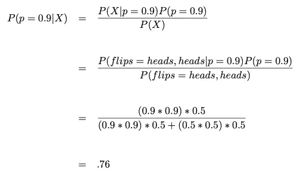

注意:用装载的硬币翻转正面然后正面的概率是 0.9 * 0.9；公平硬币是 0.5*0.5

# 连续推理

让我们介绍一个稍微真实一点的场景。一个季度的公平性不是只有两个不同的值，而是连续的。我们知道大多数硬币是非常公平的(接近 p = 0.5)，但是一些铸造的硬币更不公平。我们认为公平值的标准偏差(也就是我们的正面概率的 p 参数)大约是 0.1。所以如果我们找到一个 25 美分的硬币，我们对它的公平性的先验信念是这样的:

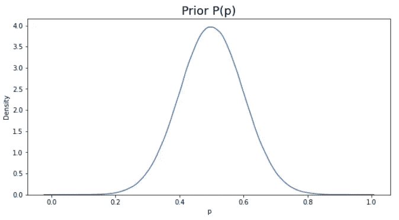

作者图片

这是一个连续的概率密度函数。虽然我们没有得到离散值的点概率(即 p = 0.6 的概率是多少)，但我们可以解释相对概率(即 p=0.5 的概率是 p=0.4 的两倍)或 p 在给定区间内的概率(即 p 在 0.4 和 0.6 之间的概率为 68%)。

我们有了先验信念，让我们抛硬币，找出后验概率分布。

我们抛硬币，我们得到反面。回到比例贝叶斯定理:

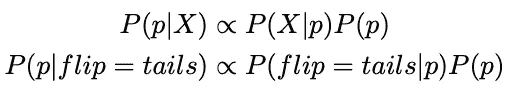

我们知道 P(P)；这是我们刚刚定义的先验概率分布。但是当 P 的可能值是无穷大时，我们如何选择 P 的哪些可能值来计算 P(X | p)？我们如何将这两个分布相乘呢？如果我们有一个有几个参数(而不是只有一个)的模型，我们如何考虑所有可能的参数组合？

这些问题比较难。

对于我们假设先验和后验来自同一概率分布“族”的情况，我们可以利用**共轭**先验来解析求解我们的后验。如果我们不能对我们的后验分布做出这些严格的假设，我们可以使用蒙特卡罗技术来采样并慢慢建立我们的后验分布。

在本文中，我不会深入研究这些技术。目的是建立一种直觉，关于贝叶斯定理如何应用于推理。我们从一个简单的模型开始，以了解先验、后验，以及我们如何不断增加数据和更新我们的模型。然后我们看了一个稍微复杂一点的模型，以理解为什么应用贝叶斯需要更多的工作。

对于进一步的阅读，我推荐 Richard McElreath 的《统计学再思考》,尤其是他关于蒙特卡罗方法的章节。为什么有偏见的硬币实际上是不现实的，看看这篇[论文](http://www.stat.columbia.edu/~gelman/research/published/diceRev2.pdf)。