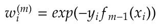

# 从助推到梯度助推

> 原文：<https://towardsdatascience.com/from-boosting-to-gradientboost-ed271cdf2e9e?source=collection_archive---------41----------------------->

## 友好但严谨的解释

比尔·杰伦在 [Unsplash](https://unsplash.com?utm_source=medium&utm_medium=referral) 上的照片

本文面向试图进入数据科学领域的学生或需要复习提升和梯度提升的专业人士。网上已经有很多关于这个主题的资料，但是没有多少包括学习过程的可视化。

所以我们将从升压原理开始，以梯度升压结束。我们也将理解从前者到后者的转变。我们将从图形直觉开始，然后解释用伪代码编写的算法。

# 介绍

[梯度树提升](https://en.wikipedia.org/wiki/Gradient_boosting#Gradient_tree_boosting)是 shelve 家族中处理结构化数据最好的算法之一。它被广泛使用，主要是因为它在大量数据集上的表现优于其他算法。它有很多优点，例如它可以在各种样本大小上进行训练，并且相对较快(特别是考虑到最近在 GPU 上的实现)。这些优势使得像 SVM 这样的算法越来越少被使用。

这个算法家族起源于 boosting 方法，这是过去 25 年中引入的最强大的学习思想之一。1997 年由 [Yoav Freund](https://en.wikipedia.org/wiki/Yoav_Freund) 和 [Robert Schapire](https://en.wikipedia.org/wiki/Robert_Schapire) 推出的 AdaBoost 就是这种方法的第一例。那年晚些时候 [Leo Breiman](https://en.wikipedia.org/wiki/Leo_Breiman) 意识到提升可以转化为一个具有适当成本函数的优化问题，这催生了 2001 年 Jerome Friedman 的梯度提升。

# 助推

Boosting 是一种集成方法，这意味着它将许多弱学习者的输出组合起来，以产生一个强大的委员会。弱学习者是错误率比随机猜测稍好的学习者。在 boosting 中，弱学习者是按顺序建立的。每个模型都建立在输入数据的修改版本上，试图关注其前任所犯的错误。助推模型是一种加法模型。这意味着最终输出是基函数的加权和(在梯度树提升的情况下是浅决策树)。第一版 Boosting (Adaboost。M1)是一种分类模型，其中我们将符号函数应用于加法扩展的结果。通过声明我们的模型 H 并使用 M 个基函数 f，我们得到:

一如既往，一个好的模式胜过千言万语。假设我们正在尝试解决一个二元分类任务，仅使用两个预测值 X1 和 X2 来区分蓝色方块和红色圆圈。我们使用决策树作为基本分类器。

图片来自作者

在第一次迭代结束时，我们构建了深度为 1(只有 1 个决策边界)的第一个弱决策树分类器。左边的例子被很好地分类了，但是在判定边界的右边出现了 4 个错误。

接下来发生的是，第二个模型的输入观察值根据 f1 树产生的错误进行加权。第二棵树 f2 将会特别注意它的前任所犯的错误(我们已经强调了)。

作者图片

这一次，考虑到权重，决策树采用特征 x2 来获得最佳分割，从而降低整体熵。接下来，再次对观测值进行加权。但是重要的是要注意到权重是根据它们当前的状态而演变的。一个观察结果被错误地分类了两次，所以这一次它的权重将更加重要。

作者图片

被错误分类两次的观察值的权重现在如此重要，以至于它主要影响第三个决策树的结果。最后，我们合并三棵树的结果。他们中的每一个人都会得到一个与他们犯的错误数量相对应的总权重。最后，我们得到以下结果:

整个 Adaboost 算法是这样的(用伪代码):

在步骤 2.b，我们计算当前分类器的总错误率。接下来，在 2.c 中，我们计算将在最终公式中应用于当前弱分类器的总权重。在 2.d 中，我们更新每个观察个体的权重。请注意指数函数的使用，它强调了一个事实，即错误分类的观察结果在下一轮中将获得更高的权重。

最初，所有的观察值都被赋予相同的权重。随着算法的进行，各个权重分布发生变化，以便每个连续的弱分类器改变其焦点。

# 从升压到梯度升压

如前所述，梯度提升源于对 Adaboost 算法可以被重新表述为具有适当成本函数的优化问题的观察。更准确地说，Adaboost 算法可以使用指数损失函数**重新表述为**前向阶段加法建模**过程。这最后一句话似乎有点吓人，但不应该。该过程的伪代码如下所示:**

所以我们从空函数开始，在每一步，我们添加一个权重为β的特定函数(弱学习器输出)。在 Adaboost 的情况下，并且考虑到**分类的结果位于{-1，1}** ，损失函数 L 是指数损失函数:

现在，我们将给出带有指数损失函数的前向阶段加法建模过程与 Adaboost 算法等效的完整证明。因此，让我们首先使用指数损失的定义重写我们的最小化目标:

w_i 不依赖于β或 f，因此相对于我们的最小化目标，它被视为常数。现在，我们将重写目标，因为我们的目标要么是 1，要么是-1。我们引入函数 A(为了简化符号)作为我们想要最小化的函数。所以我们把目标分成两种情况:一种是当 y_i 和 G(x_i)一致时，另一种是当它们不一致时:

现在的目标是揭示我们在 Adaboost 算法中看到的[指标函数](https://en.wikipedia.org/wiki/Indicator_function)。所以我们写道:

现在我们想找到β的值来解决我们的最小化问题。我们将 A 相对于β的偏导数设为 0，并求解方程:

如图所示，除了 1/2 乘法器，我们退回到 Adaboost 算法的表达式 2.c，误差项等于表达式 2.b:

现在我们可以证明 Adaboost 算法的最终等价性(第 2.d 行)。所以我们之前已经介绍了权重的定义:

从中我们可以得出下一轮的权重值:

现在，如果我们包括向前分阶段相加模型的更新规则(第 2.b 行):

我们有:

现在，因为目标标签是-1 或 1，所以我们可以写:

我们最终会得到:

并且我们退回到 Adaboost 的权重更新规则 2.d，期望最后一项 exp(-β_m)。这最后一项是两个过程之间的唯一区别，但事实上，它不会影响结果，因为它将所有权重乘以相同的值。总的来说，我们证明了这两个步骤是完全相同的。

# 梯度推进

Adaboost 和具有指数损失的前向阶段加性模型之间的等价性是在 Adaboost 开始后 5 年发现的。从这个观察来看，梯度推进只是指日可待。我们首先意识到的是，我们可以找到与上一次拟合的剩余部分相匹配的最佳函数，而不是找到添加到当前假设中的最佳函数，就像这样:

通过这个简单的技巧，我们提取了残差，但没有改变程序的结果。这个过程的名字来源于，我们可以将残差表示为特定成本函数的负梯度。在具有平方误差损失的回归设置中尤其如此:

梯度增强的作用如下:

1.  将前任留下的求反残差表示为代价函数的梯度
2.  找出最小化那些被否定的残差的最佳假设
3.  添加求反残差的预测。

程序是这样的:

通过在步骤 2.a 和 2.b 中使用相同的损失函数，**该过程等同于函数空间**中的梯度下降。

让我们通过一个简单的例子来想象这里发生了什么。假设我们正在尝试将回归模型拟合到以下数据集(只有 1 个预测值 X1):

作者图片

在第一次迭代结束时，我们构建了以下回归树:

作者图片

现在我们将尝试改进这个只有 1 级的弱决策树。因此，我们从计算求反的残差开始:

作者图片

我们用决策树来拟合求反后的残差:

作者图片

我们综合结果:

作者图片

我们继续下去，添加越来越多的决策树，直到我们开始过度拟合(这是使用验证集来控制的)。

## 其他分类损失

与 Adaboost 不同的是，梯度提升能够将学习过程推广到其他成本函数 l。这种推广真正有趣的是，您可以使用具有不同属性的成本函数来为该过程提供不同的整体行为(特别是关于异常值)。

可以看出，指数损失与二项式负对数似然或二项式偏差具有相同的总体最小值:

> 这就是为什么在 scikit-learn 的[梯度提升分类器实现中，您可以选择指数或偏差损失。](https://scikit-learn.org/stable/modules/generated/sklearn.ensemble.GradientBoostingClassifier.html)

请注意，当响应在集合{0，1}中时，二项式偏差与逻辑损失(也称为二元交叉熵)是一回事。在这种情况下，我们使用以下公式:

> 这就是 XGBoost 软件包提出二进制:逻辑损失函数的原因

指数损失是[裕度](https://en.wikipedia.org/wiki/Margin_(machine_learning)) **y f(x)** 的单调递减函数。在具有-1/1 响应的分类设置中，分类规则 G(x)=sign[f(x)]意味着具有正容限的观察值被正确分类(y 和 f(x)一致)，而具有负容限的观察值被错误分类(y 和 f(x)不一致)。因此，分类算法的目标是尽可能频繁地产生正余量。亏损标准对负利润的惩罚要比正利润重得多。让我们看看常见的二元分类损失函数在裕度方面的表现:

作者图片

指数和二项式偏离损失持续且越来越多地惩罚负的利润率值，而不是奖励正的利润率值。但是我们可以注意到，负利润的惩罚随着指数损失而指数增长，而二项式偏差的惩罚则以更线性的方式增长。这种线性趋势也可以在支持向量损失(用于支持向量机)中找到，也称为铰链损失。指数准则集中了对具有大的负边界的观测值的许多影响。这使得这个标准对异常值更加敏感。在这种情况下或者在[贝叶斯误差](https://en.wikipedia.org/wiki/Bayes_error_rate)非常重要的噪声环境中，其他损失是优选的。

## 回归的其他损失

在回归设置中，通常使用 3 种不同的损失函数:

*   平方误差损失用于例如普通的最小二乘回归。对于异常值或当数据中有太多噪声时，它不太稳健，但当没有异常值时，它仍然是首选:

*   存在异常值时更稳健的绝对误差损失:

*   huber 损失是上述两者的混合:

我们可以将损失值绘制成残差的函数，以便更好地理解相关的惩罚:

huber 损耗结合了小误差平方损耗和大误差绝对损耗的优良特性。

## 结论

当存在有噪声的数据集时，回归的平方误差损失和指数损失可能不是最佳选择，尽管它们都导致优雅的模增强算法(Adaboost)。对于平方误差损失，人们简单地将基本学习器直接拟合到来自当前模型的残差，而对于指数损失，人们执行权重等于 exp(-y f(x))的加权拟合。梯度提升是提升算法对其他成本函数的推广。通过将当前弱学习器的残差表示为成本函数的负梯度，这是可能的。

# 参考

统计学习、数据挖掘、推理和预测的要素。特雷弗·哈斯蒂、罗伯特·蒂布拉尼、杰罗姆·弗里德曼