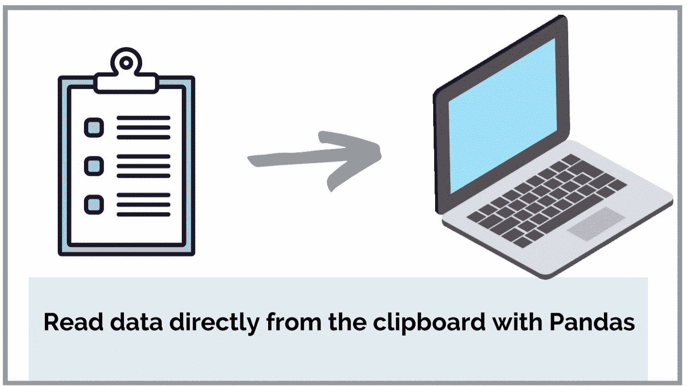
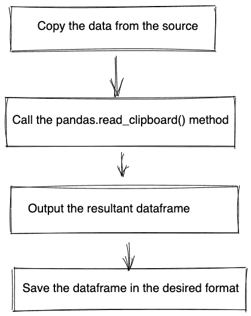
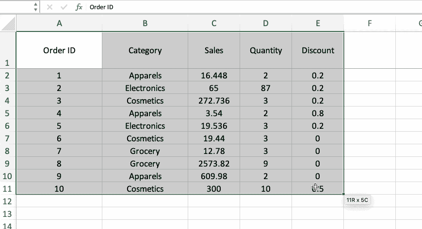
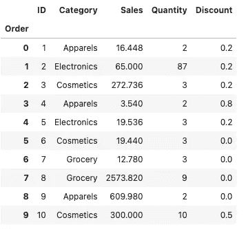
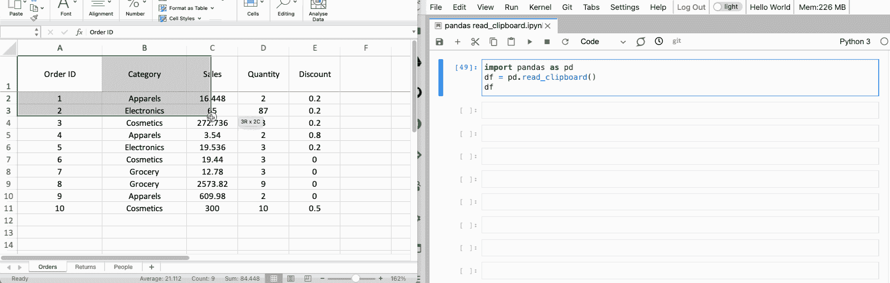
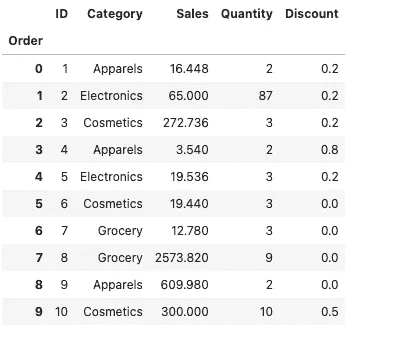
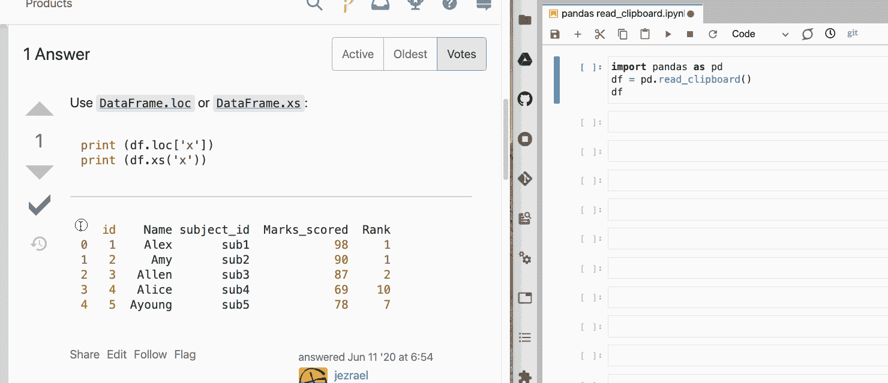
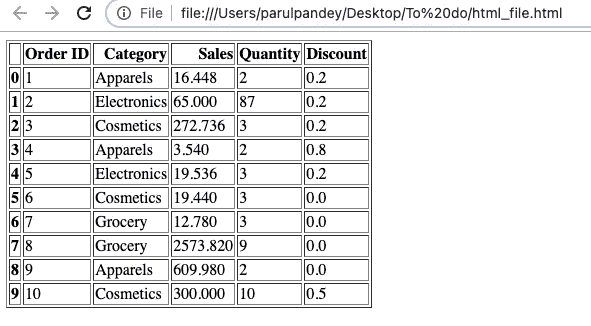

# 从剪贴板到熊猫数据框

> 原文：<https://towardsdatascience.com/from-clipboard-to-dataframe-with-pandas-6c212b1d7ed8?source=collection_archive---------17----------------------->

## 直接从剪贴板读取数据，无需先保存



作者图片

当我写一个库或一个新概念时，我通常喜欢通过例子展示它的工作。我在文章中使用的数据集的来源千差万别。有时我会创建简单的玩具数据集，而在其他场合，我会使用像 [Kaggle](/5-real-world-datasets-for-exploratory-data-analysis-21b7cc5afe7e?sk=145c99771bacf641f080c410a54ecf9e) 和 [Google search](/getting-datasets-for-data-analysis-tasks-advanced-google-search-b1c01f9cc324) 这样的已建立的数据集网站。然而，每当我需要展示一个概念时，我都必须经历从源复制数据、将数据保存到我的系统并最终在我的开发环境中使用它的费力工作。想象一下，当我发现熊猫有一个内置的方法来解决这个问题时，我有多惊讶。当你想快速尝试一些新的函数或库时，这个被恰当地命名为`read_clipboard`的方法绝对是救星，在本文中，我们将学习如何使用它。

# 使用 pandas.read_clipboard()函数

pandas 的`[read_clipboard()](https://pandas.pydata.org/docs/reference/api/pandas.read_clipboard.html)`方法从复制到剪贴板的数据创建一个 dataframe。It 从剪贴板中读取文本，并将其传递给`[read_csv()](https://pandas.pydata.org/docs/reference/api/pandas.read_csv.html)`，后者随后返回一个经过解析的 DataFrame 对象。

## 句法

```
pandas.read_clipboard(*sep='\\s+'*, ***kwargs*)
```

如果你和熊猫`read_csv(),`一起工作过，那么`read_clipboard()`的方法基本上是一样的。唯一的区别是后者中的数据源来自剪贴板缓冲区，而不是 CSV 文件。

> 如果你想深入了解熊猫的`read_csv`功能的一些参数，我会为你提供帮助。

</there-is-more-to-pandas-read-csv-than-meets-the-eye-8654cb2b3a03>  

# 使用

现在让我们看看使用这种方法的各种方式。涉及的主要步骤是:



涉及的步骤|作者提供的图片

## 1.从 Excel 文件复制数据

我们将从从 excel 文件复制一些数据集开始。这是最常见的情况。



按作者将数据复制到剪贴板|图像

现在数据已经被复制到剪贴板上。接下来，我们将导航到 Jupyter 笔记本(或任何 IDE)实例，并键入以下代码片段:

```
import pandas as pd
df = pd.read_clipboard()
df
```



作者从复制的数据集|图像中获得的数据帧

复制的数据集被传递到变量`df`中，现在可以在您的环境中使用了。下面是一张 GIF，清晰地演示了这个过程。



pandas_read_clipboard()方法|作者图片

## 2.从 CSV 文件复制数据

如果您有一个 CSV 文件，步骤保持不变。您只需要对函数的参数进行某些更改。考虑以下 CSV 数据:

```
,Order ID,Category,Sales,Quantity,Discount
0,1,Apparels,16.448,2,0.2
1,2,Electronics,65.0,87,0.2
2,3,Cosmetics,272.736,3,0.2
3,4,Apparels,3.54,2,0.8
4,5,Electronics,19.536,3,0.2
5,6,Cosmetics,19.44,3,0.0
6,7,Grocery,12.78,3,0.0
7,8,Grocery,2573.82,9,0.0
8,9,Apparels,609.98,2,0.0
9,10,Cosmetics,300.0,10,0.5
```

复制上面的数据，运行下面的代码。

```
df = pd.read_clipboard(
    sep=",",
    header="infer",
    index_col=0,
    names=["Order", "ID", "Category", "Sales", "Quantity", "Discount"],
)df
```



作者从复制的数据集|图像中获得的数据帧

我们得到与步骤 1 相同的数据帧。我们只需要传入列名和关于`header`和 `index column.`的信息

## 3.从网页拷贝数据

您还可以从任何来源复制数据，包括网页，只要它是以 dataframe 的形式构造的。这是一个从 [StackOverflow](https://stackoverflow.com/questions/62318682/get-pandas-datframe-values-by-key) 示例中复制数据并将其导入 dataframe 的示例。



作者从[网页](https://stackoverflow.com/questions/62318682/get-pandas-datframe-values-by-key) |图片中复制数据帧

# 保存数据

我们可以使用剪贴板数据以期望的格式保存数据集以供将来使用。

```
df.to_csv('data.csv')
```

您也可以将数据保存为 HTML 格式，以 HTML 表格的形式显示数据。

```
df.to_html('data.html')
```



熊猫数据帧保存为 HTML 表格|作者图片

# 结论

既然你已经了解了`read_clipboard`方法，你肯定会想尝试一下。我敢肯定，如果你喜欢创建数据相关的教程，这将派上用场。你也可以看看我写的关于熊猫功能的其他博客。例如，[这个](/get-interactive-plots-directly-with-pandas-13a311ebf426)帮助你直接创建与熊猫互动的情节，而[这个](/a-hands-on-guide-to-sorting-dataframes-in-pandas-384996ca6bb8)是一个在熊猫中“分类”数据帧的实践指南。