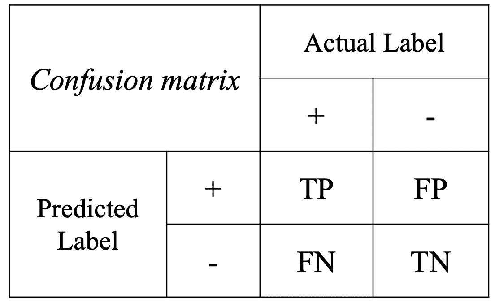

# 从混淆矩阵到加权交叉熵

> 原文：<https://towardsdatascience.com/from-confusion-matrix-to-weighted-cross-entropy-9d2999c06845?source=collection_archive---------24----------------------->

## 如何使用加权交叉熵来惩罚一个标签

你好。

在我们之前的文章中，我们用 3 个步骤介绍了机器学习的交叉熵概念。特别是，我们从信息论的角度讨论了 log(p)是什么，熵的真正含义，以及它与交叉熵损失的关系。

<https://medium.com/@david.h.kang/an-intuitive-guide-how-entropy-connects-to-cross-entropy-78b0713494a9>  

在本文中，我们将通过考虑*加权交叉熵*来扩展我们在交叉熵方面的讨论，加权交叉熵允许我们对一个标签进行加权。例如，当设计用于新冠肺炎诊断的最大似然算法时，我们可能希望对假阴性的惩罚比对假阳性的惩罚更重。让我们开始吧。

> 第一步。混淆矩阵

混淆矩阵是总结 ML 模型分类结果的一种非常方便的方法。如下所示，它由 TP(真阳性)、FP(假阳性)、FN(假阴性)和 TN(真阴性)4 个部分组成。例如，在新冠肺炎的情况下，FN 将是被诊断为没有新冠肺炎的新冠肺炎患者的数量。



作者图片

> 第二步。混淆矩阵中的关键概念

这里我总结几个来源于混淆矩阵的关键词，它们在有分类任务的 ML 论文中出现很多。尽量不要死记硬背，因为名字本身就很有意义！

***(1)敏感度*** (回忆)量化你的模型在正确分类阳性标签方面的敏感度，意思是，在所有实际阳性案例中，有多少被正确分类为阳性。

敏感度= TP / (TP + FN) = TPR(真阳性率)。

***(2) Precision*** 量化模型预测的精确程度，也就是说，在所有肯定的猜测中，有多少实际上是肯定的。

精度= TP / (TP + FP)

***(3)用于二进制分类的 F 分数*** 通过 1/F = 1/2[1/召回+1/精度]通过调和平均将灵敏度和精度结合起来

根据应用的不同，可能需要更加强调灵敏度或精度。这种情况下可以用 F_beta。请注意，当 beta = 1 时，它将成为之前定义的标准 F 分数。

1/F _ beta = 1/(1+beta)[beta/Recall+1/Precision]

***(4)准确度*** 是最常见的度量之一。由于它同时考虑了所有的总磷和总氮，当你有不平衡的数据时，它可能会产生误导。例如，虽然您可能希望尽可能好地预测罕见疾病的 TP 病例，但您的(差的)ML 模型可能仅因为有太多的 TN 而显示出高准确性，尽管它的 TP 很低。

准确度= (TP + TN) / (TP + FP + TN + FN)

> 第三步。加权交叉熵

**太好了！**你已经看到，在需要特别注意正面或负面情况的应用程序中，对混淆矩阵中的每个部分一视同仁会产生误导。

正如我们在上一篇文章中讨论的，二元分类任务中的交叉熵损失计算如下，对两个标签给予同等的重视。

```
labels * -log(sigmoid(logits)) +
    (1 - labels) * -log(1 - sigmoid(logits))
```

现在请注意，我们如何对这种损失进行轻微的处理，以增加(或减少)标签的重要性！这是通过插入大于(小于)1 的`pos_weight`来加强(或减弱)阳性标签(+)。

```
labels * -log(sigmoid(logits)) * pos_weight +
    (1 - labels) * -log(1 - sigmoid(logits))
```

当`pos_weight`大于 1 时，你会对被错误归类为阴性的阳性标签进行更多的惩罚，因此有助于提高灵敏度；你可以期待你的 ML 模型变得更加敏感，在所有实际的阳性案例中正确地分类出阳性案例。

另一方面，当`pos_weight`小于 1 时，你的模型对错误分类为阳性的阴性标签进行更多的惩罚，因此有助于提高精度；您可以期待您的 ML 模型在正确分类所有积极预测中的积极案例方面变得更加精确。方程式摘自 [tensorflow 网站](https://www.tensorflow.org/api_docs/python/tf/nn/weighted_cross_entropy_with_logits)。

> 恭喜你。你已经走了很长的路。

总而言之，

*   灵敏度和精度都与我们的模型如何将阳性病例分类为阳性(TP)有关。
*   敏感度考虑所有实际阳性(TP + FN)，而精确度考虑所有预测阳性(TP + FP)。
*   加权交叉熵损失让我们的 ML 模型惩罚更多(或更少)被错误分类为负面的正面标签，反之亦然！

不要犹豫留下你的想法！您的反馈和评论有助于丰富我们的社区。很高兴听到。感谢阅读:-)

~ DK