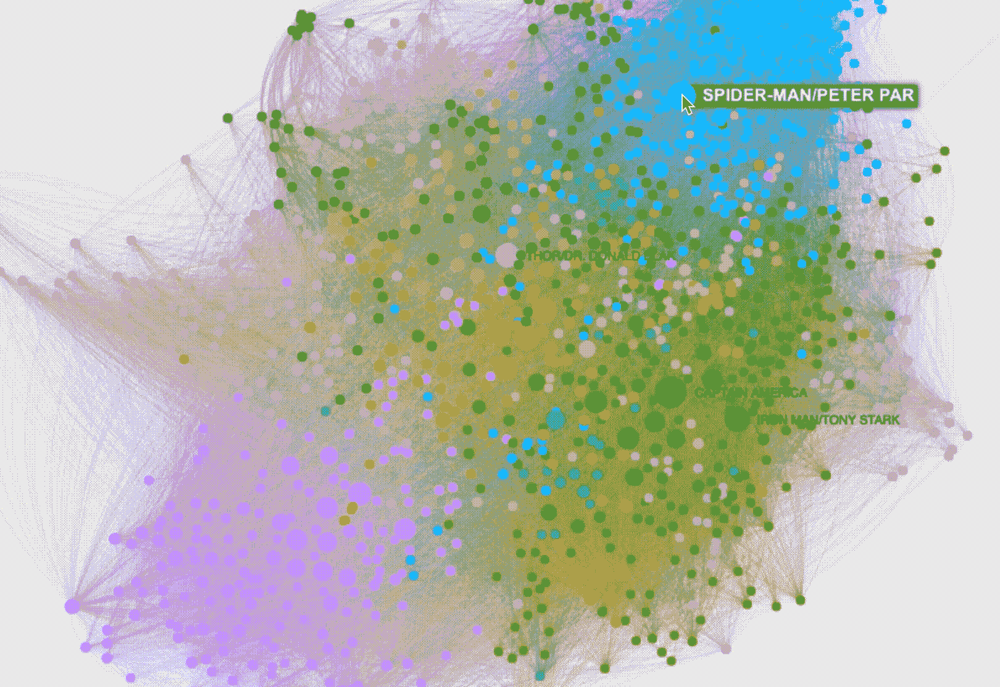

# 从 CSV 到 GitHub 页面，5 个步骤:发布漫威世界的互动社交网络

> 原文：<https://towardsdatascience.com/from-csv-to-github-pages-in-5-steps-publishing-an-interactive-social-network-of-the-marvel-7b8374bf44fb?source=collection_archive---------13----------------------->

## 如何使用 Python、Gephi 和 GitHub 页面轻松创建令人惊叹的图形可视化

在本文中，我将提供一个循序渐进的指南，告诉你如何通过 5 个简单的步骤创建、发布和共享交互式网络图可视化。


奥马尔·弗洛雷斯在 [Unsplash](https://unsplash.com?utm_source=medium&utm_medium=referral) 上拍摄的照片

在我们开始之前，我们需要三样东西:

*   Python & NetworkX 库[ [1](https://networkx.org/)
*   ge phi[[2](https://gephi.org/)]&sigma exporter 包
*   GitHub 帐户&一个公共的 GitHub 存储库

**步骤 1:导入 CSV 文件并创建一个 NetworkX 图形**

我们的数据源实际上可以是任何数据格式(例如 TSV、pandas 数据帧或数组)，但是在本文中，我们将重点关注 CSV(**C**omma-**S**separated**V**alues)格式。在本教程中，我将使用来自 Kaggle [ [3](https://www.kaggle.com/csanhueza/the-marvel-universe-social-network) ]的漫威宇宙社交网络数据集来创建一个英雄之间关系的交互式图表。数据集描述了漫画中漫威英雄的共现，因此每行描述了一个实例，其中*英雄 1* (在第 1 列)与*英雄 2* (在第 2 列)出现在同一部漫画中。

我们首先导入三个 Python 库:(1) *csv* 用于读取 csv 文件，(2) *tqdm* 用于显示进度条(可选)，以及(3) *NetworkX* 用于创建和修改图形。

```
import csv
from tqdm import tqdm
import networkx as nx
```

然后我们创建一个空的 NetworkX 图…

```
import networkx as nx G = nx.DiGraph()
```

…并根据我们的 CSV 文件添加节点和边。我们迭代每一行，为 *hero1* (第一列)和 *hero2* (第二列)添加节点。不需要担心添加重复的节点，因为名称/标签充当唯一的 id，并且已经在图中的节点被跳过。如果从 *hero1* 到 *hero2* 的边在我们的图中还不存在，我们就把它加上并把它的权重值设为 1(意思是他们曾经一起出现在一本漫画里)*。如果边已经存在，我们只需将现有边的权重增加 1。*

```
**with** open('./data/hero-network.csv', 'r') **as** f:
    data = csv.reader(f)
    headers = next(data)
    **for** row **in** tqdm(data):
        G.add_node(row[0]) *#superhero in first column*
        G.add_node(row[1]) *#superhero in second column*
        **if** G.has_edge(row[0], row[1]):
            *# edge already exists, increase weight by one*
            G[row[0]][row[1]]['weight'] += 1
        **else**:
            *# add new edge with weight 1*
            G.add_edge(row[0], row[1], weight = 1)
```

为了得到图中的第一个信息，我们打印出它的节点数和边数。

```
G_nodes = G.number_of_nodes()
G_edges = G.number_of_edges()
print("Nodes = ", G_nodes, " Edges = ",G_edges)
```

我们的图总共有**6426 个节点**和**224181 条边**。

**第二步:将 NetworkX 图形导出为 gexf 文件**

下一步，我们将 NetworkX 图形转换成 gexf 文件( **G** 图形**E**xchange**X**ML**F**format)并将其存储在我们的文件目录中。

```
nx.write_gexf(G, "./data/hero-network.gexf")
```

**第三步:导入并修改 Gephi 中的图形**

由于我们的图表存储为 gexf 文件，我们可以使用开源应用程序 Gephi(可用于 Windows、MacOS 和 Linux)导入、修改和可视化它，它提供了多种功能。

首先，我们将 gexf 文件作为无向图导入，并安装 SigmaExporter JS 包(工具>插件>可用插件)，以利用适马 JS [ [4](http://sigmajs.org/) ]。如果您愿意，也可以选择安装和使用其他布局算法。

在下一步中，我们希望让更多连接良好的相关节点(例如，托尼·斯塔克，美国队长)显得更大。为此，我们在 statistics 选项卡中计算平均加权度(对于有向图，我建议使用 PageRank)，并在 appearance 选项卡中相应地设置节点大小，8 是最小节点大小，48 是最大节点大小。

最后，我们运行一个模块化算法[ [5](https://parklize.blogspot.com/2014/12/gephi-clustering-layout-by-modularity.html#:~:text=Modularity%20is%20one%20measure%20of,groups%2C%20clusters%20or%20communities).&text=Biological%20networks%2C%20including%20animal%20brains,a%20high%20degree%20of%20modularity) ]来聚集我们的图并将节点分配给一个模块。然后，我们根据模块关系分配节点颜色，并运行我们选择的图形布局算法(在我们的例子中是 Force Atlas 2)。请记住，Gephi 提供了多种方式来个性化我们的图表[ [6](http://gephi.michalnovak.eu/Mastering%20Gephi%20Network%20Visualization.pdf) ]。

**第四步:将图形导出为适马 JS**

如果我们喜欢图表的布局和可视化，我们现在可以将其导出为适马 JS 模板(文件>导出>适马 JS 模板)。Gephi 将要求我们在图表上提供一些基本信息(例如，标题、作者、图例和描述)。我建议检查搜索选项，因为它将允许在最终的图形可视化中查找节点。此外，将悬停行为设置为 dim 提供了改进的交互体验。最后，我们选择目标目录并单击 export。我们现在应该在目标目录中有一个网络文件夹。

**第五步:在 GitHub 页面上发布图形可视化**

我们可以通过打开导航到网络文件夹并使用以下命令打开 Python http 服务器来本地测试我们的图形。

```
python -m http.serverpython -m SimpleHTTPServer (*for earlier Python versions)*
```

我们现在应该能够在我们的 web 浏览器中看到我们的图表，网址是: [http://localhost:8000/](http://localhost:8000/) 。然而，如果我们想在线发布我们的图表并与其他人分享链接，我们可以通过利用 GitHub 页面来实现。首先，我们创建一个新的(公共)GitHub 存储库并上传网络文件夹。然后，我们转到我们的存储库设置，并选择 GitHub Pages 选项卡。一旦到了那里，我们就将主分支设置为我们的源。该图现在应该可以从以下 URL 获得:

```
[**https://**[YourGitHubName]**.github.io/**[YourRepositoryName]**/network/**](https://tdenzl.github.io/MarvelNetwork/network/)
```

我们现在可以通过选择和搜索节点来浏览图表。此外，我们可以进一步调整图形的视觉效果[ [7](https://github.com/jacomyal/sigma.js/wiki/Settings) ]。



先睹为快我们的互动漫威宇宙共现图可视化

在这里你可以找到最终由 GitHub Pages 主办的[漫威宇宙共现网](https://tdenzl.github.io/MarvelNetwork/network/#)。

如果您想创建自己的网络可视化，请查看我的包含 Jupyter 笔记本脚本的 [GitHub 库](https://github.com/tdenzl/MarvelNetwork)。

**参考文献:**

[1] NetworkX，[首页](https://networkx.org/) (2021)

[2] Gephi，[首页](https://gephi.org/) (2021)

[3] C. Sanhueza，[漫威宇宙社交网络](https://www.kaggle.com/csanhueza/the-marvel-universe-social-network) (2017)

[4]适马 JS，[首页](http://sigmajs.org/) (2021)

[5] Parklize， [Gephi -模块化集群布局](https://parklize.blogspot.com/2014/12/gephi-clustering-layout-by-modularity.html#:~:text=Modularity%20is%20one%20measure%20of,groups%2C%20clusters%20or%20communities).&text=Biological%20networks%2C%20including%20animal%20brains,a%20high%20degree%20of%20modularity) (2014)

[6] K. Cherven，[掌握 Gephi 网络可视化](http://gephi.michalnovak.eu/Mastering%20Gephi%20Network%20Visualization.pdf) (2015)

[7]适马 JS，[文档](https://github.com/jacomyal/sigma.js/wiki/Settings) (2021)