# 从 DevOps 到 MLOPS:使用 Jenkins 和 Docker 整合机器学习模型

> 原文：<https://towardsdatascience.com/from-devops-to-mlops-integrate-machine-learning-models-using-jenkins-and-docker-79034dbedf1?source=collection_archive---------3----------------------->

## 如何用 Jenkins 和 Docker 自动化数据科学代码:MLOps = ML + DEV + OPS


Annamária Borsos 摄影

# MLOPS = ML + DEV + OPS

有多少创造出来的 AI 模型已经在企业投入生产？随着对数据科学团队和技术的投资，人工智能项目的数量显著增加，随之错过了许多投入生产和评估实际商业价值的机会。其中一个解决方案是 MLOPS，它能够将数据科学和 IT 运营结合起来，在生产中部署、监控和管理 ML/DL 模型。

持续集成(CI)和持续交付(CD)，也称为 CI/CD 管道，体现了 DevOps 团队的敏捷操作原则和实践的文化，允许软件开发团队更频繁、更可靠地更改代码，或允许数据科学家持续测试模型的准确性。CI/CD 是一种关注业务需求的方式，例如改进的模型准确性、自动化部署步骤或代码质量。持续集成是一组实践，驱动开发团队持续地实现小的变更，并将代码签入版本控制存储库。如今，数据科学家和 IT 运营人员拥有不同的平台(内部、私有云和公共云、多云……)和工具，需要通过自动集成和验证机制来解决这些问题，以便灵活地构建、打包和测试应用。通过自动向选定平台交付应用程序，持续交付在持续集成结束时介入。

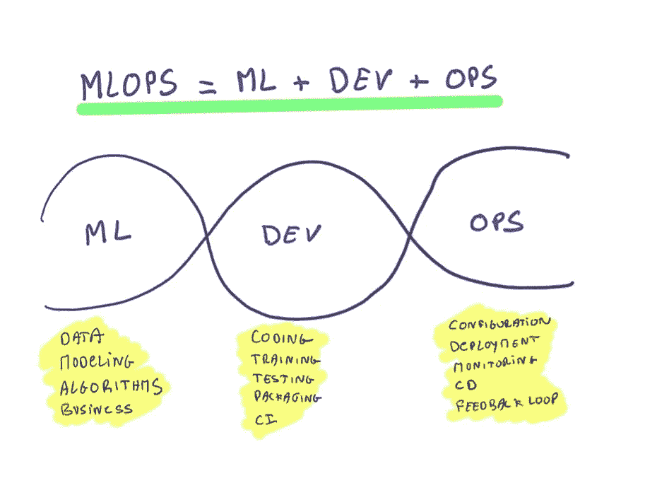

本文的目标是使用 Jenkins 和 Docker 将机器学习模型与 DevOps 集成。用 Jenkins 和 Docker 做 ML/DL 有很多好处。一个例子是，当我们训练机器学习模型时，有必要不断测试模型的准确性。使用 Jenkins 可以完全自动化这项任务。当我们从事数据科学项目时，我们通常会花一些时间来提高模型准确性，然后当我们满意时，我们会将应用程序作为 API 部署到生产中。假设我们的模型准确率是 85%。几天或几周后，我们决定调整一些超参数并添加一些数据，以提高模型的准确性。然后，我们计划将其部署到生产环境中，为此，我们需要花费一些精力来构建、测试和再次部署该模型，这可能需要大量工作，具体取决于上下文和环境。这就是开源自动化服务器 Jenkins 的用武之地。

Jenkins 提供了一个持续集成和持续交付(CI/CD)系统，提供了数百个插件来构建、部署和自动化软件项目。使用 Jenkins 有几个优点。它很容易安装和配置，它有一个重要的社区，数百个插件，它有能力在不同的环境中分配工作。Jenkins 有一个目标:花更少的时间在部署上，花更多的时间在代码质量上。Jenkins 允许我们创造工作岗位，这是 Jenkins 构建流程的核心。例如，我们可以创建工作来用不同的任务测试我们的数据科学项目。Jenkins 还提供了一套插件，Jenkins Pipeline，它支持 CI/CD。它们可以是声明性的和脚本化的管道。

在本文中，我们将看到如何使用 Jenkins 和 Docker 集成一个在 EEG 数据上训练的机器学习模型(线性判别分析和多层感知器神经网络)。

要学习这些概念:我们来考虑以下文件: **Dockerfile，train-lda.py，train-nn.py，train-auto-nn.py，requirements.txt，train.csv，test.csv**

**train-lda.py** 和 **train-nn.py** 是 python 脚本，它们摄取并归一化 EEG 数据，训练两个模型对数据进行分类，并测试模型。**Docker 文件**将用于构建我们的 Docker 映像，requirements.txt ( *joblib* )用于 Python 依赖项。 **train-auto-nn.py** 是一个 python 脚本，用不同的参数调整神经网络模型。 **train.csv** 是用于训练我们的模型的数据，而 **test.csv** 是包含新 EEG 数据的文件，将用于我们的推理模型。

你可以在[GitHub](https://github.com/xaviervasques/EEG-letters):[https://github.com/xaviervasques/Jenkins](https://github.com/xaviervasques/Jenkins)上找到所有文件

# 詹金斯装置

与 Jenkins 一起，我们将运行一个容器映像，其中安装了用于训练我们的模型的所有必要要求。为此，我们将使用 Jenkins 中的 build pipeline 插件创建一个作业链。

首先你需要安装詹金斯。在这里，我们安装长期支持版本。

在 Red Hat / CentOS 上，我们可以键入以下命令:

```
sudo wget -O /etc/yum.repos.d/jenkins.repo \https://pkg.jenkins.io/redhat-stable/jenkins.reposudo rpm --import https://pkg.jenkins.io/redhat-stable/jenkins.io.keysudo yum upgradesudo yum install jenkins java-1.8.0-openjdk-devel
```

在 Ubuntu 上，我们可以键入以下命令来安装 Jenkins:

```
wget -q -O - https://pkg.jenkins.io/debian-stable/jenkins.io.key | sudo apt-key add -sudo sh -c 'echo deb https://pkg.jenkins.io/debian-stable binary/ > \/etc/apt/sources.list.d/jenkins.list'sudo apt-get updatesudo apt-get install jenkins
```

詹金斯需要 Java。我们可以安装开放 Java 开发工具包(OpenJDK)。我们可以在这里看到安装 Jenkins 所需的所有信息:[https://www.jenkins.io/doc/book/installing/](https://www.jenkins.io/doc/book/installing/)

Jenkins 可以安装在许多发行版(Linux、macOS、Windows 等)上，并部署在私有或公共云上，如 IBM Cloud 或其他。您可以使用不同的命令来启动一些 Jenkins 服务，例如:

注册詹金斯服务

```
sudo systemctl daemon-reload
```

启动 Jenkins 服务

```
sudo systemctl start jenkins
```

检查 Jenkins 服务的状态

```
sudo systemctl status jenkins
```

如果一切都设置正确，您应该会看到如下输出:

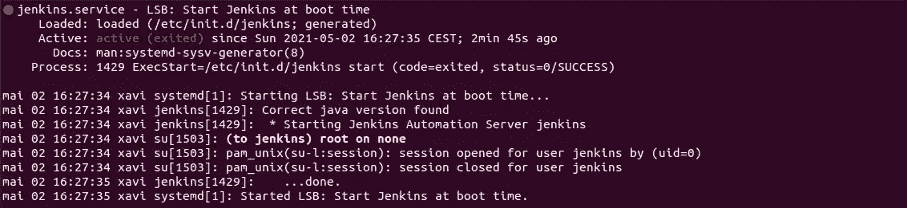

詹金斯使用端口 8080。我们可以使用 ufw 打开它:

```
sudo ufw allow 8080
```

并检查状态以确认新规则:

```
sudo ufw status
```

要启动 Jenkins，通过键入 hostame -I 获得服务器的 IP 地址，并通过输入您的 IP 和端口:192.168.1.XXX:8080 启动您的浏览器

您应该会看到类似这样的内容:


在您的终端中，使用 cat 命令显示密码:

```
sudo cat /var/lib/jenkins/secrets/initialAdminPassword
```

复制护照并粘贴在*管理员密码*中，点击*继续*。

然后按照一些简单的步骤来配置您的环境。

# 场景实施

假设我们需要定期训练我们的模型。在这种情况下，建议在 Jenkins 中包装该过程，以避免手工操作，并使代码更易于维护和改进。在本文中，我们将展示两个场景:

**场景 1:** 当有人更新机器学习代码或提供额外数据时，我们会自动克隆一个 GitHub 知识库。然后，詹金斯将自动开始一个模型的训练，并提供分类准确度，检查准确度是否低于 80%。

**场景 2:** 我们将执行与场景 1 相同的操作，并添加一些额外的任务。我们将自动开始多层感知器神经网络(NN)模型的训练，提供分类准确度分数，检查它是否小于 80%，如果是，运行 train-auto-nn.py，它将寻找我们模型的最佳超参数，并打印新的准确度和最佳超参数。

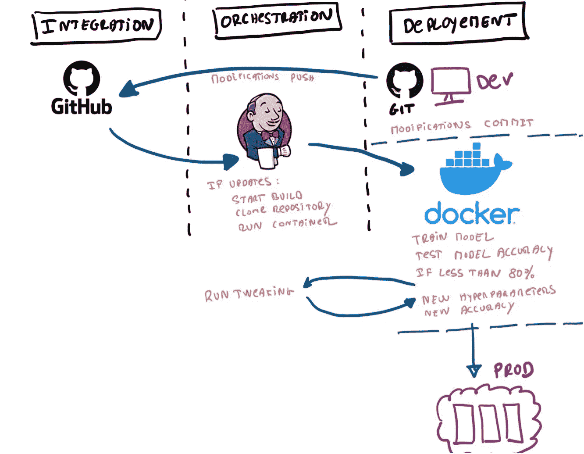

**场景 1**

我们将首先使用 Dockerfile 创建一个容器映像。可以看以前的文章来做:[快速安装并首次使用 Docker](https://xaviervasques.medium.com/quick-install-and-first-use-of-docker-327e88ef88c7) ，[使用 Docker 和 Python Rest APIs 搭配 Flask](/build-and-run-a-docker-container-for-your-machine-learning-model-60209c2d7a7f) 为你的机器学习模型和[机器学习预测实时构建并运行 Docker 容器。然后，我们将在 Jenkins 中使用 build pipeline 来创建作业链。我们将使用一个简单的模型，线性判别分析，用 scikit-learn 编码，我们将用 EEG 数据(train.csv)训练它。在我们的第一个场景中，我们希望设计一个 Jenkins 流程，其中每个作业将执行不同的任务:](/machine-learning-prediction-in-real-time-using-docker-and-python-rest-apis-with-flask-4235aa2395eb)

- **工作#1:** 当我们在 GitHub 中更新代码时，自动提取 GitHub 库

- **工作#2:** 自动启动机器学习应用，训练模型，给出预测精度。检查模型精度是否低于 80%。

詹金斯使用我们的 linux 与用户所谓的*詹金斯*。为了让我们的 *jenkins* 用户使用 **sudo** 命令，我们可能想要告诉操作系统在执行命令时不要询问密码。为此，您可以键入

```
sudo visudo /etc/sudoers
```

这将在编辑模式下打开 *sudoers* 文件，您可以如下添加或修改文件:

```
jenkins ALL=(ALL) NOPASSWD: ALL
```

另一种可能更安全的方法是在/etc/sudoers.d 目录中创建一个文件，因为该目录中包含的所有文件都将被自动处理，从而避免修改 sudoers 文件，并防止升级过程中出现任何冲突或错误。您唯一需要做的就是在 sudoers 文件的底部包含这个命令:

```
#includedir /etc/sudoers.d
```

要使用正确的权限在/etc/sudoers.d 中创建新文件，请使用以下命令:

```
sudo visudo -f /etc/sudoers.d/filename
```

现在我们只需要在文件中包含相关的行:

```
jenkins ALL=(ALL) NOPASSWD: ALL
```

打开 Jenkins 并点击*自由式项目*

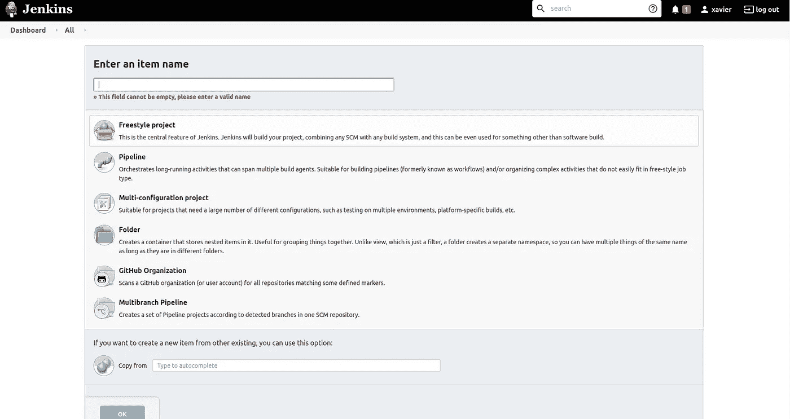

**工作#1:** 当我们在 GitHub 中修改 ML 代码时，自动提取 GitHub 库

点击*创建一个作业*并将其命名为*下载*或其他名称。

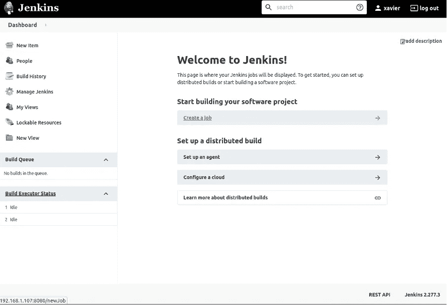

在源代码管理中，选择 Git，插入您的存储库 URL 和您的凭证。

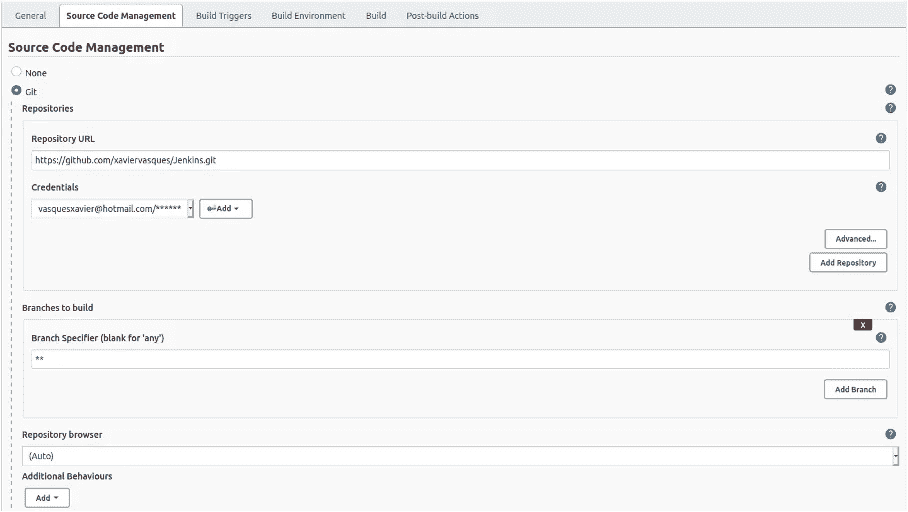

转到构建触发器并选择轮询 SCM

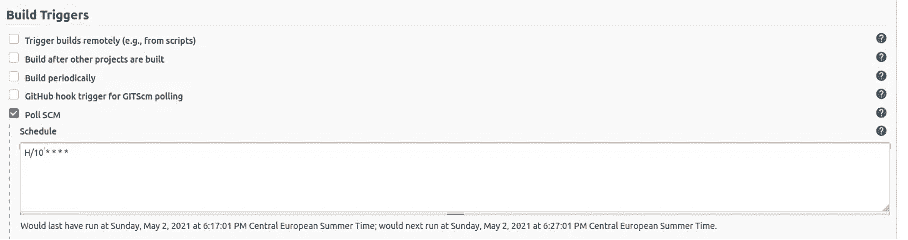

你可以点击“？”获得一些帮助，但仅举一个例子，H/10****意味着每 10 分钟从 GitHub 下载一次代码。这对于我们的示例来说并不太有用，所以您可以将 Schedule 框留空。如果您让它为空，它将只在由提交后挂钩触发时，由于 SCM 更改而运行。

然后，单击“添加构建步骤”下拉菜单，并选择“执行 shell”。键入以下命令，将 GitHub 存储库的容器复制到您之前创建的特定路径:

```
sudo -S cp * /home/xavi/Public/Code/Kubernetes/Jenkins/code
```

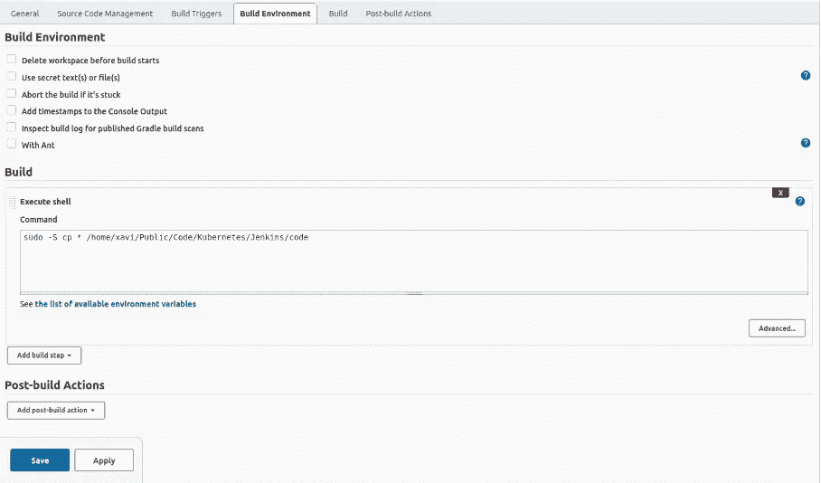

并点击*保存*。

我们可以点击“立即构建”,您应该会在创建的存储库中看到您的代码。当我们在 GitHub 存储库中修改我们的文件时(git add，git commit，git push)，这些文件将在我们创建的存储库中自动更新。

**工作#2:** 自动开始训练我们的机器学习模型，给出预测精度

让我们从建立我们的 docker 形象开始(我们可以将这一步直接放入 Jenkins):

```
docker build -t my-docker -f Dockerfile .
```

按照相同的步骤，我们将创建一个新作业。我们需要进入*构建触发器*并在其他项目构建完成后点击*构建*并输入**作业#1** 的名称(在我们的例子中是*下载*):

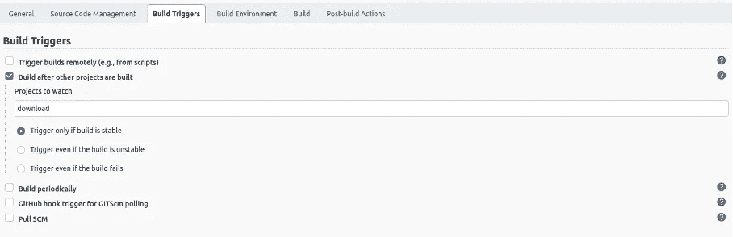

仅当构建稳定时，点击*触发器。*

然后，在 *Build* 中打开一个 *Execute shell* 并键入以下命令，自动启动机器学习应用程序，训练模型并将预测精度打印在一个文件(result.txt)中。

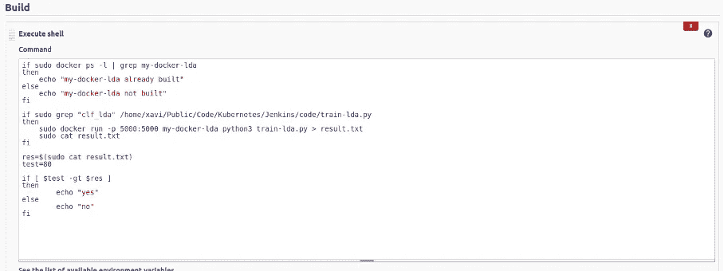

在这里，我们检查 *my-docker-lda* 是否已经构建，然后运行我们的容器并将 lda 模型的准确性保存在一个 *result.txt* 文件中。下一步是检查模型的准确度是否小于 80%,如果是，则输出“是”,否则输出“否”。例如，我们可以发送电子邮件来提供信息:[https://plugins.jenkins.io/email-ext/](https://plugins.jenkins.io/email-ext/)

要查看作业的输出，只需进入*仪表板*、*最后成功*栏，选择作业，并进入*控制台输出*。

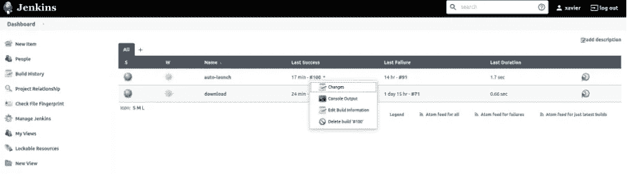

**场景二**

让我们保留**工单#1** 和**工单#2** 并创建一个新工单。

**作业#3:** 自动启动神经网络训练，给出预测精度，检查精度是否小于 80%，如果是，运行 docker 容器执行 autoML

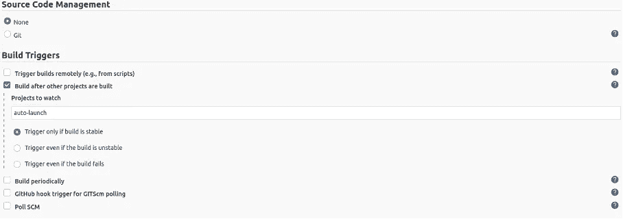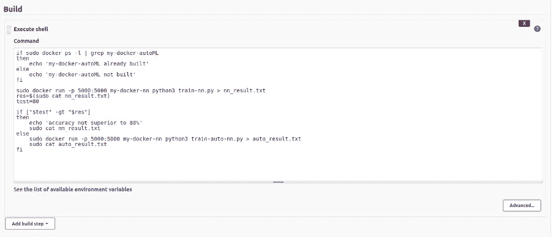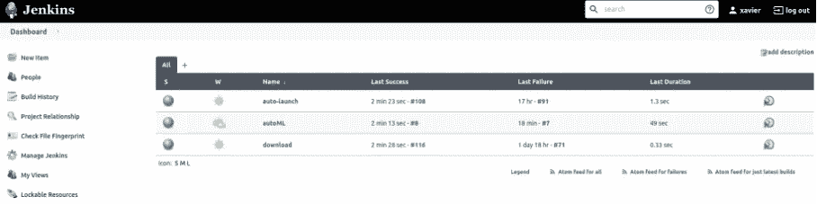

你应该在*控制台输出*中看到所选的参数和新的精度。

# 下一步是什么？

Jenkins 真正关注的是如何自动化数据科学代码。

下一步是考虑将 Ansible 与 Jenkins 一起使用。Ansible 可以在 CI/CD 管道中发挥重要作用。Ansible 将负责应用程序的部署，我们不需要担心如何部署应用程序以及环境是否设置正确。

**来源:**

[https://medium . com/@ fmirikar 5119/ci-CD-with-Jenkins-and-machine-learning-477 e 927 c430 d](https://medium.com/@fmirikar5119/ci-cd-with-jenkins-and-machine-learning-477e927c430d)

[https://www.jenkins.io](https://www.jenkins.io/)

[https://cloud.ibm.com/catalog/content/jenkins](https://cloud.ibm.com/catalog/content/jenkins)

[https://towards data science . com/automating-data-science-projects-with-Jenkins-8e 843771 aa 02](/automating-data-science-projects-with-jenkins-8e843771aa02)