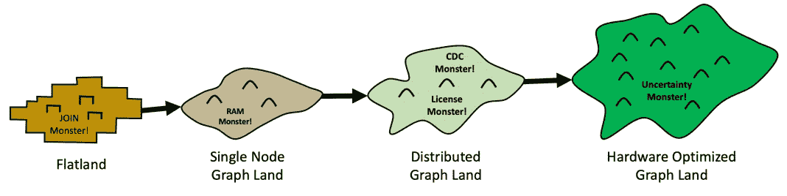
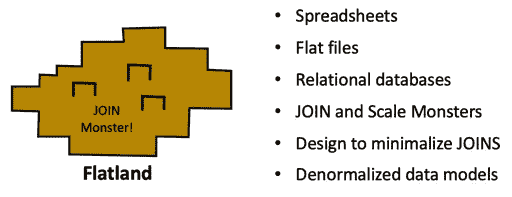
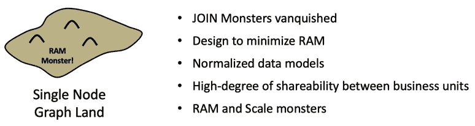
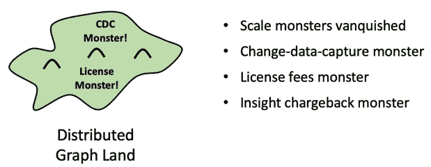
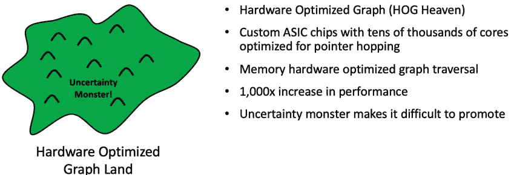
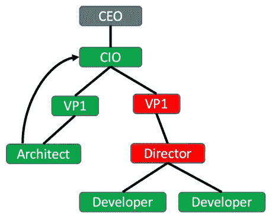

# 从平地到猪天堂

> 原文：<https://towardsdatascience.com/from-flatland-to-hog-heaven-the-four-lands-of-ekg-adoption-945571c09b67?source=collection_archive---------29----------------------->

## EKG 收养的四块土地

企业知识图(EKG)采用的四个领域。你生活在哪里会影响你对商业问题的看法。图片由作者提供。

这个博客是一个隐喻之旅，我们许多人都在朝着构建大型企业级知识图(EKG)的概念前进。我们将看看团队需要完成的三个转变，从使用*平面*数据表示解决问题到在硬件优化的图形服务器上运行十亿顶点心电图。

为了帮助团队实现这些转变，我们必须了解团队在推广心电图时必须学习的新的认知风格*。我们将展示人们如何从使用平面数据表示的问题解决风格过渡到大图，最后是涉及硬件优化图(HOG)数据库的问题解决。我们将关注团队在寻找业务问题中的新模式时将进行的三个不同的转变。*

教导如何实现这些转变对于 EKG 福音传道者在大型组织中取得成功至关重要。我们的目标是使用易于回忆的生动故事为我们的利益相关者创建一个有趣的路线图。我们的假设是，这些生动的故事可以在我们不在身边的时候被重新讲述。伟大的故事帮助团队获得信心，他们可以复述这些故事，并向其他利益相关者解释为什么 EKG 的猪天堂之旅是值得的。

我们将在整篇文章中使用*旅行地图*这个比喻。每块土地都有主要的居民和他们自己的怪物。也许我们可以从这次冒险中创造一个角色扮演游戏。 [*你正站在一片开阔的田野上*](https://en.wikipedia.org/wiki/Zork_I#Notes)……让旅程开始吧！

## 认知风格的背景

1989 年 8 月，当我和史蒂夫·乔布斯在 NeXT 电脑公司工作时，我参加了当时在阿勒格尼学院的埃德·巴博尼博士的演讲。创新的 NeXT 电脑正在向教育市场推广，ed 已经成为使用先进的 NeXT 电脑教授新的解决问题技能的主要倡导者之一。

艾德向我们介绍了一个他称之为*认知风格*的概念，即受过专业训练的人发展出一种特定的思考和解决问题的模式。Ed 坚信，使用下一台计算机来执行任务，如创建和运行模拟，将改变学生解决问题的方式。

哈佛作家肖莎娜·祖博夫(Shoshana Zuboff)在她 1988 年的著作《智能机器时代》(In the Age of The Smart Machine)中，深入研究了技术对充满电脑的工厂和办公室中解决问题和掌握知识的影响。在将近两年的时间里，我一遍又一遍地阅读，并试图将她书中的原则应用于构建一个课程，使用 NeXTStep Interface Builder 工具教授基于 GUI 的面向对象编程。这些领域继续进化成我们现在所说的“计算思维”这些是我们试图嵌入到 CoderDojo 项目的所有在线培训中的抽象模式。

几年来，我试图将这些概念整合到我在 NeXT 的连接驱动面向对象编程课程中。我发现祖博夫关于不同背景的人以不同方式解决问题的观点有可取之处。教授新的认知风格需要让学生接触新的问题/解决模式，并找出如何围绕这些模式创建课程。

设计一个高质量的课程来帮助学生向这些新风格过渡是一个不平凡的过程。这需要对同一门课程进行大量的教学，同时仔细观察和测试每一门课程，并多次重复以达到良好的效果。这是我现在在 EKG 花了很多时间的事情。

这个帮助人们采用新的认知风格的过程的核心是识别和标记不同的风格，并学习策略来帮助学生在没有太大压力的情况下优雅地过渡到新的认知风格。我们需要提供垫脚石，帮助他们朝着新的方向前进。这里是我试图在采用心电图作为组织的中枢神经系统核心的路线图中标记和识别四种不同的风格。

## 假设一个积极的意图

我们带着积极意图的假设开始了穿越这四个国家的旅程。我们假设，在这个共同的旅程中，所有的参与者都想为他们的客户提供良好的服务。他们并没有故意拒绝向顾客提供服务。他们只是没有合适的背景和经验从一个地方迁移到另一个地方。我们问这样一个问题，“*我们怎样才能帮助他们踏上征程。*

我们假设，如果我们的参与者深刻理解了每个领域的优缺点，他们会做出最好的决定来构建服务于他们客户的系统。但是我们的许多团队被困在一个地方，在现有系统上有相当大的投资。有时是第三方软件只在遗留数据库上运行。有时，人们认为，尽管竞争对手继续利用新技术，旧方法仍将继续有效。无论他们的偏见是什么，当他们准备好的时候，EKG 福音传道者的工作就是帮助他们过渡到认知的下一个层次。

## 企业知识图的四个领域

为了帮助我们在采用心电图的路线图上可视化不同的认知风格，让我们创建四个不同的“*认知领域*”并给它们贴上标签。我们将把它们中的每一个都视为解决问题模式的孤岛，并寻找我们需要做出的改变，以使它们迁移到下一个解决问题的孤岛。我们从一个我称之为“平地”的地方开始，这个地方是以埃德温·艾伯特 1884 年令人愉快的讽刺小说命名的。这本书和随后由它改编的电影应该有自己的博客，但那是另一篇文章。

## 岛屿 1:平地

平地:5000 年的行列数据思维。作者的作品。

平地是我们数据认知的起点。知识的平面表格表现了我们的平原的特征。我们在周围世界看到的一切都需要整齐地排列成表格的行和列。这种知识的平面表示非常方便。它真正开始于 5000 年前，当农业在肥沃的新月地带开始流行时，我们开始用粘土写会计记录。这些泥板按行和列记录了农业交易。我们的会计系统今天仍然这样做。

平地是一个拥挤的地方。我估计 90%的非湾区组织都住在这里。许多人职业生涯的大部分时间都住在这里。

平面知识表示经过多年的发展，从泥板到纸莎草卷轴、纸质分类帐、穿孔卡片、COBOL 平面文件，再到关系数据库中的表格。电子表格是平地上最伟大的居民之一。

我在一家拥有大型会计部门的公司工作了几年。他们通常直接雇佣大学毕业的会计学生，公司的高级合伙人监督他们的培训。这些高级合伙人广泛使用电子表格。令我惊讶的是，他们变得如此聪明，几乎在做每一项任务时都使用电子表格。他们会用电子表格的单元格给我发送长文本文档，而不是使用 MS-Word。他们没有使用 PowerPoint，而是用新的文本和图形翻阅电子表格标签。当他们遇到数据库问题时，Excel 成为他们的数据库，当他们有编程任务时，Excel 宏是因为他们的编程语言。

显而易见的是，他们以聪明的方式使用他们拥有的工具，但是当他们被给予一个不适合行列的新任务时，他们经常会挣扎。当一个项目与许多其他项目有关系时，他们通常用逗号分隔的值填充一个单元格。当行中有许多未知的单元格值时，它们的电子表格大多是空的(稀疏的)。

然后平面文件出现了一个新特性，叫做外部引用。这些是比较两个表中的两列以查看事物是否相互关联的方法。如果是的话，那么这些表就可以连接起来，一个新的表就诞生了。

挑战在于，虽然连接操作对于连接两个或三个表很有效，但是需要连接的表越多，性能就越慢。关系非常复杂的事情很难建模，也很难扩展。事实上，数据建模者都同意他们必须走捷径来减少连接的数量。他们用肮脏的反规范化剑与怪物战斗。这些决定降低了模型的精确度，模糊了现实。数据元素有时填充了不属于那里的数据。关于一个专栏真正含义的小谎言悄然而至，让报道团队痛苦地揪着自己的头发。

当这些新的关系模型被创造出来的时候，它们是柔软的，易成型的。但是随着越来越多的数据被加载，它们变得又硬又脆——就像混凝土硬化一样。每创建一份报告，事情就变得更加困难。最终，即使是很小的变更也需要长途跋涉去拜访数据建模变更控制委员会。很少有人从山顶回来时脸上带着微笑。

平地用户需要耐心。他们的网页需要几十秒的时间来渲染，而且随着更多的数据加载到他们的系统中，他们似乎总是变得更慢。有时，当系统上的其他人较少时，用户会熬夜。

平地上的用户在走路时，腿上缠着一个叫做“ERP”的大球链。这些系统旨在管理公司的传统会计和财务系统。但是他们在为你的网站上的 20，000 个并发用户创建低于 50 毫秒的推荐方面做得不好。

平地上的极速赛车手驾驶由单个大型事实表驱动的汽车，这些事实表只有一级连接到共享维度。当团队无法就事实或维度达成一致时，他们会迅速制造新车来优化他们的连接。Flatland 最初的目标是建立一个单一的数据仓库，让每个人都来崇拜分析之神。现在有数百个小数据集市在岛上行驶，每个都有自己的真相版本。

**认知风格:**我们可以在这个表格、行或单元格中放入什么？如何才能让模型保持简单？我们如何最小化连接？

**主要玩家:**电子表格怪物，加入怪物，规模怪物，事实表速度赛车

## 岛 2:单节点图形陆地

单节点图形土地。这里没有连接怪物，但是可伸缩怪物仍然存在——作者的作品。

在这第二个岛上，住着永远战胜了怪物的人们。当遍历关系时，它们不是比较列，而是简单地跳过内存指针。它们又轻又快。但是在我工作的团队中，只有大约 5%的人尝试过单节点图。

这片土地充满了表演和洞察力。在这片土地上，网络屏幕都在 1/100 秒内呈现。单节点 Graphland 的海岸充满了美丽复杂的形状和许多反映真实世界的复杂关系。在真实模型上没有妥协。开发商感觉他们在天堂，在海滩小屋啜饮椰汁可乐。

单节点图土地是一个相对的天堂，因为人们没有生活在怪物的恐惧中。当复杂性出现时，他们只是通过随意添加新关系来处理它。因此，数据模型充满了真实和美丽。数据模型被优雅地展示为真理的公共雕塑。没有人有任何过于简单化的秘密要隐藏。每个人都共享一个数据模型，因为它是真实的世界模型。共享有助于降低成本。

在“新数据负载”海啸袭击他们之前，一切都很好。然后行动小组开始紧急行动。因为如果这些小指针不适合可用的 RAM，所有的查询都会突然变慢，等待新数据从固态硬盘或更糟的是，永远缓慢旋转的磁盘换入。添加额外的 RAM 有所帮助，但是随着数据量的增长，这种设计从根本上来说是不稳定的。响应时间变得难以预测。试点项目往往与真正的企业级问题隔离开来，图形团队专注于适合服务器内存的问题。开发人员生活在对新数据加载的恐惧中，并努力将所有内容保存在 RAM 中。

**认知风格:**真实世界的精确模型，共享模型。但是 RAM 里能装什么呢？

**关键玩家:**海滩小屋中的开发者，太少的 RAM，规模怪兽，数据负载图三密，像树懒一样缓慢旋转的磁盘

## 孤岛 3:分布式图形土地

分布式图形土地。规模不再是一个问题——作者的作品。

我们旅程的第三章是到一个相对新的岛:分布式图土地。这个岛对大多数公司来说只存在了三年，尽管像谷歌、脸书和 LinkedIn 这样的湾区公司已经在这个岛上生活了八年多。这个岛有许多与单节点图土地相同的奇迹。这些模型是精确的，可以由许多业务部门共享。但是有一个关键的区别。可怕的公羊怪物已经被抛在后面了！再也不用担心新数据负载会破坏性能！

在这个岛上，当加载新数据时，新服务器会神奇地与主岛合并。数据在新的土地上透明地重新平衡。该岛没有一个次区域承受过度的压力。所有人平均分担工作。

并且在增长期间不会中断任何服务。一切都顺利进行。随着大型季节性项目的结束，这些服务器可以转移到其他关键项目。岛屿的大小是可变的，它随着需求的变化而增长和收缩。

但是这里仍然有一些怪物。租金仍然高得令人难以置信。互联数据需求很大，但供给不足。用复杂的变更数据捕获(CDC)系统导入许多不同数据源的成本是不小的。使用简单的确定性规则将数据合并在一起需要花费时间和精力。

这里的挑战是控制系统的成本。RAM 现在很便宜，但是软件层仍然可以达到每年每 TB 六到七位数。需要对图表中的数据做出谨慎的决定。

这块土地人口还不多。我的猜测是，只有不到 3%的公司真正在构建真正的横向扩展企业知识图。然而，有许多人慢慢意识到，他们应该将它视为降低成本的一种方式，整合客户的观点，提供更好的建议和预测，利用机器学习，并创造更快的洞察时间。

因为这个岛还是新的，市场上没有足够的竞争来降低成本。几个卖主控制着这个岛。讨论的是 RAM-ROI。我们可以在 RAM 中保留哪些元素？因此，只有企业急需的数据才允许在岛上使用。如果企业不愿意为显示或报告付费，数据就会被推离孤岛，进入 blobstore 的深海，在那里可查询性会下降几个数量级。

在这个岛上，如何让这个岛成长，并不是基于人们对明显不相关的数据寻求深刻见解的梦想。这些决定是基于会计部门无情的短期成本收益分析。超过一年的数据需要一个富有的赞助人，否则数据保留规则每天都会生效。你昨天看到的欺诈数据——噗！今天没有了。

需要五年历史数据来发现模式的欺诈调查人员现在盯着不相关的图表。他们知道有联系可以发现，但是他们现在必须求助于在旧的 blob 商店和 S3 桶中搜寻。他们的 LED 蜡烛燃烧到深夜。

对新贝叶斯因果模型提出卓越假设的数据科学家在绝望的贫民窟中无家可归，因为他们的数据已经不在 EKG 了。他们带着他们的蒸汽朋克机器学习模型和他们破旧的 Jupyter 笔记本在街上乞讨，笔记本上写满了潦草的方程，只有*他们*看到了真正的美。

如果有异常活动，希望得到通知的团队呢？嗯，他们有一些每晚运行一次的报告。这些报告没有太多的依据，所以在他们能够提出对策之前，他们经常错过关键的变化。由于运营成本高，并非所有早期干预都是可行的。

**关键人物:**无情的会计师、消失的数据、走进死胡同的欺诈调查人员、气馁的数据科学家、来不及采取行动的通知。

## 岛 4:硬件优化图形土地(又名猪天堂)

硬件优化图形平台:每个晶体管都经过优化，以满足客户的实时需求。作者的作品。

*拱起天堂:非常舒适或幸福的状态*

今天我们站在分布图的陆地海岸上，眺望大海对面一个刚刚在新的火山爆发中形成的新岛屿。这个岛还不适合居住，但我们中的许多人可以看到它的潜力。这是硬件优化图(HOG)的地盘。我们称它为*猪天堂*，因为它有希望使我们的 EKG 作为一个真正的中枢神经系统成为现实。在猪的天堂，我们看到一种非常轻松和幸福的状态。

我们知道这块土地在那里，因为早在 2014 年就有关于 Cray Research Graph Engine 性能的传说(参见 6.10 我们的 NoSQL 案例研究[这里](https://www.manning.com/books/making-sense-of-nosql))。我们知道图形系统可以扩展到数万 GTEPS，因为我们可以在 [Graph500](http://graph500.org/) 基准测试中看到它们。但是，一个普通的公司能把他们的 ACID 事务放在这个数据库中并获得 5 个 9 的高可用性吗？

在这个岛上，有大量(几万或几十万)的内核等待新的任务。一个查询到达后，这些线程立即开始遍历图，快速遍历内存中线程附近的链接。我们的程序小而精确，允许我们执行复杂的操作，寻找复杂结构中的深层模式。

在猪天堂，历史数据被保留多年。欺诈调查人员不断发现不良行为并节省资金。

随处嵌入运动是猪天堂宗教的一部分。机器语言算法不断扫描图的子集，并为几乎每个顶点重建嵌入。数据管理员使用这些嵌入来持续监控每个新数据导入的数据质量和一致性。

数据不再需要发送到 GPU 集群进行训练。我们有足够的 CPU 能力。机器学习是在原地完成的。数据不会不必要地移动，安全团队晚上睡得很好。

你的数据科学家呢？他们发现了从未想象过的新见解。他们不断使用实时查询和发现流程，与不断提出新问题的主题专家实时合作。十亿个顶点查询只需片刻。

那些你永远也不能负担得起的早期预警系统呢？有成千上万的在后台不断运行。他们在有时间进行干预的时候发现异常。这些比少数派报告中的预测要好。

## 猪天堂是深度系统思考

《猪天堂》是深度系统思维的结果:图形喜欢它们的定制硬件。照片由[布鲁诺·范德克朗](https://unsplash.com/@brunovdkraan?utm_source=medium&utm_medium=referral)在 [Unsplash](https://unsplash.com?utm_source=medium&utm_medium=referral) 拍摄

猪天堂不是一个意外。它是深度[系统思考](https://dmccreary.medium.com/the-god-graph-d382525ba0ae)的结果。这种想法从客户需求一直到 CPU 指令集和内存访问硬件。这是我们认真了解如何存储关联知识以更好地服务于我们的客户并让我们的数据科学家成为高效的知识科学家的结果。组件交互是复杂的:带标签的属性图、[无索引邻接](https://dmccreary.medium.com/how-to-explain-index-free-adjacency-to-your-manager-1a8e68ec664a)、分布式数据库、快速[指针跳转](https://en.wikipedia.org/wiki/Pointer_jumping)，以及在经济高效的解决方案中采用高内核数量和快速内存通道的智能硬件设计，所有这些都相互交互。

## 寻找盟友并确定不情愿的团队成员

在推广心电图的过程中，我们学到的一个教训是，方向上的重大战略转变需要广泛的共识。获得高管赞助只是第一步。我们需要组织上下的盟友。有时候盟友来自不寻常的地方。

例如，他们的人力资源领导能帮助你在你的组织中找到变革推动者吗？您的企业安全团队中是否有成员担心数百个小型数据集市的蔓延？市场营销中有没有人想把你的组织提升为人工智能领域的领导者？

影响图可以帮助你隔离 EKG 采用中的麻烦点。在这个图中，绿色的人是你的 EKG 拥护者，红色的立场阻碍了你的倡议——作者的作品。

构建组织结构图影响图可以是另一种"*系统思维"*的方式，来处理这样的问题，即查看谁在哪个岛上，以及你需要做什么来将他们转移到下一个岛上。

无论你的旅程是什么，不要试图独自完成。我们希望您能在我们日益壮大的 EKG 社区中寻找其他成员，分享您的成功故事和失败经历。在这个共同的旅程中，我们可以互相学习。

旅途愉快！