# 从高中物理到 GANs:掌握生成式机器学习的要点[1/2]

> 原文：<https://towardsdatascience.com/from-high-school-physics-to-gans-essentials-for-mastering-generative-machine-learning-1-2-da4bd5bb5568?source=collection_archive---------14----------------------->

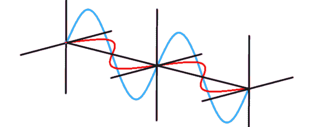

波动图解[http://animatedphysics.com/insights/modelling-photon-phase/](http://animatedphysics.com/insights/modelling-photon-phase/)

GANs 和其他生成式机器学习算法仍然被大肆宣传，并在图像、文本和声音方面发挥着神奇的作用。他们不仅能够生成有趣的数据，还能解决重要的理论问题，促进大规模生产。不幸的是，今天典型的实际用例仅限于“为[僵尸一代](https://futurism.com/the-byte/neural-network-turns-you-into-zombie)微调预训练的 StyleGAN2”。更糟糕的是，几乎没有人关心解释为什么[我们在现实世界中需要生成模型](https://medium.com/@alexrachnog/gans-beyond-generation-7-alternative-use-cases-725c60ba95e8)以及这种需求的根源来自哪里。

接下来的两篇文章旨在弥合现代酷的东西和稍微被遗忘的老派数学建模之间的差距，当时没有大数据集和强大的神经网络。掌握本材料后，您将能够:

*   理解为什么生成机器学习是一种伴随我们几个世纪的**更强大的数据建模范式**
*   更快地学习和**实现每一个现代生成模型**，了解这一过程的科学基础和需求
*   为创成式建模制定新的方案，并为研发过程或最终产品获得附加值

一如既往，所有实验的源代码，你可以在我的 [Github](https://github.com/Rachnog/From-Physics-To-GANs) 上找到。

# 作为生成模型的经典力学

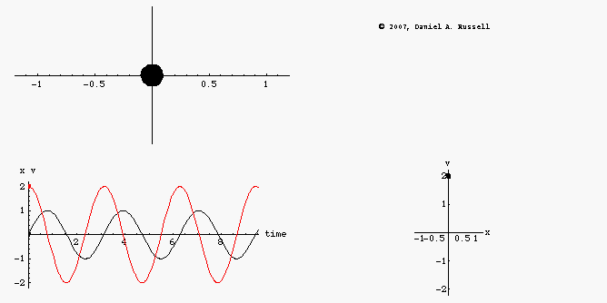

无阻尼振荡器的运动示意图，即我们例子中的摆。图片来自[https://www . ACS . PSU . edu/drussell/Demos/phase-diagram/phase-diagram . html](https://www.acs.psu.edu/drussell/Demos/phase-diagram/phase-diagram.html)

让我们记住物理课。你学到的第一个主题是简单 1D 情况下的力，运动，时间，速度，加速度。甚至在微积分课上学习微分或积分之前，你就可以很容易地根据时间和相关位置计算出物体的速度。同样的策略可以应用于更复杂的力学，如弹簧力、摆、多维力学等。你只需要用适当的公式替换，然后重新做微积分例行程序。这种建模的简化过程如下:

*   识别****物体**正在移动，有哪些位置，坐标系的原点，初始条件**
*   **找到描述给定对象在给定条件下的行为的**适当的** **模型****
*   ****用给定的条件求解模型的** **方程**并找到速度、加速度或其他变量**
*   **分析**解决方案**及其有效性**

**例如，在钟摆系统的情况下(在上面的插图上)，您可以将**对象**动力学**模型**定义为其在拉格朗日中的动能和势能之间的平衡，如果您为单个自由度(振荡的角度)求解它，您将获得运动轨迹的**方程，您可以**求解不同条件下的**。****

**现在最酷的部分是:**

> **就像我们用 GANs 采样人脸、猫和歌曲一样，我们可以通过解方程来采样物理对象的复杂运动。几个世纪以来？它让我们登上了月球。没有千兆字节的数据和用于深度神经网络的 GPU。**

**我敢打赌，他们在物理课上没教过你这个角度。如果你有这个摆的精确公式，你就有了你的**“摆锤”**:你只需要采样长度、重力、振幅等，并把它们插入公式:这样你就可以产生你想要的任意多的摆。唯一不同的是 GAN 有一些准随机向量作为输入，公式是用数据训练的黑盒神经网络。下面是一些采样轨迹的插图和代码，你可以在这里找到。**

**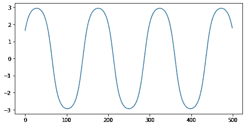****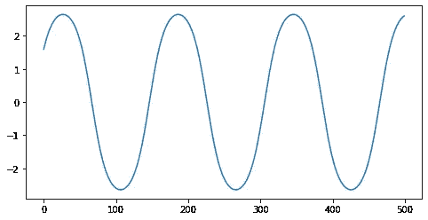****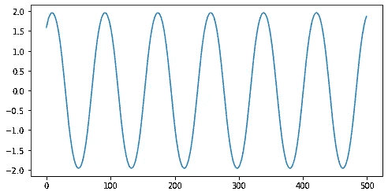**

**我们的生成模型必须能够对看起来有点像这样的轨迹进行采样**

# **作为函数逼近的生成建模**

****

**迭代逼近另一振荡行为的神经 ODE 网络。我们能用更简单的生成模型做同样的事情吗？来自我的另一篇博文:[https://towards data science . com/neural-odes-breakdown-of-other-deep-learning-breakthrough-3e 78 c 7213795](/neural-odes-breakdown-of-another-deep-learning-breakthrough-3e78c7213795)**

**科学家也观察数据，但是用他们的头脑创造一个公式。知道神经网络是通用近似器，我们可以训练它们从数据中近似这些公式。我们来进行一个实验，在不知道摆的物理性质的情况下，想通过不同绳长、球质量、角度等的观测来学习一个黑箱公式。**我们可以逐步生成我们的轨迹，将步数和上述属性作为输入，将轨迹点作为我们模型的输出**。**

**更多细节和实现都在[这里](https://github.com/Rachnog/From-Physics-To-GANs)。为了模拟“真实世界”的条件并增加观察的不确定性，我们将在数据中添加不同的噪声，查看[源代码](https://github.com/Rachnog/From-Physics-To-GANs)中的更多细节。正如我们所看到的，我们可以成功地生成不同角度、绳长等的摆轨迹，而无需知道精确的数学模型，只需观察有噪声的数据(正如在真实科学中发生的那样):**

**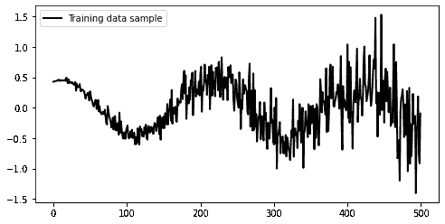****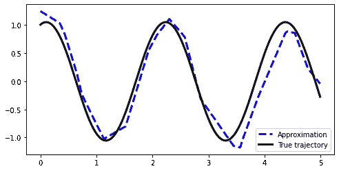****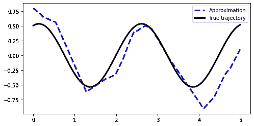**

**最左边的图像上有噪声的训练数据示例，中间是 theta=1，omega=1，m=1，l=1 的摆轨迹及其近似值，最右边的图像上是 theta=0.5，omega=0.5，m=1.5，l=1.5 的摆轨迹。预测是通过确定性神经网络完成的**

**有趣的是，随着噪声影响的增加，近似精度变得越来越差，正如所料。然而，在统计学习中，我们说，只有当我们从观察样本中学习了数据分布，我们才真正学会了如何生成数据。我们的近似是**只是一个确定性函数**，它没有分布的性质，我们不能从中采样不同的轨迹。**

# **贝叶斯生成建模**

**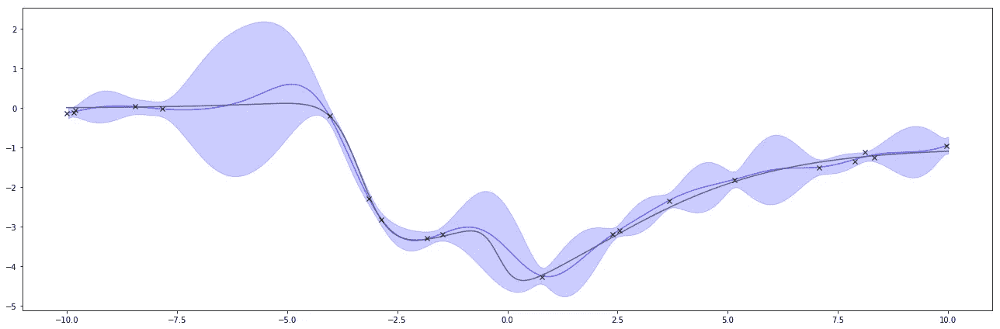**

**高斯过程回归的示例-一种贝叶斯机器学习算法，允许在我们没有足够数据且无法对预测有信心的地方对不确定性进行建模。图片来自[https://jessicastringham.net/2018/05/18/Gaussian-Processes/](https://jessicastringham.net/2018/05/18/Gaussian-Processes/)**

**简而言之，每个样本(即使是摆的同一步)都可能略有不同，因为我们在数据中引入了一些噪声，这是我们的模型无法确定每一步预测的原因。然后，我们需要在模型中捕捉这个噪声。**

**我们可以将模型的输出和模型的权重从确定性点估计转换为分布，我们可以从中进行采样。输出的噪声称为**任意的**不确定性，也是权重之一——**认知的**。与上一个示例相同，我们一步一步地生成我们的轨迹，但是，现在在每一步上，我们都可以根据不确定性水平对可能符合轨迹的几个潜在选项进行采样:**

******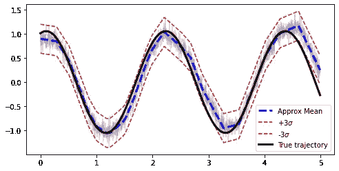****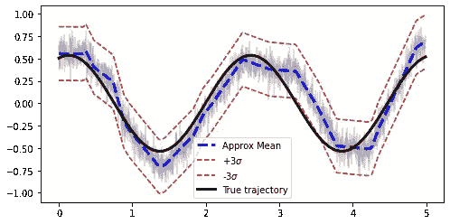**

**最左边的图像上有噪声的训练数据示例，中间是 theta=1，omega=1，m=1，l=1 的摆轨迹及其近似值，最右边的图像上是 theta=0.5，omega=0.5，m=1.5，l=1.5 的摆轨迹。使用贝叶斯神经网络进行预测，生成的轨迹具有灰色，每幅图像采样 5 个轨迹**

**我已经实现了与近似情况下相同的神经网络，但是在 TensorFlow Probability 的帮助下，可以很容易地将它变成一个**贝叶斯神经网络**。如果你想要贝叶斯机器学习的额外教程，请告诉我！如您所见，现在的结果与我们使用“GAN 框架”观察的结果相同:我们获取了数据，对其进行建模，并且我们能够对不同的实际样本进行采样。我们还可以注意到，在确定性区间内，随机**生成模型实际上具有更好的准确性。它与实际的 GANs、VAEs 和其他生成模型有什么关系，我们将在下一篇博文中讨论。****

# **外卖食品**

**这个简短的介绍旨在通过一个简单的例子来说明:**

*   **几个世纪以来,“生成”事物是科学的一个自然概念:我们用来解决现实生活过程问题的方程是从数学模型中推导出来的，这些数学模型可以像甘斯一样“采样”那些过程**
*   **在数据驱动的世界中，我们希望“自动”创建这些模型，而不像科学家那样定义精确的公式及其参数，但仍然能够模拟现实世界的对象并求解方程**
*   **我们可以通过欺骗的方式来实现它，并制作“预测”模型，这些模型将逼近我们的物理对象的数学模型的逐步解决方案，然而，我们可以用更优雅的方式来实现它**

**下一篇文章[将从这里开始，展示实际上作为物理过程的数学模型的 gan 和 vae，我希望这将激励您在许多更复杂和有趣的工业和研究场景中学习和使用生成模型。](/from-high-school-physics-to-gans-essentials-for-mastering-generative-machine-learning-2-2-82e39ca2a3b)**

****附言**
如果你觉得这个内容有用，有观点，可以[在 Bitclout](https://bitclout.com/u/alexrachnog) 上支持我。关注我还可以在[脸书](https://www.facebook.com/rachnogstyle.blog)上看到太短的人工智能文章，在 [Instagram](http://instagram.com/rachnogstyle) 上看到个人资料，在 [Linkedin](https://www.linkedin.com/in/alexandr-honchar-4423b962/) 上看到！如果你想在可解释的人工智能应用或其他人工智能项目上合作，请联系我。**