# 从高中物理到 GANs:掌握生成式机器学习的要点[2/2]

> 原文：<https://towardsdatascience.com/from-high-school-physics-to-gans-essentials-for-mastering-generative-machine-learning-2-2-82e39ca2a3b?source=collection_archive---------24----------------------->

波动图解[http://animatedphysics.com/insights/modelling-photon-phase/](http://animatedphysics.com/insights/modelling-photon-phase/)

在[之前的文章](/from-high-school-physics-to-gans-essentials-for-mastering-generative-machine-learning-1-2-da4bd5bb5568)中，我们已经进行了一些实验，在这些实验中，我们已经学会了如何用机器学习算法来逼近物理定律模型，这是“真正的”数据生成过程的前奏。在本文中，我们不会简单地估计一个时间步长和对象的确切位置之间的依赖关系，而是会根据来自数据分布的对象生成整个轨迹，并尝试像在经典数学模型中一样控制这一过程和变量。

本文总结了数学建模从人类设计第一到数据驱动第一的演变思想，我希望它将阐明为什么我们今天需要生成建模，并且您将能够在您的 R&D 和产品活动中实施它。和往常一样，源代码在[我的 Github](https://github.com/Rachnog/From-Physics-To-GANs) 上。

# 从数据中学习纯“代”公式

## 最大化模型的可能性

我们如何学习复杂数据的分布(而不是近似函数),然后从中取样？建立这种模型最常见的方法是**最大似然法(MLE)** 。似然性是一个数学公式，用于衡量数学模型与经验数据的拟合度。可能性本身可以表示为:

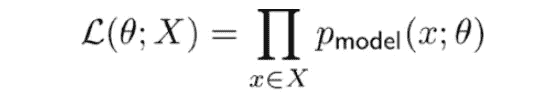

取决于模型参数θ和数据 X 的似然函数

为了找到这样的θ，使**最大化这个可能性**，我们用不同的算法(例如，蒙特卡罗马尔可夫链)解决一个优化问题:

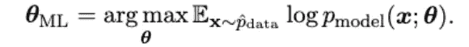

模型的最优θ，它使模型和数据之间的上述似然性最大化

这是**与最小化交叉熵**相同，这是你可以在文献和大部分机器学习教程中找到的，但也有关于这项任务的另一种观点。

## 最小化模型和数据之间的距离

让我们记住一些信息理论。某个事件 x 的自信息和对应的香农熵可以表示为:

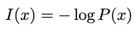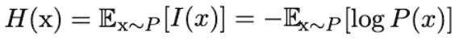

自我信息公式/香农熵公式

信息论解决的一个典型任务是比较两个有一定距离的分布，以确定它们彼此有多远。在我们的 MLE 框架中，对数似然的交叉熵已经衡量了拟合的“良好性”,我们的目标是最大化它。在信息论方法中，我们希望**最小化模型和数据分布**之间的距离，我们可以使用 Kullback-Leibler 散度来描述这个距离:

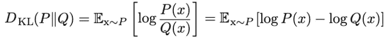

分布 P 和 Q 之间的 Kullback-Leibler (KL)散度公式

最小化这种差异会导致最小化这一项:

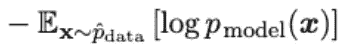

最小化 KL 散度解，这与最大似然函数最大化相一致

> 我们可以看到，最小化 KL 散度与最大化似然函数是一样的！

这看起来已经很像我们以前用神经网络做的了，所以我们为什么不试着在这里应用它们呢？

# 生成性对抗网络 101

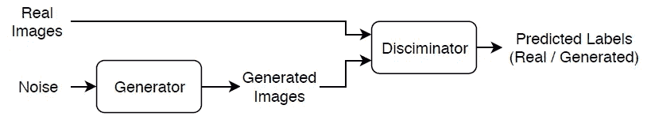

生成对抗网络(GAN)训练程序。图片来自[https://it . mathworks . com/help/deep learning/ug/train-generative-adversarial-network . html](https://it.mathworks.com/help/deeplearning/ug/train-generative-adversarial-network.html)

不幸的是，在现实生活中，我们并不确切知道数据生成过程，因此，我们不能使用 ML 最大化/ KL 最小化来训练这样的模型。学习数据分布过程的现代替代方法是两个神经网络(生成器和鉴别器)之间的最小-最大博弈。然而，我们仍然希望有一个与基础知识的联系，并保持最小化发行版之间的距离。

让我们假设，不是有一些距离的解析公式，我们可以有**一个习得的散度**，这本身就是一些优化问题。*请注意，因为我们在这里非常 meta】。我们希望同时学习一个函数(分布之间的散度)，该函数将用于学习另一个函数(生成将最小化该散度的网络):*

*   最小化“学习发散”的“外部”函数我们将称为**生成器**:

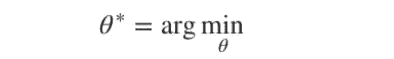

发生器的功能取决于必须优化的θ参数

*   第二个“内部”函数被训练来表示数据样本属于我们的数据分布的概率。这个“内部”函数我们称之为**鉴别器**:

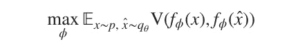

鉴别器 V 的功能必须最大化，以正确识别真实数据样本和伪造生成的样本

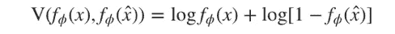

它通过最大化上述函数来惩罚将真实实例错误分类为假的 GAN，或将假实例错误分类为真实的 GAN

这可以用詹森-香农散度来表示。总之，应该被优化以找到两个神经网络的权重的**总损失函数**看起来(表示为参数θ和φ)如下:

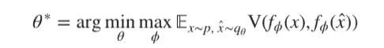

GAN 优化目标是 1)鉴别器和 2)生成器之间的最小-最大博弈，鉴别器训练以判断新数据样本是否属于目标分布，生成器学习对尽可能接近目标分布的新数据样本进行采样

这里的主要思想是，我们仍然最小化关于发生器参数的某种 KL 散度，但是由于我们不知道 p_data(x ),我们将它作为单独的鉴别器来学习。把它放在你最喜欢的深度学习框架里面非常简单，你可以在[我的 Github](https://github.com/Rachnog/From-Physics-To-GANs) 或者其他很多教程里看到。现在它将学习我们的钟摆轨迹？**让我们检查一些可视化效果**:

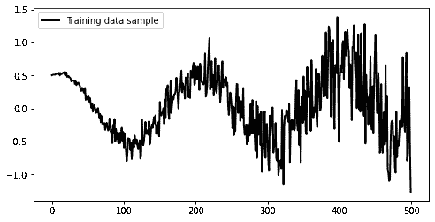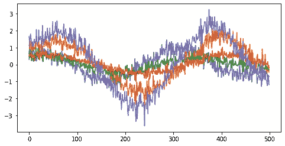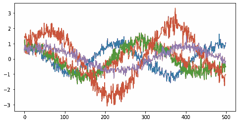

最右边的两幅图像是从 GAN 中提取的样本。详细的架构可以在我的 Github 上的相应笔记本中找到

从质量的角度来看，这不是最好的结果，但这些样本显然来自我们的发行版，并且种类繁多，让我们从 GAN 相关的教程和课程中取得进步，为我们进行平滑和美化工作。我们需要专注于**使发电可控**就像在透明的数学模型中，每个变量都有自己的物理意义。现在，我们得到的只是随机输入噪声，与控制无关。

# 从数据中学习可解释的物理定律

大多数 GANs 的输入是随机向量，从中产生随机对象。在数学建模中，输入当然可以是随机向量的一部分，但是这些输入中的每一个都负责一个单一的输出属性，这对于常规的 GANs 来说是不正确的(参见我的另一篇文章[中的更多为什么)。](/gans-vs-odes-the-end-of-mathematical-modeling-ec158f04acb9)

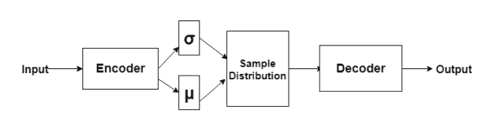

变分自动编码器示意图，图片来源:[https://theailearner . com/2018/11/10/variable-auto encoders/](https://theailearner.com/2018/11/10/variational-autoencoders/)

然而，我们有**变型自动编码器** (VAEs) **，**可以

*   用称为**编码器**的神经网络将数据压缩成潜在向量
*   通过给这个向量添加一些噪声，我们可以用另一个叫做**解码器**的网络生成新的对象(见上面的结构)

这个噪声向量可能与 GANs 中的一样无法解释，但是我们可以用损失函数中的正则项**来影响它。这个术语(见下面的公式)使得所有潜在向量的所有元素最大程度地相互独立，这导致学习潜在向量的每个元素的不同数据属性(与 GANs 中的输入随机向量相反):**

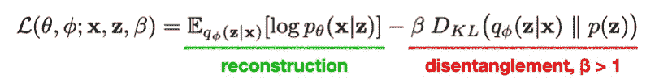

进行与上面相同的实验，但是这次使用 VAE，我们可以实现以下生成结果:

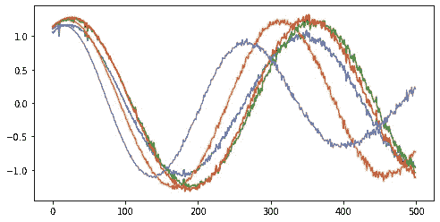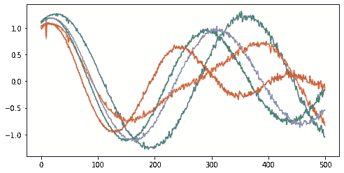

最右边的两幅图像是从β= 1 的 VAE 中提取的样本。详细的架构可以在我的 Github 上的相应笔记本中找到

正如我们所看到的，样品比 GAN 干净得多，这确实非常好！现在，让我们用β= 10 重新训练这个模型，让我们操纵潜在维度(我已经选择它为 6，因为我们改变ω、θ、绳子长度和物体的质量来创建数据集+ 2，我期望它们是空白的)。我们想看到的是，通过使一个潜在维度变大或变小来观察物理对象属性的变化:

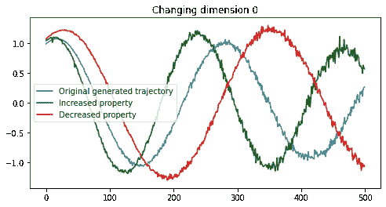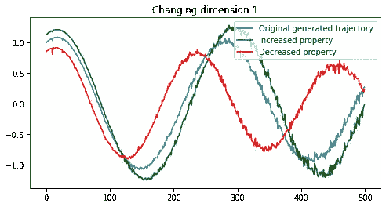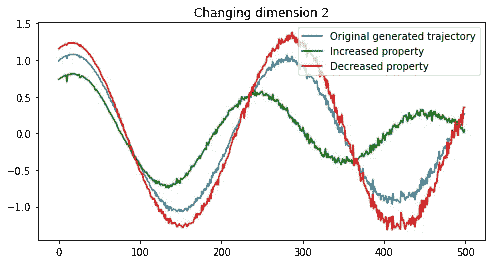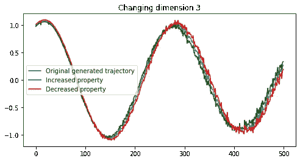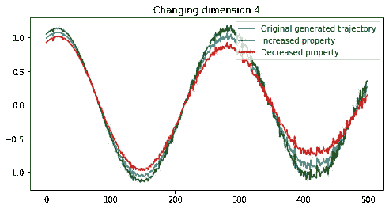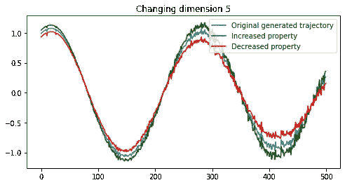

样本取自β= 10 的 VAE。每张图片代表潜在向量的一个维度的变化。蓝线是原始采样轨迹，绿线表示潜在维度的增加(同时保持其他维度不变)，红线表示潜在维度的减少

我们所看到的是相当棘手的…我们可以看到，最后 3 个维度几乎没有改变什么，在我们的 VAE 是“空白”代码。但是，很难把前三个维度解读清楚。我们可以说，第一个**改变产生的波的频率**，第二个和第三个**改变振幅**。这不完全是我们在生成数据时计划的，但这是神经网络看到的！我建议在其他数据集上尝试这种技术。例如，在我之前的一个[实验](/gans-vs-odes-the-end-of-mathematical-modeling-ec158f04acb9)中，我可以得到一个关于脉搏速度和一些异常的心跳的很好的表示:

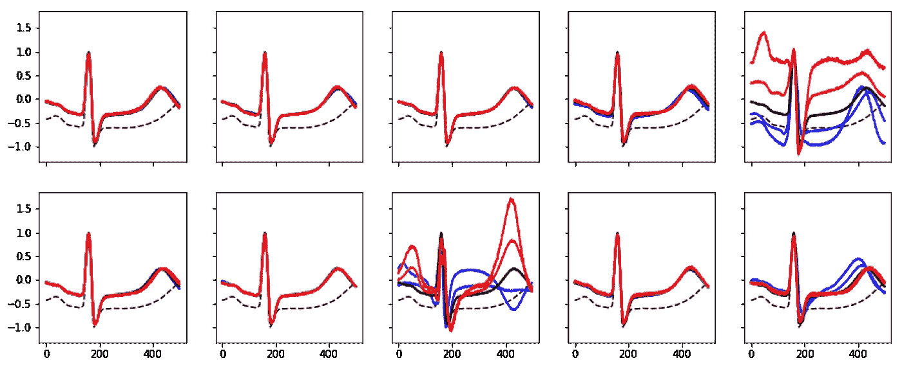

关于这个实验的更多细节请看这里:[https://towards data science . com/gans-vs-odes-the-end-of-mathematical-modeling-EC 158 f 04 ACB 9](/gans-vs-odes-the-end-of-mathematical-modeling-ec158f04acb9)

# 外卖食品

在这[两篇文章](/from-high-school-physics-to-gans-essentials-for-mastering-generative-machine-learning-1-2-da4bd5bb5568)中，我们从数学建模的一阶原理中构建了生成式机器学习的思想。通过一个简单的振荡摆运动的例子，我们实现了:

*   一个经典的人类设计的**数学模型**，从物理属性和时间步长中采样轨迹
*   一个**机器学习模型**，它从嘈杂的经验观察中逼近动态，不需要人类设计的公式
*   一个**概率机器学习模型**，它可以根据每个时间步的不确定性生成不同的轨迹
*   一个**生成对抗网络**，它生成一个完整的轨迹，而不需要告诉物理属性和时间步骤
*   一个**变型自动编码器**，它生成一个完整的轨迹并允许控制属性(尽管不是我们所期望的)

现在是时候处理更复杂的数据了！让我知道这种解释生成建模的方法是否有用，我应该在这方面写更多:如何生成图像、文本、声音，甚至表格数据，记住把我们的花哨 GANs 视为数学建模工具的想法。

**附言**
如果你觉得这个内容有用，有观点，可以[在 Bitclout 上支持我](https://bitclout.com/u/alexrachnog)。关注我还可以在[脸书](https://www.facebook.com/rachnogstyle.blog)上看到太短的人工智能文章，在 [Instagram](http://instagram.com/rachnogstyle) 上看到个人信息，在 [Linkedin](https://www.linkedin.com/in/alexandr-honchar-4423b962/) 上看到！如果你想在可解释的人工智能应用或其他人工智能项目上合作，请联系我。