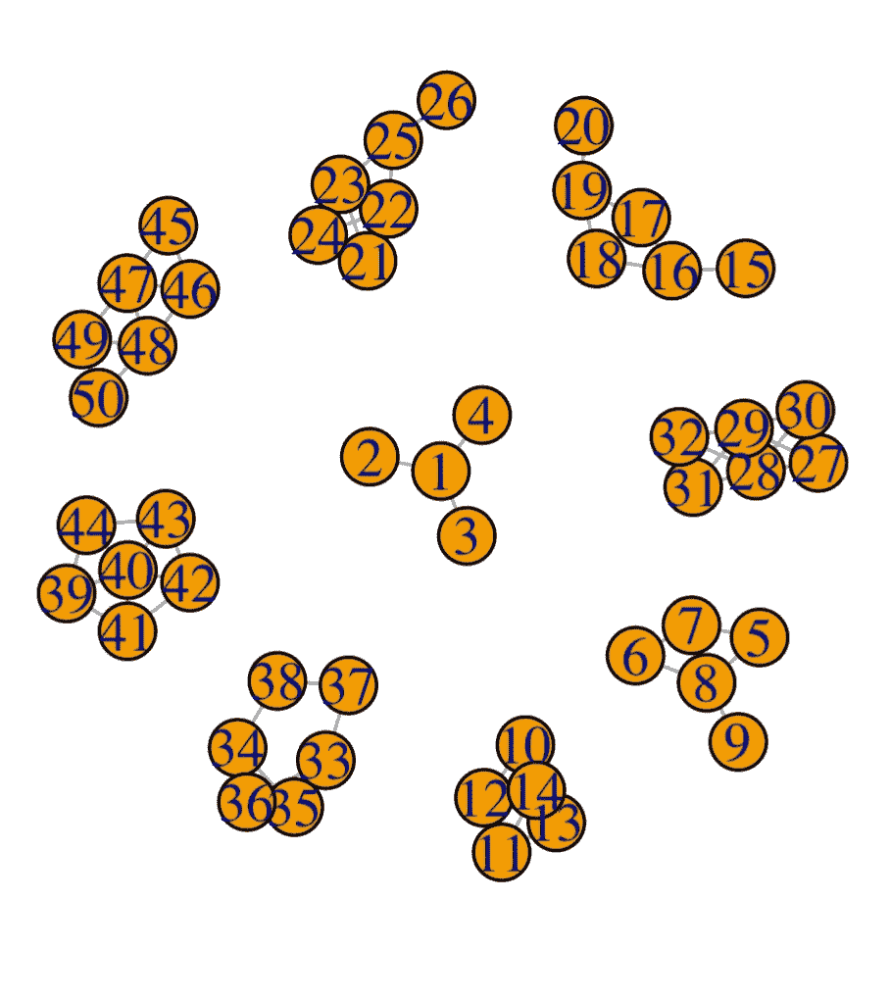
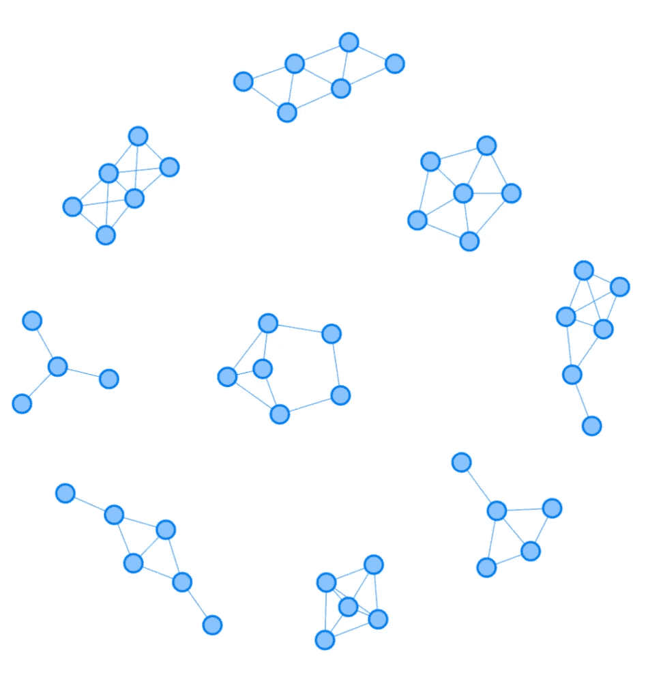
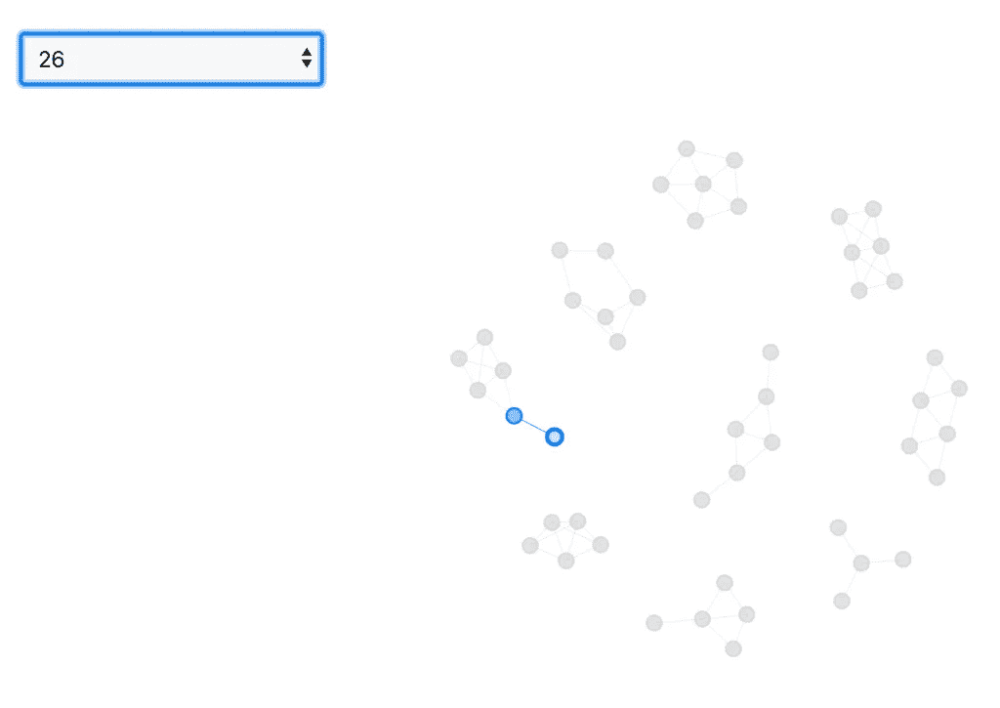
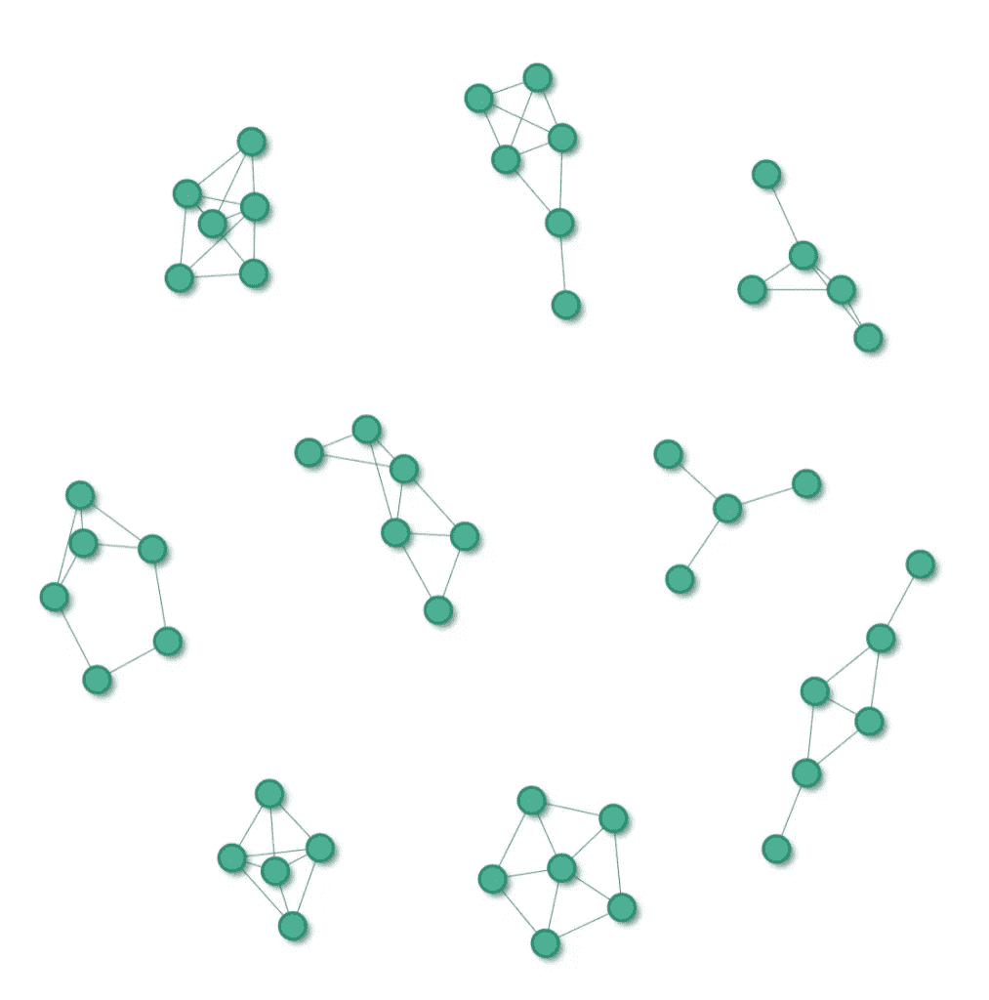
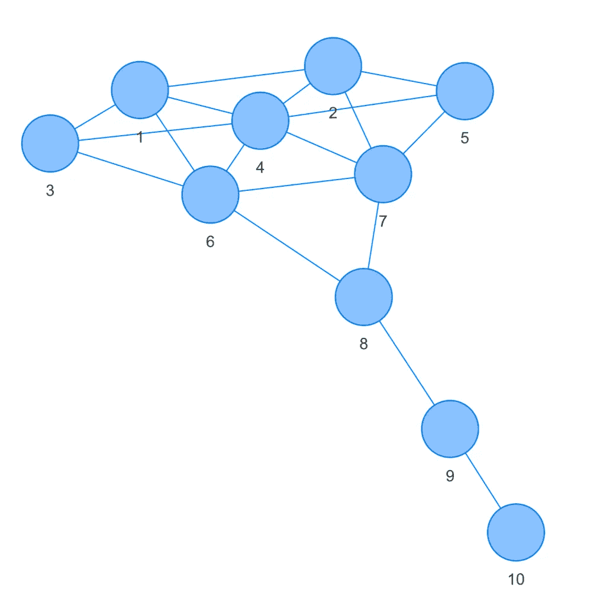

# 从 igraph 到 visNetwork

> 原文：<https://towardsdatascience.com/from-igraph-to-visnetwork-7bc5a76fdeec?source=collection_archive---------31----------------------->

## 让您的网络焕然一新


照片由克里斯蒂安·休姆在 Unsplash 上拍摄

说到网络分析， **igraph** 是一个拥有大量[文档](https://igraph.org/r/#docs)的包中之兽。如果你在 R 语言中做网络分析，你可能至少听说过它。使用 **igraph** ，你可以创建和比较确定性或随机网络，计算中心性度量，并在网络中找到社区。你甚至可以在一个有*百万*个节点和边的网络上实现图形算法！

甚至在可视化方面，igraph 也有丰富的选项。首先，有您期望的绘图的基本功能:改变网络的大小、形状、标签和布局。但是，您甚至可以通过使用 tkplot()创建交互式图形来超越基础——尽管不建议将它们用于大型图形。最后，使用 **rgl** 包，您可以用 OpenGL 构建和可视化 3D 网络。

然而，即使拥有所有网络可视化功能 **igraph** 所能提供的，我仍然发现自己被 **visNetwork** 所吸引，即使是最基本的绘图。默认情况下， **visNetwork** 创建与 RStudio Viewer、R Notebooks 和 **shiny** 兼容的漂亮的交互式网络。毫无疑问，这是我进行网络分析的首选网络可视化软件包。只需很少的代码，您就可以快速创建一个能够突出显示所选节点及其邻居的完美网络。这对于网络分析非常有用，但对于制作用于发布的干净、专业外观的网络也非常有用。

在本文中，我们将看看如何用 **visNetwork** 绘制一个 **igraph** 对象。在添加高亮显示功能之前，我们将从默认绘图开始。最后，我们将看看如何改变节点的颜色以及如何使用不同的布局算法。

# 快速演示

为了说明将 **visNetwork** 与 **igraph** 对象一起使用的便利性，我们将从 **igraph** 包中加载非线性图形。它由 9 个子图组成，有 50 个节点和 12 条边。

```
# Load packages. 
library(igraph) 
library(visNetwork) # Load the nonline graph. 
ig <- graph.famous("Nonline") # Plot with igraph. 
plot(ig)
```



图片由作者提供；r 输出

正如你所看到的，来自 **igraph** 的默认图清楚地显示了 9 个子图。然而，很难看到每个子图之间的关系。让我们将它与使用 **visNetwork** 的默认绘图进行比较。我们将使用 visIgraph()函数显示带有 **visNetwork** 的 **igraph** 对象。

```
# Plot igraph object with visNetwork. 
visIgraph(ig)
```



图片由作者提供；r 输出

啊，是的！现在清楚多了！我们不仅可以看到不同的子图，还可以看到每个子图中的关系。现在，如果我们想要选择一个特定的节点并突出显示它的邻居，会怎么样呢？幸运的是，这相当简单！

# 用户友好的节点选择

当您对特定节点或一小组节点感兴趣时，能够通过 id 选择特定节点非常有用。或者，您可能希望通过单击网络来快速识别似乎是中心节点的节点。不管怎样， **visNetwork** 让用户友好的节点选择变得轻松。

首先，我们将使用管道操作符(%>%)来组合其他的 **visNetwork** 函数，这些函数允许我们为网络指定额外的修改。对于一般的网络选项，我们将使用 visOptions()函数。为了通过 id 突出显示特定的节点，我们将设置 nodesIdSelection = TRUE。为了突出显示所选节点的邻居，我们将设置 highlightNearest = TRUE。

```
# Highlight selected node and its neighbors. 
visIgraph(ig) %>% visOptions(nodesIdSelection = TRUE,  highlightNearest = TRUE)
```

**完整交互体验，下载 R 笔记本:** [igraph2visNetwork。Rmd](https://github.com/thatdarndata/BlogPosts/blob/main/igraph2visNetwork/igraph2visNetwork.Rmd) 。



图片由作者提供；r 输出

# 新刷的一层油漆

就我个人而言，我觉得 visNetwork 的默认配色方案相当令人满意。尽管如此，使用 visNodes()函数可以很容易地改变网络的颜色。我们将为 color 参数指定一个十六进制字符串，但是您也可以使用内置的颜色名称或软件包中的调色板。最后，为了更有趣，我们将设置 shadow = TRUE 来增加节点的深度。

```
# Change the color and add a shadow. 
visIgraph(ig) %>% 
visOptions(nodesIdSelection = TRUE, highlightNearest = TRUE) %>% 
visNodes(color = "#6CAE97", shadow = TRUE)
```



图片由作者提供；r 输出

# 使用 igraph 布局算法

理想情况下，网络应该既美观又易于理解。不幸的是，根据节点的位置和分布情况，完全相同的网络可能看起来非常不同。一些布局会使解释更容易，而另一些，尤其是那些边缘交叉的布局，会更难。最佳布局取决于网络的结构。在某些情况下，例如分层网络，最佳布局是预先知道的。在其他情况下，最佳布局是未知的，您可能想尝试不同的布局算法，看看哪一个是最好的。

为了了解我们如何比较不同的布局算法，让我们看看如何使用来自 **igraph** 和 **visNetwork** 的图形布局选项。对于这个例子，我们将使用 graph.famous()函数中的“Krackhardt kite”图。为了使用 **igraph** 布局选项，我们将使用来自 **visNetwork** 的 visIgraphLayout()函数，并为布局参数提供来自 **igraph** 的布局选项。我们从“布局 _ 好看”开始。来自 **igraph** 的 layout_nicely()函数将尝试为给定网络找到最佳布局算法。要查看其他可用的布局选项，可以使用？布局 _ 好看。其他布局选项可以在文档的底部找到。

```
# Load a fully connected graph. 
ig2 <- graph.famous("Krackhardt kite") # Plot graph with layout_nicely. 
visIgraph(ig2) %>% visIgraphLayout(layout = "layout_nicely")
```



图片由作者提供；r 输出

现在我们来看看如果用“layout_as_star”的话网络是什么样子的。

```
# Plot graph with layout_as_star. 
visIgraph(ig2) %>% visIgraphLayout(layout = "layout_as_star")
```


图片由作者提供；r 输出

哇！可能需要一段时间才能从上面识别出该网络是同一个网络。网络的布局会极大地影响网络解释的速度和准确性。这就是为什么有几个布局算法可用于 **visNetwork** 的原因。

# 超越基础

希望这足以让你开始使用 **visNetwork** 和 **igraph** 。然而，要将 igraph 的精华与 vis network(T21)的精华融合在一起，还有很多事情可以做。例如，我们可以突出显示具有高中心性分数的节点，标记最短路径，或者按集团或社区给网络着色。如果你对涵盖这些主题的教程感兴趣，请留下评论！

## 引文

阿德勒博士、默多克博士等人(2021 年)。使用 OpenGL 的 rgl: 3D
可视化。r 包版本 0.105.13。
[https://CRAN.R-project.org/package=rgl](https://CRAN.R-project.org/package=rgl)

Almende B.V .，Benoit Thieurmel 和 Titouan Robert (2019)。
visNetwork:使用‘vis . js’库的网络可视化。r 包
版本 2.0.9。[https://CRAN.R-project.org/package=visNetwork](https://CRAN.R-project.org/package=visNetwork)

Csardi G，Nepusz T:用于复杂网络研究的 igraph 软件包，国际期刊，复杂系统 1695。2006.
[https://igraph.org](https://igraph.org)

r 核心团队(2020)。r:用于统计计算的语言和环境。奥地利维也纳统计计算基金会。网址
[https://www.R-project.org/](https://www.R-project.org/)。

r 版本 4 . 0 . 2(2020–06–22)
平台:x86_64-apple-darwin17.0 (64 位)
运行于:macOS Catalina 10.15.7

*原载于 2021 年 5 月 25 日 https://thatdarndata.com**的* [*。*](https://thatdarndata.com/from-igraph-to-visnetwork-makeover/)