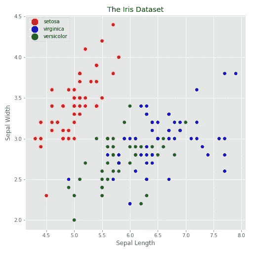
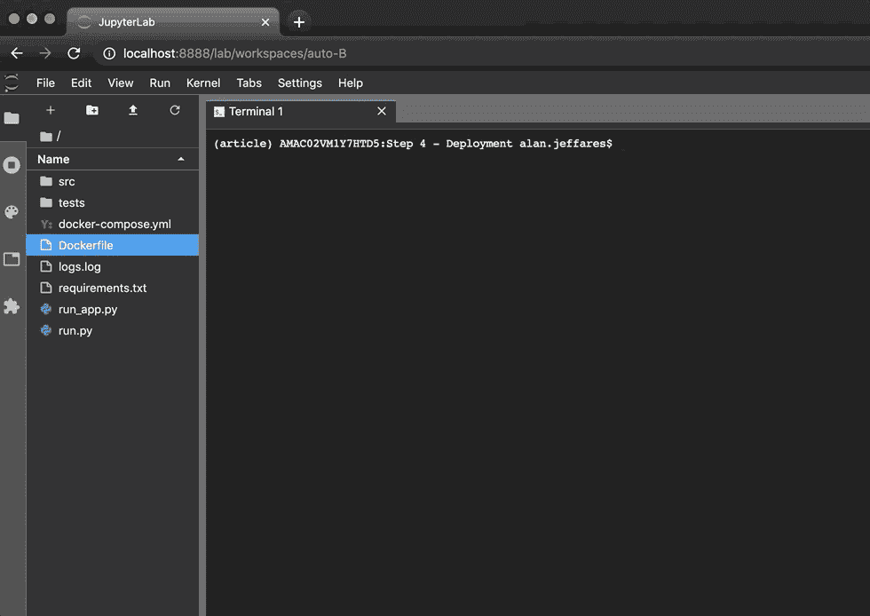
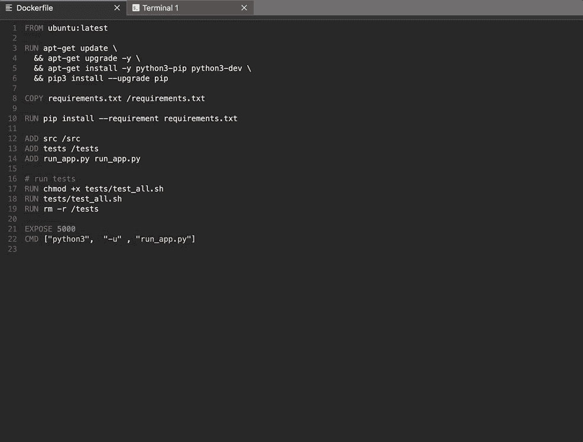

# 从 Jupyter 笔记本到部署—一个简单的例子

> 原文：<https://towardsdatascience.com/from-jupyter-notebook-to-deployment-a-straightforward-example-1838c203a437?source=collection_archive---------1----------------------->

## 一步一步的例子，采用典型的机器学习研究代码，构建一个生产就绪的微服务。

本文旨在作为我作为数据科学家的旅程的一个整合示例，从 Jupyter 笔记本格式的一个典型已解决问题开始，并将其发展为一个已部署的微服务。虽然会有代码，但这不是一个教程，而是一个逐步说明我在将数据科学解决方案投入生产时所面临的挑战和解决方案的示例。我也不认为我一路走来所做的选择是做事的唯一方式，而是希望它能为将来可能面临类似任务的其他人提供一个有用的例子。

这篇文章的配套代码可以在我的 GitHub 账户上找到，原始的 Jupyter 笔记本[在这里](https://github.com/alanjeffares/notebook-to-microservice/blob/master/original_notebook.ipynb)和最终的完整项目[在这里](https://github.com/alanjeffares/notebook-to-microservice/tree/master/Step%204%20-%20Deployment)。我将包括这些变化的片段，以演示我们讨论的各种主题，但这并不是对所有变化的完整描述。在这篇文章中，我将关注我所采取的每一步的过程和动机。

**朱庇特笔记本解决方案(** [**代号**](https://github.com/alanjeffares/notebook-to-microservice/blob/master/original_notebook.ipynb) **)**

这个玩具解决方案旨在充当数据科学家建模输出的高度简化的示例。我们可以想象，任务是建立一个分类器，给定鸢尾花的一些测量值，预测该观察值的确切种类。数据科学家获得了 [Fisher 著名的 iris 数据集](https://en.wikipedia.org/wiki/Iris_flower_data_set)，并构建了一个管道来可视化和预处理数据，然后训练和评估一个简单的模型。这个模型现在可以用来预测任何新的观察结果。本文的目标是描述将这种典型的研究成果投入生产的步骤。



罗纳德·费雪在 1936 年引入了著名的鸢尾花数据集。

**第一步:重构，代码风格和测试(** [**代码**](https://github.com/alanjeffares/notebook-to-microservice/tree/master/Step%201%20-%20Refactoring%2C%20code%20style%20and%20testing) **)**

第一步是将笔记本[模块化](https://www.python-course.eu/python3_modules_and_modular_programming.php)成一个合理的文件夹结构，这实际上意味着将文件从`.ipynb`格式转换成`.py`格式，确保每个脚本都有明确的目的，并以连贯的方式组织这些文件。我采用了下面的标准布局，但这是灵活的，应该适应不同的用例。

我们的文件结构最终会是什么样子。

一旦项目结构良好，我们就可以整理或重构代码。例如，考虑下面的代码块，它执行对数据进行分层训练测试分割的任务:

分层分离逻辑来自我们最初的 Jupyter 笔记本。

在当前的格式中，不清楚这段代码到底在做什么，它不可重用，也无法测试。为了减轻这种情况，我们可以用文档和[类型提示](https://www.python.org/dev/peps/pep-0484/)将它重写为一个函数。

重构的分层分裂函数。

这个看起来好多了，遵循 [pep8 风格指南](https://www.python.org/dev/peps/pep-0008/)。事实上，我们可以通过使用 [pycodestyle](https://pypi.org/project/pycodestyle/) 这样的[林挺](https://en.wikipedia.org/wiki/Lint_(software))包来确保整个项目符合 pep8。一旦安装了这个包，我们就可以导航到项目的根目录，并在命令行上运行`pycodestyle src`。这将列出任何 pep8 问题的位置和详细信息。我们甚至可以更进一步，使用像 [autopep8](https://pypi.org/project/autopep8/) 这样的包，它可以自动格式化 pycodestyle 标识的任何代码。

我们还应该简单地谈一下测试。有大量关于代码测试的文献(例如参见[这里的](https://realpython.com/python-testing/)，但是我们将在这个项目中只实现单元测试。这些测试相互独立地测试代码的最小可能单元。对于我们前面例子中的`stratified_split()`函数，单元测试可能看起来像这样:

对我们的*分层分离*函数的单元测试。

通过运行这段代码，我们将检查函数输出在许多预定义的情况下是否符合预期。这证实了我们现有的代码正在正常工作，但它也确保了如果任何未来的更改导致该函数停止正常工作，我们可以在该错误导致这些测试失败时及早发现它。

**第二步:协同(** [**代码**](https://github.com/alanjeffares/notebook-to-microservice/tree/master/Step%202%20-%20Collaberation) **)**

任何大规模的项目都不太可能是单个人工作的产物，因此出于这个原因，我们将讨论[版本控制](https://en.wikipedia.org/wiki/Version_control)。版本控制工具，如 [git](https://git-scm.com/) 是一个记录项目随时间变化的系统，允许多个用户将变化分支并合并到一个存储库中。有很多关于使用版本控制的[的原则和最佳实践的文章，但是我们假设大部分数据科学工作已经完成，因此我们将专注于一个叫做`pre-commit.sh`的有用文件。这就是所谓的](https://betterexplained.com/articles/a-visual-guide-to-version-control/) [git 钩子](https://git-scm.com/book/en/v2/Customizing-Git-Git-Hooks)，git 提供的一个有用的特性，它允许在某些重要的动作发生时运行定制脚本——在本例中是命令`git commit`。我们可以使用这个特性在任何提交之前方便地运行`test-all.sh`脚本，这反过来运行我们所有的单元测试以及 pycodestyle 检查，只有在没有失败的情况下才允许提交继续进行。这个过程确保对存储库的任何更改都不会破坏现有的功能，并且符合 pep8。

另一个对协作有用的文件是名为`requirements.txt`的需求文件。该文件保存在项目根目录下，列出了整个项目中使用的所有 Python 包。该项目的任何新用户都可以简单地使用 [pip](https://pypi.org/project/pip/) 通过下面的命令来安装这些需求。

```
pip install -r requirements.txt
```

创建一个`requirements.txt`也非常简单。假设我们已经为这个项目使用了一个虚拟环境，如 [venv](https://docs.python.org/3/library/venv.html) 或 [conda](https://docs.conda.io/projects/conda/en/latest/user-guide/tasks/manage-environments.html) 并安装了所有的包，我们可以通过激活环境并运行

```
pip freeze > requirements.txt
```

**第三步:准备部署(** [**代码**](https://github.com/alanjeffares/notebook-to-microservice/tree/master/Step%203%20-%20Prepare%20to%20deploy) **)**

现在我们已经为本地使用做好了项目准备，是时候做一些改变来为云使用做准备了。其中一个变化是日志记录。在本地工作时，跟踪程序和调试相对简单。打印语句、调试工具和控制台输出的组合通常可以达到目的，但是一旦部署了组件，我们就需要一些稍微复杂一点的东西。这就是 python[日志](https://docs.python.org/3/library/logging.html)模块可以提供帮助的地方。一旦配置好模块，我们可以简单地替换打印语句，如

```
print('Splitting train and test sets')
```

随着

```
logger.info('Splitting train and test sets')
```

现在，日志可以与用户定义的元数据(如时间、模块、函数名和行号)一起存储在日志文件中。这些信息不仅可以让我们跟踪程序的进度，还可以给出用于调试目的的详细信息，这些信息都安全地存储在日志文件中。

这也是从本地存储数据和文件转向远程存储的好时机。例如，训练数据目前存储在一个在线 csv 文件中，如果我们获得额外的数据，更新该文件的过程会很麻烦。一种替代方法是使用开源关系数据库管理系统 MySQL 和它的连接器。我们不会在这里详述细节，但是一旦设置好，我们就可以使用 sql 查询轻松地从我们的数据库中读入数据。

我们还希望从本地保存文件开始。当需要进行预测时，我们可能想要使用几个月前训练的模型，获得这种类型的对象存储服务的最简单、最便宜的方法之一是通过亚马逊 S3。这里我们将再次跳过一些配置细节，但是 [boto3](https://boto3.amazonaws.com/v1/documentation/api/latest/index.html) 提供了一个方便的 Python 接口来访问 S3 桶。上传和下载文件到这个远程桶是一件轻而易举的事情，让我们可以轻松访问我们所有的模型。我还没有在本文的示例代码中实现 MySQL 或 S3，但是网上有很多其他的指导来完成这个步骤(例如，这里的[和这里的](https://www.datacamp.com/community/tutorials/mysql-python)和[分别是](https://realpython.com/python-boto3-aws-s3/))。

在我们准备开始部署之前，我们应该对这个存储库做的最后一个更改是抽象出所有硬编码的变量。一旦这个项目是远程部署，这将是一个相当艰巨的任务，以改变代码。因此，我们将把所有参数从硬编码值转移到 json 配置文件中。现在，当涉及到更改参数时，我们只需要更改这个 json 文件中的值，而不是代码本身，这样做要简单得多。像这样的一行

```
gscv = GridSearchCV(pipeline, parameters, cv=3, scoring="accuracy")
```

可能会将交叉验证折叠数和评分标准移动到配置文件中，并成为

```
gscv = GridSearchCV(pipeline, parameters, cv=NUM_FOLDS, scoring=SCORING)
```

其中变量`NUM_FOLDS`和`SCORING`从`design.json`配置文件中加载，并且`get_default()`函数被添加到`config.py`中以方便访问这些值。

**第四步:部署(** [**代码**](https://github.com/alanjeffares/notebook-to-microservice/tree/master/Step%204%20-%20Deployment) **)**

完成前面的三个步骤后，我们终于准备好部署代码了。我们将把这个服务部署为一个 [web 应用程序](https://en.wikipedia.org/wiki/Web_application)，我们将通过一组 api 端点与之通信。为此，我们将使用一个 [web 框架](https://en.wikipedia.org/wiki/Web_framework)来自动处理大量开销。虽然我们可以使用很多，但对于这个简化的应用程序来说，烧瓶似乎是一个不错的选择，因为它易于安装和运行，并且非常灵活。主要思想是通过运行`python3 run_app.py`，这将通过`src/template_app`文件夹访问项目的功能，并将在`http://localhost:5000`开始运行应用程序。一旦应用程序启动并运行，我们就可以使用`GET`和`POST`请求来访问它的火车，通过浏览器或 API 开发平台(如 [Postman](https://www.postman.com/) )预测或可视化功能。



在本地运行 flask 应用程序以可视化数据。

即使对于这个非常简单的项目，需求列表也开始大幅增长。对于另一个开发人员来说，启动并运行我们的代码需要设置虚拟环境并下载包。为了自动化这个过程并避免陷入依赖问题的风险，我们将使用一个叫做 [Docker](https://www.docker.com/) 的工具。Docker 有效地创建了一个空容器，从头开始安装整个项目。这样做的好处是，任何机器上的任何人都可以通过安装 docker 并简单地从项目的根文件夹中运行`docker build sample_app:v.1.0 .`来启动并运行我们的代码。一旦构建了本地映像，我们就可以用`docker run -p 5000:5000 sample_app:v.1.0`运行并公开它。就是这样！Dockerfile 文件包括下载 Python、pip 和需求的说明。然后它运行测试和 pycodestyle，如果成功完成，它通过`run_app.py`脚本运行应用程序。



构建 Docker 容器(注意，这比平常运行得更快，因为容器是第二次构建的，所以大多数步骤都在缓存中)。

我们现在已经将我们最初的 jupyter 笔记本电脑转变为一个完全成熟的微服务。我们的最终代码是模块化的，它遵循 pep8，包括日志记录和测试，并且可以作为 Dockerised Flask 应用程序进行部署。我们还讨论了 SQL 和 Amazon s3 的数据管理。你应该在哪里部署你的应用将取决于你的项目需求，大规模的项目通常使用 [AWS](https://aws.amazon.com/) 、 [Azure](https://azure.microsoft.com/en-us/) 或 [Google Cloud](https://cloud.google.com/) ，而像 [Heroku](https://www.heroku.com/home#) 这样的平台为小型爱好项目提供免费托管。对于拥有大量微服务的大型项目来说， [Kubernetes](https://kubernetes.io/) 是一个开源系统，用于自动化容器化应用程序的部署、扩展和管理。一旦一个大型项目投入使用，持续集成就会成为一个主要的挑战。在这种情况下，像 [Jenkins](https://www.jenkins.io/) 这样的自动化服务器可以管理与构建、测试和部署软件相关的任务。

*感谢您的阅读，请在评论中分享您的反馈或问题。*


[图片来源 Unsplash]