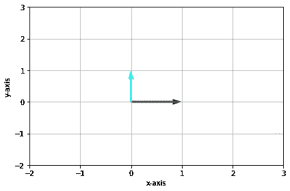
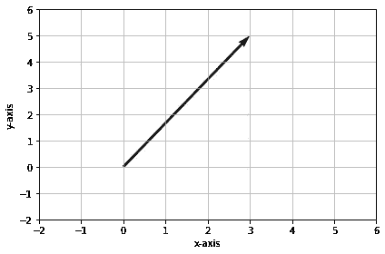
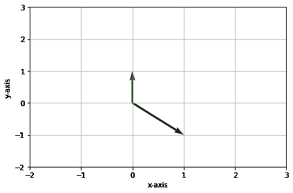
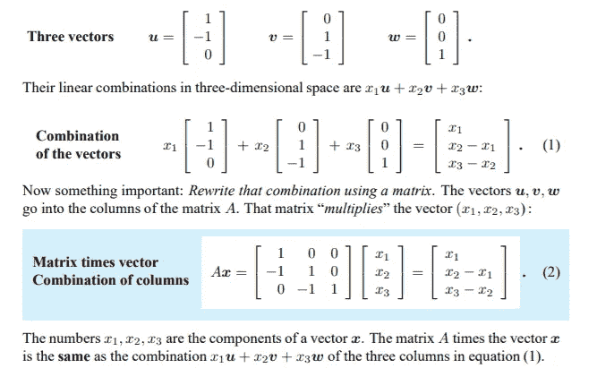
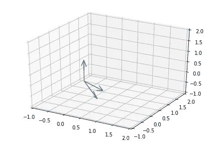
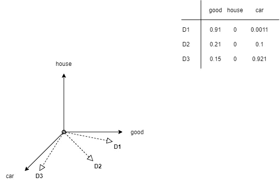

# 自然语言处理的向量代数

> 原文：<https://towardsdatascience.com/from-linear-algebra-to-text-representation-for-natural-language-processing-239cd3ccb12f?source=collection_archive---------22----------------------->

## 在向量空间中表示单词语义


迈克尔·泽兹奇在 [Unsplash](https://unsplash.com?utm_source=medium&utm_medium=referral) 上的照片

自然语言处理领域包括构建技术，由像你我这样的人用自然语言处理文本，并从中提取见解，以执行各种任务，从解释搜索引擎上的用户查询和返回网页，到作为聊天机器人助手解决客户查询。将每个单词表示为一种能够捕捉单词含义和整体上下文的形式变得至关重要，特别是当重大决策基于从大规模文本中提取的见解时，例如通过社交媒体预测股票价格变化。

在本文中，我们将从向量代数的基础知识开始，了解向量的直觉和它们对于表示特定类型信息的意义，在向量空间中表示文本的不同方式，以及这个概念如何发展到我们现在拥有的艺术模型的状态。

我们将逐步了解以下领域-

*   坐标系中的单位向量
*   向量的线性组合
*   向量坐标系中的跨度
*   共线性和多重共线性
*   向量的线性相关性和独立性
*   基本向量
*   自然语言处理的向量空间模型
*   密集向量

# 坐标系中的单位向量

***i*** - >表示指向 x 方向的单位向量(长度为 1 个单位的向量)

***j****->表示 y 方向的单位矢量*

*合在一起，它们被称为我们的坐标向量空间的基础。*

*我们将在下面的后续部分中更多地讨论术语**基础**。*

**

*标准单位矢量—作者图片*

*   *假设我们有一个向量 3***I***+5***j****
*   *这个向量的 x，y 坐标分别是:3 和 5*
*   *这些坐标是标量，分别在 x 和 y 方向上翻转和缩放单位向量 3 & 5 个单位*

**

*2D X-Y 空间中的一个向量——作者图片*

# *两个向量的线性组合*

*如果***u***&***v***是二维空间中的两个向量，那么它们的线性组合成向量 ***l*** 就表示为-*

***l=*x1。**+*x2。* ***v*******

*   **数字 *x1* 、 *x2* 是矢量 x 的分量**
*   **这实质上是 x 对给定向量的缩放和加法运算。**

**上述线性组合的表达式等价于以下线性系统-**

****B*x***=***l*****

**其中 ***B*** 表示列为 ***u*** 和 ***v*** 的矩阵。**

**让我们通过下面的一个例子来理解这一点，在一个 2 维空间中有矢量*&***v***—***

```
**# Vectors u & v
# The vectors are 3D, we'll only use 2 dimensions
u_vec = np.array([1, -1, 0])
v_vec = np.array([0, 1, -1])# Vector x
x_vec = np.array([1.5, 2])# Plotting them
# fetch coords from first 2 dimensions
data = np.vstack((u_vec, v_vec))[:,:2]
origin = np.array([[0, 0, 0], [0, 0, 0]])[:,:2]
plt.ylim(-2,3)
plt.xlim(-2,3)
QV = plt.quiver(origin[:,0],origin[:,1], data[:, 0], data[:, 1], color=['black', 'green'], angles='xy', scale_units='xy', scale=1.)
plt.grid()
plt.xlabel("x-axis")
plt.ylabel("y-axis")
plt.show()**
```

****

**向量的线性组合—作者图片**

**我们也可以从一个教授在笔记中给出的一个类似的三维例子的解释中理解它-**

****

**线性代数，第一章-向量导论，麻省理工学院**

**从图像中的示例中提取 3 个向量，并在 3D 空间中绘制它们(轴的单位不同于图中的向量)**

```
**u_vec = np.array([1, -1, 0])
v_vec = np.array([0, 1, -1])
w_vec = np.array([0, 0, 1])data = np.vstack((u_vec, v_vec, w_vec))
origin = np.array([[0, 0, 0], [0, 0, 0], [0, 0, 0]])
fig = plt.figure()
ax = fig.add_subplot(111, projection='3d')
ax.quiver(origin[:,0],origin[:,1], origin[:,2], data[:, 0], data[:, 1], data[:,2])ax.set_xlim([-1, 2])
ax.set_ylim([-1, 2])
ax.set_zlim([-1, 2])
plt.grid()
plt.show()**
```

****

**3D 空间中的矢量—作者提供的图像**

# **跨度**

*   **跨度是所有可能的向量组合的集合，我们可以用一对给定向量的线性组合来达到它**
*   **大多数二维向量对的跨度是二维空间中的所有向量。除非，当它们在同一方向排列时(即，如果它们共线)，在这种情况下，它们的跨度是一条线。**

**即 span( ***a*** ，***b***)=**R**(2D 空间中的所有向量)，前提是它们不共线。**

# **共线性**

**当我们有 p 个不同的预测变量，但其中一些是其他变量的线性组合，因此它们不会添加任何其他信息时，就会出现共线性。2 个共线向量/变量将具有接近+/- 1 的相关性，并且可以通过它们的相关矩阵来检测。**

****多重共线性**存在于两个以上的向量共线时，并且任何一对向量不一定具有高相关性。**

****线性独立性****

**我们说 *v1* ， *v2* ，。。。， *vn* 是线性无关的，如果它们都不是**

**其他的线性组合。这相当于说**

**那个*x1 . v1*+*x2 . v2*+。。。+ *xn.vn* = 0 暗示 *x1 = x2 =。。。= xn = 0***

**由于共线矢量可以表示为彼此的线性组合，所以它们是**线性相关的。****

# ****基础****

**基是跨越那个空间的一组线性无关的向量。**

**我们称这些向量为基向量**

# **自然语言处理中的向量空间模型**

**一个**向量空间**是向量的集合 V，其中定义了两种运算——向量加法和标量乘法。举个例子，如果两个向量***u***&***V***都在空间 ***V*** 中，那么它们的和， ***w = u + v*** 也会在向量空间 ***V*** 中。**

**2D 向量空间是一组具有 2 个轴的线性独立的基向量。**

**每个轴代表向量空间中的一个维度。**

**再回忆一下前面的剧情矢量 ***a*** = (3，5)= 3***I***+5***j***。这个向量在 2D 空间上用两个线性独立的基向量来表示——X&Y，它们也表示空间的 2 个轴和 2 个维度。**

**3 & 5 这是这个向量的 X，Y 分量，在 X-Y 2D 空间上的表示。**

****

**2D X-Y 平面上的向量—作者提供的图像**

# ****NLP 中的向量空间模型****

**向量空间模型是向量空间中文本的表示。**

**这里，语料库中的每个单词是线性独立的基向量，并且每个基向量表示向量空间中的轴。**

*   **这意味着，每个单词与其他单词/轴正交。**
*   **对于一个词汇集 ***|V|*** ， **R** 将包含 ***|V|*** 坐标轴。**
*   **术语的组合将文档表示为这个空间中的点或向量**

**对于 3 个单词，我们将有一个三维矢量模型，表示如下-**

****

**三个词的向量空间模型—作者的图像**

**图表上方的表格显示了 TF-IDF 事件矩阵。**

***=(0.91，0，0.0011)表示三个轴上的文档向量——商品、房子、汽车。同样，我们有*&***D3***文档向量。****

**然而，向量空间的表示对我们有什么帮助呢？**

*   **使用这种表示的一个常见应用是搜索引擎的信息检索、问答系统等等。**
*   **通过将文本表示为向量，我们旨在使用向量代数从文本中提取语义，并将其用于不同的应用，如搜索包含与给定搜索查询中包含的语义相似的语义的文档。**

**例如，对于一个搜索标记“buy ”,我们希望获得包含该单词不同形式的所有文档——buying、buy 甚至是单词“buy”的同义词。这种文档不能从将文档表示为二进制[关联矩阵](https://en.wikipedia.org/wiki/Incidence_matrix)的其他基本方法中获取。**

**这是通过像文档和查询的向量之间的余弦相似性这样的距离度量来实现的，其中越接近查询的文档排名越高。**

*   **单词/词汇的数量可能高达数百万，例如，谷歌新闻语料库是 3 百万，这意味着尽可能多的独立轴/维度来表示向量。因此，我们希望使用向量空间中的运算来减少维数，并使单词在同一轴上彼此相似。**

# **密集向量**

*   **上述操作在文档向量上是可能的，这些文档向量通过将文档的上述向量表示扩展到表示为分布式或密集向量的文档来表示。这些表示捕获了文本的语义，也捕获了单词向量的线性组合**
*   **之前的向量空间模型中，每个单词代表一个单独的维度，这导致了稀疏向量。**
*   **密集向量捕获向量表示中的上下文。单词的密集向量使得出现在相似上下文中的单词将具有相似的表示。**
*   **这些密集向量也被称为单词嵌入或分布式表示。**
*   **word2vec 就是这样一个框架，**从大型语料库中学习**密集的单词向量。它有两种变体——skip-gram 和 CBOW(连续单词包)**
*   **获得密集向量的一些其他框架和技术是全局向量(GloVe)、fastText、ELMo(来自语言模型的嵌入)以及在推理期间获得上下文化单词嵌入的基于 Bert 的方法的最新技术状态。**

## **结论**

**本文介绍了基于向量代数的向量空间的概念，并强调了相关概念作为其在自然语言处理中的应用的一部分，用于在语义表示和提取任务中表示文本文档。**

**单词嵌入的应用已经扩展到更高级和更广泛的应用，并且性能比以前有了很大的提高。**

**你也可以通过访问我的 [Git 库](https://github.com/Taaniya/linear-algebra-for-ml)来参考源代码并在 colab 上运行。**

**希望你喜欢读它。:)**

## **参考**

*   **[线性无关，基础&尺寸，MIT](https://www.youtube.com/watch?v=eeMJg4uI7o0)**
*   **[矩阵——麻省理工学院矢量导论](https://math.mit.edu/~gs/linearalgebra/linearalgebra5_1-3.pdf)**
*   **[NLP 的向量空间模型，NPTEL](https://www.youtube.com/watch?v=6Nz88LHOIdo)**
*   **统计学习导论，电子书，作者:Gareth James，Daniela Witten，Trevor Hastie 和 Robert Tibshirani**