# 从预测到行动——如何从数据中学习最佳策略(2/4)

> 原文：<https://towardsdatascience.com/from-making-predictions-to-optimizing-actions-an-introduction-to-policy-learning-2-4-9fc46ba8f3d0?source=collection_archive---------20----------------------->

贝丝·麦克唐纳在 [Unsplash](https://unsplash.com?utm_source=medium&utm_medium=referral) 上的照片

在[第一部分](/from-prediction-to-action-how-to-learn-optimal-policies-from-data-part-1-1edbfdcb725d)中，我们讨论了从数据中学习*最优*策略的必要性。政策优化涵盖了*大量*实际情况(例如，可以说，*每个*个性化问题都是一个政策优化问题)，我们简要地看了医疗保健、防止流失、目标营销和市政府的例子。

为了学习最优策略，我们需要收集正确的数据。在本帖中，我们将描述如何创建一个数据集，使其适合政策学习。

有了合适的数据集:

*   在[第三部分](/from-prediction-to-action-how-to-learn-optimal-policies-from-data-3-4-aa56c974a505)中，我们将学习一种简单(在我看来也是*神奇*)的方法来估计 ***任何*** 政策的结果。
*   在[第四部分](/from-prediction-to-action-how-to-learn-optimal-policies-from-data-4-4-14c63cc0c938)中，我们将学习如何找到一个**最优** 策略。

让我们回顾一下第 1 部分中的问题定义。你有:

*   一组客户(我广义地使用‘客户’来指代您想要对其应用操作的实体。例如，它可以是一个病人、一个网站访问者、一个潜在客户、一个企业、一个地理区域……你明白了)。关于客户属性、行为和其他上下文信息的所有相关信息被表示为特征向量。
*   一组可能的动作
*   当某项行动针对某个客户时，您的结果*(重要的是，不同的客户对行动的反应可能不同)*
*   *你的目标:为每一位顾客找到最佳结果的行动。换句话说，学习一个将**最佳**动作分配给每个客户特征向量的函数。这被称为**最优**策略**策略**。*

*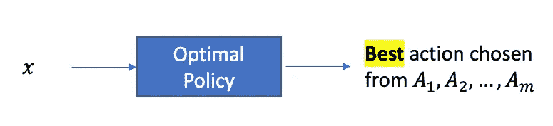*

# *数据集创建策略*

*让我们从为策略优化创建数据集时需要记住的最重要的事情开始:*

> *政策学习的理想数据集来自随机实验。*

*如果你有自由运行这样的实验，太好了！*

*但是如果你不能进行随机实验，不要绝望——如果你可以获得过去的观察数据，你仍然可以从中创建一个训练数据集。*

*我们将在本帖中详细讨论这两种情况，从你*可以*进行随机实验的快乐场景开始。我们将会看到，这里的灵活性比乍看起来要大得多。*

# ****通过随机实验创建数据集****

*通过随机实验创建训练数据集是一个 3 步的过程。*

*   ***第一步**:从客户群中选择一个*随机*的客户样本。*
*   ***步骤 2** :决定*如何随机分配行动*给样本中的每个客户*
*   ***步骤 3** :进行实验并收集结果数据*

*第 1 步很简单，让我们转到第 2 步。*

*回到[第 1 部分](/from-prediction-to-action-how-to-learn-optimal-policies-from-data-part-1-1edbfdcb725d)中的网飞客户流失管理示例，回想一下我们考虑了三个行动:“明年打八折”、“再流两台设备”和“什么都不做”。*

*目前，让我们假设我们只有两个行动，“流 2 更多的设备”或“什么都不做”。*

*将这两项行动中的一项随机分配给样本中的每位客户，最简单的方法是什么？对每一位顾客，投一枚公平的硬币。如果出现正面，分配“2 个以上的设备”，如果出现反面，分配“什么都不做”。*

*这个“方案”可以描述如下:*

*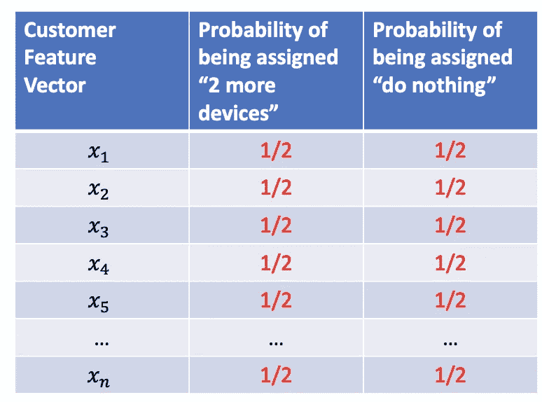*

*更一般地说，如果我们有 N 个行动，我们可以使每个行动对每个顾客来说都是同等可能的。对于三个动作的网飞例子，我们的方案看起来像这样:*

*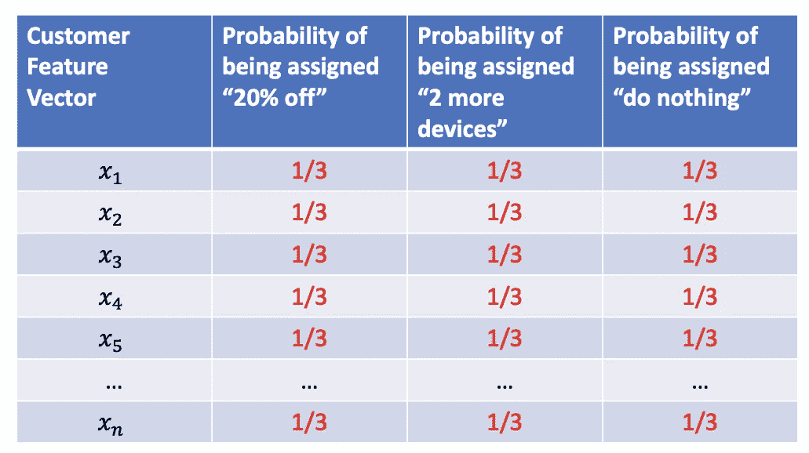*

*这就是有趣的地方。*

**原来我们可以为每个客户-动作组合选择任意***概率，只要满足两个条件:***

*   ****对于任何客户，所有行动的概率之和必须为 1.0** (即每行的概率之和必须为 1.0)。这就确保了*恰好有一个*动作被分配给每个客户。**
*   ****每个概率必须非零**。这确保了每个动作都有机会被分配给客户。**

*****如果我们用满足这两个条件的概率工作，得到的数据集可以安全地用于政策评估和政策优化。*****

**以下是满足两个条件的概率示例:**

**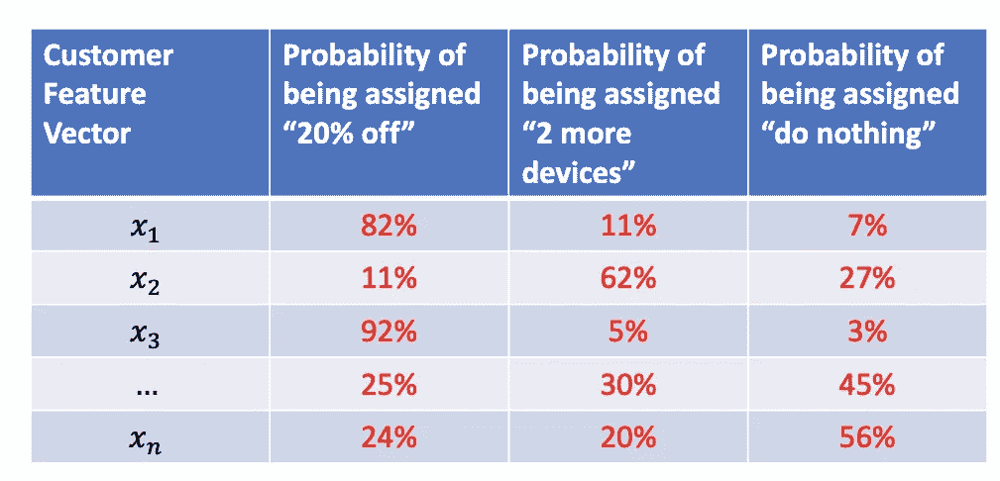**

**我想提请你们注意两件事:**

*   **请注意，*概率对于不同的客户*是不同的。这完全没问题，因为它没有违反上面的两个条件。事实上，这种为不同客户选择不同概率的能力给了我们巨大的灵活性，我们很快就会看到这一点。**
*   **请注意，上表是一种**策略**:给定 *x* ，您根据为 ***定义的概率随机挑选一个动作*即**** *x.* 满足上述两个条件的策略在强化学习文献中称为*行为策略*，但我将它称为 ***数据收集策略*** (因为我发现**

*为不同客户选择不同概率的自由在实践中非常有用。*

*一种常见的情况是当我们不想浪费一个“昂贵”的行动(例如，50%的折扣！)在不太可能需要的客户身上。*

*具体来说，假设我们希望将“下一年八折”活动仅应用于取消概率高的客户，而不是其他客户，因为我们怀疑低风险客户可能会将奖励收入囊中，而我们已经在他们身上浪费了昂贵的折扣。但是我们不关心“流两个以上的设备”和“什么都不做”应用的频率。*

*我们可以在数据收集策略中轻松满足这一业务需求。这里有一个方法。*

*首先，我们使用历史数据建立一个模型来预测每个客户的取消概率。*

*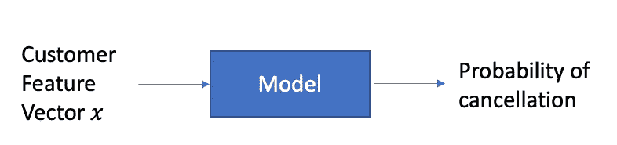*

*您可以使用您选择的任何分类方法来构建此模型，只要它提供概率预测，而不仅仅是 0-1 类预测。对您的客户样本运行此模型，以获得以下结果:*

*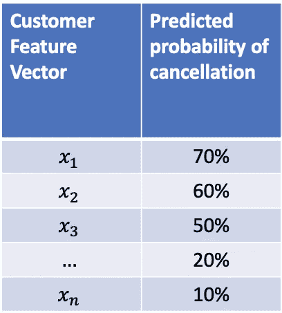*

*现在，考虑样本中的一个客户，其取消的预测概率是 *p* 。对于该客户，将被分配“下一年 20%折扣”活动的概率设置为*p。*取剩余概率(即 *1-* *p* )并在其他活动中平均分配:“流式传输两个以上设备”的概率为 *(1-p)/2* ,“什么都不做”的概率为 *(1-p)/2* 。*

**

*很容易确认这是一个有效的数据收集策略:所有三个数字都是非零的，当然，它们加起来是 1.0(目前，我假设预测模型不会输出*恰好*等于 1.0 或 0.0 的概率。我将在后面的文章中重新讨论这个假设)。*

*应用这个逻辑，我们得到这个数据收集策略:*

*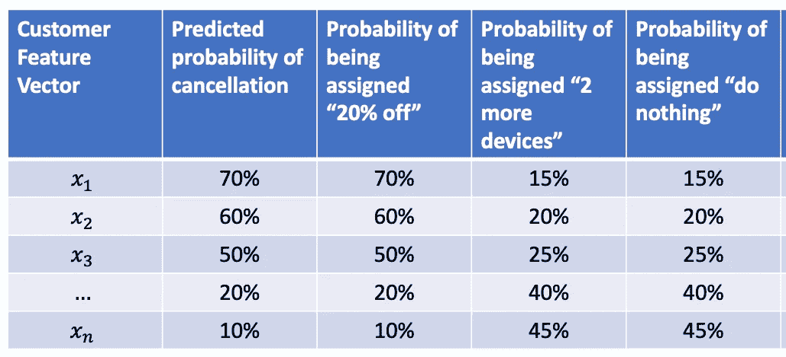*

*第一个客户的取消概率为 70%，因此“打八折”的概率为 70%，“再流两台设备”的概率为 15%，“什么都不做”的概率为 15%。*

*您可以看到，预测取消概率较低的客户(例如，示例中的最后一位客户)获得昂贵的“八折”折扣的机会很小，这正是我们想要的。*

*这只是我们如何灵活定义数据收集策略以适应业务考虑的一个例子。请随意使用您的创造力和业务知识来定义其他数据收集策略。只需确保概率不为零，并且样本中每个客户的概率总和为 1.0。*

*一旦指定了有效的数据收集策略，我们就进入步骤 3:运行实验并测量结果。*

*这一步很简单:*

> *对于样本中的每个客户，根据该客户的概率随机选择一项行动，将所选行动应用于该客户*，*并衡量结果。*

*如果你知道如何随机抽样，根据概率选择一个行动是很容易的，而且有很多方法可以做到。例如，对于三种行为的概率为 70%-15%-15%的客户，生成一个 0-1 范围内的统一随机数，如果该值在 0.0-0.7 之间，则选择“下一年优惠 20%”，如果该值在 0.70-0.85 之间，则选择“再分流两台设备”，如果该值在 0.85-1.0 之间，则选择“什么都不做”。*

*当实验结束时，最终的数据将是这样的。*

*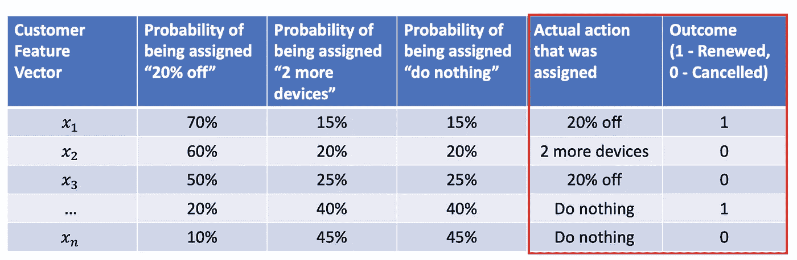*

*请注意，我们添加了另外两列:分配给每个客户的实际操作，以及结果的值。为了简单起见，我展示了一个二元结果，但是您可以使用任何东西(例如，下一年的利润)。*

# *根据**观察数据**创建数据集*

*现在让我们考虑一下你很难进行随机实验来收集数据的情况。但是我们仍然可以建立一个数据集，用于政策评估和学习，**如果**关于过去应用于客户的行动和结果*的数据*可用的话(见下表)。*

*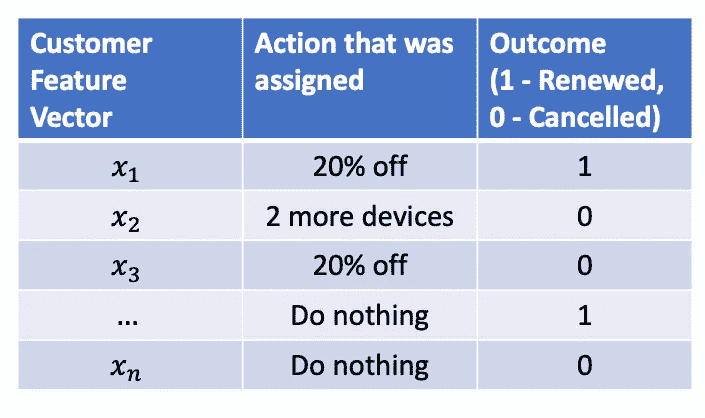*

*这里我们需要记住两个重要的警告:*

*   *我们拥有行动和结果数据历史数据的客户可能不是客户群的随机样本。*
*   *虽然您可以看到分配给每个客户的操作，但是没有关于如何为该客户准确选择操作的信息。*我们不知道是否使用了随机数据收集政策。**

**由于缺乏上述随机化，政策评估(将在第 3 部分中介绍)和政策优化(将在第 4 部分中介绍)的结果必须“有所保留”，即带有一定程度的怀疑。**

*警告结束后，让我们看看如何从观察数据中构建一个训练数据集。基本想法是从历史数据集中“估算”客户行动概率，即填写下表中缺失的**值:***

*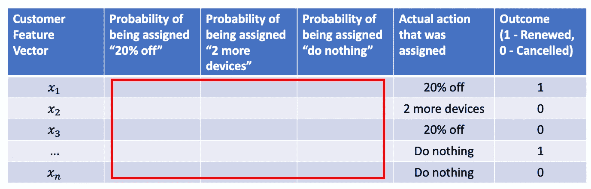*

*怎么会？通过使用被指定为**类标签**的实际动作…*

*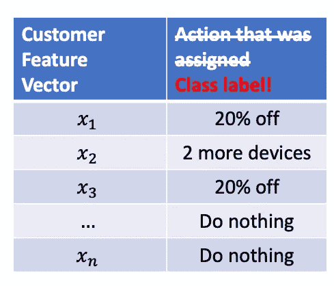*

*…并使用上述数据集构建多类分类模型！*

*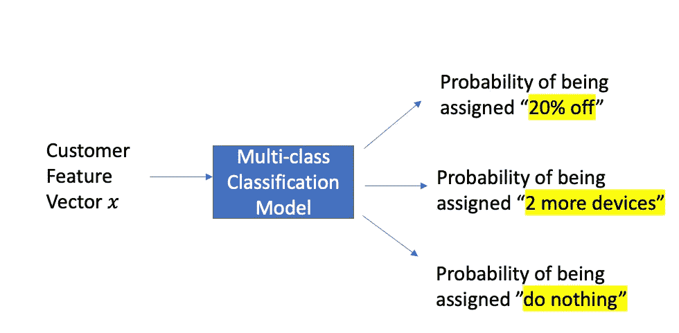*

*现在，我们可以用模型预测的概率填写表格…*

*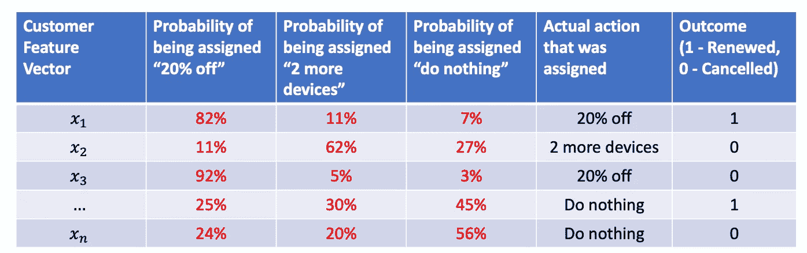*

*…我们的训练数据集已经准备好了。*

*你可能会想，“别这么快。如果预测模型返回的概率对于某些客户行为组合来说*正好是*零，那会怎么样？这难道不会违反我们之前规定的非零概率条件吗？”*

*你完全正确，这违反了条件，我们不能用概率。*

*在我们研究如何解决这个问题之前，值得指出的是，这在实践中并不少见。在许多业务情况下，“常识性的业务规则”被使用，并且可以产生预测概率为零的历史数据(顺便说一句，在这种情况下，您可以将“业务规则”视为“策略”的另一个名称)。*

*考虑这个业务规则的例子:*

> *如果一个顾客在过去的一个月里狂看了一个节目，“什么都不做”。*
> 
> *否则:如果客户上个月的观看时间比上个月少 0–30%，则提供“多 2 台设备”。如果客户上个月的观看时长环比下降超过 30%，则提供“八折”。*

*让我们假设特征向量 *x* 具有表示疯狂观看、观看时间百分比变化等的特征。*

*如果使用上述规则/策略，历史数据将如下表所示(为了使表格更容易阅读，我对记录进行了分组，以便狂欢观察者在一起，0–30%的记录在一起，以此类推)。*

*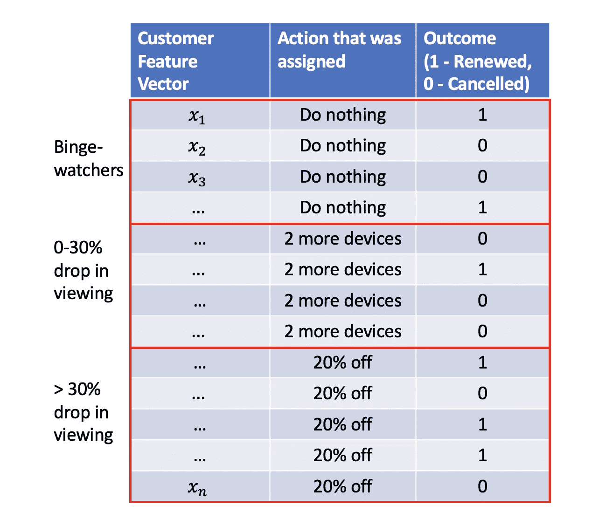*

*现在，如果您使用 *x* 作为输入，使用分配的动作作为目标类标签，对该历史数据运行[分类树](https://en.wikipedia.org/wiki/Decision_tree_learning)算法(如本文前面所解释的)，它很可能会从数据中“逆向工程”您的策略，并生成如下所示的树…*

*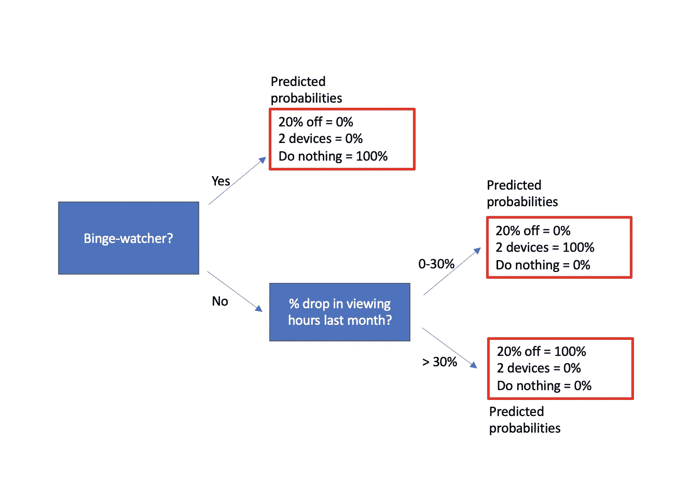*

*…导致预测的概率正好是 0.0 和 1.0。*

*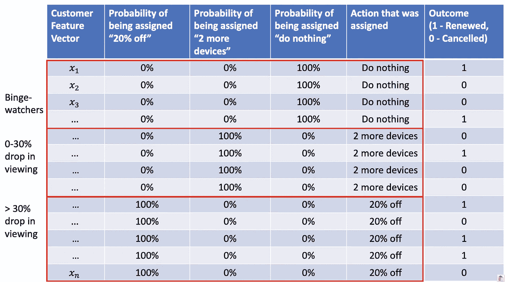*

**由于这违反了非零概率条件，我们无法使用此数据集进行策略评估和优化。**

*我们能做什么？*

*首先，坏消息是:为了解决这个问题，我们*让*进行随机实验并收集新数据。*

*但也有可能是好消息。如果你不能进行随机实验，因为你没有这样做的基础设施，恐怕我没有解决办法:-(*

*但是如果原因是*

*   *你的商业利益相关者不习惯随机实验*或**
*   *他们对当前的政策很满意，并且有一种“如果它没坏，就不要修理它”的心态*
*   *他们觉得改变现行政策是有风险的，*

*你也许可以用下面这个“温柔”的提议说服他们。*

> *让我在一个客户样本上运行这个实验:**对于样本中 90%的客户，我们将遵循当前的策略。**对于 10%的客户，我们将随机选择一项行动。*

*这种流行的方法(称为[*ε-贪婪*](https://en.wikipedia.org/wiki/Multi-armed_bandit) *)* 对企业来说可能是合意的，因为出错的“风险”小于 10%。*

*更正式地说:*

*   *将*ε*设置为一个小分数(如 0.1)*
*   *对于每个客户，从一个统一的(0，1)随机变量中抽取。如果其值小于 *epilson* (例如，小于 0.1)，随机选择一个概率相等的行动，并将该行动分配给客户。如果没有，请使用当前策略来决定分配给该客户的操作。*

*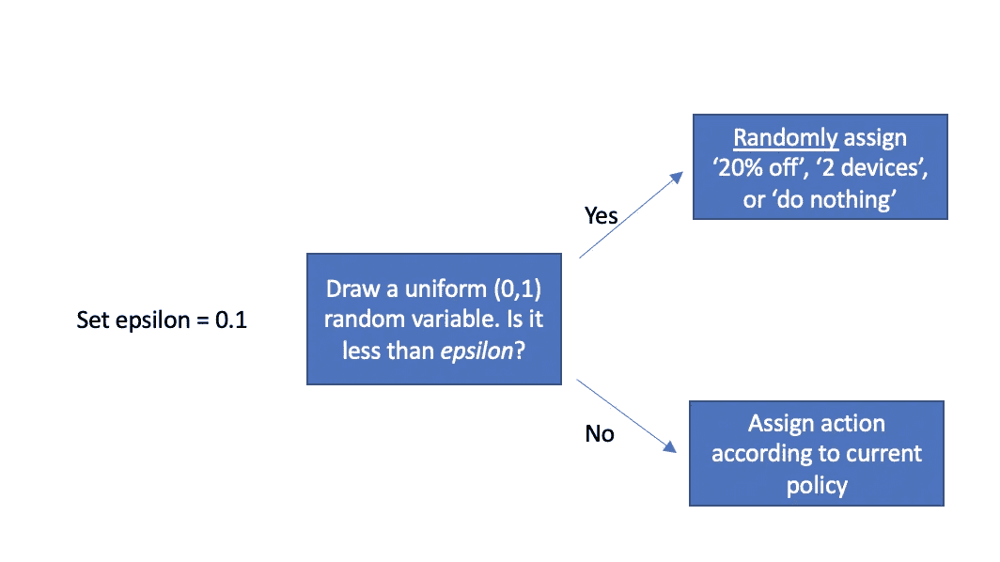*

*如您所见，在 1- *epsilon* %(例如，90%)的时间里，这种方法将选择由当前策略指示的动作。但是在 *epsilon* %(例如 10%)的情况下，这种方法将以相等的概率选择三个动作中的一个。*

*同样，你可以把这看作是两个策略的组合，加权平均为 90%–10%*

*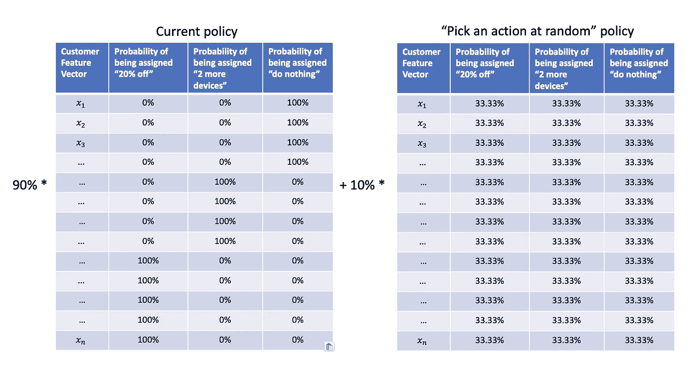*

*…要获得满足“零概率”条件的新值:*

*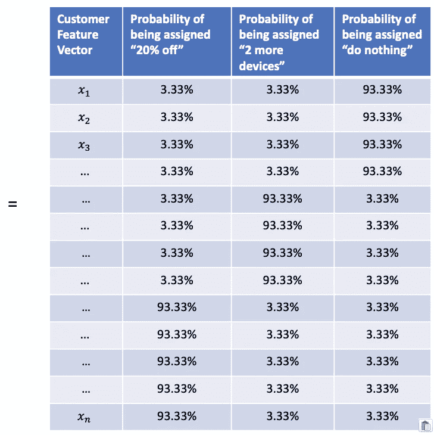*

*通过保持小规模，你可以向商业利益相关者保证你不会以数据收集的名义冒很大的风险或承担很大的费用。这种方法是让业务涉众“放松”到实验心态的好方法。随着他们越来越习惯并能承受更多风险，你可以将 T20 设定为一个更高的值。*

*(顺便说一句，如果我们从来没有尝试过一个行动，因此没有关于其结果的数据，那该怎么办？只需将新动作添加到 *epsilon* -greedy 的“随机分配一个动作”分支，并开始收集数据)*

*在这一点上，使用上面描述的方法，让我们说你已经组装了一个像这样的数据集，概率都是非零的。*

**

*或者，更一般地说:*

*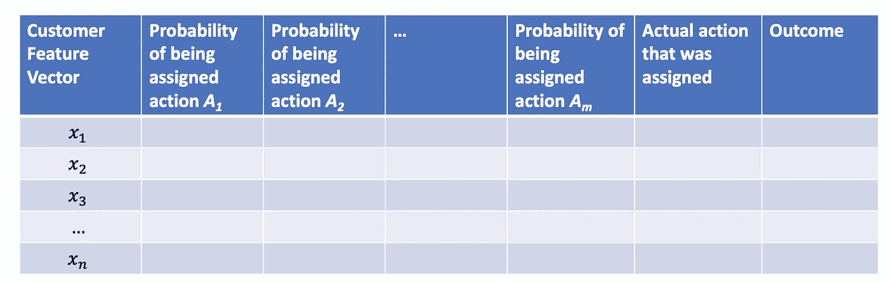*

*这个数据集非常有用。*

*在[第 3 部分](/from-prediction-to-action-how-to-learn-optimal-policies-from-data-3-4-aa56c974a505)中，我们将学习如何使用该数据集快速评估 ***任何*** 策略的结果(即策略评估*)，而无需运行任何实验。**

*在第 4 部分中，我们将学习如何使用它来找到一个 ***最优*** 策略。*